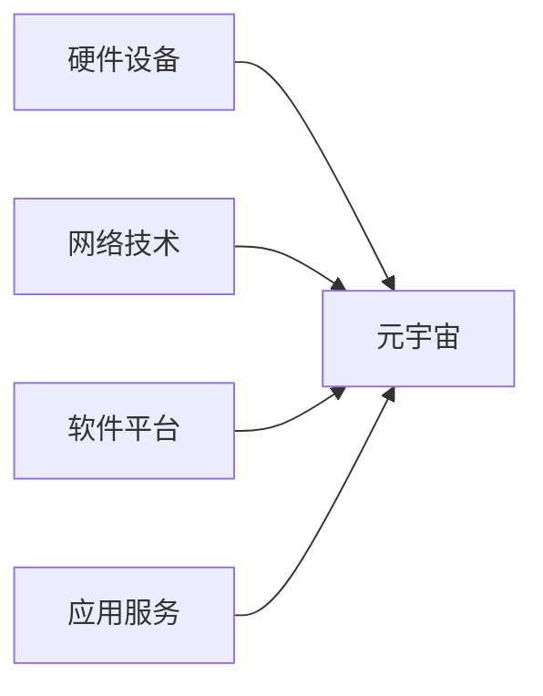

## 1.背景介绍

元宇宙（Metaverse）是一个由虚拟现实（VR）、增强现实（AR）、物联网（IoT）、人工智能（AI）等多种先进技术共同构建的，包含无数互联虚拟世界的全新网络空间。这个概念最初源于1992年的科幻小说《雪崩》。随着科技的发展，元宇宙的概念也逐渐从科幻走向现实，被越来越多的科技公司和研究者所关注。

## 2.核心概念与联系

元宇宙是一个全新的网络空间，它的基础设施包括硬件设备（如VR/AR眼镜、感应装置等）、网络技术（如5G、6G等）、软件平台（如游戏引擎、元宇宙操作系统等）以及各种应用服务（如虚拟社交、虚拟经济、虚拟教育等）。元宇宙的构建涉及到多个领域的知识，包括计算机科学、人工智能、网络技术、图形学、心理学等。



## 3.核心算法原理具体操作步骤

元宇宙的构建需要多种技术的支持，其中最核心的是图形渲染技术和网络通信技术。图形渲染技术负责生成虚拟世界的视觉效果，而网络通信技术则负责将用户的操作实时传输到虚拟世界，并将虚拟世界的状态实时反馈给用户。

## 4.数学模型和公式详细讲解举例说明

在元宇宙中，物体的位置和运动状态通常用欧拉角和四元数表示。欧拉角是一种描述物体在三维空间中旋转的方式，而四元数则是一种扩展了复数的数学概念，可以用来描述和计算物体在三维空间中的旋转。

设物体的旋转角为$\theta$，旋转轴为单位向量$\vec{n}=(n_x, n_y, n_z)$，则物体的旋转可以用四元数$q=(q_w, q_x, q_y, q_z)$表示，其中$q_w=\cos\frac{\theta}{2}$，$q_x=n_x\sin\frac{\theta}{2}$，$q_y=n_y\sin\frac{\theta}{2}$，$q_z=n_z\sin\frac{\theta}{2}$。

## 5.项目实践：代码实例和详细解释说明

元宇宙的构建可以使用各种游戏引擎，如Unity、Unreal Engine等。下面以Unity为例，展示如何创建一个简单的元宇宙环境。

首先，我们需要创建一个新的Unity项目，然后在项目中创建一个新的场景。在场景中，我们可以添加各种游戏对象，如地形、建筑、角色等，以构建虚拟世界的环境。

然后，我们需要为场景中的角色添加控制脚本，以实现用户的交互操作。下面是一个简单的角色控制脚本的例子：

```csharp
using System.Collections;
using System.Collections.Generic;
using UnityEngine;

public class PlayerController : MonoBehaviour
{
    public float speed = 5.0f;

    void Update()
    {
        float moveHorizontal = Input.GetAxis("Horizontal");
        float moveVertical = Input.GetAxis("Vertical");

        Vector3 movement = new Vector3(moveHorizontal, 0.0f, moveVertical);
        GetComponent<Rigidbody>().velocity = movement * speed;
    }
}
```

这个脚本实现了使用键盘的方向键或WASD键控制角色移动的功能。

## 6.实际应用场景

元宇宙的应用场景非常广泛，包括但不限于：虚拟社交、虚拟教育、虚拟旅游、虚拟购物、虚拟演唱会、虚拟电影院、虚拟游戏、虚拟体育、虚拟办公等。

## 7.工具和资源推荐

构建元宇宙需要的工具和资源主要有：VR/AR硬件设备、5G/6G网络设备、游戏引擎（如Unity、Unreal Engine等）、3D建模软件（如Blender、Maya等）、图像处理软件（如Photoshop、GIMP等）、音频处理软件（如Audition、Audacity等）等。

## 8.总结：未来发展趋势与挑战

元宇宙的发展趋势是朝向更高的真实感、更广的覆盖范围、更深的用户参与度发展。随着技术的进步，我们可以预见到未来的元宇宙将更加真实、丰富、多元。

然而，元宇宙的发展也面临着诸多挑战，如技术挑战（如图形渲染技术、网络通信技术、人工智能技术等的研发和优化）、社会挑战（如隐私保护、版权保护、虚拟犯罪等的防范和治理）、经济挑战（如虚拟经济的规范和管理）等。

## 9.附录：常见问题与解答

1. 什么是元宇宙？

元宇宙是一个由虚拟现实（VR）、增强现实（AR）、物联网（IoT）、人工智能（AI）等多种先进技术共同构建的，包含无数互联虚拟世界的全新网络空间。

2. 如何构建元宇宙？

构建元宇宙需要多种技术的支持，如图形渲染技术、网络通信技术、人工智能技术等。

3. 元宇宙有哪些应用场景？

元宇宙的应用场景非常广泛，包括虚拟社交、虚拟教育、虚拟旅游、虚拟购物、虚拟演唱会、虚拟电影院、虚拟游戏、虚拟体育、虚拟办公等。

---

作者：禅与计算机程序设计艺术 / Zen and the Art of Computer Programming