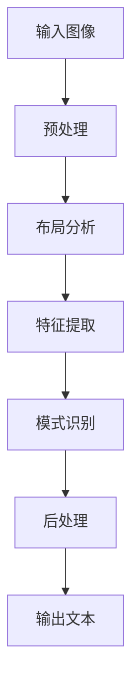
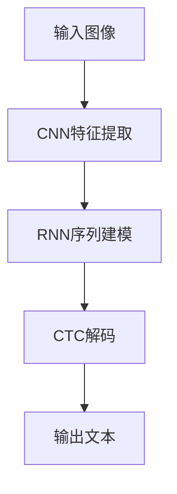

# 光学字符识别：让机器读取文字

## 1.背景介绍

### 1.1 什么是光学字符识别？

光学字符识别(Optical Character Recognition, OCR)是一种将印刷体文字、手写体文字等图像转换为可编辑文本的技术。它使计算机能够从扫描的图像、照片或视频中提取和识别文字信息。OCR广泛应用于数据录入、文档处理、银行支票识别、车牌识别等领域,极大地提高了工作效率。

### 1.2 OCR的发展历程

OCR技术可以追溯到20世纪60年代,当时主要采用模式匹配的方法。随着计算机视觉和机器学习的发展,OCR技术也在不断进步。近年来,基于深度学习的OCR系统取得了突破性进展,识别准确率大幅提高。

### 1.3 OCR的挑战

尽管OCR技术日益成熟,但仍然面临一些挑战,例如:

- 复杂背景和噪声干扰
- 不同字体、字体大小和字体样式
- 倾斜、扭曲和低分辨率图像
- 多语言和特殊字符的支持

## 2.核心概念与联系

### 2.1 OCR系统的基本流程

典型的OCR系统包括以下几个主要步骤:

1. **预处理**: 对输入图像进行调整,如去噪、二值化、倾斜校正等,以提高后续处理的质量。

2. **布局分析**: 将图像分割为文本行、文本块和单个字符。

3. **特征提取**: 从每个字符中提取特征,如轮廓、投影等,用于后续的识别。

4. **模式识别**: 将提取的特征与预定义的模板或训练模型进行匹配,识别出对应的字符。

5. **后处理**: 对识别结果进行校正和优化,如纠正常见错误、结构化输出等。



### 2.2 关键技术

OCR系统的关键技术包括:

- **图像预处理**: 包括去噪、二值化、倾斜校正等,对后续步骤至关重要。
- **文本行/文本块分割**: 准确分割文本行和文本块,是布局分析的核心。
- **字符分割**: 将文本行切分为单个字符,为特征提取和模式识别做准备。
- **特征提取**: 提取有效的字符特征,如结构特征、统计特征等,直接影响识别准确率。
- **模式识别**: 包括基于模板匹配和基于机器学习的方法,后者具有更强的泛化能力。

## 3.核心算法原理具体操作步骤

### 3.1 预处理

#### 3.1.1 去噪

去噪是OCR预处理的重要一步,常用的方法有中值滤波、高斯滤波等。中值滤波能有效去除椒盐噪声,而高斯滤波则适用于去除高斯噪声。

#### 3.1.2 二值化

二值化是将灰度图像转换为二值图像的过程,常用的算法有大津算法、Otsu算法等。这些算法通过计算图像灰度直方图,寻找一个最优阈值,将图像分为前景和背景两部分。

#### 3.1.3 倾斜校正

倾斜的文本会影响后续的布局分析和字符识别。常用的倾斜校正方法包括基于投影分析的方法、基于赫夫变换的方法等。前者通过计算文本行的投影直方图来估计倾斜角度,后者则利用直线检测来校正倾斜。

### 3.2 布局分析

#### 3.2.1 文本行分割

文本行分割是将图像划分为一行行文本的过程。常用的方法有基于投影分析的方法、基于纹理分析的方法等。投影分析利用水平投影直方图的谷值来分割文本行,而纹理分析则利用文本行的纹理特征进行分割。

#### 3.2.2 文本块分割

文本块分割是将图像划分为不同的文本块,如标题、正文等。常用的方法有基于连通区域分析的方法、基于纹理分析的方法等。连通区域分析利用相邻像素的连通性来划分文本块,而纹理分析则利用不同文本块的纹理特征进行分割。

### 3.3 特征提取

#### 3.3.1 结构特征

结构特征描述了字符的形状和结构信息,如笔画数量、笔画方向、笔画交叉点等。常用的结构特征提取方法有投影分析、轮廓分析等。

#### 3.3.2 统计特征

统计特征描述了字符的统计分布信息,如灰度直方图、灰度共现矩阵等。常用的统计特征提取方法有灰度投影、灰度共现矩阵等。

### 3.4 模式识别

#### 3.4.1 基于模板匹配

基于模板匹配的方法将提取的特征与预先定义的字符模板进行匹配,找到最相似的模板即可识别出对应的字符。这种方法简单直观,但缺乏泛化能力,难以应对字体变化。

#### 3.4.2 基于机器学习

基于机器学习的方法利用大量标注数据训练分类模型,如支持向量机、随机森林、神经网络等。近年来,基于深度学习的端到端OCR系统取得了突破性进展,如CRNN、GRCNN等,能够直接从图像中识别出文字序列。



上图展示了一种基于CRNN的端到端OCR系统的流程,首先使用卷积神经网络(CNN)提取图像特征,然后使用循环神经网络(RNN)对特征序列建模,最后通过连接时态分类(CTC)解码得到最终的文本输出。

## 4.数学模型和公式详细讲解举例说明

### 4.1 大津算法(Otsu's Method)

大津算法是一种自动计算图像二值化阈值的算法,它通过最小化类内方差来寻找最佳阈值。设图像的灰度级为$L$,灰度级$i$的像素点数量为$n_i$,则图像的总像素数为:

$$
N = \sum_{i=0}^{L-1} n_i
$$

假设阈值为$k$,则前景像素点数量为:

$$
N_0 = \sum_{i=0}^{k} n_i
$$

背景像素点数量为:

$$
N_1 = \sum_{i=k+1}^{L-1} n_i = N - N_0
$$

前景和背景的平均灰度值分别为:

$$
\mu_0 = \frac{1}{N_0} \sum_{i=0}^{k} i \cdot n_i, \quad \mu_1 = \frac{1}{N_1} \sum_{i=k+1}^{L-1} i \cdot n_i
$$

则图像的总平均灰度值为:

$$
\mu_T = \mu_0 \cdot \frac{N_0}{N} + \mu_1 \cdot \frac{N_1}{N}
$$

类内方差定义为:

$$
\sigma_w^2(k) = \omega_0(k) \cdot \sigma_0^2(k) + \omega_1(k) \cdot \sigma_1^2(k)
$$

其中:

$$
\omega_0(k) = \frac{N_0}{N}, \quad \omega_1(k) = \frac{N_1}{N}
$$

$$
\sigma_0^2(k) = \sum_{i=0}^{k} (i - \mu_0)^2 \cdot \frac{n_i}{N_0}, \quad \sigma_1^2(k) = \sum_{i=k+1}^{L-1} (i - \mu_1)^2 \cdot \frac{n_i}{N_1}
$$

大津算法的目标是寻找一个阈值$k^*$,使得类内方差$\sigma_w^2(k^*)$最小,即:

$$
k^* = \arg\min_{0 \leq k < L} \sigma_w^2(k)
$$

通过遍历所有可能的阈值$k$,计算对应的类内方差$\sigma_w^2(k)$,取最小值对应的$k^*$作为最终的二值化阈值。

### 4.2 投影分析

投影分析是OCR中常用的一种技术,可用于文本行分割、字符分割等。它通过计算图像的水平或垂直投影直方图,根据投影值的变化来确定文本行或字符的边界。

对于二值图像,水平投影直方图$H(y)$定义为:

$$
H(y) = \sum_{x=0}^{W-1} I(x, y)
$$

其中,$I(x, y)$为图像的像素值,$(x, y)$为像素坐标,$W$为图像宽度。$H(y)$表示第$y$行的前景像素总数。

类似地,垂直投影直方图$V(x)$定义为:

$$
V(x) = \sum_{y=0}^{H-1} I(x, y)
$$

其中,$H$为图像高度。$V(x)$表示第$x$列的前景像素总数。

通过分析投影直方图的变化,可以确定文本行或字符的边界。例如,在水平投影直方图中,值为0的位置通常对应文本行之间的间隔;而在垂直投影直方图中,值为0的位置通常对应字符之间的间隔。

下图展示了一个文本行的水平投影直方图:

```
      +-----+
      |     |
+-----+     +-----+
|     |     |     |
|     |     |     |
+-----+     +-----+
```

通过检测投影值的突变位置,可以将文本行与背景分离。

## 5.项目实践：代码实例和详细解释说明

以下是一个使用Python和OpenCV实现简单OCR系统的示例代码,包括预处理、布局分析和字符识别三个部分。

### 5.1 预处理

```python
import cv2
import numpy as np

def preprocess(img):
    # 灰度化
    gray = cv2.cvtColor(img, cv2.COLOR_BGR2GRAY)
    
    # 二值化
    _, binary = cv2.threshold(gray, 0, 255, cv2.THRESH_BINARY_INV + cv2.THRESH_OTSU)
    
    # 形态学操作(开运算)
    kernel = cv2.getStructuringElement(cv2.MORPH_RECT, (3, 3))
    binary = cv2.morphologyEx(binary, cv2.MORPH_OPEN, kernel)
    
    return binary
```

上述代码实现了图像的灰度化、二值化和形态学开运算。首先将彩色图像转换为灰度图像,然后使用Otsu算法进行二值化。最后,通过开运算(先腐蚀后膨胀)去除噪声和细小物体。

### 5.2 布局分析

```python
def find_contours(binary):
    contours, _ = cv2.findContours(binary, cv2.RETR_EXTERNAL, cv2.CHAIN_APPROX_SIMPLE)
    boxes = [cv2.boundingRect(c) for c in contours]
    return boxes

def layout_analysis(binary):
    boxes = find_contours(binary)
    
    # 按照y坐标排序
    boxes = sorted(boxes, key=lambda x: x[1])
    
    lines = []
    line = []
    for box in boxes:
        x, y, w, h = box
        if line and y - line[-1][1] > 1.5 * h:
            lines.append(line)
            line = []
        line.append(box)
    if line:
        lines.append(line)
    
    return lines
```

上述代码实现了文本行的分割。首先使用`cv2.findContours`函数找到所有的连通区域,并计算每个区域的外接矩形。然后,按照y坐标对矩形进行排序,将相邻的矩形归为同一行。最后,返回每一行的矩形列表。

### 5.3 字符识别

```python
import pytesseract

def recognize_characters(img, lines):
    text = ''
    for line in lines:
        line_text = ''
        for box in line:
            x, y, w, h = box
            roi = img[y:y+h, x:x+w]
            char = pytesseract.image_to_string(roi, config='--psm 10')
            line_text += char
        text += line_text + '\n'
    return text

# 主函数
img = cv2.imread('image.jpg')
binary = preprocess(img)