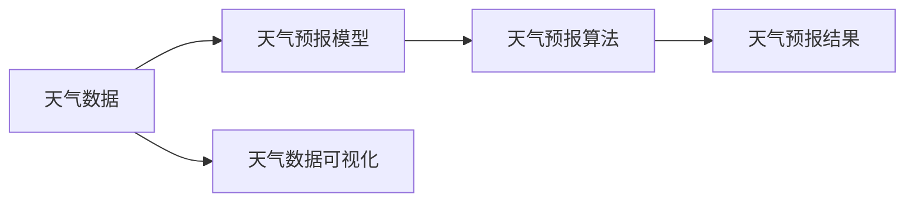
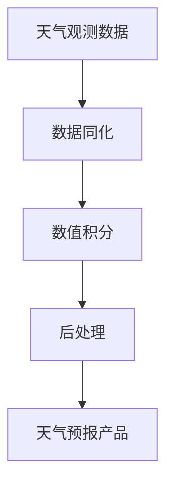

# 全国天气信息管理系统详细设计与具体代码实现

## 1. 背景介绍

随着科技的发展和人们生活水平的提高,获取准确及时的天气信息已成为人们日常生活中不可或缺的一部分。传统的天气预报方式已经无法满足人们对天气信息的需求,因此开发一个功能完善、性能稳定、易于维护的天气信息管理系统显得尤为重要。

本文将详细介绍全国天气信息管理系统的设计与实现,包括系统架构设计、数据库设计、核心算法、关键代码实现等方面。通过对系统的全面剖析,帮助读者深入理解天气信息管理系统的工作原理,为相关领域的研究和应用提供参考。

### 1.1 天气信息管理系统的意义

#### 1.1.1 服务于公众的日常生活

天气信息与人们的衣食住行密切相关。及时准确的天气预报可以帮助人们合理安排出行计划,避免因天气变化而造成的不便。

#### 1.1.2 服务于农业生产

农业生产受天气影响很大。精准的天气预报可以帮助农民合理安排农事活动,最大限度地减少因天气灾害造成的损失。

#### 1.1.3 服务于工业生产

许多工业生产活动也与天气息息相关。准确的天气预报可以帮助工厂优化生产计划,提高生产效率。

### 1.2 天气信息管理系统的现状

#### 1.2.1 传统天气预报方式的局限性

传统天气预报主要通过电视、广播等方式发布,信息更新不够及时,覆盖范围有限,难以满足人们随时随地获取天气信息的需求。

#### 1.2.2 互联网天气服务的发展

随着互联网的普及,越来越多的天气服务网站和APP应运而生。它们利用互联网的便捷性,为用户提供更加及时、丰富的天气信息服务。

#### 1.2.3 天气信息管理系统的必要性

尽管互联网天气服务蓬勃发展,但目前缺乏一个统一、权威、功能完善的天气信息管理系统。开发这样一个系统,可以更好地整合天气数据资源,规范天气预报流程,提升天气预报的准确性和时效性。

## 2. 核心概念与关联

在天气信息管理系统中,有几个核心概念需要重点关注:

### 2.1 天气数据

天气数据是系统的基础。它包括温度、湿度、气压、风向、风速、降水量等多个气象要素。天气数据可以来自气象观测站、气象雷达、气象卫星等多种渠道。

### 2.2 天气预报模型

天气预报模型是根据天气数据,利用数学模型和计算机技术,对未来一段时间的天气状况进行预测的方法。常见的天气预报模型有数值预报模型、统计预报模型等。

### 2.3 天气预报算法

天气预报算法是将天气预报模型转化为计算机程序的关键。常用的天气预报算法有插值算法、数值积分算法、统计分析算法等。

### 2.4 天气数据可视化

天气数据可视化是将海量的天气数据转化为直观易懂的图形界面,如天气图、雷达图、卫星云图等,便于用户快速了解天气信息。

下图展示了天气信息管理系统的核心概念及其关联:



## 3. 核心算法原理与具体操作步骤

天气信息管理系统的核心算法主要包括数据插值算法、数值预报算法等。下面以数值预报算法为例,介绍其基本原理和操作步骤。

### 3.1 数值预报算法原理

数值预报算法是根据大气运动的物理和热力学方程,利用数值计算方法,对大气未来状态进行预测的一种方法。其基本原理可以概括为:

1. 建立大气运动的数学模型,即一系列描述大气运动规律的微分方程。
2. 将连续的微分方程离散化,转化为适合计算机求解的差分方程。
3. 给定初始条件和边界条件,利用数值计算方法求解差分方程,得到未来某一时刻大气的状态。
4. 根据预报结果,绘制天气图,生成天气预报产品。

### 3.2 数值预报的具体操作步骤

#### 3.2.1 数据准备

收集当前时刻的天气观测数据,包括地面观测数据、高空观测数据等,作为数值预报的初始场。

#### 3.2.2 数据同化

利用数据同化技术,将观测数据融合到数值预报模型中,对模型的初始场进行修正,提高初始场的准确性。

#### 3.2.3 数值积分

根据数值预报模型的差分方程,利用数值积分方法,如欧拉方法、龙格-库塔方法等,逐步推算出未来各个时刻大气的状态。

#### 3.2.4 后处理

对数值预报结果进行必要的物理量诊断和订正,并根据预报结果绘制天气图,生成天气预报产品。

数值预报的操作流程如下图所示:



## 4. 数学模型和公式详细讲解举例说明

天气预报中常用的数学模型是大气运动方程组,它由一系列偏微分方程组成,描述了大气的热力学和动力学过程。下面以大气运动方程组中的热力学方程为例,进行详细讲解。

### 4.1 热力学方程

热力学方程描述了大气温度场的变化规律,其微分形式为:

$$
\frac{\partial T}{\partial t} + \mathbf{v} \cdot \nabla T + \omega \frac{\partial T}{\partial p} = \frac{Q}{c_p}
$$

其中,$T$为温度,$t$为时间,$\mathbf{v}$为水平风速矢量,$\nabla$为梯度算子,$\omega$为垂直速度,$p$为气压,$Q$为单位质量空气的加热率,$c_p$为定压比热。

### 4.2 方程项的物理意义

- $\frac{\partial T}{\partial t}$表示温度对时间的局地变化率。
- $\mathbf{v} \cdot \nabla T$表示温度的平流作用,即由风场引起的温度变化。
- $\omega \frac{\partial T}{\partial p}$表示温度的绝热变化,即由垂直运动引起的温度变化。
- $\frac{Q}{c_p}$表示由辐射、潜热释放等因素引起的温度变化。

### 4.3 方程的离散化

为了在计算机上求解热力学方程,需要将其离散化。以时间和空间都采用向前差分为例,离散化后的热力学方程为:

$$
\frac{T_{i,j,k}^{n+1} - T_{i,j,k}^{n}}{\Delta t} + u_{i,j,k}^{n} \frac{T_{i+1,j,k}^{n} - T_{i-1,j,k}^{n}}{2\Delta x} + v_{i,j,k}^{n} \frac{T_{i,j+1,k}^{n} - T_{i,j-1,k}^{n}}{2\Delta y} + \omega_{i,j,k}^{n} \frac{T_{i,j,k+1}^{n} - T_{i,j,k-1}^{n}}{2\Delta p} = \frac{Q_{i,j,k}^{n}}{c_p}
$$

其中,上标$n$表示时间层,$\Delta t$为时间步长;下标$i,j,k$分别表示$x,y,p$方向上的网格点,$\Delta x,\Delta y,\Delta p$为对应方向上的网格距。

### 4.4 举例说明

假设我们要预报未来24小时某地的温度变化。已知初始时刻($t=0$)各层的温度场、风场和加热率,利用离散化后的热力学方程,可以逐步推算出未来各个时刻的温度场。

设时间步长$\Delta t=60s$,水平网格距$\Delta x=\Delta y=10km$,垂直网格距$\Delta p=50hPa$。给定$t=0$时刻$(i,j,k)$网格点上的各物理量值:

- $T_{i,j,k}^0 = 290K$
- $u_{i,j,k}^0 = 5m/s$
- $v_{i,j,k}^0 = -3m/s$
- $\omega_{i,j,k}^0 = 0.1Pa/s$
- $Q_{i,j,k}^0 = 2J/(kg \cdot s)$

代入离散化的热力学方程,可求得$t=60s$时刻$(i,j,k)$网格点上的温度为:

$$
T_{i,j,k}^1 = T_{i,j,k}^0 + \Delta t \left( -u_{i,j,k}^0 \frac{T_{i+1,j,k}^0 - T_{i-1,j,k}^0}{2\Delta x} - v_{i,j,k}^0 \frac{T_{i,j+1,k}^0 - T_{i,j-1,k}^0}{2\Delta y} - \omega_{i,j,k}^0 \frac{T_{i,j,k+1}^0 - T_{i,j,k-1}^0}{2\Delta p} + \frac{Q_{i,j,k}^0}{c_p} \right)
$$

依此类推,可以逐步推算出未来24小时内任意时刻$(i,j,k)$网格点上的温度值。

## 5. 项目实践:代码实例与详细解释说明

下面以Python语言为例,给出热力学方程数值求解的核心代码实现。

### 5.1 数据结构定义

首先定义表示温度、风场等物理量的三维数组:

```python
import numpy as np

# 定义网格点数
nx, ny, nz = 100, 100, 20

# 定义网格距
dx, dy, dp = 10000, 10000, 5000

# 定义时间步长
dt = 60

# 定义物理量数组
T = np.zeros((nx, ny, nz))
u = np.zeros((nx, ny, nz)) 
v = np.zeros((nx, ny, nz))
w = np.zeros((nx, ny, nz))
Q = np.zeros((nx, ny, nz))
```

### 5.2 初始条件设置

给定初始时刻的温度场、风场和加热率:

```python
# 设置初始条件
T[:, :, :] = 290
u[:, :, :] = 5
v[:, :, :] = -3 
w[:, :, :] = 0.1
Q[:, :, :] = 2
```

### 5.3 数值积分

利用离散化的热力学方程,逐步推算未来各时刻的温度场:

```python
# 定义比热容
cp = 1004

# 开始数值积分
for n in range(24 * 3600 // dt):
    T[1:nx-1, 1:ny-1, 1:nz-1] = T[1:nx-1, 1:ny-1, 1:nz-1] + dt * (
        - u[1:nx-1, 1:ny-1, 1:nz-1] * (T[2:nx, 1:ny-1, 1:nz-1] - T[0:nx-2, 1:ny-1, 1:nz-1]) / (2 * dx)
        - v[1:nx-1, 1:ny-1, 1:nz-1] * (T[1:nx-1, 2:ny, 1:nz-1] - T[1:nx-1, 0:ny-2, 1:nz-1]) / (2 * dy)  
        - w[1:nx-1, 1:ny-1, 1:nz-1] * (T[1:nx-1, 1:ny-1, 2:nz] - T[1:nx-1, 1:ny-1, 0:nz-2]) / (2 * dp)
        + Q[1:nx-1, 1:ny-1, 1:nz-1] / cp
    )
```

### 5.4 代码解释

- 第1-14行:定义网格点数、网格距、时间步长以及各物理量的三维数组。
- 第16-21行:设置初始条件,给定初始时刻的温度场、风场和加热率。
- 第26行:定义空气的定压比热容。