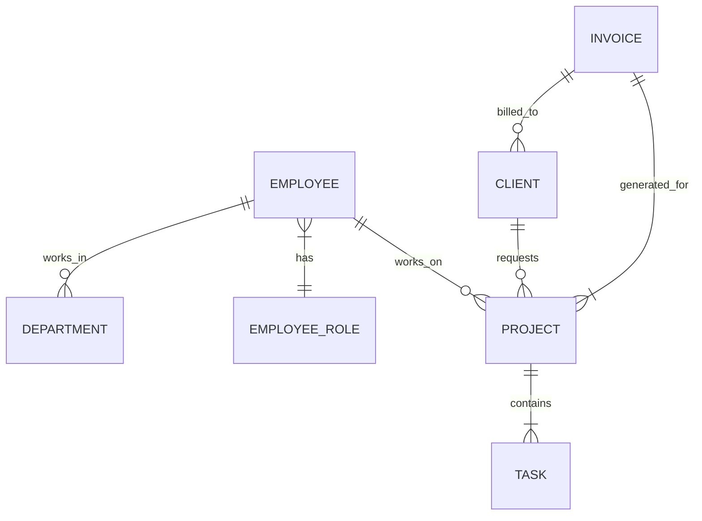

# 公司信息管理系统详细设计与具体代码实现

## 1. 背景介绍

### 1.1 公司信息管理系统概述

在当今快节奏的商业环境中，高效的信息管理对于企业的成功运营至关重要。公司信息管理系统(Company Information Management System, CIMS)旨在集中管理和组织公司的各种信息资源,包括员工数据、财务记录、客户信息、项目进度等,为企业决策提供准确及时的信息支持。

### 1.2 系统需求分析

一个优秀的CIMS需要满足以下关键需求:

- **数据集中化**: 将分散的信息集中存储,实现数据共享和一致性。
- **访问控制**: 根据用户角色和权限控制对信息的访问。
- **数据安全性**: 保护敏感数据,防止未经授权的访问和修改。
- **报表生成**: 根据需求生成各种报表,支持决策分析。
- **工作流程管理**: 自动化处理公司内部的工作流程。
- **用户友好界面**: 直观易用的界面,提高工作效率。

## 2. 核心概念与联系

### 2.1 系统架构

CIMS通常采用三层架构(Three-Tier Architecture),包括:

1. **表示层(Presentation Tier)**: 用户界面,负责数据展示和用户交互。
2. **业务逻辑层(Application Tier)**: 处理业务逻辑,实现系统功能。
3. **数据访问层(Data Tier)**: 与数据库进行交互,执行数据存取操作。


### 2.2 数据模型

数据模型是系统的核心,决定了数据的组织和存储方式。CIMS通常采用关系数据库模型,其中:

- **实体(Entity)**: 表示现实世界中的对象,如员工、部门、客户等。
- **属性(Attribute)**: 描述实体的特征,如员工编号、姓名、部门等。
- **关系(Relationship)**: 定义实体之间的联系,如员工与部门之间的从属关系。

### 2.3 关键技术

实现CIMS需要综合运用多种技术,包括但不限于:

- **数据库技术**: 如SQL、数据库设计规范等。
- **Web开发技术**: 如HTML、CSS、JavaScript、服务器端语言等。
- **安全技术**: 如加密、认证、访问控制等。
- **报表生成技术**: 如报表设计工具、数据可视化等。
- **工作流引擎**: 用于定义和执行工作流程。

## 3. 核心算法原理具体操作步骤

### 3.1 数据库设计

#### 3.1.1 概念数据模型

在设计关系数据库之前,我们需要构建概念数据模型,用实体-关系图(Entity-Relationship Diagram)表示各实体及其关系。



#### 3.1.2 逻辑数据模型

根据概念模型,我们可以推导出逻辑数据模型,即关系模式(Relation Schema),描述了表、字段及其约束条件。

例如,员工表(EMPLOYEE)的关系模式可以表示为:

```
EMPLOYEE(emp_id, name, email, phone, dept_id, role_id)
```

其中:

- `emp_id`是主键,唯一标识一个员工。
- `dept_id`是外键,引用部门表(DEPARTMENT)的主键,表示员工所属部门。
- `role_id`是外键,引用员工角色表(EMPLOYEE_ROLE)的主键,表示员工的职位。

#### 3.1.3 物理数据模型

最后,我们需要将逻辑模型转换为物理数据模型,即在特定的数据库管理系统(DBMS)中创建表。

例如,在MySQL中创建员工表:

```sql
CREATE TABLE EMPLOYEE (
    emp_id INT PRIMARY KEY AUTO_INCREMENT,
    name VARCHAR(50) NOT NULL,
    email VARCHAR(50) UNIQUE NOT NULL,
    phone VARCHAR(20),
    dept_id INT NOT NULL,
    role_id INT NOT NULL,
    FOREIGN KEY (dept_id) REFERENCES DEPARTMENT(dept_id),
    FOREIGN KEY (role_id) REFERENCES EMPLOYEE_ROLE(role_id)
);
```

### 3.2 数据访问层

数据访问层负责与数据库进行交互,屏蔽了底层数据库细节,为上层提供统一的数据访问接口。

#### 3.2.1 连接数据库

首先,我们需要建立与数据库的连接,这通常由连接池(Connection Pool)来管理,以提高性能和可伸缩性。

```java
// Java示例代码
import java.sql.*;

public class DBConnection {
    private static final String URL = "jdbc:mysql://localhost:3306/cims";
    private static final String USER = "root";
    private static final String PASSWORD = "password";

    private static BasicDataSource dataSource;

    static {
        dataSource = new BasicDataSource();
        dataSource.setUrl(URL);
        dataSource.setUsername(USER);
        dataSource.setPassword(PASSWORD);
    }

    public static Connection getConnection() throws SQLException {
        return dataSource.getConnection();
    }
}
```

#### 3.2.2 执行SQL语句

通过连接对象,我们可以创建语句(Statement)对象,并执行SQL查询或更新操作。

```java
// Java示例代码
import java.sql.*;

public class EmployeeDAO {
    public static Employee getEmployeeById(int id) throws SQLException {
        Connection conn = DBConnection.getConnection();
        String sql = "SELECT * FROM EMPLOYEE WHERE emp_id = ?";
        PreparedStatement stmt = conn.prepareStatement(sql);
        stmt.setInt(1, id);
        ResultSet rs = stmt.executeQuery();
        // 处理结果集...
    }

    public static void updateEmployee(Employee emp) throws SQLException {
        Connection conn = DBConnection.getConnection();
        String sql = "UPDATE EMPLOYEE SET name = ?, email = ?, ... WHERE emp_id = ?";
        PreparedStatement stmt = conn.prepareStatement(sql);
        // 设置参数...
        stmt.executeUpdate();
    }
}
```

#### 3.2.3 事务管理

为了保证数据的一致性,我们需要使用事务(Transaction)将多个操作作为一个不可分割的工作单元。

```java
// Java示例代码
import java.sql.*;

public class TransactionManager {
    public static void transfer(int fromId, int toId, double amount) throws SQLException {
        Connection conn = DBConnection.getConnection();
        try {
            conn.setAutoCommit(false); // 开启事务
            withdrawFromAccount(conn, fromId, amount);
            depositToAccount(conn, toId, amount);
            conn.commit(); // 提交事务
        } catch (SQLException e) {
            conn.rollback(); // 回滚事务
            throw e;
        } finally {
            conn.setAutoCommit(true); // 恢复自动提交模式
        }
    }

    private static void withdrawFromAccount(Connection conn, int id, double amount) throws SQLException {
        // 从账户id中扣款amount...
    }

    private static void depositToAccount(Connection conn, int id, double amount) throws SQLException {
        // 向账户id存款amount...
    }
}
```

### 3.3 业务逻辑层

业务逻辑层封装了系统的核心功能,对外提供服务接口。

#### 3.3.1 服务接口

服务接口定义了可供客户端调用的方法,如:

```java
// Java示例代码
public interface EmployeeService {
    Employee getEmployeeById(int id) throws EmployeeNotFoundException;
    void updateEmployee(Employee emp);
    List<Employee> getEmployeesByDepartment(int deptId);
    // 其他方法...
}
```

#### 3.3.2 服务实现

服务实现类负责实现具体的业务逻辑,它可以调用数据访问层的方法与数据库交互。

```java
// Java示例代码
public class EmployeeServiceImpl implements EmployeeService {
    private EmployeeDAO employeeDAO;
    private DepartmentDAO departmentDAO;

    public Employee getEmployeeById(int id) throws EmployeeNotFoundException {
        Employee emp = employeeDAO.getEmployeeById(id);
        if (emp == null) {
            throw new EmployeeNotFoundException("Employee not found with id " + id);
        }
        return emp;
    }

    public void updateEmployee(Employee emp) {
        // 检查员工所属部门是否存在
        Department dept = departmentDAO.getDepartmentById(emp.getDepartmentId());
        if (dept == null) {
            // 处理异常情况
        }
        // 更新员工信息
        employeeDAO.updateEmployee(emp);
    }

    // 其他方法实现...
}
```

#### 3.3.3 业务规则与约束

在业务逻辑层,我们还需要实现各种业务规则和约束条件,确保数据的完整性和一致性。例如:

- 员工邮箱必须是唯一的。
- 员工必须属于一个有效的部门。
- 员工工资不能低于法定最低工资标准。
- 项目经理必须是员工中的一员。

通过在服务实现中添加相应的逻辑,我们可以强制执行这些规则。

### 3.4 表示层

表示层负责与用户进行交互,展示数据并接收用户输入。

#### 3.4.1 用户界面

用户界面(UI)通常采用基于Web的设计,使用HTML、CSS和JavaScript等技术构建。例如,员工列表页面可以这样实现:

```html
<!-- employee-list.html -->
<table>
    <thead>
        <tr>
            <th>Employee ID</th>
            <th>Name</th>
            <th>Email</th>
            <th>Department</th>
            <th>Role</th>
        </tr>
    </thead>
    <tbody>
        <!-- 使用JavaScript动态生成表格行 -->
    </tbody>
</table>

<script>
    // 从服务器获取员工列表数据
    fetch('/api/employees')
        .then(response => response.json())
        .then(employees => {
            const tbody = document.querySelector('tbody');
            employees.forEach(employee => {
                const row = document.createElement('tr');
                // 创建单元格并填充数据
                row.innerHTML = `
                    <td>${employee.id}</td>
                    <td>${employee.name}</td>
                    <td>${employee.email}</td>
                    <td>${employee.department.name}</td>
                    <td>${employee.role.name}</td>
                `;
                tbody.appendChild(row);
            });
        });
</script>
```

#### 3.4.2 控制器

控制器(Controller)负责处理HTTP请求,调用业务逻辑层的服务,并返回适当的响应。

```java
// Java示例代码(使用Spring MVC框架)
@RestController
@RequestMapping("/api/employees")
public class EmployeeController {
    @Autowired
    private EmployeeService employeeService;

    @GetMapping
    public List<Employee> getEmployees() {
        return employeeService.getAllEmployees();
    }

    @GetMapping("/{id}")
    public Employee getEmployeeById(@PathVariable int id) throws EmployeeNotFoundException {
        return employeeService.getEmployeeById(id);
    }

    @PostMapping
    public void addEmployee(@RequestBody Employee employee) {
        employeeService.addEmployee(employee);
    }

    // 其他方法...
}
```

#### 3.4.3 数据传输对象

为了在表示层和业务逻辑层之间传输数据,我们通常使用数据传输对象(Data Transfer Object, DTO)。DTO对象通常是无状态的,只包含需要传输的数据属性,而不包含任何业务逻辑。

```java
// Java示例代码
public class EmployeeDTO {
    private int id;
    private String name;
    private String email;
    private DepartmentDTO department;
    private RoleDTO role;
    // 构造函数、getter和setter...
}
```

在控制器中,我们可以将DTO对象转换为业务对象,或者将业务对象转换为DTO对象进行传输。

## 4. 数学模型和公式详细讲解举例说明

在CIMS中,我们可能需要使用一些数学模型和公式来支持决策分析和优化。

### 4.1 线性规划

线性规划(Linear Programming)是一种常用的优化技术,可以用于解决资源分配、产品组合优化等问题。

假设我们有一家公司生产两种产品A和B,它们分别需要一定数量的原材料X和Y。我们的目标是最大化总利润,同时满足原材料的限制条件。

让我们定义:

- $x_A$和$x_B$分别表示产品A和B的产量。
- $p_A$和$p_B$分别表示产品A和B的单位利润。
- $a_{XA}$和$a_{XB}$分别表示生产一单位产品A和B所需的原材料X的数量。
- $a_{YA}$和$a_{YB}$分别表示生产一单位产品A和B所需的原材料Y的数量。
- $b_X$和$b_Y$分别表示原材料X和Y的可用量。

则线性规划模型可以表示为:

$$\max\limits_{x_A, x_B} z = p_Ax_A + p_Bx_B$$
$$\text{subject to:}\\
a_{XA}x_A