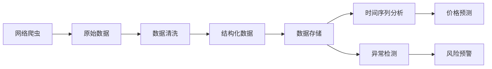

# 农产品价格采集与挖据应用

## 1. 背景介绍

随着互联网技术的快速发展,农产品电子商务平台如雨后春笋般涌现。这些平台为农产品的生产者和消费者提供了一个高效、便捷的交易渠道。然而,由于农产品价格受多种因素影响,如季节、天气、市场供需等,价格波动较大,给交易双方带来了一定的风险。因此,及时、准确地采集和分析农产品价格数据,对于农产品电商平台的健康发展具有重要意义。

本文将介绍农产品价格采集与挖掘的相关技术,包括数据采集、数据清洗、数据存储、数据分析等,并结合实际案例,探讨如何利用这些技术为农产品电商平台提供价格预测、风险预警等增值服务。

### 1.1 农产品价格的特点与影响因素

农产品价格具有以下特点:

- 季节性:不同季节,农产品的供给量不同,导致价格波动。
- 区域性:不同地区的气候、土壤、种植习惯等差异,导致农产品价格存在地域差异。
- 易腐性:许多农产品保质期较短,这影响了它们的储存和运输成本,进而影响价格。
- 价格弹性小:农产品需求的价格弹性较小,价格变化对需求量的影响有限。

影响农产品价格的因素主要有:

- 自然因素:天气状况如干旱、洪涝等灾害会导致农产品减产,价格上涨。
- 市场供需:农产品供大于求,价格下跌;供不应求,价格上涨。
- 成本因素:人工、种子、化肥等生产资料价格上涨,会推高农产品成本和价格。
- 政策因素:国家的农业补贴、储备等政策会影响农产品价格。

### 1.2 农产品价格数据的应用场景

农产品价格数据可应用于以下场景:

- 价格预测:利用历史价格数据建立预测模型,对未来价格走势进行预测。
- 价格指数编制:选取有代表性的农产品,编制价格指数,反映农产品价格总体走势。
- 价格异常监测:实时监测各品类农产品价格,及时发现并预警价格异常波动。
- 生产指导:根据价格走势,指导农户合理安排种植计划,调节产量。
- 库存管理:农产品电商平台根据价格预测,优化库存管理,降低成本。
- 保险定价:保险公司可根据农产品价格风险,合理厘定费率。

## 2. 核心概念与联系

要实现农产品价格采集与挖掘,需要涉及以下核心概念:

- 网络爬虫:自动抓取网页数据的程序。用于从农产品电商平台、价格行情网站等渠道采集价格数据。
- 数据清洗:处理爬虫采集到的原始数据,剔除错误、不一致、重复的数据,保证数据质量。
- 数据存储:将清洗后的结构化数据存入数据库,为后续分析提供支持。常用的数据库有MySQL、MongoDB等。
- 时间序列分析:农产品价格数据具有明显的时间序列特征,需要使用时间序列分析方法进行建模预测,如ARIMA、LSTM等。
- 异常检测:利用统计方法或机器学习算法,及时发现农产品价格的异常波动,为风险预警提供依据。

这些概念之间的联系如下图所示:



## 3. 核心算法原理与操作步骤

### 3.1 网络爬虫

网络爬虫的基本原理是模拟浏览器发送HTTP请求,获取网页内容,再从中提取所需数据。其主要步骤包括:

1. 确定目标网页URL
2. 发送HTTP请求,获取网页内容
3. 解析网页,提取目标数据
4. 数据清洗与结构化
5. 数据存储
6. 迭代以上步骤,直至采集完所有目标数据

Python的Requests库可用于发送HTTP请求,BeautifulSoup或Scrapy库可用于解析网页。

### 3.2 时间序列分析

常用的农产品价格时间序列分析方法包括:

- ARIMA模型:基于自回归、差分、移动平均的传统时间序列模型。
- LSTM神经网络:长短期记忆网络,能够学习序列数据中的长期依赖关系。
- Prophet模型:Facebook开源的时间序列预测算法,能够建模趋势、周期性和节假日效应。

以LSTM为例,其核心原理是引入了门控机制(输入门、遗忘门、输出门),能够选择性地记忆和遗忘信息,从而更好地捕捉时间序列的长期依赖。

LSTM的主要步骤如下:

1. 数据预处理:对时间序列数据进行归一化、划分训练集和测试集
2. 构建LSTM网络:确定网络层数、隐藏单元数、激活函数等超参数
3. 训练网络:利用训练集数据进行训练,不断调整网络权重以最小化损失函数
4. 模型评估:在测试集上评估模型预测性能,计算RMSE、MAE等评价指标 
5. 模型应用:利用训练好的模型对新的时间序列数据进行预测

### 3.3 异常检测

常用的农产品价格异常检测方法包括:

- 统计方法:如3-sigma原则,即判断数据点是否超出均值3个标准差的范围。
- 无监督学习:如孤立森林、一类SVM等,将异常点视为离群点进行检测。
- 有监督学习:如决策树、神经网络等,需要使用已标记的正常数据和异常数据进行训练。

以孤立森林为例,其核心思想是异常点更容易被孤立,因此递归地在数据集中随机选择特征构建决策树,异常点将更快地被孤立出来,在较早的树深度就被划分为叶子节点。

孤立森林的主要步骤如下:

1. 数据预处理:对数据进行归一化处理
2. 构建孤立森林:确定决策树的棵数、子采样率、树的最大深度等超参数
3. 训练孤立森林:递归地构建每棵决策树,直至达到最大深度或节点中样本数小于阈值
4. 计算异常分数:对每个数据点,计算其在每棵决策树中的平均深度,异常点的平均深度更小
5. 判断异常:根据异常分数设定阈值,将分数小于阈值的点判断为异常

## 4. 数学模型与公式详解

### 4.1 ARIMA模型

ARIMA(p,d,q)模型由三部分组成:

- AR(p):自回归,时间序列中的当前值与其前p个值之间的关系。
- I(d):差分,对时间序列进行d阶差分,使其变为平稳序列。
- MA(q):移动平均,时间序列中的当前值与其前q个随机扰动之间的关系。

ARIMA模型的数学表达式为:

$$(1-\sum_{i=1}^p\phi_iL^i)(1-L)^dX_t=(1+\sum_{i=1}^q\theta_iL^i)\varepsilon_t$$

其中,$L$为滞后算子,$\phi_i$为自回归系数,$\theta_i$为移动平均系数,$\varepsilon_t$为白噪声序列。

### 4.2 LSTM模型

LSTM的核心是细胞状态$C_t$和三个门:输入门$i_t$、遗忘门$f_t$、输出门$o_t$。

细胞状态的更新公式为:

$$C_t=f_t\odot C_{t-1}+i_t\odot\tilde{C}_t$$

其中,$\odot$表示按元素相乘,$\tilde{C}_t$为候选值。

三个门的计算公式为:

$$i_t=\sigma(W_i\cdot[h_{t-1},x_t]+b_i)$$
$$f_t=\sigma(W_f\cdot[h_{t-1},x_t]+b_f)$$
$$o_t=\sigma(W_o\cdot[h_{t-1},x_t]+b_o)$$

其中,$\sigma$为sigmoid激活函数,$W$和$b$分别为权重矩阵和偏置向量。

隐藏状态$h_t$的计算公式为:

$$h_t=o_t\odot tanh(C_t)$$

### 4.3 孤立森林

孤立森林的异常分数计算公式为:

$$s(x,n)=2^{-\frac{E(h(x))}{c(n)}}$$

其中,$E(h(x))$为数据点$x$在所有决策树中的平均深度,$c(n)$为平均深度的归一化因子,其计算公式为:

$$c(n)=2H(n-1)-(2(n-1)/n)$$

$H(i)$为调和数,可近似为$ln(i)+0.5772156649$。

异常分数$s$的取值范围为$(0,1]$,分数越接近0表示样本越可能是异常点。

## 5. 项目实践:代码实例与详解

下面以Python为例,演示农产品价格数据采集、时间序列预测和异常检测的代码实现。

### 5.1 数据采集

使用Requests库和BeautifulSoup库从某农产品价格网站采集番茄价格数据:

```python
import requests
from bs4 import BeautifulSoup
import pandas as pd

# 目标网页URL
url = "http://price.21food.cn/market/2-1.html"

# 发送HTTP请求
response = requests.get(url)

# 解析网页内容
soup = BeautifulSoup(response.text, 'html.parser')

# 提取表格数据
table = soup.find('table', attrs={'class': 'hq_table'})
rows = table.find_all('tr')

# 解析表格数据
data = []
for row in rows[1:]:
    cols = row.find_all('td')
    date = cols[0].text
    price = cols[1].text
    data.append([date, price])

# 转换为DataFrame
df = pd.DataFrame(data, columns=['date', 'price'])  
df['price'] = df['price'].astype(float)

print(df.head())
```

### 5.2 时间序列预测

利用Prophet库对番茄价格进行预测:

```python
from fbprophet import Prophet

# 将DataFrame列名改为ds和y
df = df.rename(columns={'date': 'ds', 'price': 'y'})

# 划分训练集和测试集
train_df = df[:-30]
test_df = df[-30:]

# 初始化Prophet模型
model = Prophet()

# 训练模型
model.fit(train_df)

# 生成待预测日期
future_dates = model.make_future_dataframe(periods=30)

# 模型预测
forecast = model.predict(future_dates)

# 模型评估
test_df = test_df.merge(forecast[['ds', 'yhat']], on='ds')
mse = ((test_df['y'] - test_df['yhat']) ** 2).mean()
print(f"Test MSE: {mse:.2f}")

# 绘制预测结果
model.plot(forecast)
```

### 5.3 异常检测

利用孤立森林算法对番茄价格进行异常检测:

```python
from sklearn.ensemble import IsolationForest

# 初始化孤立森林模型
model = IsolationForest(n_estimators=100, contamination=0.05)  

# 训练模型
model.fit(df[['price']])

# 异常检测
anomalies = model.predict(df[['price']])

# 标记异常点
df['anomaly'] = anomalies
df.loc[df['anomaly'] == -1, 'anomaly'] = 'Yes'
df.loc[df['anomaly'] == 1, 'anomaly'] = 'No'

# 打印异常点
print(df[df['anomaly'] == 'Yes'])
```

## 6. 实际应用场景

农产品价格采集与挖掘技术可应用于以下场景:

- 农产品电商平台:实时采集各平台的价格数据,进行比价分析,为消费者提供更优惠的选择;根据价格预测结果优化库存管理,降低成本。
- 农业大数据平台:整合多源农产品价格数据,编制价格指数,为政府制定农业政策提供数据支持;为农民、农企提供价格行情查询和预警服务。