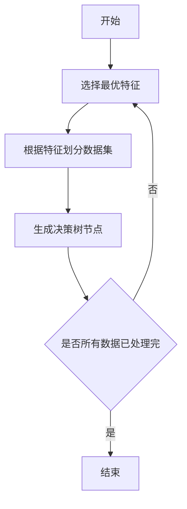

## 1.背景介绍
随着大数据的发展，决策树作为一种经典的机器学习算法，已经广泛应用于各个领域。决策树模型的优点在于其可解释性强，模型结构直观，便于理解。在此，我们将深入探讨决策树的原理和应用。

## 2.核心概念与联系
决策树是一种基于树结构进行决策的机器学习算法，其中每个内部节点表示一个属性上的测试，每个分支代表一个测试输出，每个叶节点代表一种类别。学习决策树的过程就是构建这样一个树结构的过程。



## 3.核心算法原理具体操作步骤
决策树的构建过程包括三个步骤：特征选择、决策树的生成和决策树的剪枝。

1. 特征选择：特征选择是选择出最优的分裂属性。常用的算法有信息增益、信息增益比、基尼指数等。

2. 决策树的生成：根据特征选择的结果，从根节点开始，对每一个节点进行以下操作，构造决策树：
    - 如果该节点包含的样本全属于同一类别，则置为叶节点，类别即为该类别；
    - 否则，计算各个特征的信息增益，选择信息增益最大的特征作为测试特征，按该特征可能取的每个值，将对应的样本输出到对应的子节点，返回第一步。

3. 决策树的剪枝：为了解决过拟合问题，需要对生成的决策树进行剪枝，包括预剪枝和后剪枝。

## 4.数学模型和公式详细讲解举例说明
对于特征选择，我们以信息增益为例进行说明。信息增益是由信息熵引出的一个概念，信息熵是用来度量信息的不确定性。假设有一个随机变量X，其可能取的值为$x_{1}, x_{2}, ..., x_{n}$，对应的概率为$p_{1}, p_{2}, ..., p_{n}$，那么随机变量X的信息熵定义为：

$$
H(X) = -\sum_{i=1}^{n}p_{i}log_{2}p_{i}
$$

对于决策树来说，我们希望每次分裂后，子节点的纯度更高，也就是信息熵更小。因此，我们希望找到一个特征，使得按照这个特征分裂后，信息熵的减少量最大，这个减少量我们称之为信息增益。

## 5.项目实践：代码实例和详细解释说明
以下是使用Python的sklearn库构建决策树的简单示例：

```python
from sklearn import datasets
from sklearn.model_selection import train_test_split
from sklearn.tree import DecisionTreeClassifier

# 加载数据
iris = datasets.load_iris()
X = iris.data
y = iris.target

# 划分训练集和测试集
X_train, X_test, y_train, y_test = train_test_split(X, y, test_size=0.3, random_state=0)

# 构建决策树模型
clf = DecisionTreeClassifier(criterion='entropy', max_depth=3, random_state=0)
clf.fit(X_train, y_train)

# 在测试集上进行预测
y_pred = clf.predict(X_test)
```

## 6.实际应用场景
决策树在许多领域都有广泛的应用，例如在金融风控中用于评估用户的信用风险，在医疗健康中用于疾病的预测和诊断，在电商推荐中用于用户的行为预测等。

## 7.工具和资源推荐
- Python的sklearn库：包含了决策树等各种机器学习算法，且提供了丰富的数据处理、模型评估等工具。
- R的rpart包：提供了决策树的实现，且可以很方便的进行可视化。

## 8.总结：未来发展趋势与挑战
决策树作为一种经典的机器学习模型，在很多问题上都有不错的表现，但也存在着一些问题，如容易过拟合，对于连续特征和高维特征处理不理想等。随着深度学习等新技术的发展，决策树也在不断的发展和改进，例如随机森林、梯度提升决策树等都是在决策树基础上的改进和发展。

## 9.附录：常见问题与解答
Q: 决策树如何处理连续特征？
A: 对于连续特征，一种常见的做法是使用二分法，将连续特征的值域分为两部分，这样就将连续特征问题转化为了离散特征问题。

Q: 决策树如何避免过拟合？
A: 决策树的过拟合主要是因为树的深度过深，模型过于复杂。因此，一种常见的做法是限制树的深度，另一种做法是剪枝，即在决策树生成后，对其进行简化。

作者：禅与计算机程序设计艺术 / Zen and the Art of Computer Programming