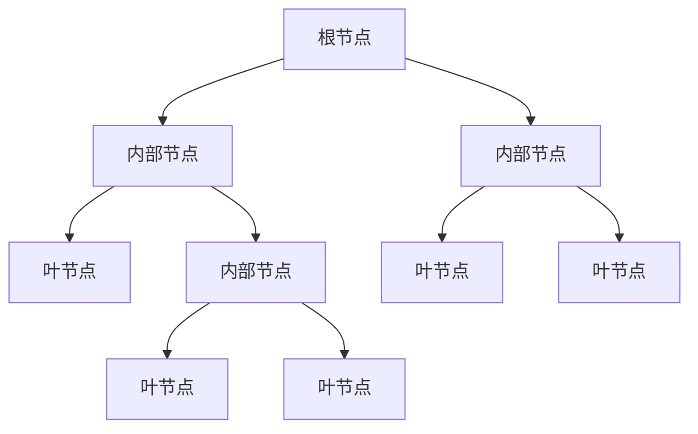
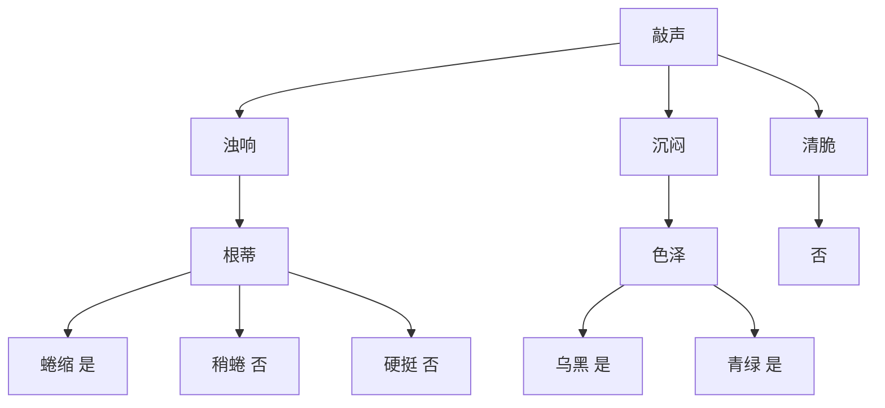

# 决策树与规则提取原理与代码实战案例讲解

## 1.背景介绍
决策树是一种常用的机器学习算法,它能够从数据中自动学习出一系列if-then规则,用于分类和预测任务。决策树的优点是模型可解释性强,训练和预测速度快,能够处理类别型和数值型特征,对缺失值不敏感。但它也有容易过拟合、对特征选择敏感等缺点。

决策树的训练过程就是一个递归地选择最优特征,并根据该特征对训练数据进行分支的过程。常见的特征选择准则有信息增益、增益率、基尼指数等。决策树的预测是根据新样本的特征,从根节点开始,按照学习到的规则进行分支,直到到达叶子节点,叶节点的类别即为预测结果。

决策树模型可解释性强的一个重要原因是,它学习到的if-then规则非常容易理解。我们可以将决策树的分支过程总结成一系列规则,每条规则对应树中的一条从根节点到叶节点的路径。将决策树转化为规则,可以帮助我们更好地理解模型的决策依据,并应用于实际业务场景。

本文将详细介绍决策树的原理,包括特征选择、树的生成、剪枝等关键技术。然后通过实际代码案例,演示如何使用Python中的机器学习库scikit-learn训练决策树模型,并将其转化为if-then规则。最后,讨论决策树在实际场景中的应用,以及未来的发展趋势与面临的挑战。

## 2.核心概念与联系
要理解决策树算法,首先需要了解几个核心概念:
- 节点:构成决策树的基本单元,包括根节点、内部节点和叶节点
- 分支:连接节点的边,表示按照某个特征进行数据划分
- 特征:每个节点根据某个特征的取值对数据进行分支
- 纯度:衡量一个节点包含的样本类别一致性,常见的指标有信息增益、增益率、基尼指数
- 过拟合:模型在训练集上表现很好,但在新数据上泛化能力差,通常是由于模型过于复杂
- 剪枝:通过降低模型复杂度来控制过拟合的一种方法,分为预剪枝和后剪枝

下图展示了决策树的基本结构和关键概念之间的联系:



决策树的生成就是不断选择最优划分特征,递归地构建子树的过程。我们期望划分后的子节点尽可能纯,即包含的样本尽可能属于同一类别。因此需要用一个指标来衡量节点的纯度,这就是信息增益、增益率和基尼指数的作用。

找到最优划分特征后,数据被分到不同的子节点,子节点继续重复上述划分过程,直到满足一定的停止条件,比如所有样本属于同一类别、达到最大深度、样本数量少于阈值等。

决策树还容易出现过拟合,即在训练集上表现很好,但在新数据上泛化能力差。剪枝就是缓解过拟合的重要手段,通过限制树的深度、叶子节点的最小样本数、设定信息增益阈值等来降低模型复杂度。

## 3.核心算法原理具体操作步骤
决策树的核心算法可以分为三个步骤:
1. 特征选择:评估每个特征对节点纯度的提升,选出最优特征
2. 决策树生成:从根节点开始,递归地选择最优特征,生成子树,直到满足停止条件
3. 剪枝:通过降低树的复杂度来控制过拟合,包括预剪枝和后剪枝两种策略

下面详细介绍每个步骤。

### 3.1 特征选择
常用的特征选择指标有三种:
- 信息增益:衡量一个特征对样本熵的减少量。熵越大表示样本的不确定性越大,减少的熵越多,特征的区分能力越强。
- 增益率:在信息增益的基础上,考虑了特征本身的熵,对取值较多的特征进行惩罚,减轻偏向选择取值多的特征的问题。
- 基尼指数:反映了从一个节点随机抽取两个样本,其类别不一致的概率。基尼指数越小,节点的纯度越高。

以信息增益为例,假设当前节点包含的样本集合为D,类别数为K,第k类样本所占的比例为pk,则该节点的信息熵为:

$$
H(D) = -\sum_{k=1}^{K} p_k log_2 p_k
$$

按特征A对样本集D进行划分,假设A有V个可能的取值{a1,a2,...,aV},则划分后的信息熵为:

$$
H(D|A) = \sum_{v=1}^V \frac{|D^v|}{|D|} H(D^v)
$$

其中,|D|和|Dv|分别表示D和Dv的样本数量。特征A对样本集D的信息增益定义为:

$$
g(D,A) = H(D) - H(D|A)
$$

遍历所有特征,计算它们的信息增益,选择信息增益最大的特征作为最优划分特征。

### 3.2 决策树生成
决策树的生成过程如下:
1. 从根节点开始,对当前节点的数据集D,计算每个特征的信息增益(或其他指标),选择最优特征A
2. 根据A的取值将D划分为若干子集{D1,D2,...,DV}
3. 对每个子集Dv,生成一个子节点,将Dv划分到该子节点,构成子树
4. 对每个子节点,递归执行1~3,直到满足停止条件,标记为叶节点
5. 停止条件可以是:所有样本属于同一类别、特征用完、达到最大深度、节点包含的样本数小于阈值等

### 3.3 剪枝
决策树的剪枝策略分为预剪枝和后剪枝。

预剪枝是在决策树生成过程中,对每个节点在划分前进行估计,若当前节点的划分不能带来泛化性能的提升,则停止划分并将当前节点标记为叶节点。预剪枝的常用策略有:
- 限制树的最大深度
- 限制叶节点的最小样本数
- 设定信息增益的阈值,若小于该阈值则停止划分

后剪枝则是先生成一棵完整的决策树,然后自底向上地对非叶节点进行考察,若将其替换为叶节点能带来泛化性能的提升,则进行剪枝。后剪枝需要使用一个独立的验证集来评估剪枝前后的性能。

## 4.数学模型和公式详细讲解举例说明
决策树涉及的主要数学模型和公式包括信息熵、条件熵、信息增益、增益率、基尼指数等,下面以西瓜数据集2.0为例进行讲解。

该数据集包含8个样本,每个样本有3个特征(色泽、根蒂、敲声)和1个类别标签(好瓜),如下表所示:

| 编号 | 色泽 | 根蒂 | 敲声 | 好瓜 |
| --- | --- | --- | --- | --- |
| 1   | 青绿 | 蜷缩 | 浊响 | 是   |
| 2   | 乌黑 | 蜷缩 | 沉闷 | 是   |
| 3   | 乌黑 | 蜷缩 | 浊响 | 是   |
| 4   | 青绿 | 蜷缩 | 沉闷 | 是   |
| 5   | 浅白 | 蜷缩 | 浊响 | 是   |
| 6   | 青绿 | 稍蜷 | 浊响 | 否   |
| 7   | 乌黑 | 稍蜷 | 浊响 | 否   |
| 8   | 浅白 | 硬挺 | 清脆 | 否   |

首先,计算当前根节点的信息熵。根节点包含所有8个样本,其中正例(是)占5/8,反例(否)占3/8,因此:

$$
H(D) = -(\frac{5}{8} log_2 \frac{5}{8} + \frac{3}{8} log_2 \frac{3}{8}) = 0.954
$$

接下来,计算每个特征的信息增益。以色泽为例,它有3个可能的取值{青绿,乌黑,浅白},将数据集按色泽划分为3个子集:
- D1(青绿)包含{1,4,6},其中正例2个,反例1个
- D2(乌黑)包含{2,3,7},其中正例2个,反例1个 
- D3(浅白)包含{5,8},其中正例1个,反例1个

计算这3个子集的信息熵:

$$
H(D1) = -(2/3 log_2 2/3 + 1/3 log_2 1/3) = 0.918 \\
H(D2) = -(2/3 log_2 2/3 + 1/3 log_2 1/3) = 0.918 \\
H(D3) = -(1/2 log_2 1/2 + 1/2 log_2 1/2) = 1.000
$$

再计算条件熵:

$$
H(D|色泽) = \frac{3}{8}H(D1) + \frac{3}{8}H(D2) + \frac{2}{8}H(D3) = 0.939
$$

由此可得色泽的信息增益:

$$
g(D,色泽) = H(D) - H(D|色泽) = 0.954 - 0.939 = 0.015
$$

类似地,可以计算根蒂和敲声的信息增益分别为0.420和0.439。可见,敲声的信息增益最大,因此选择敲声作为根节点的划分特征。

接下来,以敲声划分数据集,生成浊响、沉闷、清脆三个子节点。对每个子节点,重复上述步骤,直到满足停止条件。最终得到如下决策树:



可以看出,使用信息增益生成的决策树在训练集上可以完全分类,但在实际应用中可能存在过拟合风险。因此,还需要考虑决策树的剪枝。

限于篇幅,这里不再详细介绍增益率和基尼指数,其计算和应用与信息增益类似,感兴趣的读者可以自行研究。

## 5.项目实践：代码实例和详细解释说明
下面以Python中的scikit-learn库为例,演示如何训练决策树模型并提取规则。

首先,创建一个简单的二分类数据集:

```python
import numpy as np
from sklearn.datasets import make_classification

# 生成100个样本,每个样本有4个特征,2个类别
X, y = make_classification(n_samples=100, n_features=4, n_classes=2, random_state=42)
```

接下来,将数据集划分为训练集和测试集:

```python
from sklearn.model_selection import train_test_split

X_train, X_test, y_train, y_test = train_test_split(X, y, test_size=0.2, random_state=42)
```

然后,创建决策树分类器,指定划分质量的评估标准为"基尼指数",并对树进行限制,最大深度为3,叶子节点最少样本数为5:

```python
from sklearn.tree import DecisionTreeClassifier

clf = DecisionTreeClassifier(criterion='gini', max_depth=3, min_samples_leaf=5, random_state=42)
```

训练决策树模型:

```python
clf.fit(X_train, y_train)
```

在测试集上评估模型性能:

```python
from sklearn.metrics import accuracy_score

y_pred = clf.predict(X_test)
print(f"Accuracy: {accuracy_score(y_test