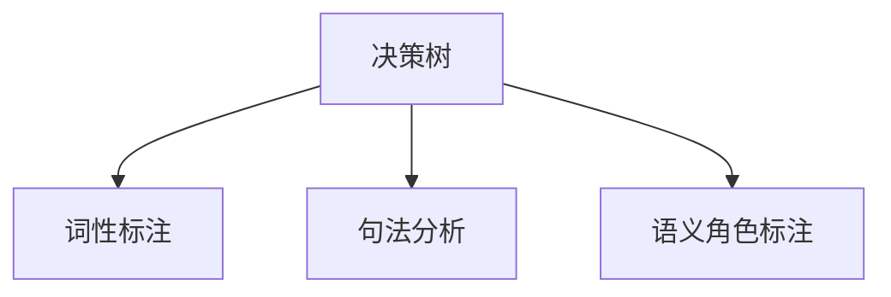

## 1.背景介绍

自然语言处理（NLP）是计算机科学、人工智能和语言学交叉的领域，它探索如何使计算机能够理解、解析和生成人类语言。这是一项复杂的任务，因为人类语言是丰富多变且充满歧义的。为了解决这一问题，研究人员已经开发出各种算法和模型。其中，决策树作为一种强大而灵活的工具，在自然语言处理中发挥了重要作用。

## 2.核心概念与联系

决策树是一种监督学习算法，它通过学习样本数据的特征和标签，构建一个树形结构的模型，用于预测未知样本的标签。决策树的每个内部节点表示一个特征，每个分支代表一个决策规则，每个叶节点代表一个预测结果。决策树的优点在于模型具有良好的可解释性，能够生成清晰的规则。

在自然语言处理中，决策树可以用于各种任务，如词性标注、句法分析、语义角色标注等。例如，在词性标注任务中，决策树可以学习词汇和上下文的特征，预测每个词的词性。



## 3.核心算法原理具体操作步骤

决策树的构建过程主要包括特征选择、树的生成和剪枝三个步骤。

### 3.1 特征选择

特征选择是决定使用哪些特征来分割数据的过程。常用的特征选择方法有信息增益、信息增益率、基尼指数等。

### 3.2 树的生成

树的生成是通过递归的方式，根据特征选择的结果，将数据集划分成不同的子集，然后在每个子集上重复这个过程，直到满足停止条件（如所有样本属于同一类别，或者没有剩余的特征）。

### 3.3 剪枝

剪枝是为了防止过拟合，通过在验证集上测试模型的性能，对树进行简化。常用的剪枝方法有预剪枝和后剪枝。

## 4.数学模型和公式详细讲解举例说明

决策树的构建过程涉及到一些重要的数学模型和公式，下面以信息增益为例，进行详细讲解。

信息增益是决策树中常用的特征选择方法，它衡量了通过某个特征对数据集进行划分，能够获得的“纯度提升”。信息增益的计算公式如下：

$$
IG(D, a) = H(D) - H(D|a)
$$

其中，$D$是数据集，$a$是特征，$H(D)$是数据集$D$的熵，$H(D|a)$是在特征$a$下，数据集$D$的条件熵。

熵$H(D)$的计算公式如下：

$$
H(D) = -\sum_{k=1}^{K} p_k \log p_k
$$

其中，$K$是类别的数量，$p_k$是类别$k$在数据集$D$中的比例。

条件熵$H(D|a)$的计算公式如下：

$$
H(D|a) = \sum_{v\in V} \frac{|D^v|}{|D|} H(D^v)
$$

其中，$V$是特征$a$的取值集合，$D^v$是在特征$a$取值为$v$时，数据集$D$的子集。

## 5.项目实践：代码实例和详细解释说明

下面以Python的scikit-learn库为例，展示如何使用决策树进行词性标注。

首先，我们需要准备数据。在这个例子中，我们使用Brown语料库，它包含了大量已经标注了词性的英文句子。

```python
from nltk.corpus import brown

sentences = brown.tagged_sents(categories='news')
```

然后，我们需要提取特征。在这个例子中，我们使用单词本身和前一个单词作为特征。

```python
def features(sentence, index):
    return {
        'word': sentence[index],
        'prev_word': '' if index == 0 else sentence[index - 1],
    }
```

接下来，我们需要构建训练集和测试集。

```python
size = int(len(sentences) * 0.8)

train_sents = sentences[:size]
test_sents = sentences[size:]

X_train = []
y_train = []

for sent in train_sents:
    for i in range(len(sent)):
        X_train.append(features(sent, i))
        y_train.append(sent[i][1])
```

最后，我们可以训练决策树模型，并进行预测。

```python
from sklearn.tree import DecisionTreeClassifier

clf = DecisionTreeClassifier()
clf.fit(X_train, y_train)

X_test = [features(sent, i) for sent in test_sents for i in range(len(sent))]
y_test = [sent[i][1] for sent in test_sents for i in range(len(sent))]

y_pred = clf.predict(X_test)
```

## 6.实际应用场景

决策树在自然语言处理中有广泛的应用，包括但不限于以下几个场景：

- 词性标注：预测每个词的词性，如名词、动词、形容词等。
- 句法分析：确定句子的句法结构，如短语结构、依存关系等。
- 语义角色标注：确定句子中每个词的语义角色，如施事、受事、工具等。

## 7.工具和资源推荐

- Python的scikit-learn库：提供了决策树模型的实现，使用方便，功能强大。
- Python的nltk库：提供了丰富的自然语言处理工具，包括语料库、词性标注器、句法分析器等。
- WEKA：一个包含了各种机器学习算法的开源软件，可以用于数据挖掘和预测建模。

## 8.总结：未来发展趋势与挑战

随着深度学习的发展，神经网络模型在自然语言处理中的应用越来越广泛，但决策树仍然有其独特的优势，如模型的可解释性强，不需要大量的训练数据，对于一些特定的任务，如规则生成、知识表示等，决策树可能更有优势。

然而，决策树也面临一些挑战，如如何处理高维稀疏的特征，如何处理连续的特征，如何处理不平衡的数据等。这些问题需要进一步的研究和探索。

## 9.附录：常见问题与解答

- 问题：决策树如何处理连续的特征？
- 回答：决策树处理连续特征的常见方法是离散化，即将连续的特征转化为离散的特征。常用的离散化方法有等宽法、等频法、基于聚类的方法等。

- 问题：决策树如何处理不平衡的数据？
- 回答：决策树处理不平衡数据的常见方法是采样，即通过过采样或者欠采样的方式，使得各类别的样本数量相近。另外，也可以在构建决策树时，对不同类别的样本赋予不同的权重。

- 问题：决策树如何处理缺失值？
- 回答：决策树处理缺失值的常见方法是填充，即用某个值替代缺失值。填充的值可以是固定值，也可以是其他样本的平均值或者众数。

作者：禅与计算机程序设计艺术 / Zen and the Art of Computer Programming