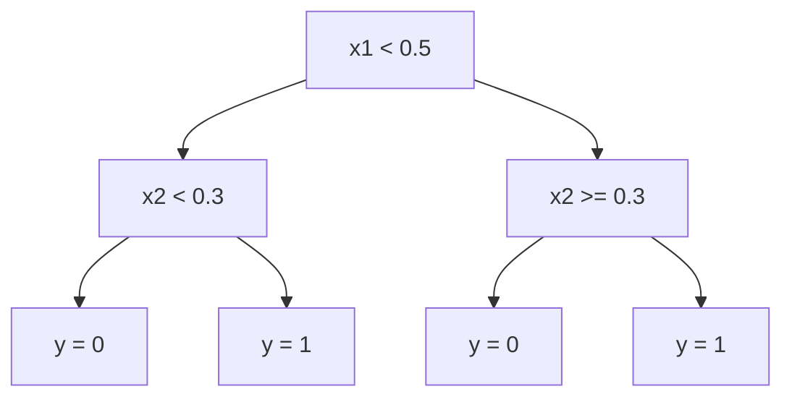

# 准确率在预测选举结果中的应用

## 1. 背景介绍

### 1.1 选举预测的重要性

选举预测一直是政治学、社会学和统计学领域的一个热门话题。准确预测选举结果对于政党、候选人、选民和整个社会都有着重大意义。它不仅能够为政党和候选人提供宝贵的信息,调整竞选策略,也能让选民更好地了解民意走向,做出明智的选择。同时,准确的选举预测也是衡量一个国家民主程度和社会发展水平的重要指标。

### 1.2 选举预测的挑战

然而,准确预测选举结果并非一蹴而就。这个过程面临着诸多挑战,例如:

- 数据质量问题:调查数据可能存在抽样偏差、非响应偏差等问题,影响预测准确性。
- 复杂的影响因素:选举结果受到政治、经济、社会、文化等多方面因素的影响,很难全部考虑。
- 动态变化:选民的意向会随着时间推移而发生变化,增加了预测的不确定性。
- 非线性关系:影响因素与选举结果之间可能存在非线性关系,难以建模。

### 1.3 机器学习在选举预测中的作用

传统的选举预测方法,如回归模型、时间序列分析等,在处理高维、非线性数据时存在局限性。而机器学习技术,尤其是深度学习,能够从海量数据中自动学习特征,捕捉复杂的非线性模式,为选举预测提供了新的解决方案。

本文将重点探讨如何利用机器学习中的分类算法,提高选举结果预测的准确率。我们将介绍相关的核心概念、算法原理、数学模型,并通过实际案例、代码实现和应用场景,为读者提供实用的技术指导。

## 2. 核心概念与联系

### 2.1 监督学习与分类问题

选举预测本质上是一个分类问题。我们需要根据候选人的特征(如政策主张、竞选活动、人口统计学特征等)和选民的特征(如年龄、收入、地理位置等),将选民划分到不同的候选人阵营。这属于监督学习的范畴。

在监督学习中,我们使用已标记的训练数据(即已知选民的投票意向)来训练分类模型,然后将该模型应用于未标记的测试数据(即未知选民的投票意向),从而进行预测。

### 2.2 常见分类算法

机器学习中常用的分类算法有:

- 逻辑回归(Logistic Regression)
- 支持向量机(Support Vector Machines, SVM)
- 决策树(Decision Trees)
- 随机森林(Random Forests)
- 梯度提升决策树(Gradient Boosting Decision Trees, GBDT)
- 神经网络(Neural Networks)

每种算法都有其适用场景和优缺点。例如,逻辑回归简单易解释,但对非线性数据的拟合能力较差;决策树和随机森林能够自动处理特征交互,但可能过拟合;神经网络具有强大的非线性拟合能力,但可解释性较差。

在实际应用中,我们通常会对多种算法进行比较,选择在特定数据集上表现最佳的模型。

### 2.3 评估指标

评估分类模型的准确率是至关重要的。常用的评估指标包括:

- 准确率(Accuracy):正确预测的样本数占总样本数的比例。
- 精确率(Precision):预测为正例的样本中,真实正例的比例。
- 召回率(Recall):真实正例中,被正确预测为正例的比例。
- F1分数:精确率和召回率的调和平均值。

除了上述指标外,我们还可以绘制ROC曲线和计算AUC(Area Under Curve),衡量分类器的整体性能。

## 3. 核心算法原理具体操作步骤

在这一部分,我们将重点介绍两种常用的分类算法:逻辑回归和随机森林,并详细阐述它们的原理和操作步骤。

### 3.1 逻辑回归

#### 3.1.1 原理

逻辑回归是一种广义线性模型,它通过对数几率(log-odds)的线性组合来预测二分类结果。具体来说,给定输入特征向量$\boldsymbol{x}$,我们希望找到一个函数$f(\boldsymbol{x})$,使得$f(\boldsymbol{x})$接近于真实标记$y$的概率。

逻辑回归模型定义如下:

$$f(\boldsymbol{x}) = P(y=1|\boldsymbol{x}) = \sigma(\boldsymbol{w}^T\boldsymbol{x} + b)$$

其中,$\sigma(z)$是逻辑sigmoid函数:

$$\sigma(z) = \frac{1}{1 + e^{-z}}$$

$\boldsymbol{w}$和$b$是需要学习的模型参数。

#### 3.1.2 模型训练

我们通过最大似然估计来学习参数$\boldsymbol{w}$和$b$。具体地,我们最大化训练数据的对数似然函数:

$$\mathcal{L}(\boldsymbol{w}, b) = \sum_{i=1}^{N} \Big[ y^{(i)}\log f(\boldsymbol{x}^{(i)}) + (1 - y^{(i)})\log(1 - f(\boldsymbol{x}^{(i)})) \Big]$$

通常使用梯度上升法或牛顿法等优化算法来求解上述最优化问题。

#### 3.1.3 预测

对于新的输入$\boldsymbol{x}^*$,我们计算$f(\boldsymbol{x}^*)$,并根据以下规则进行预测:

$$
\begin{cases}
\text{预测为正例(1)}, & \text{if } f(\boldsymbol{x}^*) \geq 0.5 \\
\text{预测为负例(0)}, & \text{if } f(\boldsymbol{x}^*) < 0.5
\end{cases}
$$

逻辑回归的优点是模型简单、可解释性强,缺点是对非线性数据的拟合能力较差。

### 3.2 随机森林

#### 3.2.1 原理

随机森林是一种基于决策树的集成学习算法。它通过构建多个决策树,并将它们的预测结果进行综合,从而提高预测的准确性和鲁棒性。

每棵决策树的构建过程如下:

1. 从训练集中有放回地抽取$N$个样本(这里$N$等于训练集大小),构建一个bootstrap数据集。
2. 在每个节点上,随机选择$m$个特征(其中$m \ll M$,M为总特征数),并在这些特征上寻找最佳分割点。
3. 每棵树在没有剪枝的情况下生长到最大。

在预测时,我们将输入样本$\boldsymbol{x}$分别输入到每棵树中,并对所有树的预测结果进行投票或平均,得到最终预测。

随机森林的优点是能够有效处理高维数据、缺失值和异常值,且不易过拟合。缺点是模型的可解释性较差。

#### 3.2.2 超参数调优

随机森林的性能很大程度上依赖于以下几个超参数的设置:

- 树的数量($n\_estimators$):树越多,模型的方差越小,但计算代价也越高。
- 最大树深($max\_depth$):深度越大,模型越容易过拟合。
- 最小样本分割数($min\_samples\_split$):该值越大,生成的树越简单。
- 最小样本叶子数($min\_samples\_leaf$):该值越大,生成的树越简单。
- 特征数量($max\_features$):该值越大,模型越复杂。

我们可以使用交叉验证等方法,在验证集上调整这些超参数,以获得最佳性能。

## 4. 数学模型和公式详细讲解举例说明

在这一部分,我们将重点讨论逻辑回归和随机森林的数学模型,并通过具体例子加深理解。

### 4.1 逻辑回归

回顾一下逻辑回归模型:

$$f(\boldsymbol{x}) = P(y=1|\boldsymbol{x}) = \sigma(\boldsymbol{w}^T\boldsymbol{x} + b)$$

其中,$\sigma(z)$是逻辑sigmoid函数:

$$\sigma(z) = \frac{1}{1 + e^{-z}}$$

让我们以一个简单的二元逻辑回归为例,其中$\boldsymbol{x} = (x_1, x_2)^T$。我们可以将模型可视化为三维空间中的一个平面:

$$\boldsymbol{w}^T\boldsymbol{x} + b = 0$$

这个平面将空间分为两部分,对应于两个类别。具体来说,对于任意点$\boldsymbol{x}^*$:

- 如果$\boldsymbol{w}^T\boldsymbol{x}^* + b > 0$,则$f(\boldsymbol{x}^*) > 0.5$,预测为正例。
- 如果$\boldsymbol{w}^T\boldsymbol{x}^* + b < 0$,则$f(\boldsymbol{x}^*) < 0.5$,预测为负例。

在训练过程中,我们需要调整$\boldsymbol{w}$和$b$的值,使得这个平面能够很好地将两类样本分开。

### 4.2 随机森林

随机森林的数学模型相对复杂一些,但我们可以通过一个简单的例子来理解其工作原理。

假设我们有一个二维数据集,包含两个特征$x_1$和$x_2$,以及对应的标记$y$。我们可以构建一棵决策树,如下所示:



在这棵树中,每个内部节点代表一个特征,根据该特征的值将样本分到左子树或右子树。叶子节点代表最终的预测结果。

对于一个新的输入样本$\boldsymbol{x}^*$,我们将其从树根开始,根据特征值进行分支,一直到达叶子节点,得到预测结果$\hat{y}$。

在随机森林中,我们构建多棵这样的决策树,每棵树的预测结果都会被考虑在内。对于分类问题,我们可以使用投票的方式(即选择被预测次数最多的类别)或者计算每个类别被预测的平均概率,将其作为最终预测结果。

通过这种集成的方式,随机森林能够显著降低过拟合的风险,提高模型的泛化能力。

## 5. 项目实践:代码实例和详细解释说明

在这一部分,我们将使用Python中的scikit-learn库,实现逻辑回归和随机森林模型,并在一个真实的选举数据集上进行测试。

### 5.1 数据集介绍

我们使用的数据集来自1984年美国总统大选,包含59个特征和16个州的选举结果。每个样本代表一个县,特征包括人口统计学特征(如年龄、种族、收入等)和地理特征(如所在州、城镇人口等)。

我们的目标是根据这些特征,预测每个县投票给共和党候选人还是民主党候选人。

### 5.2 数据预处理

在建模之前,我们需要进行一些数据预处理步骤,包括:

1. 缺失值处理:使用每个特征的中位数或众数填充缺失值。
2. 类别特征编码:对于类别特征(如所在州),我们使用One-Hot编码将其转换为数值特征。
3. 特征缩放:由于特征的量纲不同,我们使用StandardScaler将所有特征缩放到均值为0、方差为1的范围内。

```python
# 导入相关库
import pandas as pd
from sklearn.preprocessing import OneHotEncoder, StandardScaler
from sklearn.impute import SimpleImputer
from sklearn.compose import ColumnTransformer
from sklearn.pipeline import Pipeline

# 读取数据
data = pd.read_csv('election_data.csv')

# 构建预处理管道
numeric_features = ['age', 'income', ...]
categorical_features = ['state', 'county', ...]

numeric_transformer = SimpleImputer(strategy='median')
categorical_transformer = Pipeline(steps=[
    ('imputer', SimpleImputer(strategy='most_frequent')),
    ('onehot