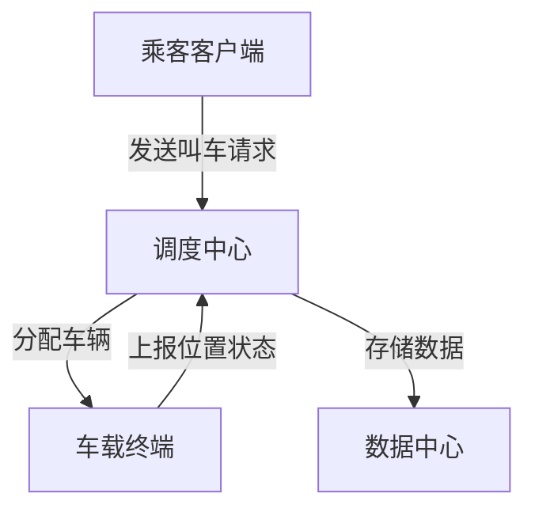
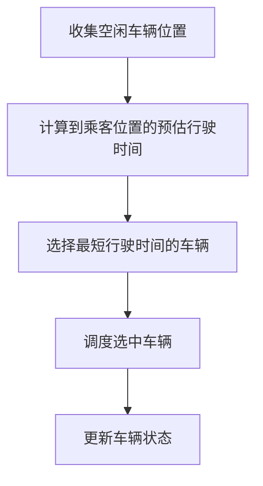
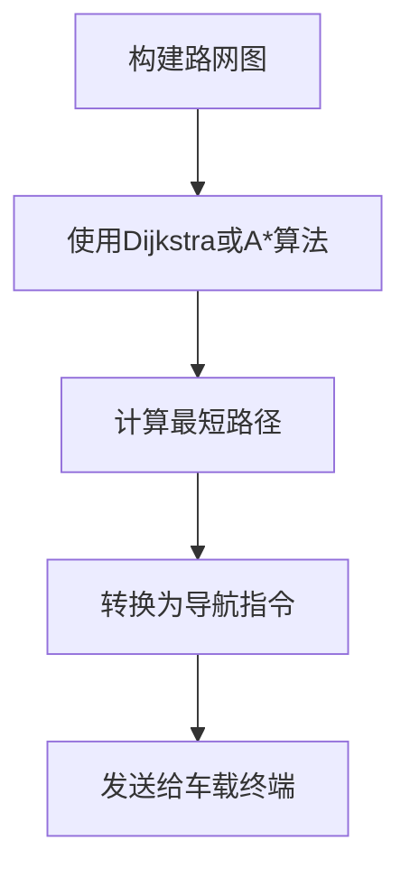

# 出租车管理系统详细设计与具体代码实现

## 1. 背景介绍

### 1.1 出租车行业概况

出租车是城市交通的重要组成部分,为市民提供了便捷的出行方式。随着城市化进程的不断加快,人们对出租车服务的需求也在持续增长。然而,传统的出租车调度方式存在诸多问题,如车辆调度效率低下、乘客等候时间长、车辆利用率不高等。因此,构建一个高效的出租车管理系统,对于优化城市交通资源配置、提高出租车服务质量具有重要意义。

### 1.2 系统目标

本文旨在设计并实现一个出租车管理系统,以解决传统出租车调度模式中存在的问题。该系统的主要目标包括:

1. 提高出租车调度效率,缩短乘客等候时间。
2. 优化车辆利用率,降低空驶率。
3. 实现实时车辆监控和调度。
4. 为乘客提供便捷的叫车服务。
5. 收集并分析出租车运营数据,为决策提供支持。

## 2. 核心概念与联系

### 2.1 系统架构

出租车管理系统采用分布式架构,由以下几个核心模块组成:

1. **调度中心**: 负责接收乘客叫车请求,分配最近的空闲车辆。
2. **车载终端**: 安装在出租车上,用于接收调度指令并上报车辆位置和状态。
3. **乘客客户端**: 提供手机APP或网页界面,供乘客发起叫车请求。
4. **数据中心**: 存储并分析系统运营数据,为决策提供支持。



### 2.2 关键技术

1. **地理位置服务**: 利用GPS或基站定位技术获取车辆和乘客的实时位置信息。
2. **路径规划算法**: 计算乘客与空闲车辆之间的最优路径,实现高效调度。
3. **实时通信技术**: 如WebSocket,实现调度中心、车载终端和乘客客户端之间的实时通信。
4. **分布式系统设计**: 保证系统的高可用性、可扩展性和容错性。
5. **大数据分析技术**: 对系统运营数据进行分析,优化调度策略和资源配置。

## 3. 核心算法原理具体操作步骤

### 3.1 车辆调度算法

#### 3.1.1 问题描述

给定一组空闲车辆的位置和一个新的乘客叫车请求,需要找到一辆最优的车辆为该乘客服务,使得乘客的等待时间最短。

#### 3.1.2 算法流程

1. 收集所有空闲车辆的位置信息。
2. 计算每辆空闲车辆到乘客位置的预估行驶时间。
3. 选择预估行驶时间最短的车辆为乘客服务。
4. 将选中的车辆调度给乘客,并更新车辆状态为"已调度"。



#### 3.1.3 算法优化

1. **考虑交通拥堵情况**: 在计算预估行驶时间时,可以利用实时交通数据,更准确地预测行驶时间。
2. **动态调度**: 当有新的空闲车辆出现时,重新评估是否需要调整调度方案。
3. **区域划分**: 将服务区域划分为多个子区域,每个子区域分配一个调度中心,降低单个调度中心的负载。

### 3.2 路径规划算法

#### 3.2.1 问题描述

给定出租车和乘客的起始位置,计算两者之间的最优路径,使得行驶时间最短或行驶距离最短。

#### 3.2.2 算法流程

1. 构建路网图,将道路抽象为节点和边。
2. 使用Dijkstra算法或A*算法计算最短路径。
3. 将计算得到的路径转换为导航指令,发送给车载终端。



#### 3.2.3 算法优化

1. **实时交通数据**: 将实时交通数据融入路径规划,避开拥堵路段。
2. **多条件约束**: 除了距离和时间,还可以考虑其他因素,如路费、舒适度等。
3. **动态路径规划**: 在行驶过程中,根据实时交通情况动态调整路径。

## 4. 数学模型和公式详细讲解举例说明

### 4.1 车辆调度模型

假设有$n$辆空闲车辆,第$i$辆车辆的位置为$(x_i, y_i)$,乘客位置为$(x_p, y_p)$。我们需要找到一辆车辆$k$,使得该车辆到达乘客位置的预估时间$t_k$最短,即:

$$\min\limits_{1 \leq k \leq n} t_k$$

其中,预估时间$t_k$可以根据车辆与乘客之间的距离$d_k$和预估速度$v$计算得到:

$$t_k = \frac{d_k}{v}$$

距离$d_k$可以使用欧几里得距离公式计算:

$$d_k = \sqrt{(x_k - x_p)^2 + (y_k - y_p)^2}$$

在实际情况中,我们还需要考虑交通拥堵等因素,可以引入一个拥堵系数$\alpha$,修正预估时间:

$$t_k = \alpha \cdot \frac{d_k}{v}$$

其中,拥堵系数$\alpha$可以根据历史数据和实时交通信息进行估计。

### 4.2 路径规划模型

假设路网由$N$个节点和$M$条边组成,我们需要找到从节点$s$到节点$t$的最短路径。可以使用Dijkstra算法或A*算法求解。

#### 4.2.1 Dijkstra算法

Dijkstra算法的基本思想是从源点出发,不断扩展到其他节点,直到找到终点。算法步骤如下:

1. 初始化距离数组$dist$,对于源点$s$,令$dist[s] = 0$,对于其他节点$v$,令$dist[v] = \infty$。
2. 创建优先队列$Q$,初始时将源点$s$插入队列。
3. 循环执行以下操作,直到队列为空:
   - 从队列中取出距离最小的节点$u$。
   - 对于$u$的每个相邻节点$v$,更新$dist[v] = \min(dist[v], dist[u] + w(u, v))$,其中$w(u, v)$是边$(u, v)$的权重。
   - 如果$v$不在队列中,则将其插入队列。

最终,$dist$数组中的值就是源点到每个节点的最短距离。

#### 4.2.2 A*算法

A*算法是一种启发式搜索算法,它在Dijkstra算法的基础上,引入了一个启发函数$h(v)$,估计节点$v$到终点的距离。算法步骤如下:

1. 初始化距离数组$dist$和启发函数$h$,对于源点$s$,令$dist[s] = 0$,对于其他节点$v$,令$dist[v] = \infty$。
2. 创建优先队列$Q$,初始时将源点$s$插入队列,优先级为$0 + h(s)$。
3. 循环执行以下操作,直到队列为空:
   - 从队列中取出优先级最高的节点$u$。
   - 如果$u$是终点,则结束搜索。
   - 对于$u$的每个相邻节点$v$,更新$dist[v] = \min(dist[v], dist[u] + w(u, v))$,并将$v$插入队列,优先级为$dist[v] + h(v)$。

最终,$dist$数组中的值就是源点到每个节点的最短距离。

A*算法的关键在于选择合适的启发函数$h(v)$,常用的启发函数是欧几里得距离或曼哈顿距离。一个好的启发函数应该满足以下条件:

1. 不过估,即$h(v) \leq d(v, t)$,其中$d(v, t)$是节点$v$到终点$t$的实际距离。
2. 越接近终点,估计值越精确。

## 5. 项目实践: 代码实例和详细解释说明

### 5.1 系统架构

我们将使用Python语言和Flask Web框架实现出租车管理系统的原型。系统架构如下:

```mermaid
graph LR
    A[乘客客户端] -->|发送叫车请求| B[Flask Web服务器]
    B -->|分配车辆| C[Redis消息队列]
    D[车载终端] ...|订阅消息队列| C
    C -->|存储数据| E[MongoDB数据库]
    B -->|查询数据| E
```

1. **乘客客户端**: 使用HTML/CSS/JavaScript实现Web界面,允许乘客发起叫车请求。
2. **Flask Web服务器**: 处理乘客请求,调用调度算法分配车辆,并将调度结果发送到Redis消息队列。
3. **Redis消息队列**: 用于在Web服务器和车载终端之间传递调度指令和车辆状态信息。
4. **车载终端**: 使用Python脚本模拟,订阅Redis消息队列,接收调度指令并上报车辆位置和状态。
5. **MongoDB数据库**: 存储系统运营数据,如乘客请求、车辆轨迹等。

### 5.2 关键代码实现

#### 5.2.1 Flask Web服务器

```python
from flask import Flask, render_template, request
import redis
import mongodb

app = Flask(__name__)
r = redis.Redis()
db = mongodb.get_db()

@app.route('/')
def index():
    return render_template('index.html')

@app.route('/request', methods=['POST'])
def request_ride():
    passenger_loc = request.form['location']
    vehicle = dispatch(passenger_loc)
    r.publish('dispatch', f'{vehicle},{passenger_loc}')
    return 'Ride requested successfully'

def dispatch(passenger_loc):
    # 调用调度算法分配车辆
    ...
    return vehicle

if __name__ == '__main__':
    app.run(debug=True)
```

1. 使用Flask创建Web服务器,提供HTML界面供乘客发起叫车请求。
2. 当收到乘客请求时,调用`dispatch`函数分配车辆。
3. 将调度结果发布到Redis消息队列,供车载终端订阅。

#### 5.2.2 车载终端

```python
import redis
import mongodb

r = redis.Redis()
db = mongodb.get_db()

def subscribe_dispatch():
    pubsub = r.pubsub()
    pubsub.subscribe('dispatch')
    for message in pubsub.listen():
        if message['type'] == 'message':
            vehicle, passenger_loc = message['data'].decode().split(',')
            if vehicle == 'TAXI001':
                navigate(passenger_loc)

def navigate(destination):
    # 导航到目的地
    ...
    report_status(destination)

def report_status(destination):
    # 上报车辆位置和状态
    vehicle_loc = get_location()
    status = 'Navigating' if vehicle_loc != destination else 'Arrived'
    db.vehicles.update_one({'id': 'TAXI001'}, {'$set': {'location': vehicle_loc, 'status': status}})

if __name__ == '__main__':
    subscribe_dispatch()
```

1. 订阅Redis消息队列,接收调度指令。
2. 根据调度指令,导航到乘客位置。
3. 上报车辆位置和状态,存储到MongoDB数据库。

### 5.3 Web界面

我们使用HTML/CSS/JavaScript实现了一个简单的Web界面,允许乘客发起叫车请求。

```html
<!DOCTYPE html>
<html>
<head>
    <title>出租车叫车系统</title>
    <style>
        /* CSS样式 */
    </style>
</head>
<body>
    <h1>出租车叫车系统</h1>
    <form id="request-form">
        <label for="location">您的位置:</label>
        