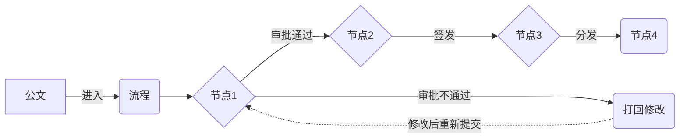

# 办公自动化之公文运转系统详细设计与具体代码实现

## 1.背景介绍

随着信息化时代的到来,企业和政府机构的办公自动化需求日益增长。公文运转是办公自动化的重要组成部分,传统的人工处理公文的方式已经无法满足现代化办公的需求。因此,开发一套高效、智能、安全的公文运转系统势在必行。

本文将详细阐述如何设计和实现一个完整的公文运转系统,涵盖需求分析、架构设计、核心算法、数据库设计、代码实现等各个方面。通过对系统的全面剖析,帮助读者深入理解公文运转的业务流程和技术实现。

### 1.1 公文运转系统的必要性

- 提高公文处理效率,减少人工处理环节
- 规范公文流转流程,保证公文处理的及时性和准确性  
- 加强公文安全管控,防止公文泄密和丢失
- 实现公文全生命周期管理,方便公文的查询、统计和归档

### 1.2 公文运转系统的目标

- 构建一个Web化的公文运转平台,支持多种终端访问
- 实现公文的拟稿、审批、签发、分发、阅读、归档等全流程管理
- 针对不同类型的公文,设计个性化的流转路径和处理规则
- 引入人工智能技术,实现公文自动分类、提取、校对等智能化处理
- 提供完善的权限控制和安全审计机制,保障系统和数据安全

## 2.核心概念与联系

在公文运转系统中,有几个核心概念需要理解:

### 2.1 公文 Document

公文是机关、团体、企业等组织在工作中形成的具有一定格式和法律效力的文书。常见的公文类型有:
- 命令 
- 决定
- 通知
- 通报
- 请示
- 报告
- 函
- 会议纪要
- ......

每种公文都有自己的格式要求和处理规范。

### 2.2 流程 Workflow

公文从产生到归档,要经历一系列环节,这个过程就是公文的流转流程。一般包括:
- 拟稿
- 审核 
- 签发
- 分发
- 阅读
- 传阅
- 借阅
- 归档
- ......

不同类型、不同重要程度的公文,流程会有所差异。流程规则可以通过可视化的方式来定义。

### 2.3 节点 Node

流程中的每个环节称为节点,一个流程由多个节点组成。节点一般对应某个具体的处理动作,如审批节点对应审批动作。每个节点都有相应的处理人。

### 2.4 角色 Role

公文处理人在系统中被赋予不同的角色,如拟稿人、审核人、签发人等。每个角色拥有不同的权限,可以在流程的特定节点执行操作。角色和权限的合理划分是系统安全的基础。

以上几个核心概念之间的关系如下图所示:

公文进入流程后,在各个节点上由不同角色的处理人进行处理,处理结果决定公文的流转方向,最终完成整个流程。

## 3.核心算法原理具体操作步骤

### 3.1 公文自动分类算法

在公文运转系统中,当一篇新的公文进入时,首先要判断它属于哪种类型的公文,然后才能进入相应的处理流程。传统的做法是由人工来识别公文类型,效率低下且容易出错。我们可以引入机器学习算法,实现公文自动分类。

#### 3.1.1 文本预处理

公文属于非结构化数据,需要进行预处理才能进行分类。预处理步骤包括:

1. 分词:将公文内容切分成一个个词语
2. 去除停用词:去掉一些无意义的虚词、连词等
3. 词干提取:将词语还原为词干形式

可以使用自然语言处理工具如jieba、NLTK等来完成预处理。

#### 3.1.2 特征提取

为了让机器学习模型能够学习,我们需要将文本转换为数值化的特征向量。常用的特征提取方法有:

1. 词袋模型 BOW:统计每个词在文档中出现的次数,生成词频向量
2. TF-IDF:在词袋模型的基础上,考虑词语在所有文档中的出现频率,提高区分度高的词的权重
3. Word2Vec:通过神经网络学习词语间的语义关系,生成词向量

#### 3.1.3 构建分类模型

根据提取的特征,选择合适的分类算法构建模型。常用的分类算法包括:

1. 朴素贝叶斯 Naive Bayes
2. 支持向量机 SVM  
3. 逻辑回归 Logistic Regression
4. 决策树 Decision Tree
5. 随机森林 Random Forest

#### 3.1.4 模型训练与评估

将已知类别的公文数据划分为训练集和测试集,用训练集训练分类模型,用测试集评估模型的准确率、精确率、召回率等指标。不断调整模型参数,直到达到满意的分类效果。

### 3.2 公文智能校对算法

公文的格式和内容都有严格的规范,传统的人工校对方式容易疏漏。我们可以利用自然语言处理技术,实现智能校对,提高公文质量。

#### 3.2.1 格式校验

利用正则表达式或者自定义规则,检查公文的格式是否符合要求,如:
- 标题格式
- 日期格式
- 正文字体、字号
- 页边距
- 页眉页脚
- 印章位置
- ......

#### 3.2.2 语法检查

使用自然语言处理工具如LanguageTool,检查公文中是否存在语法错误,如:
- 标点符号使用不当
- 主谓不一致
- 成分残缺
- 指代不明
- ......

#### 3.2.3 敏感词过滤

对公文内容进行敏感词匹配,将涉密、涉敏信息进行脱敏处理,或者提示修改。可以使用字符串匹配、正则匹配等方法,匹配系统预定义的敏感词库。

### 3.3 流程智能推荐算法

不同的公文适用不同的流转流程,如何为新拟的公文推荐合适的流程,可以借助机器学习算法来实现。

#### 3.3.1 历史流程数据准备

收集组织过去各类公文的处理流程数据,包括公文的类型、标题、拟稿部门、流程节点、处理人、处理意见、处理耗时等信息,作为训练数据。

#### 3.3.2 特征工程 

选取影响流程走向的关键因素作为特征,如:
- 公文类型
- 公文标题关键词
- 拟稿部门
- 拟稿人角色
- 紧急程度
- ......

对这些特征进行量化,转换为数值型或类别型变量。

#### 3.3.3 构建推荐模型

根据历史流程数据,训练机器学习模型,学习公文特征与流程的对应关系。可以使用的算法包括:

1. 隐马尔可夫模型 HMM
2. 条件随机场 CRF
3. 循环神经网络 RNN
4. 决策树
5. 关联规则挖掘
6. ......

#### 3.3.4 实时推荐

当一篇新的公文进入系统时,提取其特征,输入到训练好的推荐模型中,得到推荐的流程,供用户参考选择。

以上是公文运转系统中几个核心算法的原理和步骤,通过人工智能技术的应用,可以极大地提高公文处理的效率和质量。

## 4.数学模型和公式详细讲解举例说明

在公文自动分类算法中,我们提到了使用词袋模型 BOW 来进行文本特征提取。下面以 BOW 为例,详细讲解其数学模型和计算公式。

### 4.1 词袋模型 BOW

BOW(Bag of Words)模型是一种简单但有效的文本表示方法。它将一篇文档视为一个装满词语的袋子,不考虑词语的顺序和语法结构,只统计每个词出现的频率。

具体来说,设有 $m$ 篇文档 $\{d_1,d_2,...,d_m\}$ 组成的文档集合 $D$,共包含 $n$ 个不同的词语 $\{t_1,t_2,...,t_n\}$ 组成的词典 $T$。

BOW 将每篇文档 $d_i$ 表示为一个 $n$ 维向量:

$$d_i = (w_{1i}, w_{2i}, ..., w_{ni})$$

其中 $w_{ki}$ 表示词语 $t_k$ 在文档 $d_i$ 中的权重。最简单的权重计算方式是词频 TF(Term Frequency),即词语在文档中出现的次数:

$$w_{ki} = tf_{ki} = \frac{n_{ki}}{\sum_j n_{ji}}$$

$n_{ki}$ 为词语 $t_k$ 在文档 $d_i$ 中的出现次数,$\sum_j n_{ji}$ 为文档 $d_i$ 的总词数。

举个例子,假设有两篇文档:

$d_1$ = "我爱中国,我是中国人" 
$d_2$ = "我在中国工作,我喜欢中国文化"

对这两篇文档分词后,得到词典:
$T$ = {"我","爱","中国","是","人","在","工作","喜欢","文化"}

计算每个词语在两篇文档中的词频,得到 BOW 表示:

$d_1 = (\frac{2}{7}, \frac{1}{7}, \frac{2}{7}, \frac{1}{7}, \frac{1}{7}, 0, 0, 0, 0)$

$d_2 = (\frac{2}{8}, 0, \frac{2}{8}, 0, 0, \frac{1}{8}, \frac{1}{8}, \frac{1}{8}, \frac{1}{8})$

可以看出,"我"和"中国"在两篇文档中都出现了2次,而其他词语在某一篇文档中没有出现,对应的词频为0。

得到文档的向量表示后,就可以进行后续的分类、聚类等机器学习任务了。

### 4.2 TF-IDF

BOW 的一个改进是 TF-IDF(Term Frequency–Inverse Document Frequency),它在词频的基础上,引入了逆文档频率 IDF 来衡量一个词语的重要性。

IDF 的计算公式为:

$$idf_k = log(\frac{m}{m_k})$$

其中 $m$ 为文档总数,$m_k$ 为包含词语 $t_k$ 的文档数。

直观地理解,如果一个词语在大多数文档中都出现,如"的"、"是"等,它的 $idf$ 值会很小,说明这个词语对于区分文档的重要性不大。而一个词语只在少数文档中出现,它的 $idf$ 值会很大,说明这个词语具有很强的区分能力。

TF-IDF 将 TF 和 IDF 相乘,得到词语 $t_k$ 在文档 $d_i$ 中的权重:

$$w_{ki} = tf_{ki} \cdot idf_k$$

还是以上面的例子,计算每个词语的 IDF:

$idf_我 = log(\frac{2}{2}) = 0$
$idf_爱 = log(\frac{2}{1}) = 0.69$
$idf_中国 = log(\frac{2}{2}) = 0$  
......

可以看出,"我"和"中国"在两篇文档中都出现,IDF为0,而其他词语只在一篇文档中出现,IDF为0.69。

将词频 TF 和 IDF 相乘,得到 TF-IDF 权重:

$d_1 = (0, \frac{0.69}{7}, 0, \frac{0.69}{7}, \frac{0.69}{7}, 0, 0, 0, 0)$

$d_2 = (0, 0, 0, 0, 0, \frac{0.69}{8}, \f