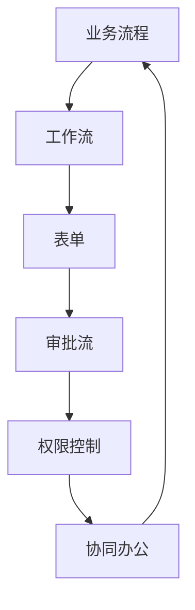
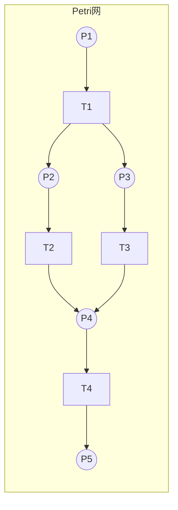

# 办公自动化系统详细设计与具体代码实现

## 1.背景介绍

### 1.1 办公自动化概述

在现代办公环境中,随着信息技术的不断发展和业务流程的日益复杂,传统的手工办公方式已经无法满足企业高效运营的需求。办公自动化系统(Office Automation System,OA)应运而生,旨在利用计算机及网络技术,实现办公流程的自动化管理,提高工作效率,降低人力成本。

OA系统通过集成多种办公功能模块,为企业提供无纸化办公、协同办公、移动办公等服务,有效整合了企业内部的信息资源,优化了业务流程,促进了跨部门、跨地域的高效协作。

### 1.2 办公自动化系统的发展历程

- **20世纪70年代**,办公自动化概念首次被提出,主要应用于文字处理、电子表格等基本办公软件。
- **20世纪80年代**,出现了基于局域网的分布式办公系统,实现了数据共享和协同办公的初步功能。
- **20世纪90年代**,随着互联网的兴起,基于Web的办公自动化系统开始流行,办公活动不再受时间和地点的限制。
- **21世纪初**,移动办公、云办公等新兴技术的融入,使得办公自动化系统更加智能化、移动化和协作化。
- **近年来**,人工智能、大数据、物联网等新技术与办公自动化系统深度融合,推动了智能化办公的发展。

### 1.3 办公自动化系统的重要性

办公自动化系统在企业管理中扮演着越来越重要的角色,主要体现在以下几个方面:

1. **提高工作效率**:自动化流程减少了重复性劳动,加快了办公速度,提高了生产效率。
2. **降低运营成本**:减少了大量纸质文件的使用,节省了办公耗材,降低了人力成本。
3. **优化协同办公**:打破了信息孤岛,促进了跨部门、跨地域的高效协作。
4. **提升决策能力**:通过数据集成和分析,为决策者提供了有价值的信息支持。
5. **加强风险控制**:规范化的审批流程,有助于防止人为操作失误,降低运营风险。

## 2.核心概念与联系

### 2.1 办公自动化系统的核心概念

为了更好地理解办公自动化系统,我们需要掌握以下几个核心概念:

1. **业务流程(Business Process)**:指企业为完成特定业务目标而定义的一系列有序活动。
2. **工作流(Workflow)**:业务流程在计算机系统中的体现,描述了工作的传递路线和规则。
3. **表单(Form)**:用于收集和展示与业务相关的数据,是工作流的载体。
4. **审批流(Approval Flow)**:工作流中涉及的审批环节,按照预定义的规则进行审批。
5. **权限控制(Access Control)**:对系统资源和操作的访问权限进行管理和控制。
6. **协同办公(Collaborative Office)**:多人参与的办公活动,需要信息共享和协作。

### 2.2 核心概念之间的关系

上述核心概念之间存在着紧密的联系,它们共同构建了办公自动化系统的基础框架。



1. 业务流程是办公自动化系统的出发点,需要根据企业的实际需求进行定义和优化。
2. 业务流程在系统中通过工作流的形式体现,工作流描述了工作的传递路线和规则。
3. 工作流中的每个环节都需要通过表单来收集和展示相关数据,表单是工作流的载体。
4. 审批流是工作流中的关键环节,需要按照预定义的规则进行审批,审批结果将影响工作流的后续流转。
5. 权限控制确保只有授权的人员才能访问相应的系统资源和操作,保证了系统的安全性和可靠性。
6. 协同办公贯穿整个办公过程,需要多人参与、信息共享和协作,以实现高效的团队协作。

通过这些核心概念及其关系,我们可以更好地理解和设计办公自动化系统。

## 3.核心算法原理具体操作步骤

### 3.1 工作流引擎

工作流引擎是办公自动化系统的核心部分,负责驱动和控制整个工作流的执行。它的主要功能包括:

1. **流程定义**:根据业务需求,通过图形化建模工具或XML等方式定义工作流程。
2. **流程部署**:将定义好的流程部署到运行时环境中,供执行引擎调用。
3. **任务分派**:根据流程定义,将当前待处理的任务分派给相应的参与者。
4. **任务监控**:跟踪和监控任务的执行状态,记录操作日志,提供审计功能。
5. **流程控制**:根据预定义的规则和条件,控制流程的转移和分支。

工作流引擎的核心算法通常采用**有限状态机**和**Petri网**等模型,用于描述和执行工作流程。

#### 3.1.1 有限状态机模型

有限状态机是一种数学模型,它可以描述有限个状态以及在这些状态之间的转移规则。在工作流引擎中,每个任务都可以看作是一个状态,任务之间的转移则对应着状态的转移。


上图展示了一个简单的工作流程,包含四个任务状态。工作流引擎根据当前状态和转移条件,决定下一个要执行的任务。

#### 3.1.2 Petri网模型

Petri网是一种更加形式化和通用的模型,常用于描述并发系统。在工作流引擎中,Petri网可以很好地表示流程中的并行分支、汇合、循环等复杂结构。



上图展示了一个包含并行分支的Petri网模型。圆圈表示库所(Place),代表工作流中的条件或事件;矩形表示变迁(Transition),代表工作流中的任务或活动。工作流引擎根据当前的标记分布(Token)和变迁规则,执行相应的任务。

通过有限状态机和Petri网等模型,工作流引擎可以精确地控制和管理复杂的工作流程。

### 3.2 表单设计与渲染

表单是办公自动化系统中非常重要的组成部分,它是工作流的载体,用于收集和展示与业务相关的数据。表单设计和渲染是实现表单功能的关键步骤。

#### 3.2.1 表单设计

表单设计阶段需要根据业务需求,定义表单的结构、字段类型、校验规则等。常见的表单设计方式包括:

1. **可视化拖拽式设计**:通过图形化界面,拖拽各种控件到表单区域,设置控件属性。
2. **XML描述文件**:使用XML等标记语言,描述表单的结构和属性。
3. **代码式设计**:使用编程语言(如Java、C#等)编写表单定义代码。

无论采用何种设计方式,最终都需要将表单定义转换为统一的内部数据结构,供后续的渲染和处理使用。

#### 3.2.2 表单渲染

表单渲染是将设计好的表单定义,转换为可视化的HTML页面,以供用户填写和查看。渲染过程一般包括以下几个步骤:

1. **解析表单定义**:读取表单定义数据,构建内部数据结构。
2. **生成HTML代码**:根据表单定义,生成对应的HTML代码。
3. **绑定数据**:将业务数据绑定到表单控件上,实现数据的填充和回显。
4. **注册事件**:注册表单控件的各种事件,如数据验证、值改变等。
5. **渲染到页面**:将生成的HTML代码渲染到浏览器页面中。

在渲染过程中,需要根据不同的控件类型和属性,生成相应的HTML元素和JavaScript代码。例如,下面是一个文本框控件的渲染示例:

```html
<input type="text" id="txtName" value="${name}" onchange="validateName(this.value)">
<script>
function validateName(value) {
    // 验证逻辑...
}
</script>
```

通过高效的表单设计和渲染机制,办公自动化系统可以灵活地适应不同业务场景的需求,为用户提供友好的数据交互界面。

## 4.数学模型和公式详细讲解举例说明

在办公自动化系统中,数学模型和公式广泛应用于各个环节,如工作流模型、数据分析、优化算法等。下面将详细介绍几个常见的数学模型和公式。

### 4.1 马尔可夫模型

马尔可夫模型是一种描述随机过程的数学模型,它假设未来状态只依赖于当前状态,与过去状态无关。在工作流领域,马尔可夫模型可用于分析和优化工作流程。

假设一个工作流程有$n$个状态,令$P$表示状态转移概率矩阵:

$$
P = \begin{pmatrix}
p_{11} & p_{12} & \cdots & p_{1n} \\
p_{21} & p_{22} & \cdots & p_{2n} \\
\vdots & \vdots & \ddots & \vdots \\
p_{n1} & p_{n2} & \cdots & p_{nn}
\end{pmatrix}
$$

其中,$p_{ij}$表示从状态$i$转移到状态$j$的概率,且满足$\sum_{j=1}^{n}p_{ij}=1$。

通过计算$P$的$n$次方,我们可以得到$n$步后各状态的稳态概率分布:

$$
\pi = \begin{pmatrix}
\pi_1 & \pi_2 & \cdots & \pi_n
\end{pmatrix} = \lim_{n\rightarrow\infty}P^n
$$

基于稳态概率分布,我们可以分析工作流中各个环节的瓶颈,优化资源分配,提高整体效率。

### 4.2 队列模型

在办公自动化系统中,任务的到达和处理过程可以看作是一个队列系统。通过建立合适的队列模型,我们可以分析和优化系统的响应时间、等待时间等性能指标。

假设任务到达服从参数为$\lambda$的泊松分布,服务时间服从参数为$\mu$的负指数分布,那么在$M/M/1$队列模型中,系统的平均等待时间$W_q$可以计算为:

$$
W_q = \frac{\lambda}{\mu(\mu-\lambda)}
$$

如果服务台数量为$c$,那么在$M/M/c$队列模型中,系统的平均等待时间$W_q$为:

$$
W_q = \frac{P_0\rho^c\mu}{c!(1-\rho)^2}\cdot\frac{1}{\mu}
$$

其中,$\rho=\lambda/c\mu$为系统的利用率,$P_0$为所有服务台空闲的稳态概率。

通过分析队列模型,我们可以评估当前系统的性能瓶颈,并采取相应的优化措施,如增加服务台数量、调整任务分配策略等,从而提高系统的响应能力。

### 4.3 线性规划

线性规划是一种重要的运筹学模型,在办公自动化系统中可用于资源优化分配、成本最小