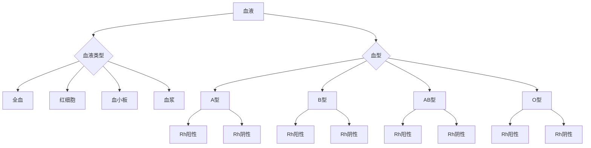
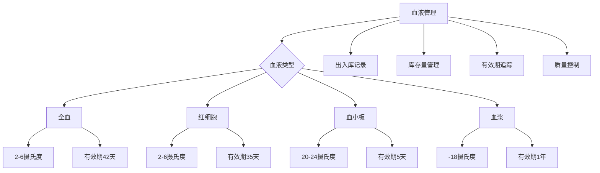
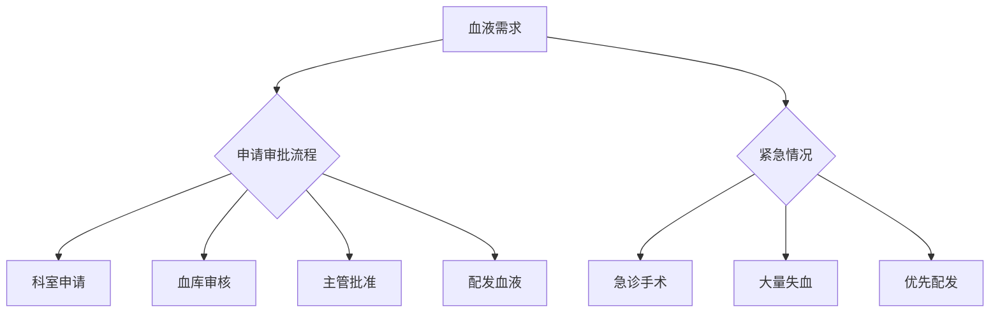
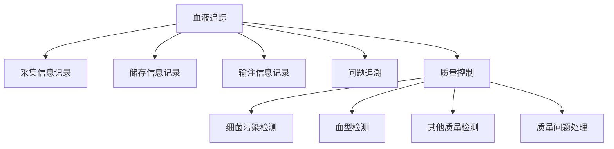
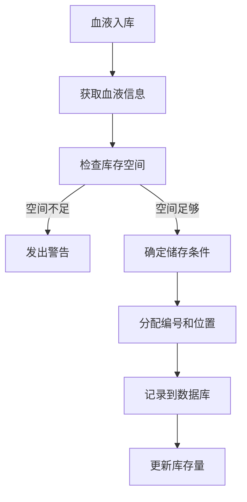
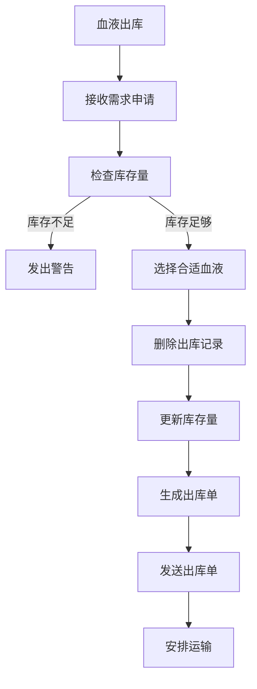
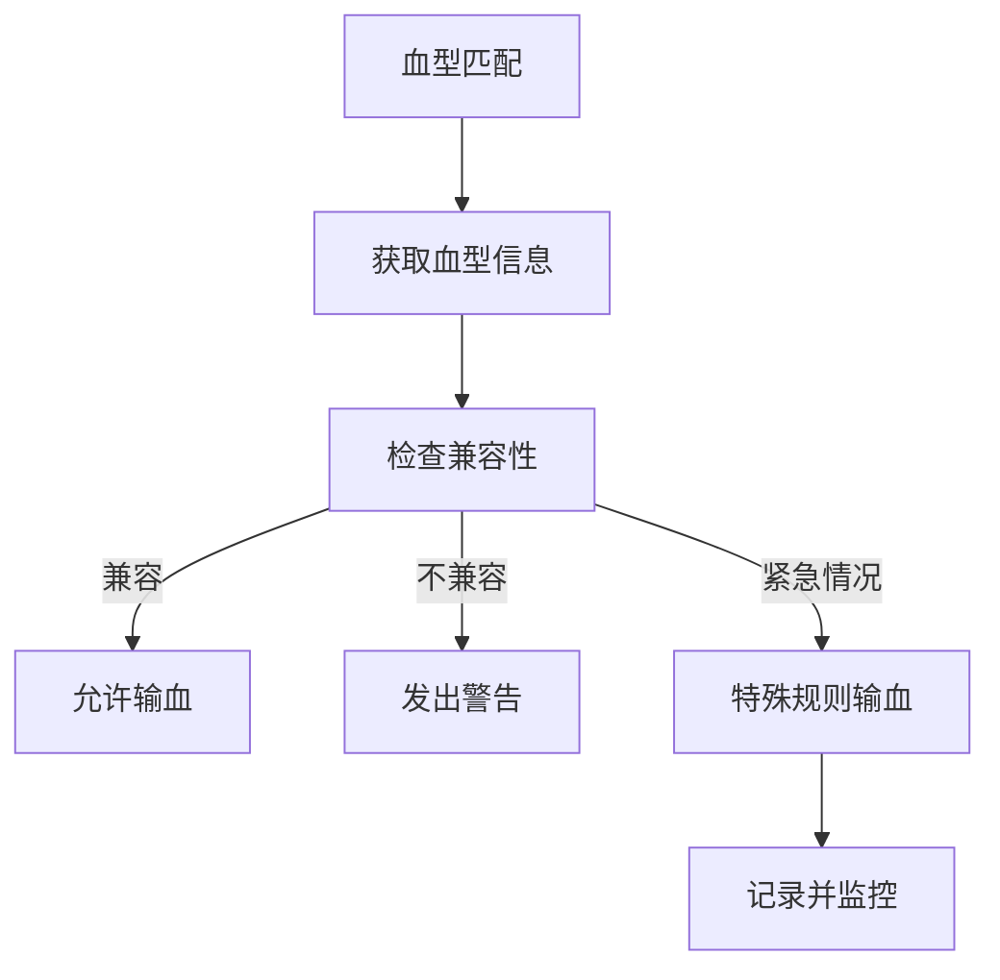
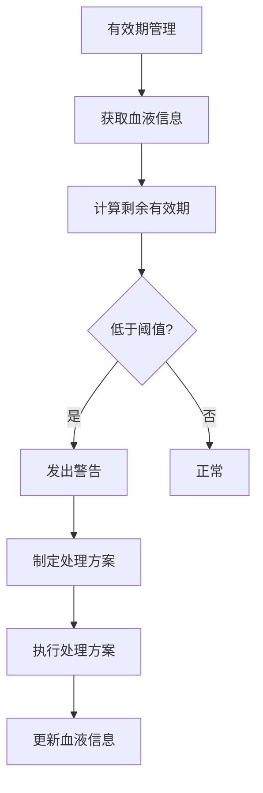

# 医院血库管理系统详细设计与具体代码实现

## 1.背景介绍

### 1.1 血液在医疗中的重要性

血液是人体生命维持的基础,在医疗领域扮演着至关重要的角色。无论是进行手术、急救还是治疗疾病,血液的供应都是必不可少的。因此,确保血液的安全储存和高效管理对于医院的正常运转至关重要。

### 1.2 血库管理系统的需求

为了满足医院对血液的需求,确保血液供应的安全性和可追溯性,需要建立一个高效的血库管理系统。该系统需要具备以下功能:

- 血液存储和库存管理
- 血液入库和出库记录
- 血液信息查询和统计
- 血液配型和交叉配合检测
- 血液过期提醒和处理
- 用血申请和审批流程
- 血液追溯和质量控制

### 1.3 系统设计的重要性

一个高质量的血库管理系统设计对于系统的可靠性、可维护性和可扩展性至关重要。良好的设计不仅可以满足当前的需求,还能适应未来的变化和发展。因此,在系统开发过程中,需要采用合理的架构、数据模型和算法,以确保系统的高效运行和长期稳定性。

## 2.核心概念与联系

### 2.1 血液类型和血型

在人体内,血液可以分为四种主要类型:全血、红细胞、血小板和血浆。每种血液类型在医疗中都有特定的用途和管理要求。

除了血液类型外,还需要考虑血型的因素。人类血型主要分为A型、B型、AB型和O型,并且每种血型又可以进一步分为Rh阳性和Rh阴性。不同血型之间的输血兼容性不同,因此在输血时必须进行严格的血型匹配和交叉配合检测。

### 2.2 血液储存和管理

为了确保血液的安全性和有效期,需要对血液进行专门的储存和管理。不同类型的血液有不同的储存温度和有效期要求。例如,全血和红细胞需要储存在2-6摄氏度的环境中,而血小板则需要储存在20-24摄氏度的条件下。

除了温度控制外,还需要对血液的出入库、库存量、有效期等信息进行严格的记录和追踪,以确保血液的可追溯性和质量控制。

### 2.3 血液需求和配发

在医院的日常运营中,各个科室和病房都会有不同的血液需求。因此,需要建立一个高效的血液需求申请和审批流程,以确保血液的合理分配和使用。

同时,还需要考虑紧急情况下的血液配发,例如急诊手术或大量失血的救治。在这种情况下,系统需要能够快速响应并优先配发血液,以挽救患者的生命。

### 2.4 血液追踪和质量控制

为了确保血液的安全性和质量,需要建立一个严格的追踪和质量控制机制。每一单位血液从采集、储存到输注的整个过程都需要详细记录,以便在发生任何问题时能够快速追溯和处理。

同时,还需要定期对血液进行质量检测,包括细菌污染、血型检测等,以确保血液的安全性和有效性。一旦发现任何质量问题,都需要立即采取相应的措施,如召回、销毁或进一步处理。

通过上述核心概念和它们之间的联系,我们可以了解血库管理系统的整体框架和关键要素。在后续的设计和实现过程中,这些概念将会被进一步细化和落实。

## 3.核心算法原理具体操作步骤

### 3.1 血液入库算法

当新鲜血液从采血中心或捐血者处收集后,需要将其存入血库。血液入库算法负责处理这一过程,确保血液信息的准确记录和存储条件的合理性。算法的具体步骤如下:

1. 获取血液基本信息,包括血液类型、血型、采集日期、有效期等。
2. 检查血库中是否有足够的存储空间,如果没有,则发出库存不足警告。
3. 根据血液类型确定合适的储存温度和环境条件。
4. 为血液分配唯一的编号和存储位置。
5. 将血液信息和存储位置记录到数据库中。
6. 更新血库的总库存量。

### 3.2 血液出库算法

当医院的各个科室或病房需要使用血液时,就需要从血库中取出相应的血液。血液出库算法负责处理这一过程,确保血液的正确分配和出库记录的准确性。算法的具体步骤如下:

1. 接收血液需求申请,包括血液类型、数量和用途。
2. 检查血库中是否有足够的库存量,如果没有,则发出库存不足警告。
3. 根据血型匹配原则,从库存中选择合适的血液。
4. 从数据库中删除出库血液的记录,并更新库存量。
5. 生成出库单,记录出库血液的详细信息。
6. 将出库单发送给申请方,并安排血液运输。

### 3.3 血型匹配算法

在输血过程中,确保血型的匹配是非常关键的一步。不正确的血型匹配可能会导致严重的并发症,甚至危及生命。因此,血型匹配算法需要严格遵循血型规则,以确保输血的安全性。算法的具体步骤如下:

1. 获取患者和拟输血液的血型信息。
2. 根据血型规则,检查患者和血液之间是否存在兼容性。
3. 如果存在兼容性,则允许输血;否则,发出血型不匹配警告。
4. 如果存在紧急情况,可以根据特殊规则进行输血,但需要记录并密切监控。

### 3.4 血液有效期管理算法

由于血液的有限保质期,因此需要对血库中的血液进行有效期管理,以确保血液的安全性和有效性。有效期管理算法负责跟踪每一单位血液的有效期,并在接近过期时发出警告,以便采取相应的处理措施。算法的具体步骤如下:

1. 从数据库中获取所有血液的信息,包括采集日期和有效期。
2. 计算每一单位血液的剩余有效期。
3. 对于剩余有效期低于预设阈值的血液,发出过期警告。
4. 根据血液类型和剩余有效期,制定处理方案,如延长有效期、销毁或其他处理措施。
5. 执行相应的处理方案,并更新血液信息。

通过上述核心算法,我们可以实现血库管理系统的关键功能,包括血液的入库、出库、血型匹配和有效期管理。这些算法确保了血液管理过程的安全性、准确性和高效性,为医院的正常运营提供了重要保障。

## 4.数学模型和公式详细讲解举例说明

在血库管理系统中,一些关键过程需要使用数学模型和公式来进行计算和优化。下面将详细介绍其中几个重要的数学模型和公式。

### 4.1 血液需求预测模型

为了确保血库中始终有足够的血液储备,需要对未来的血液需求进行准确预测。我们可以使用时间序列分析和回归模型来预测未来一段时间内的血液需求量。

假设我们有过去 $n$ 个时间段的血液需求数据 $y_1, y_2, \dots, y_n$,我们可以使用线性回归模型来拟合这些数据,并预测未来的需求量。线性回归模型的公式如下:

$$y = \beta_0 + \beta_1 x + \epsilon$$

其中 $y$ 表示血液需求量, $x$ 表示时间, $\beta_0$ 和 $\beta_1$ 是需要估计的参数, $\epsilon$ 是随机误差项。

我们可以使用最小二乘法来估计参数 $\beta_0$ 和 $\beta_1$,具体公式如下:

$$\beta_1 = \frac{\sum_{i=1}^n (x_i - \bar{x})(y_i - \bar{y})}{\sum_{i=1}^n (x_i - \bar{x})^2}$$

$$\beta_0 = \bar{y} - \beta_1 \bar{x}$$

其中 $\bar{x}$ 和 $\bar{y}$ 分别表示 $x$ 和 $y$ 的均值。

通过估计出 $\beta_0$ 和 $\beta_1$ 的值,我们就可以使用线性回归模型来预测未来任意时间点的血液需求量。

### 4.2 血液库存优化模型

为了确保血液的供应充足,同时又不会导致过多的