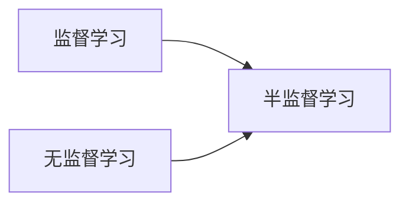

## 1.背景介绍

在机器学习领域，我们经常会遇到一个常见的问题，那就是标注数据的缺乏。这是因为获取大量的标注数据通常需要大量的人力物力，而这在许多情况下是不现实的。这就是半监督学习（Semi-Supervised Learning, SSL）的价值所在，它试图通过利用大量未标注的数据和少量标注的数据，来构建有效的机器学习模型。

## 2.核心概念与联系

半监督学习位于监督学习和无监督学习之间。在监督学习中，我们使用标签数据训练模型；在无监督学习中，我们试图从未标注的数据中发现隐藏的模式。而半监督学习则试图通过结合这两种方法，从未标注的数据中提取有用的信息，以改进在标注数据上的学习。



## 3.核心算法原理具体操作步骤

半监督学习的一种常见方法是自训练（Self-Training）。自训练的步骤如下：

1. 使用标注数据训练一个初始模型。
2. 使用这个模型预测未标注的数据，得到预测标签。
3. 选择预测置信度高的预测标签，将对应的未标注数据作为新的标注数据。
4. 使用新的标注数据更新模型。
5. 重复步骤2-4，直到模型收敛。

## 4.数学模型和公式详细讲解举例说明

假设我们有一个分类问题，标注数据集为 $L = \{(x_i, y_i)\}_{i=1}^l$，未标注数据集为 $U = \{x_j\}_{j=1}^u$。我们的目标是找到一个函数 $f: X \rightarrow Y$，使得在标注数据上的经验损失最小：

$$L(f) = \frac{1}{l}\sum_{i=1}^l \mathcal{L}(f(x_i), y_i)$$

其中，$\mathcal{L}$ 是损失函数，例如对于分类问题，我们可以使用交叉熵损失。

在自训练中，我们使用一个基础模型 $f_0$，例如神经网络，首先在标注数据上进行训练，然后用 $f_0$ 对未标注数据进行预测，得到预测标签 $\hat{y}_j = f_0(x_j)$。然后，我们选择预测置信度高的预测标签，例如对于分类问题，我们可以选择预测概率大于某个阈值的预测标签，将对应的未标注数据和预测标签加入标注数据集，然后重新训练模型。

## 5.项目实践：代码实例和详细解释说明

下面是一个使用Python和scikit-learn库实现自训练的简单示例：

```python
from sklearn.semi_supervised import SelfTrainingClassifier
from sklearn.svm import SVC

# 创建一个基础模型
base_model = SVC(probability=True, gamma="scale")

# 创建一个自训练分类器
self_training_model = SelfTrainingClassifier(base_model)

# 训练模型
self_training_model.fit(X, y)

# 预测新的数据
y_pred = self_training_model.predict(X_new)
```

在这个示例中，我们首先创建了一个基础模型，这里我们使用了支持向量机。然后，我们使用这个基础模型创建了一个自训练分类器。我们使用标注数据训练这个自训练分类器，然后用它来预测新的数据。

## 6.实际应用场景

半监督学习在许多实际应用中都有广泛的应用，例如：

- 文本分类：在许多情况下，我们有大量的未标注文本和少量的标注文本，我们可以使用半监督学习来提高文本分类的性能。
- 图像识别：在图像识别中，标注大量的图像需要大量的人力物力，我们可以使用半监督学习来利用未标注的图像。

## 7.工具和资源推荐

- scikit-learn: 一个强大的Python机器学习库，提供了许多半监督学习的算法实现。
- Semi-Supervised Learning Literature: 一个半监督学习的文献列表，包含了许多关于半监督学习的研究论文。

## 8.总结：未来发展趋势与挑战

随着大数据时代的到来，我们有越来越多的数据可以用来训练机器学习模型。然而，标注数据的获取仍然是一个挑战。半监督学习提供了一种有效的解决方案，它通过利用未标注的数据来提高模型的性能。然而，半监督学习也面临着许多挑战，例如如何有效地利用未标注的数据，如何选择预测置信度高的预测标签，如何防止过拟合等。这些都是半监督学习未来发展的重要方向。

## 9.附录：常见问题与解答

Q: 自训练有什么缺点？

A: 自训练的一个主要缺点是，如果初始模型的预测错误，那么这些错误可能会被放大，因为预测错误的标签可能会被加入到标注数据中，影响后续的模型训练。

Q: 半监督学习和弱监督学习有什么区别？

A: 弱监督学习是指我们只有不完全、不准确或不一致的标签，而半监督学习是指我们同时有标注数据和未标注数据。

作者：禅与计算机程序设计艺术 / Zen and the Art of Computer Programming