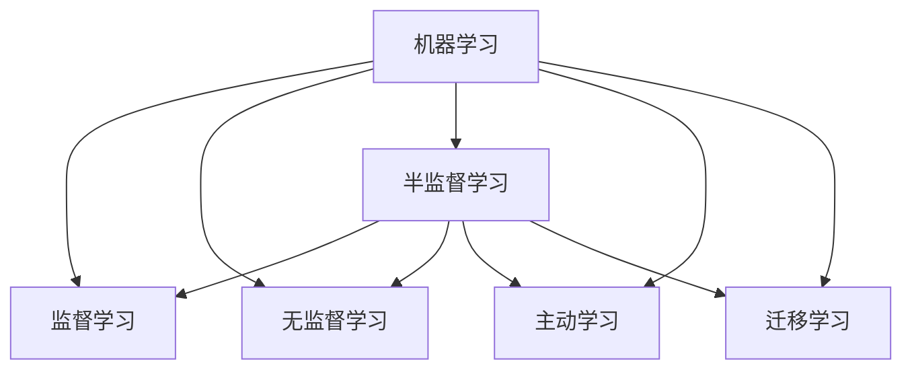

# 半监督超大规模学习：大数据时代的智能挖掘

## 1.背景介绍
### 1.1 大数据时代的机遇与挑战
随着互联网、物联网、移动互联网的飞速发展，数据正在以前所未有的速度呈爆炸式增长。据统计，全球数据量每两年就会增长一倍，预计到2025年将达到163ZB。面对如此海量的数据，传统的数据处理和分析方法已经力不从心。如何从海量数据中快速获取有价值的信息，已成为大数据时代亟待解决的难题。

### 1.2 机器学习的局限性
机器学习是人工智能的核心，其目标是通过数据驱动的方式，让机器具备自主学习的能力。传统的机器学习方法主要包括监督学习和非监督学习两大类。监督学习需要大量的标注数据作为训练集，但人工标注成本高昂，且容易引入误差和偏差。非监督学习虽然不需要标注数据，但学习效果有限，难以应对复杂场景。因此，如何利用少量标注数据和大量无标注数据，实现高效、准确、可扩展的机器学习，是一个亟待解决的难题。

### 1.3 半监督学习的兴起
半监督学习（Semi-Supervised Learning）是近年来兴起的一种新型机器学习范式，它综合利用少量的标注数据和大量的无标注数据，通过引入一些先验假设，如平滑性假设、聚类假设、流形假设等，从数据的内在结构和分布中学习数据的潜在规律，从而大幅降低标注成本，提高学习性能。半监督学习为解决大数据智能挖掘提供了新的思路和方法。

## 2.核心概念与联系
### 2.1 半监督学习的定义与分类
半监督学习是指利用少量的标注数据（Labeled Data）和大量的无标注数据（Unlabeled Data）进行模型训练的机器学习方法。其核心思想是利用无标注数据揭示数据的内在结构，从而辅助有标注数据的学习。根据学习目标和方法的不同，半监督学习可分为以下几类：

- 半监督分类（Semi-Supervised Classification）：利用少量标注数据和大量无标注数据训练分类器，对新样本进行类别预测。
- 半监督回归（Semi-Supervised Regression）：利用少量标注数据和大量无标注数据训练回归模型，对新样本进行连续值预测。
- 半监督聚类（Semi-Supervised Clustering）：在无监督聚类的基础上，利用少量标注数据引导聚类过程，提高聚类性能。
- 半监督降维（Semi-Supervised Dimensionality Reduction）：利用少量标注数据指导降维过程，学习数据的低维表示，提高可视化和分类性能。

### 2.2 半监督学习的基本假设
半监督学习的有效性依赖于一些基本假设，这些假设揭示了标注数据和无标注数据之间的内在联系，是算法设计的理论基础。常见的假设包括：

- 平滑性假设（Smoothness Assumption）：相似的样本具有相似的输出。即在样本空间中，标注样本的标记信息可以沿着高密度区域"传播"到附近的无标注样本。
- 聚类假设（Cluster Assumption）：数据空间存在簇结构，同一簇的样本倾向于拥有相同的标记。簇结构可以为标记信息在无标注样本中的传播提供"通道"。
- 流形假设（Manifold Assumption）：高维数据存在一个低维流形结构，数据点在流形上的距离反映了它们的相似程度。通过学习这个低维流形，可以更好地刻画数据的内在结构。

### 2.3 半监督学习与其他学习范式的关系
半监督学习与其他几种常见的机器学习范式密切相关，可以看作是它们的桥梁和补充：

- 监督学习（Supervised Learning）：半监督学习可看作监督学习的延伸，旨在利用无标注数据扩大训练集，提高模型的泛化性能。
- 无监督学习（Unsupervised Learning）：半监督学习借鉴了无监督学习揭示数据内在结构的思想，用于指导标记信息在数据空间的传播。
- 主动学习（Active Learning）：主动学习旨在以最小的标注代价获得最大的学习性能，而半监督学习则着眼于充分利用已有的标注和无标注数据，两者可以互补。
- 迁移学习（Transfer Learning）：半监督学习的一些思想，如流形正则化，可用于不同领域之间的知识迁移，实现跨领域学习。

下图展示了半监督学习在机器学习领域的核心地位：

## 3.核心算法原理与操作步骤
半监督学习的核心是利用无标注数据揭示数据的内在结构，用于指导有标注数据的学习。根据无标注数据的利用方式，半监督学习算法可分为以下几类：

### 3.1 生成式方法
生成式方法（Generative Methods）假设数据服从某一概率分布，通过估计这个分布的参数来建立生成模型，再用贝叶斯公式对新样本进行分类。常见的生成式方法包括：

- 高斯混合模型（Gaussian Mixture Model）
- 朴素贝叶斯（Naive Bayes）
- 隐马尔可夫模型（Hidden Markov Model）

以高斯混合模型为例，其基本步骤如下：
1. 初始化模型参数，包括各高斯成分的均值、协方差和混合系数。
2. E步：根据当前参数计算每个样本属于各高斯成分的后验概率（即响应度）。
3. M步：根据响应度更新模型参数，使似然函数最大化。
4. 重复步骤2和3，直到收敛。
5. 对新样本，计算其属于各类别的后验概率，取最大者作为预测标记。

### 3.2 半监督SVM
支持向量机（Support Vector Machine）是一种经典的判别式分类器，其目标是在特征空间中找到一个最大间隔超平面，将不同类别的样本分开。半监督SVM（S3VM）在此基础上引入无标注数据，通过最大化超平面边缘和无标注数据的置信度来优化模型。

以Transductive SVM为例，其优化目标可表示为：

$$
\begin{aligned}
\min_{w,b,\hat{y}} \quad & \frac{1}{2}||w||^2 + C_1 \sum_{i=1}^l \xi_i + C_2 \sum_{j=l+1}^{l+u} \xi_j^* \\
s.t. \quad & y_i(w^Tx_i+b) \geq 1-\xi_i, \quad i=1,\ldots,l \\
      & \hat{y}_j(w^Tx_j+b) \geq 1-\xi_j^*, \quad j=l+1,\ldots,l+u \\
      & \xi_i \geq 0, \quad i=1,\ldots,l \\
      & \xi_j^* \geq 0, \quad j=l+1,\ldots,l+u
\end{aligned}
$$

其中，$\hat{y}_j$是无标注样本的伪标记，通过迭代优化求解。算法的基本步骤如下：
1. 用有标注数据训练初始SVM。
2. 用当前SVM对无标注数据预测，得到伪标记。
3. 用所有数据优化半监督SVM目标，更新模型。
4. 重复步骤2和3，直到收敛。

### 3.3 图半监督学习
图半监督学习（Graph-based SSL）基于图论构建数据之间的相似性关系，通过标记信息在图上的传播来预测无标注样本的标记。其核心是构建一个数据相似性图，节点代表样本，边代表样本之间的相似程度。

以标签传播算法（Label Propagation）为例，其基本步骤如下：
1. 构建数据相似性图，常用k近邻或$\epsilon$-邻域方法。
2. 初始化节点的标记概率矩阵，有标记样本的相应类别概率为1，其余为0。
3. 迭代更新节点的标记概率，直到收敛。更新公式为：

$$
P(t+1) = \alpha SP(t) + (1-\alpha)Y
$$

其中，$P$是标记概率矩阵，$S$是归一化的相似性矩阵，$Y$是初始标记矩阵，$\alpha$是平滑系数。

4. 对新样本，根据其在图中的位置计算标记概率，取最大者作为预测标记。

### 3.4 协同训练
协同训练（Co-Training）利用数据的多视图特性，通过不同视图的分类器之间的相互教学，提高半监督学习的性能。其基本假设是不同视图具有相容性和条件独立性。

以两个视图为例，其基本步骤如下：
1. 在每个视图上用有标注数据训练初始分类器。
2. 每个分类器用自身视图的特征对无标注数据进行预测，挑选置信度最高的样本及其伪标记加入训练集。
3. 更新每个视图上的分类器。
4. 重复步骤2和3，直到收敛或达到预设的迭代次数。
5. 对新样本，将两个视图的预测结果进行组合，如投票或平均。

## 4.数学模型与公式详解
半监督学习涉及多种数学模型和优化方法，以下选取几个代表性的加以说明。

### 4.1 高斯混合模型
高斯混合模型（GMM）假设数据由多个高斯分布混合而成，其概率密度函数为：

$$
p(x) = \sum_{k=1}^K \pi_k \mathcal{N}(x|\mu_k,\Sigma_k)
$$

其中，$\pi_k$是第$k$个高斯成分的混合系数，$\mu_k$和$\Sigma_k$分别是其均值和协方差矩阵。GMM的参数估计通常使用EM算法，E步计算样本的响应度：

$$
\gamma(z_{ik}) = \frac{\pi_k \mathcal{N}(x_i|\mu_k,\Sigma_k)}{\sum_{j=1}^K \pi_j \mathcal{N}(x_i|\mu_j,\Sigma_j)}
$$

M步根据响应度更新参数：

$$
\begin{aligned}
\mu_k^{new} &= \frac{1}{N_k} \sum_{i=1}^N \gamma(z_{ik}) x_i \\
\Sigma_k^{new} &= \frac{1}{N_k} \sum_{i=1}^N \gamma(z_{ik}) (x_i-\mu_k^{new})(x_i-\mu_k^{new})^T \\
\pi_k^{new} &= \frac{N_k}{N}
\end{aligned}
$$

其中，$N_k=\sum_{i=1}^N \gamma(z_{ik})$是第$k$个成分的有效样本数。

### 4.2 Laplacian SVM
Laplacian SVM（LapSVM）是一种基于流形正则化的半监督SVM，其目标函数为：

$$
\min_{f} \frac{1}{l} \sum_{i=1}^l V(y_i,f(x_i)) + \gamma_A ||f||_K^2 + \gamma_I ||f||_I^2
$$

其中，$V$是损失函数，$||f||_K^2$是RKHS范数，用于控制函数的平滑性，$||f||_I^2$是流形正则化项，用于控制函数在数据流形上的平滑性：

$$
||f||_I^2 = \frac{1}{(u+l)^2} \sum_{i,j=1}^{u+l} W_{ij} (f(x_i)-f(x_j))^2
$$

其中，$W$是数据相似性矩阵。LapSVM的求解可转化为二次规划问题：

$$
\begin{aligned}
\min_{\alpha} \quad & \frac{1}{2} \alpha^T \hat{Q} \alpha - e^T \alpha \\
s.t. \quad & y^T \alpha = 0 \\
      & 0 \leq \alpha_i \leq \frac{1}{l}, \quad i=1,\ldots,l
\end{aligned}
$$

其中，$