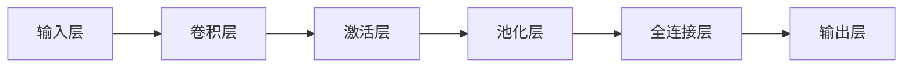

## 1.背景介绍

卷积神经网络（Convolutional Neural Networks，CNN）是一种前馈神经网络，它的人工神经元可以响应周围单元覆盖的范围内的周围单元，对于大型图像处理有出色表现。CNN 是一种深度学习的算法，已在图像识别和分类中取得了显著的成就。本文将详细介绍 CNN 的原理，并通过代码示例进行讲解。

## 2.核心概念与联系

卷积神经网络由一个或多个卷积层和顶端的全连通层（对应经典的神经网络）组成，同时也包括关联权重和池化层。这一结构使得卷积神经网络能够利用输入数据的二维结构。与其他深度学习结构相比，卷积神经网络在图像和语音识别方面能够给出更好的结果。这一模型也可以使用反向传播算法进行训练。相比较其他深度、前馈神经网络，卷积神经网络需要考虑的参数更少，使之成为一种颇具吸引力的深度学习结构。



## 3.核心算法原理具体操作步骤

### 3.1 卷积操作

卷积操作是卷积神经网络的核心。它在输入数据上滑动卷积核，通过对应元素相乘然后求和，得到卷积结果。

### 3.2 激活函数

卷积操作的结果通过激活函数，一般使用ReLU函数，将线性函数转化为非线性函数，增加模型的复杂性。

### 3.3 池化操作

池化操作是另一种形式的降采样。常见的池化操作有最大值池化、平均值池化等。

### 3.4 全连接层

全连接层的作用是将学习到的“分布式特征表示”映射到样本标记空间。

## 4.数学模型和公式详细讲解举例说明

卷积操作可以表示为：

$$
f(i, j) = \sum_m \sum_n I(i-m, j-n)K(m, n)
$$

其中，$I$ 是输入数据，$K$ 是卷积核。

ReLU激活函数可以表示为：

$$
f(x) = max(0, x)
$$

最大值池化操作可以表示为：

$$
f(i, j) = max_{m, n}I(i+m, j+n)
$$

## 5.项目实践：代码实例和详细解释说明

以Python和Tensorflow为例，以下是一个简单的CNN模型：

```python
import tensorflow as tf

model = tf.keras.models.Sequential([
  tf.keras.layers.Conv2D(32, (3, 3), activation='relu', input_shape=(64, 64, 3)),
  tf.keras.layers.MaxPooling2D(2, 2),
  tf.keras.layers.Conv2D(64, (3, 3), activation='relu'),
  tf.keras.layers.MaxPooling2D(2, 2),
  tf.keras.layers.Conv2D(64, (3, 3), activation='relu'),
  tf.keras.layers.MaxPooling2D(2, 2),
  tf.keras.layers.Flatten(),
  tf.keras.layers.Dense(128, activation='relu'),
  tf.keras.layers.Dense(10, activation='softmax')
])
```

## 6.实际应用场景

CNN被广泛应用于图像和视频处理、语音识别等领域，如：自动驾驶、医疗图像诊断、视频监控等。

## 7.工具和资源推荐

- Python：一种广泛使用的高级编程语言，适用于开发各种应用，特别是数据分析和科学计算。
- Tensorflow：一个开源深度学习框架，由Google Brain团队开发。
- Keras：基于Python的开源人工神经网络库，能够在TensorFlow、Microsoft-CNTK和Theano等多个深度学习框架上运行。

## 8.总结：未来发展趋势与挑战

随着计算能力的提升和大量数据的可用性，卷积神经网络的应用将更加广泛。然而，如何设计更有效的卷积核，如何理解卷积神经网络的内部机制，以及如何提高模型的鲁棒性等，仍然是需要进一步研究的问题。

## 9.附录：常见问题与解答

1. 问：为什么使用卷积而不是全连接？
   答：卷积可以有效地处理图像等具有局部相关性的数据，而全连接则忽略了这种局部性。

2. 问：为什么需要池化操作？
   答：池化操作可以降低数据的维度，减少计算量，同时也能防止过拟合。

作者：禅与计算机程序设计艺术 / Zen and the Art of Computer Programming