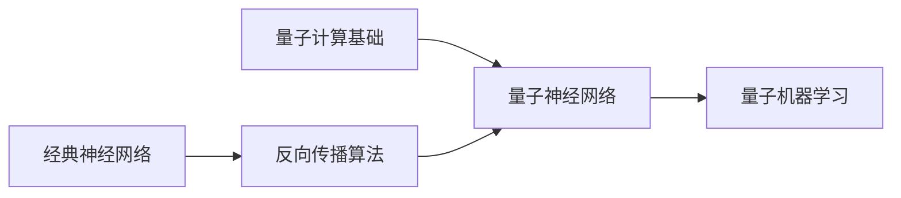

# 反向传播算法与量子计算：量子神经网络的探索

## 1. 背景介绍

### 1.1 人工神经网络与反向传播算法

人工神经网络(Artificial Neural Networks, ANNs)是一种模仿生物神经网络的计算模型,由大量的人工神经元相互连接构成。通过调整神经元之间的连接权重,神经网络可以学习复杂的非线性映射关系,在模式识别、机器学习等领域有广泛应用。

反向传播(Backpropagation, BP)算法是训练人工神经网络的核心算法。它通过计算损失函数对网络参数的梯度,并利用梯度下降法更新权重,使网络输出逼近期望输出。BP算法的提出极大地推动了神经网络的发展。

### 1.2 量子计算与量子神经网络

量子计算是利用量子力学原理进行信息处理和计算的新兴技术。与经典计算相比,量子计算在某些问题上展现出指数级的加速能力,如大数分解、量子模拟等。

量子神经网络(Quantum Neural Networks, QNNs)是将人工神经网络的思想与量子计算相结合的产物。通过引入量子比特(Qubit)、量子门(Quantum Gate)等量子计算元件,量子神经网络有望在学习效率、容量、鲁棒性等方面超越经典神经网络。

### 1.3 反向传播算法在量子神经网络中的应用

尽管量子神经网络有诸多优势,但其训练一直是一个挑战。经典的BP算法无法直接应用于量子电路,因为量子态的测量会导致波函数塌缩,破坏了梯度回传。

近年来,研究者们提出了多种量子反向传播算法,试图克服这一困难。这些算法利用量子电路的可逆性、量子态叠加等特性,实现了类似经典BP的参数优化过程。量子反向传播的突破为量子神经网络的实用化铺平了道路。

## 2. 核心概念与联系

### 2.1 经典神经网络

- 人工神经元
  - 激活函数
  - 权重和偏置
- 网络结构
  - 前馈网络
  - 循环网络
- 损失函数
  - 均方误差
  - 交叉熵

### 2.2 反向传播算法

- 前向传播
  - 计算网络输出
- 反向传播
  - 计算损失函数梯度
  - 更新网络参数
- 优化方法
  - 梯度下降法
  - 动量法
  - Adam优化器

### 2.3 量子计算基础

- 量子比特
  - 布洛赫球表示
  - 量子态叠加
- 量子门
  - 单量子门
  - 多量子门
- 量子电路
  - 量子逻辑门组合
  - 量子测量
- 量子算法
  - Grover搜索
  - Shor分解

### 2.4 量子神经网络

- 量子感知机
  - 量子激活函数
  - 可变参数量子电路
- 量子卷积网络
  - 量子卷积层
  - 量子池化层
- 量子循环网络
  - 量子时间序列处理
  - 量子长短期记忆网络

### 2.5 量子机器学习

- 量子增强学习
  - 量子策略梯度
  - 量子Q学习
- 量子生成对抗网络
  - 量子生成器
  - 量子判别器
- 量子变分算法
  - 量子变分特征提取
  - 量子变分分类器



## 3. 核心算法原理具体操作步骤

### 3.1 经典反向传播算法

1. 初始化网络参数(权重和偏置)
2. 前向传播计算网络输出
   - 对每一层,计算加权输入和激活值
   - 将当前层输出传递给下一层,直到输出层
3. 计算损失函数值
4. 反向传播计算梯度
   - 计算输出层损失函数对神经元输入的梯度
   - 逐层向前传递梯度,计算每一层权重和偏置的梯度
5. 更新网络参数
   - 根据梯度和学习率,更新每一层的权重和偏置
6. 重复步骤2-5,直到达到停止条件(如最大迭代次数、验证集误差等)

### 3.2 参数化量子电路

1. 构建含可变参数的量子电路
   - 设计量子逻辑门序列(如旋转门、CNOT门等)
   - 在电路中插入可变参数(如旋转角度)
2. 初始化量子态(如$|0\rangle^{\otimes n}$)
3. 对输入数据进行编码
   - 将经典数据映射到量子态(如振幅编码、角度编码)
4. 对量子态应用参数化量子电路
   - 根据电路结构和参数,对量子态进行演化
5. 对量子态进行测量
   - 选择合适的测量基(如计算基、Bell基)
   - 获得测量结果(如0/1串、概率分布)
6. 将测量结果映射回经典数据
   - 根据测量结果,计算网络输出(如分类概率、预测值)

### 3.3 量子反向传播算法

1. 初始化量子电路参数
2. 前向传播计算网络输出
   - 对输入数据进行量子编码
   - 应用参数化量子电路,得到量子态
   - 对量子态进行测量,获得网络输出
3. 计算损失函数值
4. 反向传播计算梯度
   - 利用参数移动规则,计算每个参数的梯度
     - 对每个参数$\theta_i$,构建变化后的量子电路
     - 计算电路输出关于$\theta_i$的偏导数
   - 将梯度传递给经典优化器
5. 更新量子电路参数
   - 根据梯度和学习率,更新每个可变参数
6. 重复步骤2-5,直到达到停止条件

## 4. 数学模型和公式详细讲解举例说明

### 4.1 经典神经网络

- 神经元数学模型
  - 加权输入: $z = \sum_i w_i x_i + b$
  - 激活函数: $a = \sigma(z)$
    - Sigmoid: $\sigma(z) = \frac{1}{1+e^{-z}}$
    - ReLU: $\sigma(z) = \max(0, z)$
- 损失函数
  - 均方误差: $L = \frac{1}{2} \sum_i (y_i - \hat{y}_i)^2$
  - 交叉熵: $L = -\sum_i y_i \log \hat{y}_i$

### 4.2 反向传播算法

- 梯度计算
  - 输出层: $\frac{\partial L}{\partial z_i^{(L)}} = \frac{\partial L}{\partial a_i^{(L)}} \cdot \sigma'(z_i^{(L)})$
  - 隐藏层: $\frac{\partial L}{\partial z_i^{(l)}} = \sum_j \frac{\partial L}{\partial z_j^{(l+1)}} \cdot w_{ji}^{(l+1)} \cdot \sigma'(z_i^{(l)})$
- 参数更新
  - 权重: $w_{ij}^{(l)} \leftarrow w_{ij}^{(l)} - \alpha \frac{\partial L}{\partial w_{ij}^{(l)}}$
  - 偏置: $b_i^{(l)} \leftarrow b_i^{(l)} - \alpha \frac{\partial L}{\partial b_i^{(l)}}$

### 4.3 量子计算

- 量子态
  - 单量子比特态: $|\psi\rangle = \alpha|0\rangle + \beta|1\rangle$
  - 多量子比特态: $|\psi\rangle = \sum_{i=0}^{2^n-1} c_i |i\rangle$
- 量子门
  - Pauli-X门: $X = \begin{bmatrix} 0 & 1 \\ 1 & 0 \end{bmatrix}$
  - Hadamard门: $H = \frac{1}{\sqrt{2}} \begin{bmatrix} 1 & 1 \\ 1 & -1 \end{bmatrix}$
  - CNOT门: $CNOT = \begin{bmatrix} 1 & 0 & 0 & 0 \\ 0 & 1 & 0 & 0 \\ 0 & 0 & 0 & 1 \\ 0 & 0 & 1 & 0 \end{bmatrix}$

### 4.4 量子神经网络

- 参数化量子电路
  - 单参数旋转门: $R_x(\theta) = \begin{bmatrix} \cos(\theta/2) & -i\sin(\theta/2) \\ -i\sin(\theta/2) & \cos(\theta/2) \end{bmatrix}$
  - 两量子比特门: $CZ = \begin{bmatrix} 1 & 0 & 0 & 0 \\ 0 & 1 & 0 & 0 \\ 0 & 0 & 1 & 0 \\ 0 & 0 & 0 & -1 \end{bmatrix}$
- 量子测量
  - Z基测量: $P(0) = |\langle 0|\psi\rangle|^2, P(1) = |\langle 1|\psi\rangle|^2$
  - 投影测量: $P_i = |\langle \phi_i|\psi\rangle|^2$

### 4.5 量子反向传播

- 参数移动规则
  - 单参数旋转门: $\frac{\partial \langle O \rangle}{\partial \theta} = \frac{1}{2} (\langle O \rangle_{\theta+\frac{\pi}{2}} - \langle O \rangle_{\theta-\frac{\pi}{2}})$
  - 多参数电路: $\frac{\partial \langle O \rangle}{\partial \theta_i} = \frac{1}{2} (\langle O \rangle_{\theta_i+\frac{\pi}{2}} - \langle O \rangle_{\theta_i-\frac{\pi}{2}})$
- 参数更新
  - $\theta_i \leftarrow \theta_i - \alpha \frac{\partial L}{\partial \theta_i}$

## 5. 项目实践：代码实例和详细解释说明

下面是一个简单的量子神经网络分类器的PyTorch实现:

```python
import torch
import pennylane as qml

# 定义量子电路
dev = qml.device("default.qubit", wires=2)

@qml.qnode(dev)
def quantum_circuit(inputs, weights):
    qml.RX(inputs[0], wires=0)
    qml.RY(inputs[1], wires=1)
    qml.CNOT(wires=[0, 1])
    qml.RX(weights[0], wires=0)
    qml.RY(weights[1], wires=1)
    return qml.expval(qml.PauliZ(0)), qml.expval(qml.PauliZ(1))

# 定义混合量子经典网络
class HybridNet(torch.nn.Module):
    def __init__(self):
        super().__init__()
        self.weights = torch.nn.Parameter(torch.randn(2))
        
    def forward(self, x):
        x = torch.tanh(x)  # 经典预处理层
        x = quantum_circuit(x, self.weights)  # 量子电路层
        x = torch.cat((x[0], x[1]))  # 将测量结果拼接
        x = torch.sigmoid(x)  # 经典后处理层
        return x

# 实例化模型和优化器    
model = HybridNet()
optimizer = torch.optim.Adam(model.parameters(), lr=0.1)

# 训练循环
for epoch in range(100):
    for inputs, labels in data_loader:
        optimizer.zero_grad()
        outputs = model(inputs)
        loss = criterion(outputs, labels) 
        loss.backward()
        optimizer.step()
```

代码解释:

1. 首先,我们使用PennyLane库定义了一个含参数的2量子比特电路`quantum_circuit`。电路接受经典输入`inputs`和可训练权重`weights`,对输入进行量子编码,然后应用参数化量子门,最后返回每个量子比特的Z方向观测值。

2. 接下来,我们定义了一个混合量子经典网络`HybridNet`。它包含一个经典的预处理层(这里使用`tanh`激活)、一个量子电路层和一个经典后处理层(`sigmoid`激活)。在前向传播中,输入数据首先经过预处理,然后送入量子电路,获得测量结果,最后通过后处理层得到输出。

3. 我们实例化了模型和优化器,