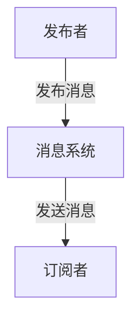

## 1.背景介绍

发布订阅模式，也被称为Pub/Sub模式，是一种广泛应用于消息系统和事件驱动系统的设计模式。在这种模式中，消息的发送者（发布者）不会直接发送消息给特定的接收者（订阅者）。相反，发布者将消息类别或消息本身发布到一些中介或消息系统，订阅者可以订阅这些类别并接收相关的消息。

发布订阅模式的一个主要优点是它可以解耦消息的发送者和接收者。这使得系统更具有可扩展性，因为添加新的订阅者不会影响发布者，反之亦然。此外，发布订阅模式也支持一对多的消息分发，允许多个订阅者接收同一条消息。

## 2.核心概念与联系

在发布订阅模式中，主要涉及到以下几个核心概念：

- **发布者(Publisher)**: 发布者负责生成消息并发布到消息系统。发布者并不知道谁会接收它的消息。

- **订阅者(Subscriber)**: 订阅者订阅感兴趣的消息类别，并从消息系统接收相关的消息。

- **消息系统/中介(Broker)**: 消息系统作为中介，负责存储和转发发布者的消息。它将消息发送给所有订阅了相应类别的订阅者。

- **消息(Message)**: 消息是发布者生成并发送到消息系统的数据。消息可以包含任何类型的数据，包括简单的文本、数字、日期或更复杂的数据结构。

- **主题(Topic)**: 主题是消息的类别。订阅者可以订阅一个或多个主题，消息系统会将发布到这些主题的消息发送给相应的订阅者。

发布者、订阅者、消息系统和消息之间的关系可以通过下面的Mermaid流程图进行描述：



## 3.核心算法原理具体操作步骤

发布订阅模式的核心操作步骤如下：

1. **消息发布**：发布者生成消息，并将消息发布到消息系统。发布的消息会附带一个或多个主题。

2. **消息存储**：消息系统接收到发布者的消息后，会将消息存储起来，并根据消息的主题将消息分类。

3. **消息订阅**：订阅者可以向消息系统订阅一个或多个主题。

4. **消息发送**：当有新的消息发布到订阅者订阅的主题时，消息系统会将这些消息发送给订阅者。

5. **消息接收**：订阅者接收到消息后，可以对消息进行处理。

## 4.数学模型和公式详细讲解举例说明

在发布订阅模式中，消息的发送和接收可以被建模为一个随机过程。这个过程的特性可以通过概率论和统计学的方法来描述和分析。

假设我们有一个发布者和$n$个订阅者，发布者在每个时间单位内发布消息的概率为$p$。我们可以定义一个随机变量$X$，表示在一个时间单位内发布者发布的消息数量。根据泊松分布的定义，$X$的概率分布函数可以表示为：

$$
P(X=k) = \frac{e^{-\lambda}\lambda^k}{k!}
$$

其中，$\lambda = np$是发布者在一个时间单位内发布消息的平均数量。

对于每个订阅者，我们可以定义一个随机变量$Y_i$，表示它在一个时间单位内接收的消息数量。因为每个订阅者只接收它订阅的主题的消息，所以$Y_i$的概率分布函数也是一个泊松分布，但参数$\lambda_i$可能与$\lambda$不同。

通过这种方式，我们可以使用数学模型来描述和分析发布订阅模式的行为，包括消息的发送和接收的速率、延迟、丢包率等。

## 5.项目实践：代码实例和详细解释说明

下面是一个使用Python实现的简单发布订阅模式的例子：

```python
class Publisher:
    def __init__(self):
        self.subscribers = dict()

    def register(self, who, callback=None):
        if callback is None:
            callback = getattr(who, 'update')
        self.subscribers[who] = callback

    def unregister(self, who):
        del self.subscribers[who]

    def dispatch(self, message):
        for subscriber, callback in self.subscribers.items():
            callback(message)

class Subscriber:
    def update(self, message):
        print('Received: ' + message)

publisher = Publisher()
subscriber = Subscriber()

publisher.register(subscriber)
publisher.dispatch('Hello, World!')
publisher.unregister(subscriber)
```

在这个例子中，`Publisher`类代表发布者，`Subscriber`类代表订阅者。`Publisher`类有一个`subscribers`字典来存储订阅者和它们的回调函数。`register`方法用于注册订阅者，`unregister`方法用于注销订阅者，`dispatch`方法用于发送消息。

`Subscriber`类有一个`update`方法，这是它的回调函数，用于处理接收到的消息。

## 6.实际应用场景

发布订阅模式广泛应用于各种系统和应用中，例如：

- **消息队列系统**：如RabbitMQ、Kafka等，它们都支持发布订阅模式。

- **事件驱动系统**：在这些系统中，事件的生成者（发布者）会发布事件，事件的处理者（订阅者）会订阅和处理这些事件。

- **实时数据更新**：例如股票价格更新、天气预报等，发布者可以发布最新的数据，订阅者可以订阅这些数据并实时更新。

- **微服务架构**：在微服务架构中，服务之间可以通过发布订阅模式来进行解耦的通信。

## 7.工具和资源推荐

以下是一些实现发布订阅模式的工具和资源：

- **RabbitMQ**：一种广泛使用的消息队列系统，支持发布订阅模式。

- **Kafka**：一种高性能的分布式流处理平台，也支持发布订阅模式。

- **Redis**：除了作为内存数据库外，Redis也提供了发布订阅的功能。

- **MQTT**：一种轻量级的发布订阅协议，常用于物联网应用。

## 8.总结：未来发展趋势与挑战

发布订阅模式作为一种强大的设计模式，已经广泛应用于各种系统和应用中。随着微服务和事件驱动架构的兴起，发布订阅模式的应用将更加广泛。

然而，发布订阅模式也面临一些挑战，例如如何保证消息的可靠性和顺序性，如何处理大规模的订阅者，如何实现消息的过滤和路由等。这些问题需要我们在实际应用中去解决。

## 9.附录：常见问题与解答

**Q: 发布订阅模式和观察者模式有什么区别？**

A: 发布订阅模式和观察者模式都是行为型设计模式，都用于实现对象之间的解耦。它们的主要区别在于，观察者模式中，观察者直接观察主题的状态，而发布订阅模式中，订阅者并不直接观察发布者，而是通过消息系统接收发布者的消息。

**Q: 发布订阅模式如何保证消息的可靠性？**

A: 保证消息的可靠性通常需要消息系统的支持。例如，消息系统可以使用持久化存储来保存消息，以防止消息在传输过程中丢失。此外，消息系统也可以提供消息确认机制，让订阅者确认它已经接收和处理了消息。

作者：禅与计算机程序设计艺术 / Zen and the Art of Computer Programming