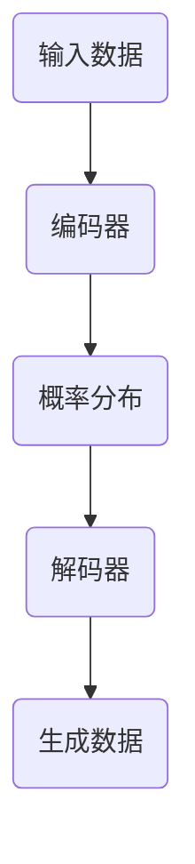

## 1.背景介绍

在深度学习领域，自编码器 (Auto-Encoder) 是一种重要的无监督学习方法，它能够通过学习数据的隐含特征进行编码和解码，达到降维和特征抽象的目的。而变分自编码器 (Variational Auto-Encoder, VAE) 则是自编码器的一种变体，它引入了概率分布的思想，使得模型能够生成与训练数据相似的新数据。VAE在很多领域都有广泛的应用，如图像生成、文本生成等。

## 2.核心概念与联系

VAE的核心思想是基于概率分布和最大化似然函数进行模型训练。它由编码器和解码器两部分组成，编码器将输入数据编码为一个概率分布，解码器从这个概率分布中采样得到新的数据。这个过程可以用以下的Mermaid流程图来表示：



## 3.核心算法原理具体操作步骤

VAE的核心算法原理包括以下几个步骤：

1. **编码**：编码器接收输入数据，将其编码为一个概率分布。这个概率分布通常假设为高斯分布，其参数由神经网络输出。

2. **采样**：从编码得到的概率分布中采样生成新的数据。

3. **解码**：解码器接收采样得到的数据，将其解码为原始数据的维度。

4. **重构误差与KL散度**：VAE的训练目标是最小化重构误差和KL散度，其中重构误差衡量了解码数据与原始数据的相似度，KL散度衡量了编码得到的概率分布与先验分布的相似度。

## 4.数学模型和公式详细讲解举例说明

VAE的数学模型可以用以下的公式来表示：

$$
\log p_\theta(x) \geq \mathbb{E}_{q_\phi(z|x)}[\log p_\theta(x|z)] - D_{KL}(q_\phi(z|x) || p(z))
$$

其中，$p_\theta(x|z)$ 是解码器的概率分布，$q_\phi(z|x)$ 是编码器的概率分布，$p(z)$ 是先验分布，通常假设为标准正态分布。$D_{KL}$ 是KL散度，用来衡量两个概率分布的相似度。

## 5.项目实践：代码实例和详细解释说明

以下是一个简单的VAE模型的实现，使用了PyTorch框架：

```python
import torch
from torch import nn

class VAE(nn.Module):
    def __init__(self, input_dim, hidden_dim, z_dim):
        super(VAE, self).__init__()
        # Encoder
        self.fc1 = nn.Linear(input_dim, hidden_dim)
        self.fc21 = nn.Linear(hidden_dim, z_dim)  # mu layer
        self.fc22 = nn.Linear(hidden_dim, z_dim)  # logvariance layer
        # Decoder
        self.fc3 = nn.Linear(z_dim, hidden_dim)
        self.fc4 = nn.Linear(hidden_dim, input_dim)

    def encode(self, x):
        h1 = torch.relu(self.fc1(x))
        return self.fc21(h1), self.fc22(h1)

    def reparameterize(self, mu, logvar):
        std = torch.exp(0.5*logvar)
        eps = torch.randn_like(std)
        return mu + eps*std

    def decode(self, z):
        h3 = torch.relu(self.fc3(z))
        return torch.sigmoid(self.fc4(h3))

    def forward(self, x):
        mu, logvar = self.encode(x)
        z = self.reparameterize(mu, logvar)
        return self.decode(z), mu, logvar
```

## 6.实际应用场景

VAE在许多领域都有广泛的应用，例如：

1. **图像生成**：VAE可以生成与训练数据相似的新图像，用于数据增强、艺术创作等。

2. **异常检测**：VAE可以学习数据的隐含特征，用于检测与正常数据显著不同的异常数据。

3. **推荐系统**：VAE可以用于学习用户的行为特征，用于推荐系统中的用户行为预测。

## 7.工具和资源推荐

以下是一些有用的工具和资源：

1. **PyTorch**：一个强大的深度学习框架，支持动态图和自动求导，非常适合用于实现VAE。

2. **TensorFlow**：另一个强大的深度学习框架，支持静态图和自动求导，也可以用于实现VAE。

3. **Keras**：一个高级的深度学习框架，提供了许多预定义的层和模型，可以快速实现VAE。

## 8.总结：未来发展趋势与挑战

虽然VAE已经在许多领域得到了成功的应用，但是仍然存在一些挑战和未来的发展趋势：

1. **更复杂的分布**：现有的VAE模型通常假设编码的概率分布为高斯分布，但是这可能无法很好地捕捉数据的复杂性。未来的研究可能会探索更复杂的分布，如混合高斯分布、t分布等。

2. **更大规模的数据**：随着数据规模的增长，如何有效地训练VAE成为一个挑战。未来的研究可能会探索更高效的训练方法，如分布式训练、大规模并行等。

3. **更多的应用场景**：随着VAE技术的发展，可能会有更多的应用场景出现，如音频生成、视频生成等。

## 9.附录：常见问题与解答

1. **VAE的优点是什么？**

   VAE的一个主要优点是它能够生成与训练数据相似的新数据。这使得VAE可以用于数据增强、艺术创作等应用。

2. **VAE的缺点是什么？**

   VAE的一个主要缺点是它假设编码的概率分布为高斯分布，这可能无法很好地捕捉数据的复杂性。

3. **VAE和普通的自编码器有什么区别？**

   VAE和普通的自编码器的主要区别在于，VAE引入了概率分布的思想，使得模型能够生成新的数据。

作者：禅与计算机程序设计艺术 / Zen and the Art of Computer Programming