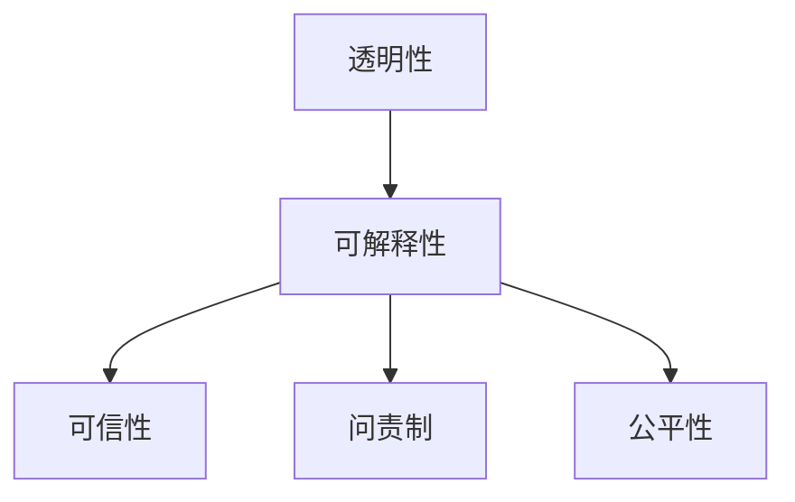

# 可解释人工智能原理与代码实战案例讲解

## 1.背景介绍
### 1.1 可解释人工智能的重要性
随着人工智能技术的快速发展,AI系统在各个领域得到了广泛应用。然而,传统的AI模型往往是"黑盒子",其内部决策过程难以被人类所理解。这导致了一系列问题,例如结果的可信度、公平性和安全性等。为了解决这些问题,可解释人工智能(Explainable AI,XAI)应运而生。它旨在开发出一种透明、可解释、可信的AI系统。

### 1.2 可解释人工智能的定义
可解释人工智能是一种赋予AI系统以解释能力的技术。它能够清晰地阐述AI系统是如何得出决策结果的,使人类能够理解、信任并有效管理AI系统。可解释性包括两个层面:一是对AI模型的整体解释,即阐明模型的工作原理;二是对AI模型的局部解释,即说明个案的决策依据。

### 1.3 可解释人工智能的发展历程
可解释人工智能的研究可以追溯到上世纪80年代的专家系统。但由于当时的技术限制,这一领域的进展较为缓慢。近年来,随着深度学习的崛起,AI模型变得愈发复杂和不透明,可解释性问题日益突出。2016年,DARPA提出了"可解释AI"的概念,掀起了新一轮的研究热潮。各大科技公司纷纷投入到XAI领域,推动了该领域的快速发展。

## 2.核心概念与联系
### 2.1 可解释性
可解释性是指AI系统能够向人类用户提供其决策过程和结果的解释。一个好的解释应当简明、全面、易于理解。可解释性可以帮助用户判断结果的可信度,并对AI系统形成合理的预期。

### 2.2 透明性 
透明性强调AI系统的开放性。它要求公开AI系统的目的、结构、训练数据、算法等关键信息,接受公众和专业机构的审查监督。透明性是实现可解释性的基础。

### 2.3 可信性
可信性反映了用户对AI系统的信任程度。它来源于系统长期稳定的表现和对用户需求的满足。可解释性对建立可信性至关重要。当用户能够理解系统的工作原理时,他们更倾向于信任该系统。

### 2.4 问责制
问责制是指对AI系统开发者和使用者的责任追究机制。它确保参与者尽职尽责,对系统的质量和影响负责。可解释性为落实问责制提供了依据。当出现问题时,我们可以追溯系统的决策过程,判断责任归属。

### 2.5 公平性
公平性要求AI系统在处理不同人群时一视同仁,杜绝歧视和偏见。由于训练数据和算法的局限性,AI系统可能产生有失公允的结果。可解释性有助于发现其中的偏差,并为之提供解决方案。

### 2.6 各概念之间的关系
下图展示了可解释性、透明性、可信性、问责制、公平性之间的关系:



透明性是可解释性的基础,可解释性则是建立可信性、落实问责制、保障公平性的关键。这些概念相辅相成,共同构筑了可解释人工智能的核心内涵。

## 3.核心算法原理具体操作步骤
### 3.1 基于规则的解释方法
#### 3.1.1 决策树
决策树是一种树形结构,内部节点表示特征,叶节点表示分类结果。它通过一系列"if-then"规则对样本进行分类。决策树的构建过程如下:

1. 计算每个特征的信息增益或基尼指数
2. 选择最优特征作为根节点
3. 递归地构建子树,直到满足停止条件
4. 剪枝优化决策树

决策树的优点是结构简单、易于理解。但它容易过拟合,泛化能力较差。

#### 3.1.2 逻辑回归
逻辑回归是一种常用的分类模型。它通过Sigmoid函数将样本特征映射到0-1之间,得到样本属于某一类别的概率。逻辑回归的训练过程如下:

1. 定义似然函数
2. 求解似然函数的极大值,得到模型参数
3. 用学习到的参数对新样本进行预测

逻辑回归的优点是模型简洁,训练速度快,适合处理高维数据。但它难以刻画特征之间的复杂关系。

### 3.2 基于模型的解释方法
#### 3.2.1 LIME
LIME(Local Interpretable Model-agnostic Explanations)是一种对黑盒模型进行局部解释的算法。它的基本思想是用一个可解释的模型(如线性模型)去局部近似黑盒模型。LIME的工作流程如下:

1. 在待解释样本附近采样扰动数据
2. 对扰动数据用黑盒模型预测,得到标签
3. 用可解释模型拟合扰动数据和预测标签
4. 提取可解释模型的权重,得到特征重要性

LIME可以适用于任意模型,提供实例级别的解释。但它的采样策略和距离度量方式会影响解释的稳定性。

#### 3.2.2 SHAP
SHAP(SHapley Additive exPlanations)是一种基于博弈论的特征重要性评估方法。它将每个特征视为一个"玩家",通过考察该特征在所有可能的"合作组合"中的贡献来衡量其重要性。SHAP的计算过程如下:

1. 列举特征的所有组合
2. 用黑盒模型计算每种组合下的预测值
3. 计算每个特征的Shapley值
4. 将特征按Shapley值排序,得到重要性排名

SHAP赋予了特征重要性明确的理论意义,具有公平性和一致性等良好性质。但它的计算复杂度较高,在高维数据上难以实现。

### 3.3 基于示例的解释方法
#### 3.3.1 反事实解释
反事实解释回答了"如果输入改变,模型输出会如何变化"的问题。它通过寻找反事实样本(与原样本仅有少量特征不同,但预测结果发生改变)来揭示模型的决策边界。反事实解释的生成步骤如下:

1. 确定待解释样本和目标类别
2. 优化目标函数,找到反事实样本
3. 对比原样本和反事实样本,得到关键特征

反事实解释直观易懂,但寻找最优反事实样本是一个具有挑战性的问题。

#### 3.3.2 影响函数
影响函数衡量了训练集中每个样本对模型预测结果的影响力。它借助损失函数的梯度信息,评估样本的重要程度。影响函数的计算公式为:

$$I_{up,loss}(z) = - \nabla_{\theta} L(z_i, \hat{\theta}) H^{-1}_{S_{tr}} \nabla_{\theta} L(z, \hat{\theta})$$

其中$z$是待解释样本,$z_i$是训练样本,$\hat{\theta}$是模型参数,$H_{S_{tr}}$是Hessian矩阵。

影响函数可以定量分析模型的泛化能力和鲁棒性,但其计算开销很大,在大规模数据集上难以应用。

## 4.数学模型和公式详细讲解举例说明
### 4.1 Shapley值
Shapley值源自博弈论,用于衡量每个玩家对联盟总收益的贡献。在特征重要性分析中,我们可以将每个特征视为一个玩家,将模型预测视为联盟收益。特征$i$的Shapley值定义为:

$$\phi_i(v) = \sum_{S \subseteq F \setminus \{i\}} \frac{|S|!(|F|-|S|-1)!}{|F|!} (v(S \cup \{i\}) - v(S))$$

其中$F$是所有特征的集合,$S$是$F$的子集,$v$是模型的预测函数。

举例来说,假设我们有三个特征$x_1,x_2,x_3$,模型在不同特征组合下的预测值如下:

```
v({}) = 0
v({x1}) = 1
v({x2}) = 2 
v({x3}) = 3
v({x1,x2}) = 4
v({x1,x3}) = 5
v({x2,x3}) = 6
v({x1,x2,x3}) = 10
```

根据Shapley值的定义,我们可以计算出每个特征的重要性:

$$
\begin{aligned}
\phi_1 &= \frac{1}{3}(v(\{1\}) - v(\{\})) + \frac{1}{6}(v(\{1,2\}) - v(\{2\})) \\
&+ \frac{1}{6}(v(\{1,3\}) - v(\{3\})) + \frac{1}{3}(v(\{1,2,3\}) - v(\{2,3\})) \\
&= \frac{5}{3} \\
\phi_2 &= \frac{7}{3} \\  
\phi_3 &= 4
\end{aligned}
$$

可见,$x_3$的重要性最高,$x_2$次之,$x_1$最低。这与我们的直觉一致。

### 4.2 LIME
LIME的核心是用一个可解释的模型$g$去局部近似黑盒模型$f$。假设$x$是待解释样本,$\pi_x(z)$是将扰动样本$z$映射回$x$附近的函数。LIME优化的目标函数为:

$$\xi = \underset{g \in G}{\arg\min}\, L(f, g, \pi_x) + \Omega(g)$$

其中$L$是$f$和$g$的不一致性损失,$\Omega$是$g$的复杂度。

以图像分类为例,假设$x$是一张狗的图片,经过分割后可以得到$n$个超像素$x_1,x_2,...,x_n$。我们随机遮挡一些超像素,生成扰动图片$z$。接着用黑盒模型$f$对$z$进行预测,得到标签$f(z)$。最后,用一个线性模型$g$去拟合$(z,f(z))$,得到每个超像素的权重。权重高的超像素对分类结果影响大,是图片的关键区域。

## 5.项目实践:代码实例和详细解释说明
下面我们用Python实现LIME算法,对图像分类模型进行解释。

```python
import numpy as np
import sklearn.metrics
from sklearn.linear_model import Ridge
from skimage.segmentation import quickshift

class ImageExplainer:
    def __init__(self, model, num_samples=1000, top_labels=5, num_features=100000):
        self.model = model
        self.num_samples = num_samples
        self.top_labels = top_labels
        self.num_features = num_features
        
    def explain(self, image):
        # 对图片进行分割,提取超像素
        segments = quickshift(image, kernel_size=4, max_dist=200, ratio=0.2)
        num_superpixels = np.unique(segments).shape[0]
        
        # 生成扰动数据
        perturbations = np.random.binomial(1, 0.5, size=(self.num_samples, num_superpixels)) 
        perturbations[0,:] = 1
        
        # 预测扰动数据
        predictions = []
        for pert in perturbations:
            perturbed_img = self.perturb_image(image, segments, pert)
            pred = self.model.predict(perturbed_img[np.newaxis,:,:,:])
            predictions.append(pred)
        predictions = np.array(predictions)
        
        # 选出置信度最高的几个类别
        top_labels_idx = np.argsort(predictions[0])[-self.top_labels:]
        
        # 用线性模型拟合扰动数据和预测结果
        weights = []
        for label in top_labels_idx:
            model = Ridge(alpha=1, fit_intercept=True)
            model.fit(perturbations, predictions[:, label])
            weight = model.coef_
            weights.append(weight)
        weights = np.array(weights)
        
        # 计算每个超像素的重要性
        num_top_features = min(self.num_features, num_superpixels)
        top_features_idx = np.argsort(np.sum(np.abs(weights), axis=0))[-num_top_features:]
        mask = np.zeros(num_superpixels)
        mask[top_features_idx] = True
        return mask,