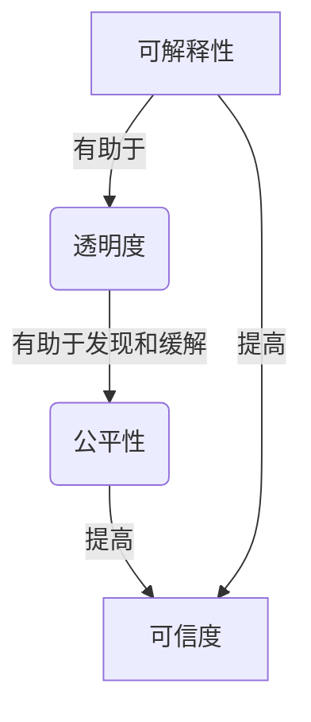

# 可解释性与透明度:赋予LLM智能体以可解释性

## 1.背景介绍

### 1.1 人工智能的崛起

人工智能(AI)技术在过去几年中取得了长足的进步,尤其是大型语言模型(LLM)的出现,使得自然语言处理(NLP)领域达到了一个新的里程碑。LLM能够理解和生成看似人类写作的自然语言,在机器翻译、问答系统、内容生成等领域发挥着越来越重要的作用。

### 1.2 LLM的黑箱问题

然而,尽管LLM展现出了惊人的语言能力,但它们的内部工作机制却是一个黑箱,难以解释和理解。这种"黑箱"特性给LLM的应用带来了一些挑战和风险,例如:

- **缺乏透明度**: 难以解释LLM是如何得出特定输出的,这可能会影响人们对其结果的信任度。
- **潜在偏见**: LLM在训练过程中可能会吸收数据集中存在的偏见,从而在输出中反映出这些偏见。
- **不可解释性**: 当LLM做出明显错误的预测时,很难追踪到底是什么导致了这一错误。

### 1.3 可解释性的重要性

为了更好地利用LLM的强大能力,同时降低相关风险,赋予LLM以可解释性和透明度变得越来越重要。可解释的LLM不仅可以提高人们对其输出的信任度,还有助于发现和缓解潜在的偏见,并在出现错误时更容易进行故障排查和模型改进。

## 2.核心概念与联系

### 2.1 可解释性(Explainability)

可解释性是指能够以人类可理解的方式解释人工智能系统的内部逻辑和决策过程。对于LLM而言,可解释性意味着能够解释模型是如何从输入到输出的,以及中间所做的推理过程。

### 2.2 透明度(Transparency)

透明度是指人工智能系统的工作原理和决策过程对外部观察者是可见和可审查的。对于LLM,透明度意味着能够查看模型的内部结构、参数和计算过程,从而更好地了解其行为。

### 2.3 公平性(Fairness)

公平性是指人工智能系统在做出决策时不会对特定群体产生不当的偏见或歧视。可解释的LLM有助于发现和缓解潜在的偏见,从而提高其公平性。

### 2.4 可信度(Trustworthiness)

可信度是指人们对人工智能系统的输出和决策有足够的信心和信任。通过提高LLM的可解释性和透明度,人们可以更好地理解和信任模型的行为。

### 2.5 核心概念关系

可解释性、透明度、公平性和可信度这四个概念相互关联且互为支撑。提高LLM的可解释性有助于增强透明度,从而发现和缓解潜在的偏见,进而提高公平性和可信度。反之,缺乏可解释性和透明度可能会导致偏见和不可信的情况。



## 3.核心算法原理具体操作步骤

赋予LLM以可解释性和透明度需要采用一些核心算法和技术,下面将介绍其中的一些关键方法及其具体操作步骤。

### 3.1 注意力可视化(Attention Visualization)

注意力机制是许多LLM的核心组成部分,它决定了模型在生成每个单词时关注输入序列的哪些部分。通过可视化注意力权重,我们可以更好地理解模型的决策过程。

**具体操作步骤**:

1. 获取LLM在生成每个单词时的注意力权重矩阵。
2. 将注意力权重矩阵可视化,例如使用热力图或其他可视化技术。
3. 分析可视化结果,观察模型在不同位置关注了哪些输入单词或短语。
4. 结合输入和输出,解释模型的决策过程和推理逻辑。

### 3.2 特征归因(Feature Attribution)

特征归因技术旨在量化每个输入特征对模型输出的贡献程度,从而帮助理解模型的决策过程。对于LLM,我们可以将单词或短语视为特征,并计算它们对最终输出的影响。

**具体操作步骤**:

1. 选择一种特征归因方法,如积分梯度(Integrated Gradients)或Shapley值(Shapley Values)。
2. 对LLM的输入进行扰动,并观察输出的变化。
3. 根据特征归因方法的原理,计算每个输入特征对输出的贡献程度。
4. 将特征贡献度可视化,例如使用热力图或其他技术。
5. 分析可视化结果,解释模型对哪些输入特征更为敏感,从而揭示其决策逻辑。

### 3.3 概念激活向量(Concept Activation Vectors, CAVs)

CAVs是一种用于解释LLM内部表示的技术。它通过识别与特定概念相关的神经元激活模式,从而揭示模型如何编码和理解这些概念。

**具体操作步骤**:

1. 收集与感兴趣的概念相关的文本数据集。
2. 使用LLM对这些文本进行编码,获取相应的隐藏层激活值。
3. 通过聚类或其他无监督技术,识别与该概念相关的神经元激活模式。
4. 将这些模式视为CAVs,用于可视化和解释LLM对该概念的理解。
5. 分析CAVs在不同输入下的激活强度,揭示模型如何处理和表示该概念。

### 3.4 对抗性攻击(Adversarial Attacks)

对抗性攻击是一种测试LLM鲁棒性和可解释性的技术。通过对输入进行微小但有针对性的扰动,我们可以观察模型输出的变化,从而揭示其脆弱性和决策过程。

**具体操作步骤**:

1. 选择一种对抗性攻击方法,如快速梯度符号法(Fast Gradient Sign Method)或Hotflip攻击。
2. 对LLM的输入进行对抗性扰动,生成对抗样本。
3. 观察模型在对抗样本下的输出变化。
4. 分析输出变化,揭示模型对哪些输入扰动更为敏感,从而了解其决策逻辑和脆弱性。
5. 根据发现的脆弱性,优化和改进LLM的鲁棒性和可解释性。

## 4.数学模型和公式详细讲解举例说明

在解释LLM的可解释性算法时,我们需要涉及一些数学模型和公式。下面将详细讲解其中的一些关键公式,并给出具体的例子说明。

### 4.1 注意力权重计算

注意力机制是LLM的核心组成部分之一,它决定了模型在生成每个单词时关注输入序列的哪些部分。注意力权重的计算公式如下:

$$\alpha_{t,i} = \frac{e^{s_{t,i}}}{\sum_{j=1}^{n}e^{s_{t,j}}}$$

其中:

- $\alpha_{t,i}$ 表示在时间步 $t$ 生成单词时,注意力机制对输入序列第 $i$ 个单词的权重。
- $s_{t,i}$ 是一个分数,表示模型在时间步 $t$ 对输入序列第 $i$ 个单词的"关注程度"。
- $n$ 是输入序列的长度。

通过计算每个时间步的注意力权重矩阵,我们可以可视化模型在生成每个单词时关注了哪些输入单词或短语,从而揭示其决策过程。

**例子**:

假设我们有一个输入序列 "The cat sat on the mat",  LLM需要生成下一个单词。在某个时间步,注意力权重矩阵可能如下所示:

```
     The   cat   sat    on    the   mat
t=5  0.1   0.2   0.1   0.05  0.5   0.05
```

从这个注意力权重矩阵中,我们可以看出,在生成下一个单词时,模型主要关注了 "the" 和 "cat" 这两个单词,因此它可能会生成一个与猫相关的单词,如 "meowed" 或 "purred"。

### 4.2 积分梯度(Integrated Gradients)

积分梯度是一种常用的特征归因方法,它通过积分模型输出相对于输入的梯度,来量化每个输入特征对输出的贡献程度。对于一个输入 $x$ 和基准输入 $x'$,输入特征 $i$ 对模型输出 $F(x)$ 的贡献可以表示为:

$$\text{IG}_i(x) = (x_i - x'_i) \times \int_{\alpha=0}^{1} \frac{\partial F(x' + \alpha \times (x - x'))}{\partial x_i} d\alpha$$

其中,积分路径从基准输入 $x'$ 到实际输入 $x$。通过计算每个特征的 $\text{IG}_i$ 值,我们可以量化它们对模型输出的贡献程度,从而揭示模型的决策逻辑。

**例子**:

假设我们有一个情感分类模型,输入是一个句子 "I love this movie",  我们想知道每个单词对于正面情感输出的贡献程度。使用积分梯度方法,我们可以计算每个单词的 $\text{IG}_i$ 值,结果如下:

```
I     love   this   movie
0.01  0.7    0.05   0.24
```

从这个结果可以看出,单词 "love" 对正面情感输出的贡献最大,这与我们的直觉相符。通过分析每个单词的贡献度,我们可以更好地理解模型的决策过程。

### 4.3 Shapley值(Shapley Values)

Shapley值是一种基于博弈论的特征归因方法,它将每个特征对模型输出的贡献视为一个合作游戏,并计算每个特征在这个游戏中的公平贡献度。对于一个输入 $x$ 和模型输出 $F(x)$,第 $i$ 个特征的 Shapley 值可以表示为:

$$\phi_i(F, x) = \sum_{S \subseteq N \backslash \{i\}} \frac{|S|!(|N|-|S|-1)!}{|N|!}[F(x_S \cup \{i\}) - F(x_S)]$$

其中:

- $N$ 是所有特征的集合。
- $x_S$ 表示只包含集合 $S$ 中特征的输入。
- $F(x_S \cup \{i\}) - F(x_S)$ 表示特征 $i$ 对模型输出的边际贡献。

通过计算每个特征的 Shapley 值,我们可以量化它们对模型输出的贡献程度,从而揭示模型的决策逻辑。

**例子**:

假设我们有一个二元logistic回归模型,用于预测一个人是否会购买某个产品。输入特征包括年龄、收入和教育程度。使用 Shapley 值方法,我们可以计算每个特征对购买决策的贡献度,结果如下:

```
年龄   收入   教育程度
0.2    0.6     0.2
```

从这个结果可以看出,收入对购买决策的贡献最大,这与我们的直觉相符。通过分析每个特征的 Shapley 值,我们可以更好地理解模型的决策过程,并确定哪些特征对于模型预测更为重要。

## 5.项目实践:代码实例和详细解释说明

为了更好地理解可解释性算法的实现,我们将提供一些代码示例,并对其进行详细的解释说明。这些示例使用Python和相关库(如PyTorch、TensorFlow等)实现。

### 5.1 注意力可视化示例

以下是一个使用PyTorch实现注意力可视化的示例代码:

```python
import torch
import torch.nn as nn
import matplotlib.pyplot as plt

# 定义一个简单的序列到序列模型
class Seq2SeqModel(nn.Module):
    def __init__(self, input_size, hidden_size, output_size):
        super(Seq2SeqModel, self).__init__