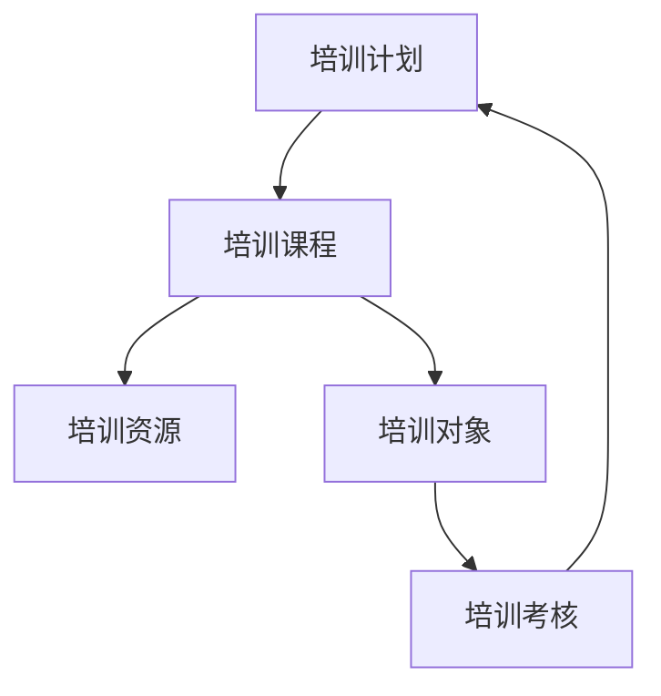

# 员工培训管理系统详细设计与具体代码实现

## 1.背景介绍

### 1.1 培训的重要性

在当今快节奏的商业环境中,培训对于提高员工的技能、知识和绩效至关重要。有效的培训不仅能够确保员工具备所需的专业能力,还能提高他们的工作效率、增强团队合作精神,并推动整个组织的发展。因此,建立一个完善的员工培训管理系统对于企业的长期发展具有重要意义。

### 1.2 现有系统的不足

虽然许多企业已经意识到培训的重要性,但他们使用的培训管理系统往往存在诸多不足。例如,培训课程安排混乱、报名流程繁琐、培训资源利用率低下等问题。这些问题不仅影响了培训的效率和质量,也增加了管理和维护的工作量。

### 1.3 新系统的目标

为了解决现有系统的缺陷,我们设计了一个新的员工培训管理系统。该系统的主要目标包括:

1. 提供直观友好的用户界面,简化培训课程的查询、报名和管理流程。
2. 实现培训资源的高效利用,避免资源浪费。
3. 收集和分析培训数据,为管理层提供决策支持。
4. 支持在线学习和远程培训,提高培训的灵活性和覆盖面。
5. 与企业其他系统(如人力资源管理系统)实现无缝集成。

## 2.核心概念与联系

### 2.1 培训管理的核心概念

员工培训管理系统涉及以下几个核心概念:

1. **培训课程(Training Course)**: 指为员工提供的各种培训活动,包括讲座、研讨会、实践操作等。每个课程都有相应的培训目标、内容、时间安排等信息。

2. **培训计划(Training Plan)**: 是指为实现特定培训目标而制定的一系列培训课程安排。培训计划通常根据企业的发展战略和员工的实际需求来制定。

3. **培训资源(Training Resource)**: 包括培训场地、设备、讲师等为开展培训活动所需的各种资源。合理利用和分配培训资源是提高培训效率的关键。

4. **培训对象(Trainee)**: 即需要接受培训的员工。根据不同的培训目标和内容,培训对象可能是来自不同部门、不同职级的员工群体。

5. **培训考核(Training Assessment)**: 指对员工的培训效果进行评估和考核,以确保培训目标的实现。考核可以采取理论测试、实践操作等多种形式。

### 2.2 核心概念之间的关系

上述核心概念之间存在着密切的关系,它们共同构成了员工培训管理系统的基础框架。具体来说:

- 培训计划由一系列培训课程组成,每个课程都需要利用相应的培训资源。
- 培训对象参加培训课程,并接受相应的培训考核。
- 培训考核的结果将反馈到培训计划的制定和调整中,以优化未来的培训安排。
- 培训资源的合理分配直接影响培训课程的开展效果。

我们可以使用一个简单的 Mermaid 流程图来直观地展示这些核心概念之间的关系:

## 3.核心算法原理具体操作步骤

在员工培训管理系统中,有几个核心算法需要特别关注:

### 3.1 培训课程安排算法

培训课程安排算法的主要目标是根据培训计划、培训资源的可用情况以及培训对象的时间安排,生成一个最优的培训课程时间表。这是一个典型的约束优化问题,可以使用多种算法来求解,例如:

1. **贪心算法**: 按照一定规则(如优先安排资源占用最少的课程),逐步构建时间表。贪心算法简单高效,但可能得到的解不是全局最优解。

2. **回溯算法**: 通过枚举所有可能的时间安排,找到满足所有约束条件的最优解。回溯算法可以获得精确的最优解,但计算复杂度较高。

3. **启发式算法**: 借鉴贪心算法和回溯算法的思想,结合一些启发式规则(如避免资源冲突、尽量压缩时间段等),快速获得一个近似最优解。

无论采用哪种算法,其核心步骤都包括:

1. 收集输入数据,包括培训计划、可用资源、培训对象的时间约束等。
2. 构建数学模型,将问题形式化为目标函数和约束条件。
3. 应用算法求解,获得满足约束条件的最优或近似最优解。
4. 对结果进行后处理,生成最终的培训课程时间表。

### 3.2 培训资源分配算法

培训资源分配算法的目标是根据培训课程安排,为每个课程分配所需的培训资源(如场地、设备、讲师等),同时最大化资源的利用率。这也是一个典型的约束优化问题,可以采用以下算法:

1. **匈牙利算法**: 用于解决线性分配问题,可以实现最优资源分配。
2. **遗传算法**: 借鉴生物进化的思想,通过模拟"遗传"和"变异"过程,逐步优化资源分配方案。
3. **模拟退火算法**: 模拟固体冷却过程,通过概率跳出局部最优解,最终获得全局最优解。

无论采用哪种算法,其核心步骤都包括:

1. 收集输入数据,包括培训课程安排、可用资源清单等。
2. 构建数学模型,将问题形式化为目标函数和约束条件。
3. 应用算法求解,获得满足约束条件的最优或近似最优资源分配方案。
4. 对结果进行后处理,生成最终的资源分配计划。

### 3.3 培训效果评估算法

培训效果评估算法的目标是根据培训考核结果,对培训课程的效果进行客观评估。常用的评估方法包括:

1. **统计分析**: 计算培训前后员工的知识、技能水平变化,并进行显著性检验。
2. **数据挖掘**: 利用聚类、分类等数据挖掘算法,发现培训效果与其他因素(如员工背景、课程内容等)之间的关联模式。
3. **机器学习**: 构建监督或非监督学习模型,预测和评估新的培训课程可能产生的效果。

无论采用哪种方法,其核心步骤都包括:

1. 收集输入数据,包括培训考核结果、员工背景信息、课程内容等。
2. 进行数据预处理,如数据清洗、特征工程等。
3. 应用统计分析、数据挖掘或机器学习算法,建立培训效果评估模型。
4. 对模型进行验证和优化,提高评估的准确性。
5. 基于模型的输出,生成培训效果评估报告。

## 4.数学模型和公式详细讲解举例说明

在员工培训管理系统中,我们需要构建数学模型来形式化描述各种优化问题,并使用相应的算法进行求解。下面我们将详细介绍其中的一些典型数学模型和公式。

### 4.1 培训课程安排模型

培训课程安排问题可以形式化为一个整数线性规划模型。假设我们有 $n$ 个培训课程需要安排,每个课程 $i$ 有一个持续时间 $d_i$,需要占用 $r_i$ 种资源。我们的目标是最小化培训课程的总持续时间,同时满足以下约束条件:

1. 每个课程只能安排在一个时间段内。
2. 两个课程不能在同一时间段内占用同一种资源。
3. 每个培训对象在特定时间段内只能参加一个课程。

我们可以引入两个决策变量:

- $x_{ij} = \begin{cases} 1, & \text{如果课程 i 安排在时间段 j} \\ 0, & \text{否则} \end{cases}$
- $y_j$ 表示时间段 $j$ 的结束时间。

则该问题可以表示为:

$$
\begin{aligned}
\min \quad & y_m \\
\text{s.t.} \quad & \sum_{j=1}^m x_{ij} = 1, \quad \forall i \in \{1, 2, \ldots, n\} \\
& \sum_{i=1}^n r_{ik} x_{ij} \leq 1, \quad \forall j \in \{1, 2, \ldots, m\}, \forall k \in \{1, 2, \ldots, r\} \\
& y_j \geq \sum_{i=1}^n d_i x_{ij}, \quad \forall j \in \{1, 2, \ldots, m\} \\
& x_{ij} \in \{0, 1\}, \quad \forall i \in \{1, 2, \ldots, n\}, \forall j \in \{1, 2, \ldots, m\}
\end{aligned}
$$

其中 $m$ 是时间段的总数,可以根据具体情况设置一个足够大的值。

该模型的第一个约束条件确保每个课程只安排在一个时间段内;第二个约束条件保证在同一时间段内,不会有两个课程占用同一种资源;第三个约束条件则确保了每个时间段的结束时间足够容纳该时间段内所有课程的持续时间之和。

通过求解这个整数线性规划模型,我们可以获得一个最优的培训课程时间安排方案。

### 4.2 培训资源分配模型

培训资源分配问题可以建模为一个线性分配问题。假设我们有 $n$ 个培训课程,每个课程 $i$ 需要占用 $r_i$ 种资源,共有 $m$ 种可用资源。我们的目标是最大化资源的利用率,同时满足每个课程的资源需求。

我们可以引入决策变量 $x_{ij}$,表示将资源 $j$ 分配给课程 $i$ 的数量。则该问题可以表示为:

$$
\begin{aligned}
\max \quad & \sum_{i=1}^n \sum_{j=1}^m x_{ij} \\
\text{s.t.} \quad & \sum_{j=1}^m x_{ij} \geq r_i, \quad \forall i \in \{1, 2, \ldots, n\} \\
& \sum_{i=1}^n x_{ij} \leq 1, \quad \forall j \in \{1, 2, \ldots, m\} \\
& x_{ij} \in \{0, 1\}, \quad \forall i \in \{1, 2, \ldots, n\}, \forall j \in \{1, 2, \ldots, m\}
\end{aligned}
$$

其中第一个约束条件确保每个课程的资源需求都得到满足;第二个约束条件保证每种资源最多只被分配给一个课程。

这是一个经典的线性分配问题,可以使用匈牙利算法等求解。通过求解该模型,我们可以获得一个最优的培训资源分配方案,从而最大化资源的利用率。

### 4.3 培训效果评估模型

培训效果评估可以建模为一个回归或分类问题。假设我们有 $n$ 个培训对象,每个对象 $i$ 有 $p$ 个特征 $\mathbf{x}_i = (x_{i1}, x_{i2}, \ldots, x_{ip})^T$,包括培训前的知识水平、工作经验等。我们的目标是基于这些特征,预测培训后的知识水平或技能提升程度 $y_i$。

对于回归问题,我们可以构建一个线性回归模型:

$$
y_i = \beta_0 + \beta_1 x_{i1} + \beta_2 x_{i2} + \ldots + \beta_p x_{ip} + \epsilon_i
$$

其中 $\beta_0, \beta_1, \ldots, \beta_p$ 是模型参数,需要通过训练数据进行估计;$\epsilon_i$ 是随机误差项。

对于分类问题,我们可以构建一个逻辑回归模型:

$$
P(y_i = 1 | \mathbf{x}_i) = \frac{1}{1 + e^{-(\beta_0 + \beta_1 