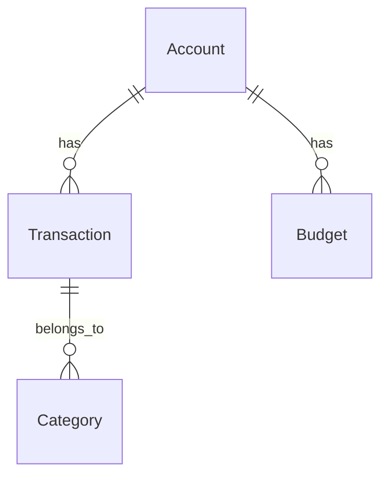
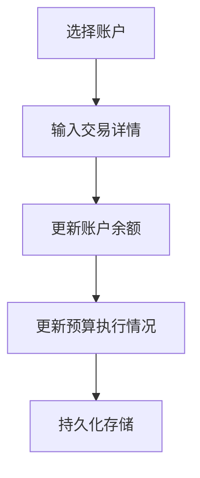
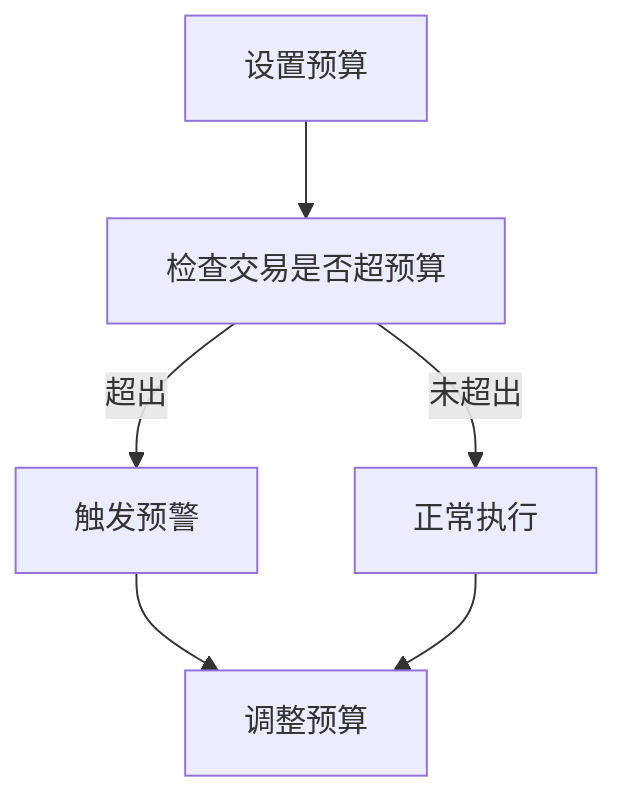

# 商场财务管理系统详细设计与具体代码实现

## 1. 背景介绍

### 1.1 商场财务管理的重要性

在当今竞争激烈的商业环境中，高效的财务管理对于任何商场的成功运营都至关重要。财务管理不仅涉及收入和支出的记录,还包括预算控制、成本分析、资金流动性管理等多个方面。一个健全的商场财务管理系统可以帮助企业实时监控财务状况,优化资源配置,降低运营风险,从而提高整体盈利能力。

### 1.2 传统财务管理系统的缺陷

传统的商场财务管理系统通常依赖于人工记录和纸质文件,这种方式不仅效率低下,而且容易出现错误和数据丢失。此外,由于缺乏集中化的数据存储和实时更新,企业领导层难以及时获取准确的财务信息,从而影响决策的质量和效率。

### 1.3 现代化财务管理系统的需求

为了解决传统系统的缺陷,现代商场迫切需要一个集成化、自动化的财务管理系统。这种系统应该具备以下特点:

- 集中式数据存储和管理
- 自动化的数据采集和处理
- 实时财务报表生成和分析
- 多角色访问控制和权限管理
- 移动端支持和远程访问

## 2. 核心概念与联系

### 2.1 系统架构概览

商场财务管理系统采用了经典的三层架构,包括表现层(前端)、业务逻辑层(后端)和数据访问层。前端负责与用户交互,后端处理业务逻辑,数据访问层则负责与数据库进行交互。


### 2.2 核心功能模块

系统的核心功能模块包括:

1. **账户管理**:管理员可以创建、修改和删除不同类型的账户,如收入账户、支出账户等。
2. **交易记录**:用户可以记录各种类型的收入和支出交易,并关联到相应的账户。
3. **预算管理**:管理员可以为不同的账户设置预算,并实时监控预算执行情况。
4. **报表生成**:系统可以自动生成各种类型的财务报表,如收支明细表、资产负债表等。
5. **数据分析**:系统提供了数据可视化和分析工具,帮助用户深入了解财务状况。

### 2.3 数据模型

系统的核心数据模型包括以下几个主要实体:

- `Account`:表示各种类型的账户,如现金账户、银行账户等。
- `Transaction`:表示收入或支出交易记录。
- `Category`:交易分类,用于对交易进行分组和统计。
- `Budget`:预算信息,关联到特定的账户。

这些实体之间存在以下关系:

- 一个账户可以有多条交易记录。
- 一条交易记录属于一个特定的分类。
- 一个账户可以设置多个预算。



## 3. 核心算法原理具体操作步骤

### 3.1 交易记录算法

交易记录是系统的核心功能之一,它涉及以下几个主要步骤:

1. 用户选择要记录交易的账户。
2. 输入交易金额、日期、类别等详细信息。
3. 系统根据交易类型(收入或支出)更新相应账户的余额。
4. 如果该交易涉及预算,系统会更新预算执行情况。
5. 交易记录被持久化存储到数据库中。



### 3.2 预算管理算法

预算管理算法用于帮助用户控制支出,避免超支。它包括以下步骤:

1. 管理员为特定账户设置预算金额和有效期限。
2. 每当有新的支出交易发生时,系统会检查该交易是否超出了预算限额。
3. 如果超出预算,系统会触发预警机制,通知相关人员。
4. 管理员可以根据实际情况调整或续期预算。



### 3.3 报表生成算法

报表生成算法负责根据用户的需求,从数据库中提取相关数据,并生成所需的财务报表。主要步骤如下:

1. 用户选择所需的报表类型,如收支明细表、资产负债表等。
2. 系统从数据库中查询符合条件的交易记录和账户信息。
3. 对查询结果进行必要的计算和聚合,如求和、平均值等。
4. 根据预定义的模板,将计算结果格式化为报表。
5. 将生成的报表以适当的格式(如PDF、Excel等)呈现给用户。


## 4. 数学模型和公式详细讲解举例说明

在商场财务管理系统中,有几个核心的数学模型和公式需要特别关注。

### 4.1 账户余额计算

账户余额是系统中最基本的财务指标之一。对于任意账户,其余额可以通过以下公式计算:

$$
\text{Balance} = \text{InitialBalance} + \sum_\text{IncomeTransactions} \text{Amount} - \sum_\text{ExpenseTransactions} \text{Amount}
$$

其中:

- $\text{Balance}$ 表示账户的当前余额。
- $\text{InitialBalance}$ 表示账户的初始余额。
- $\sum_\text{IncomeTransactions} \text{Amount}$ 表示所有收入交易的总金额。
- $\sum_\text{ExpenseTransactions} \text{Amount}$ 表示所有支出交易的总金额。

例如,假设一个现金账户的初始余额为 $1000 元,在一个月内有 $2000 元的收入和 $1500 元的支出,则该账户的期末余额为:

$$
\text{Balance} = 1000 + 2000 - 1500 = 1500 \text{ (元)}
$$

### 4.2 预算执行率计算

预算执行率是衡量预算管理效果的重要指标。对于任意预算,其执行率可以通过以下公式计算:

$$
\text{ExecutionRate} = \frac{\sum_\text{Transactions} \text{Amount}}{\text{BudgetAmount}} \times 100\%
$$

其中:

- $\text{ExecutionRate}$ 表示预算的执行率。
- $\sum_\text{Transactions} \text{Amount}$ 表示所有相关交易的总金额。
- $\text{BudgetAmount}$ 表示预算的总金额。

例如,假设某个支出账户的年度预算为 $100,000 元,实际支出为 $85,000 元,则该预算的执行率为:

$$
\text{ExecutionRate} = \frac{85,000}{100,000} \times 100\% = 85\%
$$

如果执行率超过 $100\%$,则表示实际支出超出了预算限额。

### 4.3 财务指标计算

除了账户余额和预算执行率之外,系统还支持计算多种常用的财务指标,如收入增长率、利润率等。以利润率为例,其计算公式如下:

$$
\text{ProfitMargin} = \frac{\text{NetIncome}}{\text{Revenue}} \times 100\%
$$

其中:

- $\text{ProfitMargin}$ 表示利润率。
- $\text{NetIncome}$ 表示净收入,等于总收入减去总支出。
- $\text{Revenue}$ 表示总收入。

假设某商场在一个季度内的总收入为 $5,000,000 元,总支出为 $4,200,000 元,则该季度的利润率为:

$$
\text{ProfitMargin} = \frac{5,000,000 - 4,200,000}{5,000,000} \times 100\% = 16\%
$$

通过计算和分析这些财务指标,商场管理层可以更好地了解企业的经营状况,并作出相应的决策。

## 5. 项目实践: 代码实例和详细解释说明

为了更好地理解商场财务管理系统的实现细节,我们将提供一些核心模块的代码示例,并进行详细的解释说明。

### 5.1 账户管理模块

账户管理模块负责创建、修改和删除不同类型的账户。下面是一个示例实现:

```python
class Account:
    def __init__(self, name, initial_balance, account_type):
        self.name = name
        self.balance = initial_balance
        self.type = account_type
        self.transactions = []

    def deposit(self, amount, description):
        transaction = Transaction(amount, description, 'income')
        self.transactions.append(transaction)
        self.balance += amount

    def withdraw(self, amount, description):
        if amount > self.balance:
            raise Exception("Insufficient balance")
        transaction = Transaction(amount, description, 'expense')
        self.transactions.append(transaction)
        self.balance -= amount

    def get_balance(self):
        return self.balance

class Transaction:
    def __init__(self, amount, description, transaction_type):
        self.amount = amount
        self.description = description
        self.type = transaction_type
```

在这个示例中,我们定义了两个类:`Account`和`Transaction`。`Account`类表示一个账户,它包含了账户名称、余额、类型以及交易记录列表。`deposit()`和`withdraw()`方法分别用于记录收入和支出交易,并更新账户余额。`Transaction`类则表示一条交易记录,包含了金额、描述和交易类型。

### 5.2 预算管理模块

预算管理模块允许管理员为特定账户设置预算,并监控预算执行情况。下面是一个示例实现:

```python
class Budget:
    def __init__(self, account, amount, start_date, end_date):
        self.account = account
        self.amount = amount
        self.start_date = start_date
        self.end_date = end_date
        self.transactions = []

    def add_transaction(self, transaction):
        if transaction.type == 'expense':
            self.transactions.append(transaction)

    def get_execution_rate(self):
        total_expense = sum(t.amount for t in self.transactions)
        return total_expense / self.amount * 100

    def is_over_budget(self):
        return self.get_execution_rate() > 100
```

在这个示例中,我们定义了一个`Budget`类,它包含了预算所关联的账户、预算金额、有效期限以及相关交易记录列表。`add_transaction()`方法用于将支出交易添加到预算中,`get_execution_rate()`方法计算预算的执行率,`is_over_budget()`方法检查是否超出预算限额。

### 5.3 报表生成模块

报表生成模块负责从数据库中提取数据,并生成所需的财务报表。下面是一个示例实现:

```python
import pandas as pd

class ReportGenerator:
    def __init__(self, accounts, transactions):
        self.accounts = accounts
        self.transactions = transactions

    def generate_income_statement(self, start_date, end_date):
        filtered_transactions = [t for t in self.transactions
                                 if start_date <= t.date <= end_date]
        df = pd.DataFrame(filtered_transactions)
        income = df[df['type'] == 'income']['amount'].sum()
        expense = df[df['type'] == 'expense']['amount'].sum()
        net_income = income - expense
        return {
            'income': income,
            'expense': expense,
            'net_income': net_income
        }
```

在这个示例中,我们定义了一个`ReportGenerator`类,它接受账户列表和交易记录列表作为输入。`generate_income_statement()`方法用于生成收支明细表,它首先根据指定的日期范围过滤交易记录,然后使用Pandas库进行数据处理和计算,最终返回一个字典,包含了总收入、总支出和净收入等关键指标。

需要注意的是,这只是一个简单的示例,实际的报表生成模块可能需要处理更多类型的报表,并支持更复杂的数据处理和格式化操作。

## 6. 实际应用场景

商场财务管理系统可以应用于各种规模的商业场所,包括购物中心、零售店、连锁超市等。以下是一些典型的应用