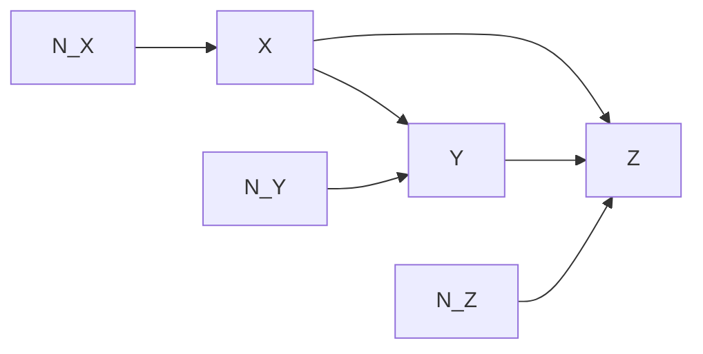
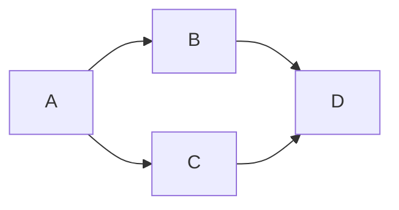
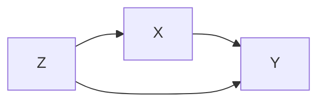

# 因果推理 原理与代码实例讲解

## 1. 背景介绍

### 1.1 什么是因果推理?

因果推理是指从观察到的数据中推断出因果关系的过程。它试图回答"为什么会发生这种情况?"和"如果改变某些条件会产生什么结果?"这样的问题。在许多领域中,如医学、经济学、社会科学等,理解变量之间的因果关系对于做出正确的决策至关重要。

### 1.2 为什么因果推理很重要?

传统的机器学习算法主要关注相关性,但相关性并不意味着因果关系。例如,气温升高和冰淇淋销量增加之间存在相关性,但气温升高并不是导致冰淇淋销量增加的原因。相反,两者都是受到第三个因素(天气变暖)的影响。因此,仅依赖相关性可能会导致错误的决策。

另一方面,因果推理可以帮助我们了解干预的影响。如果我们知道某个因素是导致结果的原因,那么改变该因素就可能改变结果。这在决策过程中非常有用,例如制定有效的政策或开发新的治疗方法。

### 1.3 因果推理的挑战

尽管因果推理极其重要,但推断因果关系并非易事。主要挑战包括:

1. **遵循规则**: 确定哪些规则可以从观察到的数据中推断出有效的因果关系。
2. **混杂因素**: 处理可能影响因果关系的混杂因素,如未观测到的变量。
3. **反事实推理**: 推断在不同情况下会发生什么,即使这些情况在现实中并未发生。
4. **因果机制**: 理解导致某种现象发生的潜在机制或过程。

## 2. 核心概念与联系

### 2.1 关键概念

以下是一些与因果推理相关的关键概念:

1. **结构因果模型(SCM)**: 使用图形结构(如有向无环图或贝叶斯网络)和一组方程来表示因果关系的框架。
2. **d-分离**: 在给定的图形结构中,判断两个变量是否在给定的条件下是条件独立的标准。
3. **后门准则**: 确定在给定的图形结构中,什么样的条件可以识别出因果效应的标准。
4. **反事实推理**: 推断在不同情况下会发生什么,即使这些情况在现实中并未发生。
5. **结构化干预**: 在因果模型中,通过改变某些变量的值来模拟干预的影响。
6. **因果等价类**: 具有相同条件独立性关系的多个图形结构的集合。

### 2.2 核心联系

这些概念之间存在着紧密的联系:

1. **结构因果模型(SCM)** 提供了一种表示和推理因果关系的框架。
2. **d-分离** 是在给定的 SCM 中判断条件独立性的标准,有助于识别可能的因果路径。
3. **后门准则** 利用 d-分离 和 SCM 来确定可以识别出因果效应的条件。
4. **反事实推理** 是在 SCM 中通过改变某些变量的值来模拟干预的影响,从而推断在不同情况下会发生什么。
5. **结构化干预** 是在 SCM 中实现反事实推理的一种方式。
6. **因果等价类** 有助于从有限的观察数据中推断出潜在的 SCM。

通过将这些概念结合起来,我们可以建立因果模型,推断因果关系,并预测干预的影响。

## 3. 核心算法原理具体操作步骤

### 3.1 结构因果模型(SCM)

结构因果模型(SCM)是一种用于表示和推理因果关系的框架。它由两个部分组成:

1. **结构方程**: 一组确定性方程,描述每个变量如何由其他变量和一个外部噪声项决定。
2. **因果图**: 一个有向无环图,节点表示变量,边表示直接的因果影响。

例如,考虑以下 SCM:

$$
X = N_X \\
Y = f_Y(X) + N_Y \\
Z = f_Z(X, Y) + N_Z
$$

其中 $N_X$、$N_Y$ 和 $N_Z$ 是外部噪声项,代表未观测到的因素。相应的因果图如下:



在这个模型中,$X$ 是 $Y$ 和 $Z$ 的原因,$Y$ 也是 $Z$ 的原因。我们可以使用这个模型来推断干预的影响,例如,如果我们干预 $X$,那么 $Y$ 和 $Z$ 也会受到影响。

### 3.2 d-分离和后门准则

**d-分离** 是在给定的因果图中判断条件独立性的标准。它基于以下思想:如果两个变量之间的所有路径都被一组条件变量阻塞(或"d-分离"),那么在给定这些条件变量的情况下,这两个变量就是条件独立的。

**后门准则** 利用 d-分离 来确定在什么条件下可以识别出因果效应。具体来说,如果在给定一组条件变量的情况下,原因变量和结果变量之间的所有"后门路径"都被阻塞,那么就可以识别出原因对结果的因果效应。

例如,在上面的 SCM 中,要识别 $X$ 对 $Z$ 的因果效应,我们需要阻塞 $X \rightarrow Z$ 路径上的后门路径 $X \leftarrow N_X \rightarrow Y \rightarrow Z$。通过给定 $Y$ 作为条件变量,这条路径就被阻塞了,因此我们可以识别出 $X$ 对 $Z$ 的因果效应。

### 3.3 反事实推理和结构化干预

**反事实推理** 是推断在不同情况下会发生什么的过程,即使这些情况在现实中并未发生。在 SCM 中,我们可以通过 **结构化干预** 来实现反事实推理。

结构化干预是指在 SCM 中,通过改变某些变量的值来模拟干预的影响。具体来说,我们将原始的结构方程替换为新的方程,其中被干预的变量被赋予一个固定值或由一个新的函数决定。

例如,在上面的 SCM 中,如果我们想推断在 $X=x'$ 的情况下 $Z$ 会是什么值,我们可以进行以下干预:

$$
X = x' \\
Y = f_Y(x') + N_Y \\
Z = f_Z(x', Y) + N_Z
$$

通过计算这个新的 SCM,我们就可以推断在 $X=x'$ 的情况下 $Z$ 的值。这种推理过程被称为反事实推理,因为它推断了一种在现实中并未发生的情况。

## 4. 数学模型和公式详细讲解举例说明

在因果推理中,常常使用概率论和图论的概念和方法。以下是一些重要的数学模型和公式:

### 4.1 贝叶斯网络

贝叶斯网络是一种用于表示概率分布的图形模型,它由一个有向无环图和一组条件概率分布组成。在因果推理中,贝叶斯网络可以用来表示结构因果模型(SCM)。

在一个贝叶斯网络中,每个节点表示一个随机变量,边表示变量之间的条件依赖关系。给定一个节点的父节点,该节点的条件概率分布就可以被确定。因此,整个联合概率分布可以被分解为一系列条件概率分布的乘积:

$$
P(X_1, X_2, \ldots, X_n) = \prod_{i=1}^n P(X_i | \text{Parents}(X_i))
$$

其中 $\text{Parents}(X_i)$ 表示 $X_i$ 的父节点。

例如,考虑以下贝叶斯网络:



该网络的联合概率分布可以写为:

$$
P(A, B, C, D) = P(A)P(B|A)P(C|A)P(D|B,C)
$$

贝叶斯网络为因果推理提供了一种紧凑的表示和高效的推理算法。

### 4.2 d-分离和后门准则

如前所述,**d-分离** 是在给定的因果图中判断条件独立性的标准。形式上,如果在给定一组条件变量 $\mathbf{Z}$ 的情况下,两个变量 $X$ 和 $Y$ 之间的所有无向路径都被阻塞,那么 $X$ 和 $Y$ 就是在 $\mathbf{Z}$ 的条件下相互独立的,记作 $(X \perp Y | \mathbf{Z})$。

**后门准则** 利用 d-分离 来确定在什么条件下可以识别出因果效应。具体来说,如果在给定一组条件变量 $\mathbf{Z}$ 的情况下,原因变量 $X$ 和结果变量 $Y$ 之间的所有"后门路径"都被阻塞,那么就可以识别出 $X$ 对 $Y$ 的因果效应,记作 $(X \rightarrow Y | \mathbf{Z})$。

例如,在以下因果图中:



要识别 $X$ 对 $Y$ 的因果效应,我们需要阻塞后门路径 $X \leftarrow Z \rightarrow Y$。通过给定 $Z$ 作为条件变量,这条路径就被阻塞了,因此我们可以写出 $(X \rightarrow Y | Z)$。

### 4.3 反事实推理和结构化干预

**反事实推理** 是推断在不同情况下会发生什么的过程,即使这些情况在现实中并未发生。在结构因果模型(SCM)中,我们可以通过 **结构化干预** 来实现反事实推理。

结构化干预是指在 SCM 中,通过改变某些变量的值来模拟干预的影响。具体来说,我们将原始的结构方程替换为新的方程,其中被干预的变量被赋予一个固定值或由一个新的函数决定。

设 $\mathbf{X}$ 是一组变量,其中 $X_i$ 由以下结构方程决定:

$$
X_i = f_i(PA_i, N_i)
$$

其中 $PA_i$ 是 $X_i$ 的父节点,而 $N_i$ 是外部噪声项。

现在,假设我们想推断在 $X_j = x_j'$ 的情况下其他变量的值。我们可以进行以下干预:

$$
X_j = x_j' \\
X_i = f_i(PA_i^{x_j'}, N_i) \quad \text{for } i \neq j
$$

其中 $PA_i^{x_j'}$ 表示在 $X_j = x_j'$ 的情况下,变量 $X_i$ 的父节点的值。通过计算这个新的 SCM,我们就可以推断在 $X_j = x_j'$ 的情况下其他变量的值。

这种推理过程被称为反事实推理,因为它推断了一种在现实中并未发生的情况。它在决策过程中非常有用,因为它可以帮助我们预测干预的影响。

## 5. 项目实践:代码实例和详细解释说明

在这一部分,我们将通过一个实际的代码示例来展示如何实现因果推理。我们将使用 Python 中的 CausalNex 库,这是一个用于因果推理和决策的开源库。

### 5.1 安装 CausalNex

首先,我们需要安装 CausalNex 库。您可以使用 pip 进行安装:

```
pip install causalnex
```

### 5.2 构建结构因果模型

让我们考虑一个简单的例子,涉及三个变量:吸烟习惯 (S)、肺癌 (L) 和染色体异常 (A)。我们可以用以下结构因果模型来表示它们之间的关系:

```python
import causalnex.structure.data_generators as dgs
import causalnex.plots as plots

# 定义结构方程
equations = [
    "A := rnormal(0, 1)",
    "S := rnormal(0, 1)",
    "L := 0.5 * A + 0.5 * S