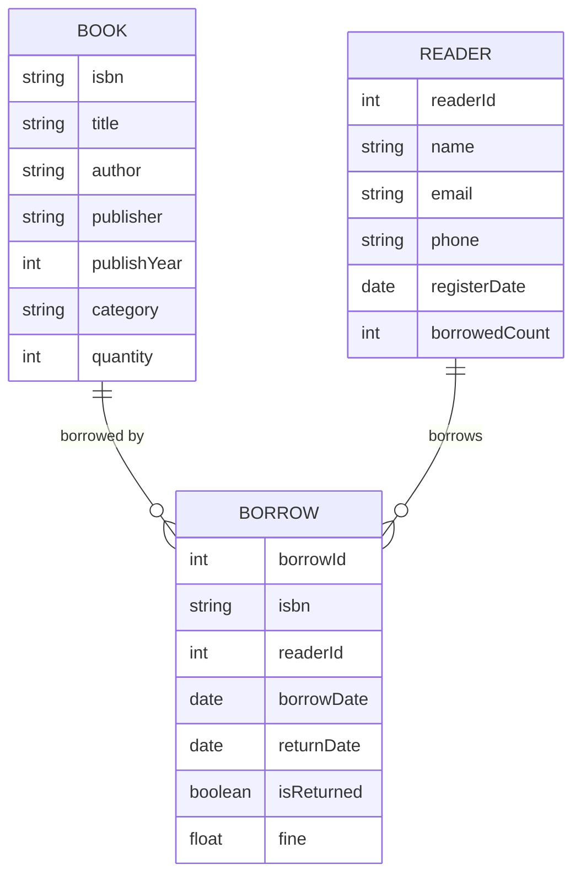
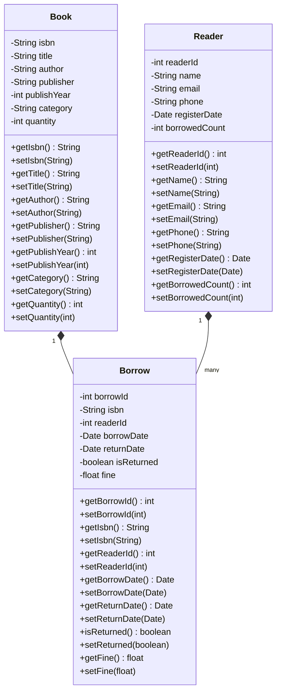

# 图书租借管理系统详细设计与具体代码实现

作者：禅与计算机程序设计艺术

## 1. 背景介绍
图书租借管理系统是现代图书馆管理的重要组成部分。它能够有效地管理图书的借阅、归还、查询等操作,提高图书馆的工作效率和服务质量。本文将详细介绍图书租借管理系统的设计与实现。

### 1.1 图书租借管理系统的意义
#### 1.1.1 提高图书馆管理效率
#### 1.1.2 方便读者借阅图书
#### 1.1.3 减少人工操作失误

### 1.2 图书租借管理系统的功能需求
#### 1.2.1 图书信息管理
#### 1.2.2 读者信息管理  
#### 1.2.3 图书借阅管理
#### 1.2.4 图书归还管理
#### 1.2.5 逾期罚款管理
#### 1.2.6 图书查询统计

## 2. 核心概念与联系
### 2.1 实体关系图


### 2.2 类图设计


## 3. 核心算法原理具体操作步骤
### 3.1 图书查询算法
#### 3.1.1 顺序查找
#### 3.1.2 二分查找
#### 3.1.3 索引查找

### 3.2 借阅信息排序算法  
#### 3.2.1 冒泡排序
#### 3.2.2 选择排序
#### 3.2.3 插入排序
#### 3.2.4 快速排序

### 3.3 逾期罚款计算算法
逾期罚款的计算公式为:
$$
Fine = (\text{归还日期} - \text{应还日期}) \times \text{日罚金额}
$$
其中,$\text{归还日期}$为实际归还图书的日期,$\text{应还日期}$为应当归还图书的日期,$\text{日罚金额}$为每逾期一天的罚金数额。

具体计算步骤如下:
1. 获取图书的借阅记录
2. 计算$\text{归还日期} - \text{应还日期}$得到逾期天数$\text{OverdueDays}$
3. 若$\text{OverdueDays} \leq 0$,则$\text{Fine} = 0$
4. 若$\text{OverdueDays} > 0$,则$\text{Fine} = \text{OverdueDays} \times \text{日罚金额}$
5. 将罚金数额$\text{Fine}$记录到借阅记录中

## 4. 项目实践：代码实例和详细解释说明
下面是图书租借管理系统的核心代码实现。本项目使用Java语言,采用Spring Boot框架和MySQL数据库。

### 4.1 数据库表设计
```sql
CREATE TABLE `book` (
  `isbn` varchar(20) NOT NULL,
  `title` varchar(100) NOT NULL,
  `author` varchar(100) DEFAULT NULL,
  `publisher` varchar(100) DEFAULT NULL,
  `publish_year` int(11) DEFAULT NULL,
  `category` varchar(50) DEFAULT NULL,
  `quantity` int(11) NOT NULL,
  PRIMARY KEY (`isbn`)
) ENGINE=InnoDB DEFAULT CHARSET=utf8;

CREATE TABLE `reader` (
  `reader_id` int(11) NOT NULL AUTO_INCREMENT,
  `name` varchar(50) NOT NULL,
  `email` varchar(100) DEFAULT NULL,
  `phone` varchar(20) DEFAULT NULL,
  `register_date` date NOT NULL,
  `borrowed_count` int(11) NOT NULL DEFAULT '0',
  PRIMARY KEY (`reader_id`)
) ENGINE=InnoDB DEFAULT CHARSET=utf8;

CREATE TABLE `borrow` (
  `borrow_id` int(11) NOT NULL AUTO_INCREMENT,
  `isbn` varchar(20) NOT NULL,
  `reader_id` int(11) NOT NULL,
  `borrow_date` date NOT NULL,
  `return_date` date DEFAULT NULL,
  `is_returned` tinyint(1) NOT NULL DEFAULT '0',
  `fine` float NOT NULL DEFAULT '0',
  PRIMARY KEY (`borrow_id`),
  KEY `fk_borrow_book` (`isbn`),
  KEY `fk_borrow_reader` (`reader_id`),
  CONSTRAINT `fk_borrow_book` FOREIGN KEY (`isbn`) REFERENCES `book` (`isbn`),
  CONSTRAINT `fk_borrow_reader` FOREIGN KEY (`reader_id`) REFERENCES `reader` (`reader_id`)
) ENGINE=InnoDB DEFAULT CHARSET=utf8;
```

### 4.2 实体类设计
#### 4.2.1 Book类
```java
public class Book {
    private String isbn;
    private String title;
    private String author;
    private String publisher;
    private Integer publishYear;
    private String category;
    private Integer quantity;
    
    // 省略getter和setter方法
}
```

#### 4.2.2 Reader类
```java
public class Reader {
    private Integer readerId;
    private String name;
    private String email;
    private String phone;
    private Date registerDate;
    private Integer borrowedCount;
    
    // 省略getter和setter方法
}
```

#### 4.2.3 Borrow类
```java
public class Borrow {
    private Integer borrowId;
    private String isbn;
    private Integer readerId;
    private Date borrowDate;
    private Date returnDate;
    private Boolean isReturned;
    private Float fine;
    
    // 省略getter和setter方法
}
```

### 4.3 数据访问层设计
#### 4.3.1 BookMapper接口
```java
@Mapper
public interface BookMapper {
    @Select("SELECT * FROM book WHERE isbn = #{isbn}")
    Book selectByIsbn(String isbn);
    
    @Select("SELECT * FROM book")
    List<Book> selectAll();
    
    @Insert("INSERT INTO book(isbn, title, author, publisher, publish_year, category, quantity) " +
            "VALUES (#{isbn}, #{title}, #{author}, #{publisher}, #{publishYear}, #{category}, #{quantity})")
    int insert(Book book);
    
    @Update("UPDATE book SET title=#{title}, author=#{author}, publisher=#{publisher}, " + 
            "publish_year=#{publishYear}, category=#{category}, quantity=#{quantity} WHERE isbn=#{isbn}")
    int update(Book book);
    
    @Delete("DELETE FROM book WHERE isbn =#{isbn}")
    int deleteByIsbn(String isbn);
}
```

#### 4.3.2 ReaderMapper接口
```java
@Mapper
public interface ReaderMapper {
    @Select("SELECT * FROM reader WHERE reader_id = #{readerId}")
    Reader selectByReaderId(Integer readerId);
    
    @Select("SELECT * FROM reader")
    List<Reader> selectAll();
    
    @Insert("INSERT INTO reader(name, email, phone, register_date) " +
            "VALUES (#{name}, #{email}, #{phone}, #{registerDate})")
    @Options(useGeneratedKeys = true, keyProperty = "readerId")
    int insert(Reader reader);
    
    @Update("UPDATE reader SET name=#{name}, email=#{email}, phone=#{phone}, " +
            "register_date=#{registerDate}, borrowed_count=#{borrowedCount} WHERE reader_id=#{readerId}")  
    int update(Reader reader);
    
    @Delete("DELETE FROM reader WHERE reader_id =#{readerId}")
    int deleteByReaderId(Integer readerId);
}
```

#### 4.3.3 BorrowMapper接口
```java
@Mapper
public interface BorrowMapper {
    @Select("SELECT * FROM borrow WHERE borrow_id = #{borrowId}")
    Borrow selectByBorrowId(Integer borrowId);
    
    @Select("SELECT * FROM borrow WHERE isbn = #{isbn}")
    List<Borrow> selectByIsbn(String isbn);
    
    @Select("SELECT * FROM borrow WHERE reader_id = #{readerId}")
    List<Borrow> selectByReaderId(Integer readerId);
    
    @Insert("INSERT INTO borrow(isbn, reader_id, borrow_date) " +
            "VALUES (#{isbn}, #{readerId}, #{borrowDate})")  
    @Options(useGeneratedKeys = true, keyProperty = "borrowId")
    int insert(Borrow borrow);
    
    @Update("UPDATE borrow SET isbn=#{isbn}, reader_id=#{readerId}, borrow_date=#{borrowDate}, " +
            "return_date=#{returnDate}, is_returned=#{isReturned}, fine=#{fine} WHERE borrow_id=#{borrowId}")
    int update(Borrow borrow);
    
    @Delete("DELETE FROM borrow WHERE borrow_id =#{borrowId}")
    int deleteByBorrowId(Integer borrowId);
}
```

### 4.4 业务逻辑层设计
#### 4.4.1 BookService接口与实现
```java
public interface BookService {
    Book getBookByIsbn(String isbn);
    List<Book> getAllBooks();
    boolean addBook(Book book);
    boolean updateBook(Book book);
    boolean deleteBook(String isbn);
}

@Service
public class BookServiceImpl implements BookService {
    @Autowired
    private BookMapper bookMapper;
    
    @Override
    public Book getBookByIsbn(String isbn) {
        return bookMapper.selectByIsbn(isbn);
    }
    
    @Override
    public List<Book> getAllBooks() {
        return bookMapper.selectAll();
    }
    
    @Override
    public boolean addBook(Book book) {
        return bookMapper.insert(book) > 0;
    }
    
    @Override
    public boolean updateBook(Book book) {
        return bookMapper.update(book) > 0;
    }
    
    @Override
    public boolean deleteBook(String isbn) {
        return bookMapper.deleteByIsbn(isbn) > 0;
    }
}
```

#### 4.4.2 ReaderService接口与实现
```java
public interface ReaderService {
    Reader getReaderById(Integer readerId);
    List<Reader> getAllReaders();
    boolean addReader(Reader reader);
    boolean updateReader(Reader reader);
    boolean deleteReader(Integer readerId);
}

@Service
public class ReaderServiceImpl implements ReaderService {
    @Autowired
    private ReaderMapper readerMapper;
    
    @Override
    public Reader getReaderById(Integer readerId) {
        return readerMapper.selectByReaderId(readerId);
    }
    
    @Override
    public List<Reader> getAllReaders() {
        return readerMapper.selectAll();
    }
    
    @Override
    public boolean addReader(Reader reader) {
        return readerMapper.insert(reader) > 0;
    }
    
    @Override
    public boolean updateReader(Reader reader) {
        return readerMapper.update(reader) > 0;
    }
    
    @Override
    public boolean deleteReader(Integer readerId) {
        return readerMapper.deleteByReaderId(readerId) > 0;
    }
}
```

#### 4.4.3 BorrowService接口与实现
```java
public interface BorrowService {
    Borrow getBorrowById(Integer borrowId);
    List<Borrow> getBorrowsByIsbn(String isbn);
    List<Borrow> getBorrowsByReaderId(Integer readerId);
    boolean addBorrow(Borrow borrow);
    boolean updateBorrow(Borrow borrow);
    boolean deleteBorrow(Integer borrowId);
    float calculateFine(Borrow borrow, float dailyFine);
}

@Service
public class BorrowServiceImpl implements BorrowService {
    @Autowired
    private BorrowMapper borrowMapper;
    
    @Override
    public Borrow getBorrowById(Integer borrowId) {
        return borrowMapper.selectByBorrowId(borrowId);
    }
    
    @Override
    public List<Borrow> getBorrowsByIsbn(String isbn) {
        return borrowMapper.selectByIsbn(isbn);
    }
    
    @Override
    public List<Borrow> getBorrowsByReaderId(Integer readerId) {
        return borrowMapper.selectByReaderId(readerId);
    }
    
    @Override
    public boolean addBorrow(Borrow borrow) {
        return borrowMapper.insert(borrow) > 0;
    }
    
    @Override
    public boolean updateBorrow(Borrow borrow) {
        return borrowMapper.update(borrow) > 0;
    }
    
    @Override
    public boolean deleteBorrow(Integer borrowId) {
        