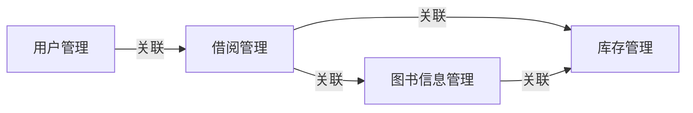

## 1.背景介绍

在现代社会，图书馆是一个重要的知识资源库，它们提供了大量的信息和知识，对于学术研究和个人学习都有着不可替代的作用。然而，随着图书馆藏书量的增加，人工管理图书的效率和准确性面临着巨大的挑战。因此，设计并实现一个高效、便捷的图书管理系统显得尤为重要。

## 2.核心概念与联系

图书管理系统主要涉及到的核心概念有：图书信息管理、用户管理、借阅管理、库存管理等。这些概念之间存在着紧密的联系。例如，用户进行借阅操作时，需要通过图书信息管理找到所需图书，然后通过借阅管理完成借阅过程，同时，库存管理需要根据借阅情况更新图书库存。



## 3.核心算法原理具体操作步骤

设计图书管理系统的核心算法主要包括图书信息的检索算法、借阅管理的算法以及库存管理的算法。

图书信息的检索算法主要是通过图书的ISBN、书名、作者等信息进行检索。一般采用哈希表或者BST（Binary Search Tree）进行存储和检索，这样可以保证在大量数据中快速高效地找到所需图书。

借阅管理的算法主要涉及到借阅、归还和续借等操作。借阅和归还操作需要修改用户的借阅记录以及图书的库存信息，续借操作则需要检查图书的状态和用户的借阅权限。

库存管理的算法主要是对图书的数量进行管理。当图书被借阅或归还时，需要相应地增加或减少库存数量。同时，还需要定期检查库存，对于库存过低的图书进行采购。

## 4.数学模型和公式详细讲解举例说明

在图书管理系统中，我们可以使用一些数学模型和公式来帮助我们进行分析和计算。

例如，我们可以使用排队论的模型来分析用户的借阅需求。假设用户到达图书馆的借阅窗口的时间间隔服从泊松分布，即到达时间的概率密度函数为：

$$
f(x) = \lambda e^{-\lambda x}
$$

其中，$\lambda$ 是用户到达的平均速率。

借阅窗口的服务时间我们假设服从指数分布，即服务时间的概率密度函数为：

$$
f(x) = \mu e^{-\mu x}
$$

其中，$\mu$ 是服务的平均速率。

通过这两个公式，我们可以计算出系统的平均排队长度、平均等待时间等指标，从而为图书馆的运营提供决策支持。

## 5.项目实践：代码实例和详细解释说明

下面我们以Java语言为例，简单实现一下图书信息管理的部分功能。

```java
class Book {
    String ISBN;
    String title;
    String author;
    int stock;
    // 省略构造方法和getter/setter方法
}

class Library {
    Map<String, Book> books = new HashMap<>();

    public void addBook(Book book) {
        books.put(book.getISBN(), book);
    }

    public Book findBookByISBN(String ISBN) {
        return books.get(ISBN);
    }
}
```

在这个简单的例子中，我们定义了一个Book类来表示图书信息，包括ISBN、书名、作者和库存等属性。然后我们定义了一个Library类来表示图书馆，其中使用了一个HashMap来存储图书信息，可以通过ISBN快速查找到图书。

## 6.实际应用场景

图书管理系统广泛应用于各类图书馆、书店以及学校等场所。通过图书管理系统，工作人员可以方便地管理图书信息，用户也可以方便地找到所需图书，大大提高了工作效率和用户满意度。

## 7.工具和资源推荐

在开发图书管理系统时，我们可以使用一些工具和资源来提高开发效率。例如，我们可以使用数据库管理系统（如MySQL、Oracle等）来存储图书和用户信息，使用后端开发框架（如Spring Boot、Django等）来实现业务逻辑，使用前端开发框架（如React、Vue等）来实现用户界面。

## 8.总结：未来发展趋势与挑战

随着技术的发展，图书管理系统也将面临新的发展趋势和挑战。例如，未来的图书管理系统可能会采用更先进的技术，如人工智能和大数据，来提高管理效率和用户体验。同时，随着用户需求的多样化和个性化，如何设计出满足用户需求的图书管理系统也将是一个挑战。

## 9.附录：常见问题与解答

Q: 图书管理系统中如何处理图书丢失的情况？

A: 在图书丢失的情况下，我们需要首先确认图书的丢失情况，然后在系统中标记该图书为丢失状态，并从库存中减去该图书。同时，我们还需要根据图书馆的规定，对丢失图书的用户进行相应的处理，如罚款等。

Q: 如何处理图书馆的开放时间和用户的借阅时间？

A: 我们可以在系统中设置图书馆的开放时间，并在用户进行借阅操作时，检查当前时间是否在开放时间内。如果不在开放时间内，我们可以拒绝用户的借阅请求。

作者：禅与计算机程序设计艺术 / Zen and the Art of Computer Programming