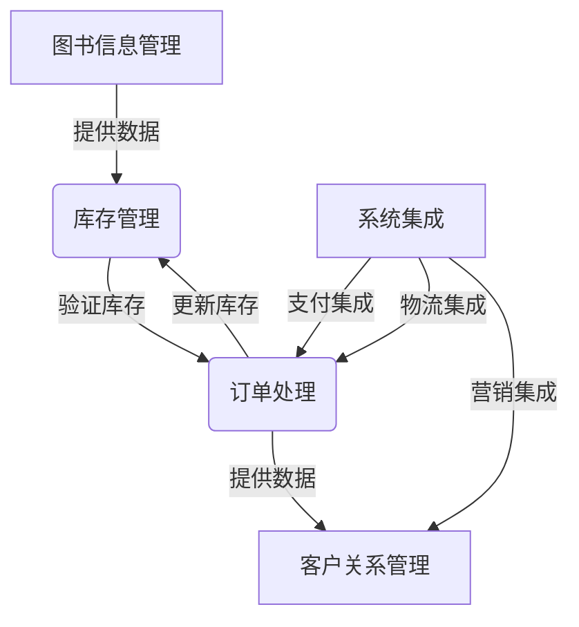

# 图书销售管理系统详细设计与具体代码实现

## 1.背景介绍

### 1.1 图书销售管理系统概述

在当今时代,图书销售已经成为一个不可或缺的重要产业。无论是实体书店还是在线书城,都需要一个高效、可靠的管理系统来确保业务的顺利运行。图书销售管理系统旨在简化和自动化图书销售的各个环节,包括库存管理、订单处理、客户关系管理等,从而提高工作效率,降低运营成本,并为客户提供更好的购物体验。

### 1.2 系统的必要性

传统的手工管理方式已经无法满足现代图书销售业务的需求。手工管理不仅效率低下,而且容易出现人为错误,导致库存数据不准确、订单处理延迟等问题。因此,开发一个自动化的图书销售管理系统变得迫在眉睫。该系统可以实现以下目标:

- 精准跟踪库存水平,及时补货
- 自动化订单处理流程,提高响应速度
- 收集和分析销售数据,优化业务策略
- 建立客户档案,改善客户服务质量
- 集成多种支付渠道,提升购物体验

### 1.3 系统架构概览

图书销售管理系统通常采用客户端-服务器(Client-Server)架构,其中:

- **客户端**: 提供图形用户界面(GUI),允许用户(如销售人员、管理员等)与系统进行交互,执行各种操作。
- **服务器**: 负责处理业务逻辑、存储和管理数据、与外部系统集成等核心功能。

服务器端通常包括以下几个主要模块:

- **Web服务模块**: 提供RESTful API接口,供客户端和其他系统访问。
- **业务逻辑模块**: 实现系统的核心功能,如库存管理、订单处理等。
- **数据访问模块**: 负责与数据库进行交互,执行数据持久化操作。
- **外部系统集成模块**: 与第三方支付系统、物流系统等进行集成。

该架构具有良好的扩展性和可维护性,可以根据需求进行模块化开发和部署。

## 2.核心概念与联系

### 2.1 图书信息管理

图书信息是整个系统的核心数据,包括书名、作者、出版社、ISBN号、价格等基本信息,以及库存数量等动态信息。精确管理图书信息对于确保销售过程的顺利进行至关重要。

### 2.2 库存管理

库存管理模块负责跟踪每种图书的库存水平,并在库存量低于设定阈值时自动发出补货请求。准确的库存数据可以避免因缺货而导致的订单延迟或无法履行的情况。

### 2.3 订单处理

订单处理是系统的另一个核心功能。当客户下单购买图书时,系统需要自动执行以下步骤:

1. 验证库存充足性
2. 计算订单总额
3. 处理支付
4. 更新库存记录
5. 安排发货
6. 跟踪订单状态

高效的订单处理流程可以提升客户满意度,增强企业竞争力。

### 2.4 客户关系管理

建立完善的客户档案有助于企业更好地了解客户需求,并提供个性化服务。系统应当记录客户的购买历史、偏好等信息,以便进行精准营销。同时,客户也可以通过系统查看订单状态、获取发货通知等。

### 2.5 系统集成

为了提供无缝的购物体验,图书销售管理系统需要与多个外部系统进行集成,例如:

- 支付系统(如银行网关、在线支付平台等)
- 物流系统(用于安排发货和跟踪物流状态)
- 营销系统(用于发送促销信息和优惠券)

通过系统集成,可以实现业务流程的自动化和优化。

### 2.6 核心概念关系

上述核心概念相互关联、环环相扣,构成了图书销售管理系统的完整业务流程。准确的图书信息是库存管理的基础;库存数据又是订单处理的前提条件;订单信息需要更新库存记录,并为客户关系管理提供数据支持;系统集成则贯穿于整个流程,确保各个环节的高效运转。

## 3.核心算法原理具体操作步骤

### 3.1 库存管理算法

#### 3.1.1 库存阈值算法

为了确保库存水平的合理性,系统需要设置适当的库存阈值。当某种图书的库存量低于该阈值时,系统将自动发出补货请求。阈值的计算需要综合考虑多个因素,包括:

- 历史销售数据(按周期、按季节等)
- 供应链效率(补货所需时间)
- 安全库存水平
- 存储空间限制

可以使用以下公式计算库存阈值:

$$
阈值 = 安全库存 + 补货周期 \times 预计需求量
$$

其中:

- 安全库存是为应对需求波动而设置的最低库存量
- 补货周期是从发出补货请求到实际到货所需的时间
- 预计需求量是根据历史数据预测的未来一段时间的销售量

该算法可以动态调整阈值,以适应不同时期的需求变化,从而优化库存水平。

#### 3.1.2 补货策略

一旦库存量低于阈值,系统需要决定补货数量。通常有两种补货策略:

1. **固定批量补货**:每次补货时,补足到一个固定的目标库存量。
2. **动态补货**:根据预测的未来需求量动态计算补货数量。

动态补货策略的优势在于可以更好地控制库存成本,避免过度库存或缺货的风险。其计算公式如下:

$$
补货量 = 目标库存量 - 当前库存量
$$

$$
目标库存量 = 安全库存 + 补货周期 \times 预计需求量
$$

其中,预计需求量可以使用时间序列分析或机器学习算法(如ARIMA模型、神经网络等)进行预测。

### 3.2 订单处理算法

#### 3.2.1 订单验证

在接受订单之前,系统需要执行以下验证步骤:

1. 检查所订购图书的库存量是否足够
2. 验证客户提供的支付信息(如信用卡号、账号余额等)是否有效
3. 根据购物车中的商品计算订单总额

如果任何一个步骤验证失败,订单将被拒绝,并向客户返回相应的错误信息。

#### 3.2.2 支付处理

对于有效订单,系统需要与支付系统进行集成,以处理支付流程。常见的支付方式包括:

- 信用卡/借记卡支付
- 网上银行转账
- 电子钱包支付(如PayPal、Alipay等)

支付处理算法的核心步骤包括:

1. 构建支付请求数据,包括订单信息、金额、支付方式等
2. 调用支付系统的API接口,发送支付请求
3. 等待支付系统的响应,获取支付结果
4. 根据支付结果,更新订单状态并通知客户

为了确保支付安全,算法还需要执行以下操作:

- 加密敏感数据(如信用卡号)
- 验证支付请求的完整性和来源
- 记录支付日志,以便追查和审计

#### 3.2.3 物流安排

对于已支付的订单,系统需要与物流系统集成,安排发货流程。算法的主要步骤包括:

1. 根据客户地址,选择最佳的发货仓库
2. 计算运费,并将其加入订单总额
3. 生成运单信息,包括收件人地址、订单明细等
4. 调用物流系统API,预约取件和发货
5. 获取物流跟踪号,更新订单状态
6. 向客户发送发货通知和跟踪链接

为了提高物流效率,算法可以考虑以下优化策略:

- 根据地理位置和订单量,合理布局发货仓库
- 与多家物流公司合作,选择最优的运输方案
- 对于大宗订单,安排专车直送服务

### 3.3 客户关系管理算法

#### 3.3.1 客户分析

通过分析客户的购买记录和偏好,系统可以为企业制定更有效的营销策略。常用的客户分析算法包括:

1. **RFM模型**:根据客户的最近一次购买时间(Recency)、购买频率(Frequency)和购买金额(Monetary)对客户进行打分和分类。
2. **协同过滤算法**:基于客户的历史购买记录,推荐与其兴趣相似的其他商品。
3. **关联规则挖掘**:发现客户购买行为中的关联模式,例如"购买A类图书的客户往往也会购买B类图书"。

这些算法的输出可以用于:

- 制定个性化的营销活动和优惠策略
- 推荐感兴趣的图书或相关产品
- 优化网站内容和布局,提升转化率

#### 3.3.2 客户服务优化

除了营销方面的优化,系统还应当为客户提供高质量的服务体验。可以采用以下策略:

1. **自动问答系统**:基于自然语言处理技术,解答客户的常见问题。
2. **智能路由**:根据客户的问题类型和优先级,将客户请求路由到合适的服务人员。
3. **服务质量评估**:收集客户反馈,评估服务质量,持续改进服务流程。

通过优化客户服务,企业可以提高客户满意度和忠诚度,从而获得更多的回头客和口碑营销效应。

## 4.数学模型和公式详细讲解举例说明

在图书销售管理系统中,数学模型和公式在多个环节发挥着重要作用,如库存管理、需求预测、定价策略等。本节将详细讲解其中几个核心模型和公式。

### 4.1 时间序列分析与需求预测

准确预测未来的需求量对于制定库存策略至关重要。时间序列分析是一种常用的需求预测方法,它利用历史数据中的模式和趋势来预测未来值。

#### 4.1.1 移动平均法

移动平均法是一种简单但有效的预测方法,它通过计算最近几个时间点的平均值来预测下一个时间点的值。公式如下:

$$
F_{t+1} = \frac{1}{n}\sum_{i=t-n+1}^{t}D_i
$$

其中:

- $F_{t+1}$是对时间点$t+1$的需求量的预测值
- $D_i$是时间点$i$的实际需求量
- $n$是计算移动平均值时考虑的最近$n$个时间点

移动平均法适用于需求量呈现稳定趋势的情况,但对于存在明显季节性或周期性的需求模式,它的预测精度会受到影响。

#### 4.1.2 指数平滑法

指数平滑法是一种更加灵活的预测方法,它不仅考虑最近的观测值,而且也赋予更早期的观测值一定的权重。公式如下:

$$
F_{t+1} = \alpha D_t + (1 - \alpha)F_t
$$

其中:

- $F_{t+1}$是对时间点$t+1$的需求量的预测值
- $D_t$是时间点$t$的实际需求量
- $F_t$是对时间点$t$的需求量的预测值
- $\alpha$是平滑系数,取值范围为$0 < \alpha < 1$

平滑系数$\alpha$决定了模型对最新观测值和历史预测值的权重分配。较大的$\alpha$值意味着模型更加重视最新的观测值,反之则更加重视历史预测值。通常需要根据具体数据特征调整$\alpha$值以获得最佳预测效果。