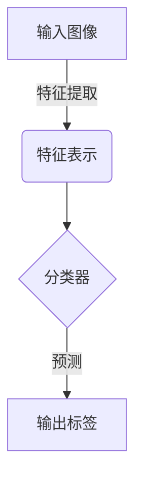
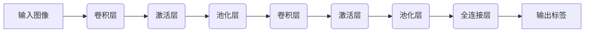

# 图像分类：识别图像中的物体

## 1.背景介绍

### 1.1 图像分类的重要性

在当今数字时代,图像数据的爆炸式增长带来了巨大的机遇和挑战。图像分类作为计算机视觉领域的核心任务之一,其目标是自动识别和分类图像中的物体或场景。它在多个领域发挥着关键作用,例如:

- **自动驾驶**:准确识别道路标志、行人和其他车辆,确保行车安全。
- **医疗诊断**:分析医学影像,检测疾病并辅助诊断。
- **零售业**:自动化商品分类和库存管理。
- **安防监控**:识别可疑物品和人员,提高公共安全。

随着深度学习技术的不断发展,图像分类的准确率和鲁棒性得到了极大提升,使其在越来越多的领域中得到广泛应用。

### 1.2 图像分类的挑战

尽管取得了长足进步,但图像分类仍然面临着诸多挑战:

- **视觉变化**: 同一物体在不同角度、光照、尺度下呈现出极大的视觉差异。
- **背景干扰**: 复杂的背景会干扰目标物体的检测和识别。
- **类内差异**: 同一类别的物体在外观上可能存在较大差异。
- **类间相似性**: 不同类别的物体可能在某些方面相似,导致分类困难。
- **数据不平衡**: 训练数据集中不同类别的样本数量差异较大。

克服这些挑战需要更加强大的算法模型和更加丰富的训练数据。

## 2.核心概念与联系

### 2.1 监督学习与深度学习

图像分类是一个典型的监督学习任务。监督学习的目标是从标注的训练数据中学习出一个映射函数,将输入数据(图像)映射到正确的输出标签(物体类别)。

深度学习是当前图像分类领域的主流方法,它基于多层神经网络模型,能够自动从原始图像数据中提取出高级特征表示,并进行端到端的训练。常用的深度学习模型包括卷积神经网络(CNN)、递归神经网络(RNN)等。

### 2.2 特征提取与分类器

在深度学习模型中,特征提取和分类器是两个关键组成部分:

1. **特征提取器**: 利用卷积、池化等操作从原始图像中提取出多尺度的特征表示,捕获图像的局部和全局模式。
2. **分类器**: 基于提取的特征对图像进行分类,通常使用全连接层实现。

这两部分通过端到端的训练相互促进,特征提取器学习出更加区分性的特征表示,分类器则基于这些特征做出更加准确的预测。



## 3.核心算法原理具体操作步骤

### 3.1 卷积神经网络

卷积神经网络(CNN)是图像分类任务中最常用和最成功的深度学习模型。它的核心思想是通过卷积操作在局部区域提取特征,并通过池化操作对特征进行下采样,从而获得对平移、缩放等变换具有一定鲁棒性的特征表示。

一个典型的CNN模型包括以下几个关键步骤:

1. **卷积层(Convolution Layer)**: 使用多个卷积核在输入图像上滑动,提取出不同的局部特征。
2. **激活层(Activation Layer)**: 通过非线性激活函数(如ReLU)增加模型的表达能力。
3. **池化层(Pooling Layer)**: 对特征图进行下采样,减少特征的空间维度,提高模型的鲁棒性。
4. **全连接层(Fully Connected Layer)**: 将提取的特征映射到最终的分类空间,输出每个类别的置信度得分。

通过堆叠多个卷积层、池化层和全连接层,CNN能够逐层提取出更加抽象和高级的特征表示,最终实现准确的图像分类。



### 3.2 模型训练

CNN模型的训练过程通常采用监督学习的方式,利用大量标注的图像数据进行端到端的优化。具体步骤如下:

1. **数据预处理**: 对输入图像进行标准化、数据增强等预处理,提高模型的泛化能力。
2. **前向传播**: 将预处理后的图像输入到CNN模型中,计算每个类别的预测得分。
3. **损失计算**: 将预测得分与真实标签计算损失函数(如交叉熵损失)。
4. **反向传播**: 利用反向传播算法计算每个参数的梯度。
5. **参数更新**: 使用优化算法(如SGD、Adam)根据梯度更新模型参数。
6. **迭代训练**: 重复上述步骤,直到模型在验证集上的性能不再提升为止。

在训练过程中,还需要注意一些关键技术,如正则化(L1/L2正则、Dropout等)、学习率调度等,以防止过拟合和提高模型的泛化能力。

## 4.数学模型和公式详细讲解举例说明

### 4.1 卷积运算

卷积运算是CNN中最关键的操作之一,它通过在输入特征图上滑动卷积核,提取出局部特征。对于二维图像,卷积运算可以表示为:

$$
S(i, j) = (I * K)(i, j) = \sum_{m}\sum_{n}I(i+m, j+n)K(m, n)
$$

其中:
- $I$是输入特征图
- $K$是卷积核(也称滤波器)
- $S$是输出特征图
- $m$、$n$是卷积核的索引

卷积核的权重在训练过程中会不断更新,以提取出对于分类任务最有区分性的特征。通过堆叠多个卷积层,CNN能够从低级的边缘和纹理特征,逐步提取出更加抽象和高级的语义特征。

### 4.2 池化操作

池化操作的主要目的是减小特征图的空间维度,从而降低计算复杂度并增强模型的鲁棒性。最常用的池化方式是最大池化(Max Pooling),它在局部邻域内选取最大值作为输出:

$$
y_{i,j} = \max_{(m,n) \in R_{i,j}} x_{m,n}
$$

其中:
- $x$是输入特征图
- $y$是输出特征图
- $R_{i,j}$是以$(i,j)$为中心的局部邻域

最大池化能够保留输入特征图中的最显著的响应,同时对于小的平移和形变具有一定的不变性。

### 4.3 softmax分类器

在CNN的最后一层,通常使用softmax分类器将特征映射到每个类别的概率值。对于一个有$K$个类别的分类任务,softmax函数可以表示为:

$$
p(y=k|x) = \frac{e^{z_k}}{\sum_{j=1}^K e^{z_j}}
$$

其中:
- $x$是输入特征向量
- $z_k$是第$k$类的线性得分,即$z_k = w_k^Tx + b_k$
- $p(y=k|x)$是输入$x$属于第$k$类的预测概率

在训练过程中,我们最小化真实标签和预测概率之间的交叉熵损失函数:

$$
J(\theta) = -\frac{1}{N}\sum_{i=1}^N\sum_{k=1}^K y_k^{(i)}\log p(y=k|x^{(i)}; \theta)
$$

其中:
- $\theta$是模型的所有可训练参数
- $N$是训练样本数量
- $y_k^{(i)}$是第$i$个样本属于第$k$类的真实标签(0或1)

通过梯度下降等优化算法,可以不断更新模型参数$\theta$,使损失函数最小化,从而获得更加准确的分类器。

## 5.项目实践:代码实例和详细解释说明

在本节中,我们将使用PyTorch框架,构建一个基于ResNet的图像分类模型,并在CIFAR-10数据集上进行训练和测试。CIFAR-10是一个常用的小型图像分类数据集,包含10个类别,每个类别有6000张32x32的彩色图像。

### 5.1 导入必要的库

```python
import torch
import torchvision
import torchvision.transforms as transforms
import torch.nn as nn
import torch.optim as optim
```

### 5.2 加载和预处理数据

```python
# 定义数据预处理方式
transform = transforms.Compose([
    transforms.RandomHorizontalFlip(), # 随机水平翻转
    transforms.RandomCrop(32, padding=4), # 随机裁剪
    transforms.ToTensor(), # 转换为Tensor
    transforms.Normalize((0.5, 0.5, 0.5), (0.5, 0.5, 0.5)) # 标准化
])

# 加载训练集和测试集
trainset = torchvision.datasets.CIFAR10(root='./data', train=True, download=True, transform=transform)
trainloader = torch.utils.data.DataLoader(trainset, batch_size=128, shuffle=True)

testset = torchvision.datasets.CIFAR10(root='./data', train=False, download=True, transform=transform)
testloader = torch.utils.data.DataLoader(testset, batch_size=100, shuffle=False)
```

### 5.3 定义ResNet模型

```python
class ResidualBlock(nn.Module):
    def __init__(self, in_channels, out_channels, stride=1, downsample=None):
        super(ResidualBlock, self).__init__()
        self.conv1 = nn.Conv2d(in_channels, out_channels, kernel_size=3, stride=stride, padding=1, bias=False)
        self.bn1 = nn.BatchNorm2d(out_channels)
        self.conv2 = nn.Conv2d(out_channels, out_channels, kernel_size=3, stride=1, padding=1, bias=False)
        self.bn2 = nn.BatchNorm2d(out_channels)
        self.relu = nn.ReLU(inplace=True)
        self.downsample = downsample

    def forward(self, x):
        residual = x
        out = self.conv1(x)
        out = self.bn1(out)
        out = self.relu(out)
        out = self.conv2(out)
        out = self.bn2(out)
        if self.downsample:
            residual = self.downsample(x)
        out += residual
        out = self.relu(out)
        return out

class ResNet(nn.Module):
    def __init__(self, block, layers, num_classes=10):
        super(ResNet, self).__init__()
        self.in_channels = 16
        self.conv = nn.Conv2d(3, 16, kernel_size=3, stride=1, padding=1, bias=False)
        self.bn = nn.BatchNorm2d(16)
        self.relu = nn.ReLU(inplace=True)
        self.layer1 = self.make_layer(block, 16, layers[0])
        self.layer2 = self.make_layer(block, 32, layers[1], 2)
        self.layer3 = self.make_layer(block, 64, layers[2], 2)
        self.avg_pool = nn.AvgPool2d(8)
        self.fc = nn.Linear(64, num_classes)

    def make_layer(self, block, out_channels, blocks, stride=1):
        downsample = None
        if (stride != 1) or (self.in_channels != out_channels):
            downsample = nn.Sequential(
                nn.Conv2d(self.in_channels, out_channels, kernel_size=3, stride=stride, padding=1, bias=False),
                nn.BatchNorm2d(out_channels))
        layers = []
        layers.append(block(self.in_channels, out_channels, stride, downsample))
        self.in_channels = out_channels
        for i in range(1, blocks):
            layers.append(block(out_channels, out_channels))
        return nn.Sequential(*layers)

    def forward(self, x):
        out = self.conv(x)
        out = self.bn(out)
        out = self.relu(out)
        out = self.layer1(out)
        out = self.layer2(out)
        out = self.layer3(out)
        out = self.avg_pool(out)
        out = out.view(out.size(0), -1)
        out = self.fc(out)
        return out
```

### 5.4 训练和测试模型

```python
# 定义模型、损失函数和优化器
model = ResNet(Res