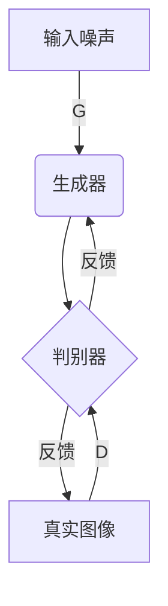
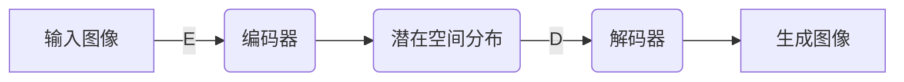

# 《图像生成：深度学习的实验与验证》

## 1.背景介绍

### 1.1 人工智能的崛起

人工智能(Artificial Intelligence, AI)作为一门跨学科的技术,已经逐渐渗透到我们生活的方方面面。在过去的几十年里,AI的发展一直备受关注,尤其是近年来深度学习(Deep Learning)技术的兴起,使得AI的能力得到了前所未有的提升。

### 1.2 图像生成的重要性

在AI的广阔领域中,图像生成是一个非常重要的研究方向。图像不仅是信息的载体,也是人类感知世界的主要方式之一。能够自动生成高质量的图像,对于多个领域都有着重要的应用价值,如计算机视觉、多媒体、虚拟现实等。

### 1.3 深度学习在图像生成中的作用

传统的图像生成方法往往依赖于手工设计的特征和规则,难以处理复杂的视觉信号。而深度学习则能够直接从数据中自动学习特征表示,并对复杂的模式进行建模,从而在图像生成任务上取得了突破性的进展。

## 2.核心概念与联系  

### 2.1 生成对抗网络(Generative Adversarial Networks, GANs)

生成对抗网络是当前图像生成领域的主导模型,由两个神经网络组成:生成器(Generator)和判别器(Discriminator)。生成器的目标是生成逼真的图像,而判别器则需要区分生成的图像和真实图像。两个模型相互对抗,最终达到一个纳什均衡,使得生成器能够产生高质量的图像。



### 2.2 变分自编码器(Variational Autoencoders, VAEs)

变分自编码器是另一种常用的生成模型,它由编码器(Encoder)和解码器(Decoder)组成。编码器将输入图像编码为潜在空间的分布,而解码器则从该分布中采样,并将采样的潜在向量解码为图像。通过最小化重构损失和KL散度,VAE能够学习数据的潜在表示和生成过程。



### 2.3 transformer在图像生成中的应用

除了GAN和VAE,transformer模型也开始在图像生成任务中发挥作用。Vision Transformer(ViT)直接将图像分割为patches,并将它们输入到transformer中进行建模。而diffusion模型则将图像生成视为一个从噪声到图像的反向扩散过程,并使用transformer来学习这一过程。

## 3.核心算法原理具体操作步骤

### 3.1 生成对抗网络(GANs)

1. **初始化生成器G和判别器D**

   - G: 从噪声向量映射到图像空间
   - D: 区分真实图像和生成图像

2. **训练过程**

   - 固定G,训练D以最大化对真实图像的分数,最小化对生成图像的分数
   - 固定D,训练G以最小化D对生成图像的分数

3. **目标函数**

   - D: $\max_D V(D,G) = \mathbb{E}_{x\sim p_{\text{data}}(x)}[\log D(x)] + \mathbb{E}_{z\sim p_z(z)}[\log(1-D(G(z)))]$
   - G: $\min_G V(D,G) = \mathbb{E}_{z\sim p_z(z)}[\log(1-D(G(z)))]$

4. **训练策略**

   - 交替训练G和D
   - 使用技巧(如WGAN、LSGAN等)提高训练稳定性

### 3.2 变分自编码器(VAEs)

1. **网络结构**

   - 编码器 $q_\phi(z|x)$: 将输入图像$x$编码为潜在分布$z$
   - 解码器 $p_\theta(x|z)$: 从潜在向量$z$生成图像$\hat{x}$

2. **目标函数**

   $$\mathcal{L}(\phi,\theta;x) = -\mathbb{E}_{q_\phi(z|x)}[\log p_\theta(x|z)] + \beta D_\text{KL}(q_\phi(z|x)||p(z))$$

   其中第一项为重构损失,第二项为KL散度,用于约束潜在分布接近先验分布。

3. **重参数技巧(Reparameterization Trick)**

   $$z = \mu + \sigma \odot \epsilon,\quad \epsilon \sim \mathcal{N}(0,I)$$

   使得潜在向量$z$可以被反向传播优化。

4. **训练过程**

   - 最小化VAE损失函数,同时优化编码器和解码器参数

### 3.3 Vision Transformer

1. **图像分割为Patches**

   - 将图像分割为固定大小的patches(如$16\times 16$像素)
   - 每个patch被线性映射为一个patch embedding

2. **Transformer Encoder**

   - 添加位置编码(Positional Encoding)
   - 通过多头自注意力层(Multi-Head Attention)和前馈网络(Feed-Forward Network)建模patch之间的关系

3. **生成图像**

   - 对最终的patch embeddings应用线性投影
   - 重建为图像尺寸

### 3.4 Diffusion Models

1. **正向扩散过程**

   - 从真实图像$x_0$开始,逐步添加高斯噪声$\epsilon$,得到$x_t$
   - 最终得到纯噪声图像$x_T$

2. **反向采样过程**

   - 从$x_T$开始,逐步去噪,生成$x_{T-1},x_{T-2},...,x_0$
   - 使用神经网络$p_\theta(x_{t-1}|x_t)$建模去噪过程

3. **训练目标**

   - 最小化真实图像与生成图像之间的加性噪声的方差
   - 使用变分下界(ELBO)优化

4. **采样过程**

   - 从$x_T \sim \mathcal{N}(0,I)$开始
   - 通过$x_{t-1} \sim p_\theta(x_{t-1}|x_t)$逐步生成图像

## 4.数学模型和公式详细讲解举例说明

### 4.1 生成对抗网络的损失函数

生成对抗网络的目标是训练生成器G产生逼真的图像,使得判别器D无法区分生成图像和真实图像。这可以通过最小-最大博弈的形式来表达:

$$\min_G \max_D V(D,G) = \mathbb{E}_{x\sim p_{\text{data}}(x)}[\log D(x)] + \mathbb{E}_{z\sim p_z(z)}[\log(1-D(G(z)))]$$

其中:

- $x$是真实图像,服从数据分布$p_{\text{data}}(x)$
- $z$是随机噪声向量,服从先验分布$p_z(z)$,如高斯分布
- $G(z)$是生成器输出的生成图像
- $D(x)$和$D(G(z))$分别是判别器对真实图像和生成图像的分数输出

训练时,我们希望最大化判别器对真实图像的分数,最小化对生成图像的分数;同时,生成器则希望最小化判别器对生成图像的分数。通过这种对抗训练,生成器和判别器相互提升,最终达到一个纳什均衡,使得生成器能够产生逼真的图像。

### 4.2 变分自编码器的证据下界(ELBO)

变分自编码器的目标是最大化边缘对数似然:

$$\log p(x) = \log \int p_\theta(x|z)p(z)dz$$

由于这一积分通常是无法直接计算的,因此引入了一个推断模型$q_\phi(z|x)$作为$p_\theta(z|x)$的近似,并使用下面的证据下界(ELBO):

$$\log p(x) \geq \mathbb{E}_{q_\phi(z|x)}[\log p_\theta(x|z)] - D_\text{KL}(q_\phi(z|x)||p(z))$$

其中第一项是重构项,反映了解码器对真实数据的重构能力;第二项是KL散度,用于约束编码器输出的潜在分布接近先验分布。通过最大化ELBO,我们可以同时优化编码器和解码器的参数。

在实际训练中,通常会引入一个权重系数$\beta$,得到VAE的最终损失函数:

$$\mathcal{L}(\phi,\theta;x) = -\mathbb{E}_{q_\phi(z|x)}[\log p_\theta(x|z)] + \beta D_\text{KL}(q_\phi(z|x)||p(z))$$

调节$\beta$可以控制重构质量和潜在空间的平滑程度之间的权衡。

### 4.3 Diffusion Models的变分下界

Diffusion Models将图像生成过程建模为一个从噪声到图像的反向扩散过程。设$x_0$是真实图像,$x_T$是纯噪声图像,那么正向过程可以表示为:

$$q(x_1,\dots,x_T|x_0) = \prod_{t=1}^T q(x_t|x_{t-1})$$

其中$q(x_t|x_{t-1})$是从$x_{t-1}$到$x_t$的高斯噪声转换过程。

反向过程则是通过神经网络$p_\theta(x_{t-1}|x_t)$来建模,目标是最小化真实图像$x_0$与生成图像$\hat{x}_0$之间的加性噪声方差:

$$\mathbb{E}_{q(x_0)}\left[\left\|x_0 - \hat{x}_0\right\|^2\right]$$

通过变分下界,可以将这一目标转化为:

$$\mathbb{E}_{q(x_0,x_1,\dots,x_T)}\left[\sum_{t=1}^T \left\|\epsilon_\theta(x_t,t)\right\|^2\right]$$

其中$\epsilon_\theta(x_t,t) = x_t - \mathbb{E}_\theta[x_{t-1}|x_t]$是去噪模型的预测误差。通过最小化这一变分下界,我们可以训练神经网络$p_\theta(x_{t-1}|x_t)$来逐步去噪,最终生成高质量的图像。

## 5.项目实践：代码实例和详细解释说明

### 5.1 使用PyTorch实现DCGAN

DCGAN(Deep Convolutional GAN)是GAN在图像生成任务上的一种常用架构,它使用卷积神经网络作为生成器和判别器。下面是一个使用PyTorch实现DCGAN的简单示例:

```python
import torch
import torch.nn as nn

# 生成器
class Generator(nn.Module):
    def __init__(self, z_dim, img_channels):
        super().__init__()
        self.net = nn.Sequential(
            nn.ConvTranspose2d(z_dim, 512, 4, 1, 0, bias=False),
            nn.BatchNorm2d(512),
            nn.ReLU(True),
            nn.ConvTranspose2d(512, 256, 4, 2, 1, bias=False),
            nn.BatchNorm2d(256),
            nn.ReLU(True),
            nn.ConvTranspose2d(256, 128, 4, 2, 1, bias=False),
            nn.BatchNorm2d(128),
            nn.ReLU(True),
            nn.ConvTranspose2d(128, 64, 4, 2, 1, bias=False),
            nn.BatchNorm2d(64),
            nn.ReLU(True),
            nn.ConvTranspose2d(64, img_channels, 4, 2, 1, bias=False),
            nn.Tanh()
        )

    def forward(self, z):
        return self.net(z)

# 判别器
class Discriminator(nn.Module):
    def __init__(self, img_channels):
        super().__init__()
        self.net = nn.Sequential(
            nn.Conv2d(img_channels, 64, 4, 2, 1, bias=False),
            nn.LeakyReLU(0.2, inplace=True),
            nn.Conv2d(64, 128, 4, 2, 1, bias=False),
            nn.BatchNorm2d(128),
            nn.LeakyReLU(0.2, inplace=True),
            nn.Conv2d(128, 256, 4, 2, 1, bias=False),
            nn.BatchNorm2d(256),
            nn.LeakyReLU(0.2, inplace=True),
            nn.Conv