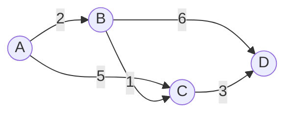
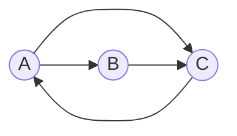

# 图形处理:从MapReduce到Pregel的演进

## 1.背景介绍
### 1.1 图形处理的重要性
在当今大数据时代,图形处理在许多领域扮演着至关重要的角色。从社交网络分析、推荐系统到生物信息学,图形处理为我们提供了深入洞察复杂关系网络的能力。然而,传统的数据处理模型如MapReduce在处理高度互联的图形数据时面临诸多挑战。

### 1.2 MapReduce的局限性
MapReduce是一种高度可扩展的并行计算模型,在处理大规模数据集方面表现出色。但是,当涉及到图形处理时,MapReduce暴露出一些固有的局限性:
- 迭代计算:图算法通常需要多轮迭代计算,而MapReduce缺乏对迭代的原生支持。
- 消息传递:图中顶点之间频繁的消息传递在MapReduce中实现起来比较困难和低效。
- 数据局部性:MapReduce将图划分为独立的部分进行处理,忽略了图的拓扑结构,导致数据局部性受损。

### 1.3 Pregel模型的诞生
为了克服MapReduce在图形处理中的不足,Google提出了Pregel模型。Pregel是一种专门为大规模图形处理设计的分布式计算框架,吸取了BSP(Bulk Synchronous Parallel)模型的精华,为图算法提供了一种更加自然和高效的编程模型。

## 2.核心概念与联系
### 2.1 Pregel编程模型
Pregel采用了"Think like a vertex"的编程范式,即以图的顶点为中心来设计算法。在Pregel中,计算被组织为一系列的超步(superstep),每个超步包括以下三个阶段:
1. 每个顶点根据上一超步收到的消息更新自己的状态。 
2. 每个顶点向其他顶点发送消息。
3. 一个全局同步屏障,确保所有顶点完成当前超步。

这种以顶点为中心的计算模型使得编写图算法变得直观和简洁。

### 2.2 消息传递机制
Pregel通过消息传递的方式实现顶点之间的通信。在每个超步中,顶点可以向其他顶点发送消息,这些消息将在下一个超步中被接收和处理。Pregel为消息传递提供了灵活的API,允许自定义消息的格式和合并策略。

### 2.3 容错性与可扩展性
Pregel在设计时就考虑到了容错性和可扩展性。它通过检查点机制来容忍机器故障,将顶点状态定期写入持久化存储,发生故障时能够从上一个检查点恢复。Pregel采用了分布式的"share-nothing"架构,可以轻松扩展到数千台机器,处理TB级别的图数据。

## 3.核心算法原理与具体操作步骤
### 3.1 单源最短路径算法(SSSP)
单源最短路径是图算法中的经典问题,给定一个起始顶点,找到从该顶点到图中所有其他顶点的最短路径。下面我们以SSSP为例,展示如何在Pregel中实现该算法。

#### 3.1.1 初始化
- 为每个顶点分配一个唯一的ID。
- 将起始顶点的距离初始化为0,其他顶点的距离初始化为正无穷。
- 将起始顶点加入一个集合A。

#### 3.1.2 迭代计算
重复以下步骤,直到集合A为空:
1. 对于集合A中的每个顶点u:
   - 通过u的出边(u,v),计算v的新距离:d_new(v) = d(u) + w(u,v)。
   - 如果d_new(v) < d(v),更新v的距离为d_new(v),并将v加入集合A。
2. 将u从集合A中移除。
3. 如果集合A为空,算法结束;否则,进入下一轮迭代。

#### 3.1.3 Pregel实现
- 超步0:将起始顶点距离设为0,向所有邻居发送(startId,0)的消息。
- 超步1,2,3...:
  - 每个顶点处理收到的消息,更新自己的距离。
  - 如果距离有更新,向所有邻居发送(selfId,newDist)的消息。
- 当没有顶点再发送消息时,算法收敛,得到最短路径结果。

### 3.2 PageRank算法
PageRank是Google用于评估网页重要性的经典算法。它基于以下假设:如果一个网页被很多其他重要网页链接,那么该网页也应该很重要。PageRank通过迭代计算每个网页的重要性得分,直到得分收敛。

#### 3.2.1 初始化
- 为每个网页(顶点)分配一个唯一的ID。
- 将所有网页的初始PageRank值设为1/N,其中N为网页总数。

#### 3.2.2 迭代计算
重复以下步骤,直到PageRank值收敛:
1. 对于每个网页i,计算它的新PageRank值:
   $$PR(i) = \frac{1-d}{N} + d \sum_{j \in IN(i)} \frac{PR(j)}{OUT(j)}$$
   其中,d为阻尼因子,通常取0.85;IN(i)为指向网页i的网页集合;OUT(j)为网页j的出链数。
2. 判断新旧PageRank值是否收敛,如果收敛则算法结束;否则,进入下一轮迭代。

#### 3.2.3 Pregel实现
- 超步0:将所有顶点的PageRank值初始化为1/N。
- 超步1,2,3...:
  - 每个顶点向其出边指向的顶点发送$\frac{PR(i)}{OUT(i)}$的消息。
  - 每个顶点根据公式计算新的PageRank值。
- 当PageRank值收敛时,算法结束。

## 4.数学模型和公式详细讲解举例说明
### 4.1 SSSP的Bellman-Ford公式
SSSP可以用Bellman-Ford方程来形式化描述。令d(v)表示起点s到顶点v的最短距离,则Bellman-Ford方程为:

$$
d(v) = 
\begin{cases}
0 & v = s \\
min\{d(u) + w(u,v) | (u,v) \in E\} & v \neq s
\end{cases}
$$

其中,w(u,v)为边(u,v)的权重。该方程表示,起点到自身的距离为0,到其他顶点v的距离等于所有能到达v的顶点u的距离d(u)加上边(u,v)的权重w(u,v)中的最小值。

举例说明:
假设有如下图G,起点为A:



初始时,d(A)=0,其他顶点距离为正无穷。
- 迭代1:d(B)=min(0+2)=2, d(C)=min(0+5)=5
- 迭代2:d(C)=min(5,2+1)=3, d(D)=min(2+6)=8
- 迭代3:d(D)=min(8,3+3)=6

最终得到最短距离:d(A)=0,d(B)=2,d(C)=3,d(D)=6。

### 4.2 PageRank的数学模型
PageRank算法可以用以下数学模型来描述:

$$PR(i) = \frac{1-d}{N} + d \sum_{j \in IN(i)} \frac{PR(j)}{OUT(j)}$$

其中,PR(i)为网页i的PageRank值,N为网页总数,d为阻尼因子,IN(i)为指向网页i的网页集合,OUT(j)为网页j的出链数。

这个模型可以解释为:一个网页的PageRank值由两部分组成:
1. 随机浏览模型:$(1-d)/N$表示用户随机访问一个网页的概率。
2. 网页投票模型:$d \sum_{j \in IN(i)} \frac{PR(j)}{OUT(j)}$表示网页通过链接关系投票,一个网页将其PageRank值平均分配给它所链接的网页。

举例说明:
假设有如下网页链接关系,d取0.85:



初始时,PR(A)=PR(B)=PR(C)=1/3=0.33
- 迭代1:
  - PR(A) = 0.05 + 0.85 * 0.33 = 0.33 
  - PR(B) = 0.05 + 0.85 * 0.17 = 0.19
  - PR(C) = 0.05 + 0.85 * (0.17 + 0.33) = 0.48
- 迭代2:
  - PR(A) = 0.05 + 0.85 * 0.48 = 0.46
  - PR(B) = 0.05 + 0.85 * 0.17 = 0.19
  - PR(C) = 0.05 + 0.85 * (0.19 + 0.23) = 0.41

重复迭代直到收敛,最终得到每个网页的PageRank值,反映了网页的重要性。

## 5.项目实践:代码实例和详细解释说明
下面我们以单源最短路径问题为例,给出Pregel模型下的代码实现。我们使用Scala语言和Apache Spark GraphX库进行演示。

```scala
import org.apache.spark.graphx._
import org.apache.spark.rdd.RDD

object SSSPPregel {
  def main(args: Array[String]): Unit = {
    // 创建Spark上下文
    val sc = new SparkContext("local", "SSSPPregel")
    
    // 定义图的顶点和边
    val vertexArray = Array(
      (1L, ("A", 0)),
      (2L, ("B", Int.MaxValue)),
      (3L, ("C", Int.MaxValue)),
      (4L, ("D", Int.MaxValue))
    )
    val edgeArray = Array(
      Edge(1L, 2L, 2),
      Edge(1L, 3L, 5),
      Edge(2L, 3L, 1),
      Edge(2L, 4L, 6),
      Edge(3L, 4L, 3)
    )
    
    // 构建图Graph[VD,ED]
    val graph: Graph[(String, Int), Int] = Graph(sc.parallelize(vertexArray), sc.parallelize(edgeArray))
    
    // 定义Pregel算法
    val sourceId = 1L // 设置起点
    val initialMsg = Int.MaxValue
    val vertexProgram = (id: VertexId, attr: (String, Int), msg: Int) => {
      if (id == sourceId) (attr._1, 0) else (attr._1, math.min(attr._2, msg))
    }
    val sendMessage = (edge: EdgeTriplet[(String, Int), Int]) => {
      if (edge.srcAttr._2 + edge.attr < edge.dstAttr._2) {
        Iterator((edge.dstId, edge.srcAttr._2 + edge.attr))
      } else {
        Iterator.empty
      }
    }
    val messageCombiner = (a: Int, b: Int) => math.min(a, b)
    
    // 运行Pregel
    val sssp = graph.pregel(initialMsg)(vertexProgram, sendMessage, messageCombiner)
    
    // 显示结果
    println(sssp.vertices.collect.mkString("\n"))
  }
}
```

代码解释:
1. 首先创建Spark上下文,用于执行分布式计算。
2. 定义图的顶点和边数据,其中顶点包含ID和属性(name,distance),边包含源顶点ID、目标顶点ID和权重。
3. 使用vertexArray和edgeArray构建图Graph,顶点属性为(String,Int),边属性为Int。
4. 定义Pregel算法的三个核心函数:
   - vertexProgram:顶点计算函数,根据收到的消息更新顶点距离。
   - sendMessage:消息发送函数,当源顶点距离+边权重<目标顶点距离时,发送消息(目标顶点ID,新距离)。
   - messageCombiner:消息合并函数,取最小距离。
5. 调用Graph.pregel运行Pregel算法,得到结果图sssp。
6. 显示计算结果,即每个顶点的最短距离。

输出结果:
```
(4,(D,6))
(1,(A,0))
(3,(C,3))
(2,(B,2))
```

可以看到,Pregel在保留了原始图结构的同时,以顶点为中心的计算模型使得单源最短路径算法的实现非常简洁和高效。

## 6.实际应用