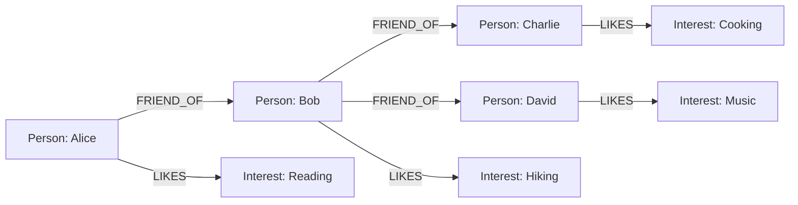

# 图数据库 原理与代码实例讲解

## 1. 背景介绍

### 1.1 数据库发展简史

在现代信息时代,数据无疑是最宝贵的资源之一。随着数据量的不断增长,有效地存储、管理和查询数据成为了一个巨大的挑战。为了应对这一挑战,数据库系统应运而生。

最初的数据库系统是基于文件系统的,数据被存储在扁平文件中。虽然这种方式简单,但是缺乏数据之间关联关系的表达能力,并且数据冗余和数据一致性问题严重。

后来,关系数据库(Relational Database)的出现解决了这些问题。关系数据库将数据组织成二维表格的形式,每一行表示一个实体,每一列表示实体的一个属性。通过建立表与表之间的关联关系,关系数据库可以有效地减少数据冗余,并保证数据的一致性和完整性。

关系数据库在过去几十年中占据了主导地位,但是随着数据量和数据复杂度的不断增加,它也暴露出了一些缺陷。例如,关系数据库在处理高度连接的数据时,性能会急剧下降;对于非结构化或半结构化数据(如文档、图像等),关系数据库也难以高效地存储和查询。

### 1.2 图数据库的兴起

为了解决关系数据库在处理高度连接数据和非结构化数据时的困难,图数据库(Graph Database)应运而生。图数据库将数据表示为节点(Node)和边(Edge)的形式,非常适合描述复杂的关系网络。

图数据库的核心思想是将现实世界中的实体和关系直接映射到数据库中的节点和边,从而更好地捕捉数据之间的语义关联。与关系数据库相比,图数据库具有以下优势:

1. **高效处理关联数据**:图数据库天生就是为了处理高度连接的数据而设计的,可以通过遍历图结构快速查询关联数据,避免了关系数据库中的昂贵的连接操作。

2. **灵活的数据模型**:图数据库采用无模式(Schema-free)或宽松模式(Schema-flexible)的设计,可以很方便地存储各种类型的数据,包括结构化、半结构化和非结构化数据。

3. **语义查询能力**:图数据库通常提供了基于图形模式匹配的查询语言,可以方便地表达和查询数据之间的复杂关系。

随着社交网络、知识图谱、推荐系统等应用场景的兴起,图数据库也逐渐受到了广泛关注和应用。目前,Neo4j、JanusGraph、Amazon Neptune等都是流行的图数据库产品。

## 2. 核心概念与联系

### 2.1 图数据模型

在图数据库中,数据被建模为一个有向属性图(Attributed Directed Graph)。这个图由以下三个核心组件组成:

1. **节点(Node)**:表示现实世界中的实体,如人、地点、事物等。每个节点可以有一个或多个属性(Property)描述它的特征。

2. **边(Edge)**:表示节点之间的关系,如亲属关系、交易关系等。边具有方向性,可以是单向的或双向的。

3. **属性(Property)**:节点和边都可以有任意数量的属性,用于描述它们的特征。属性可以是简单的键值对,也可以是更复杂的数据结构。

下面是一个简单的图数据模型示例,描述了一个社交网络中的人际关系:



在这个示例中,节点表示人和兴趣爱好,边表示朋友关系和喜欢的关系。每个节点和边都可以有额外的属性,如年龄、地址、评分等。

### 2.2 属性图数据库

属性图数据库(Property Graph Database)是一种将数据建模为属性图的数据库系统。与关系数据库将数据组织成二维表格不同,属性图数据库直接将现实世界的实体和关系映射到节点和边上,更好地捕捉了数据之间的语义关联。

属性图数据库通常提供以下核心功能:

1. **创建节点和边**:可以在数据库中创建新的节点和边,并为它们赋予属性。

2. **遍历图形**:可以通过遍历图形来查询关联数据,如找到某个节点的邻居节点、某条边的起始节点和终止节点等。

3. **图形模式匹配**:可以使用声明式的图形查询语言(如 Cypher、GSQL 等)来匹配特定的图形模式,从而实现复杂的关系查询。

4. **图形分析算法**:属性图数据库通常内置了各种图形分析算法,如最短路径、页面排名、社区发现等,可以对图形数据进行深入的挖掘和分析。

下面是一个使用 Cypher 查询语言在 Neo4j 图数据库中查找两个人之间的最短路径的示例:

```cypher
MATCH (a:Person),(b:Person)
WHERE a.name = 'Alice' AND b.name = 'David'
CALL shortestPath((a)-[*..15]->(b))
YIELD path
RETURN path
```

这个查询首先匹配名为 Alice 和 David 的两个人物节点,然后调用 `shortestPath` 过程来查找它们之间的最短路径,最多允许经过 15 条边。查询结果将返回这条最短路径。

### 2.3 图数据库与关系数据库的区别

虽然图数据库和关系数据库都是用于存储和管理数据的系统,但它们在数据建模、查询语言和适用场景等方面存在明显的区别:

1. **数据建模**:关系数据库将数据组织成二维表格,而图数据库将数据建模为节点和边构成的图形。图数据库更适合表示高度连接的数据和复杂的关系网络。

2. **查询语言**:关系数据库使用结构化查询语言(SQL),通过连接操作来查询关联数据。而图数据库通常使用基于图形模式匹配的声明式查询语言(如 Cypher、GSQL 等),可以更直观地表达和查询数据之间的关系。

3. **查询性能**:对于高度连接的数据,图数据库通常比关系数据库具有更好的查询性能。这是因为图数据库可以直接遍历图形来查询关联数据,而关系数据库需要执行昂贵的连接操作。

4. **数据模型灵活性**:关系数据库采用严格的模式(Schema),需要预先定义好表结构。而图数据库通常采用无模式或宽松模式的设计,可以更灵活地存储各种类型的数据。

5. **适用场景**:关系数据库更适合处理结构化的业务数据,如订单、库存等。而图数据库更适合处理高度连接的数据,如社交网络、知识图谱、推荐系统等。

总的来说,图数据库和关系数据库都有各自的优缺点和适用场景。在实际应用中,我们可以根据具体的数据特征和需求来选择合适的数据库系统。有时候,将两种数据库系统结合使用也是一种不错的选择。

## 3. 核心算法原理具体操作步骤

### 3.1 图遍历算法

图遍历是图数据库中最基本和最常用的操作之一。它的目的是从一个起始节点出发,按照某种策略访问图中的所有节点和边。图遍历算法通常被用于查找两个节点之间的路径、计算节点的重要性等任务。

常见的图遍历算法有深度优先搜索(Depth-First Search, DFS)和广度优先搜索(Breadth-First Search, BFS)。下面分别介绍这两种算法的原理和具体操作步骤。

#### 3.1.1 深度优先搜索(DFS)

深度优先搜索是一种优先深入遍历图的策略。它从起始节点出发,沿着一条路径一直遍历下去,直到无法继续前进为止,然后回溯到上一个节点,尝试另一条路径。这个过程一直持续下去,直到所有节点都被访问过。

DFS 算法的具体操作步骤如下:

1. 选择一个起始节点作为当前节点。
2. 将当前节点标记为已访问。
3. 对当前节点的所有未访问过的邻居节点,递归地执行步骤 1~3。
4. 如果所有邻居节点都已访问过,则回溯到上一个节点,继续执行步骤 3。
5. 重复步骤 3~4,直到所有节点都被访问过。

下面是一个使用 Python 实现 DFS 算法的示例代码:

```python
from collections import deque

def dfs(graph, start):
    visited = set()
    stack = deque([start])
    
    while stack:
        node = stack.pop()
        if node not in visited:
            visited.add(node)
            print(node)
            for neighbor in graph[node]:
                stack.append(neighbor)
    
    return visited

# 示例图
graph = {
    'A': ['B', 'C'],
    'B': ['D', 'E'],
    'C': ['F'],
    'D': [],
    'E': ['F'],
    'F': []
}

print("DFS Traversal:")
dfs(graph, 'A')
```

在这个示例中,我们使用一个字典来表示图,键表示节点,值表示该节点的邻居节点列表。DFS 算法使用一个栈来模拟递归过程,从起始节点 'A' 开始遍历。输出结果如下:

```
DFS Traversal:
A
C
F
B
E
F
D
```

可以看到,DFS 算法首先深入遍历了 'A' 到 'C' 到 'F' 的路径,然后回溯到 'B',继续遍历 'B' 的邻居节点。

#### 3.1.2 广度优先搜索(BFS)

广度优先搜索是一种逐层遍历图的策略。它从起始节点出发,先访问所有距离起始节点路径长度为 1 的节点,然后访问所有距离为 2 的节点,依次类推,直到所有节点都被访问过。

BFS 算法的具体操作步骤如下:

1. 选择一个起始节点作为当前层的第一个节点。
2. 将当前层的所有节点标记为已访问,并将它们的未访问过的邻居节点加入下一层。
3. 如果下一层为空,则遍历结束;否则,将下一层作为当前层,回到步骤 2。

下面是一个使用 Python 实现 BFS 算法的示例代码:

```python
from collections import deque

def bfs(graph, start):
    visited = set()
    queue = deque([start])
    visited.add(start)
    
    while queue:
        node = queue.popleft()
        print(node)
        for neighbor in graph[node]:
            if neighbor not in visited:
                visited.add(neighbor)
                queue.append(neighbor)
    
    return visited

# 示例图
graph = {
    'A': ['B', 'C'],
    'B': ['D', 'E'],
    'C': ['F'],
    'D': [],
    'E': ['F'],
    'F': []
}

print("BFS Traversal:")
bfs(graph, 'A')
```

在这个示例中,我们使用一个队列来模拟层次遍历过程,从起始节点 'A' 开始遍历。输出结果如下:

```
BFS Traversal:
A
B
C
D
E
F
F
```

可以看到,BFS 算法首先访问了距离起始节点 'A' 路径长度为 1 的节点 'B' 和 'C',然后访问了距离为 2 的节点 'D'、'E' 和 'F'。

DFS 和 BFS 算法各有优缺点。DFS 算法占用的空间较小,但可能会陷入无限循环;而 BFS 算法虽然空间开销较大,但可以保证找到起点到任意节点的最短路径。在实际应用中,需要根据具体的需求来选择合适的算法。

### 3.2 最短路径算法

在图数据库中,常常需要计算两个节点之间的最短路径。最短路径问题是一个经典的图算法问题,有