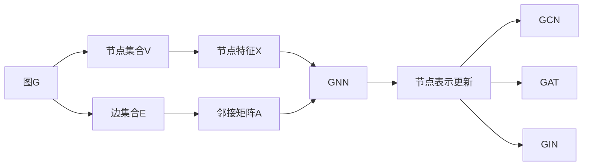

# 图神经网络 原理与代码实例讲解

## 1.背景介绍

### 1.1 图数据无处不在
在现实世界中,图数据无处不在。社交网络、交通网络、金融交易网络、分子结构、知识图谱等都可以用图来表示。图由节点(node)和边(edge)组成,节点表示实体,边表示实体之间的关系。与传统的结构化数据(如表格数据)和非结构化数据(如文本、图像)不同,图数据包含了丰富的关系信息。

### 1.2 传统机器学习方法的局限性
传统的机器学习方法如支持向量机(SVM)、随机森林等,主要针对固定大小的特征向量进行建模,无法直接处理图结构数据。虽然可以先提取图的统计特征(如度分布、聚类系数等),再输入传统机器学习模型,但这样做会丢失图的拓扑结构信息。

### 1.3 深度学习模型的图数据处理
近年来,深度学习模型如卷积神经网络(CNN)和循环神经网络(RNN)在计算机视觉和自然语言处理等领域取得了巨大成功。研究者们尝试将深度学习应用到图数据上,希望学习到图的深层表示。但CNN主要处理规则的网格结构数据,RNN主要处理序列数据,它们都不太适合处理图这种非欧几何结构的数据。

### 1.4 图神经网络的兴起  
为了更好地处理图结构数据,图神经网络(Graph Neural Network, GNN)应运而生。GNN可以直接在图上进行端到端的学习,自动提取图的高级特征表示,再应用于下游任务。GNN已经在图分类、链路预测、节点分类、图生成等任务上取得了state-of-the-art的效果,成为了处理图数据的重要工具。

## 2.核心概念与联系

### 2.1 图的定义
图$G=(V,E)$由节点集合$V$和边集合$E$组成。无向图的边是无序对$(v_i,v_j)$,有向图的边是有序对$<v_i,v_j>$,边上可能带有权重$w$。

### 2.2 节点的特征表示
每个节点$v_i$可以用一个$d$维特征向量$\mathbf{x}_i \in \mathbb{R}^d$表示。特征可以是节点的属性,如文本、类别等;也可以是人工提取的特征。

### 2.3 邻接矩阵
图的拓扑结构可以用邻接矩阵$\mathbf{A}$表示。$\mathbf{A}$是一个$n \times n$的矩阵($n$为节点数),如果节点$i$和$j$之间有边相连,则$\mathbf{A}_{ij}=1$(或边的权重),否则为0。

### 2.4 GNN的核心思想
GNN的核心思想是通过神经网络对节点的特征进行变换,同时利用图的结构对节点的特征进行聚合,从而得到节点的新特征表示。即新特征既考虑了节点自身的特征,也考虑了邻居节点的特征。

### 2.5 消息传递机制
GNN通过消息传递机制来实现特征聚合。具体来说,每个节点先从邻居节点收集信息(消息聚合),再根据收集到的信息更新自己的特征(状态更新)。这一过程可以迭代多轮。

### 2.6 GNN的几个变体
GNN有几个重要变体,包括:

- 图卷积网络(Graph Convolutional Network,GCN):类比CNN,用卷积操作聚合邻居信息。
- 图注意力网络(Graph Attention Network,GAT):类比Attention机制,用注意力权重聚合邻居信息。 
- 图同构网络(Graph Isomorphism Network,GIN):增强GNN的区分能力,能够区分同构图。

下图展示了这些概念之间的联系:

## 3.核心算法原理具体操作步骤

### 3.1 GNN的通用框架

一个GNN层的前向传播可以概括为两个步骤:消息聚合和状态更新。假设第$l$层的节点表示为$\mathbf{h}^{(l)}$,则:

消息聚合:
$$
\mathbf{m}_i^{(l)} = \text{AGGREGATE}^{(l)} \left(\left\lbrace \mathbf{h}_j^{(l-1)} : j \in \mathcal{N}(i) \right\rbrace \right)
$$

状态更新:
$$
\mathbf{h}_i^{(l)} = \text{UPDATE}^{(l)} \left( \mathbf{h}_i^{(l-1)}, \mathbf{m}_i^{(l)} \right)
$$

其中,$\mathcal{N}(i)$表示节点$i$的邻居节点集合。AGGREGATE和UPDATE可以是任意可微分函数,如求和、均值、MLP等。

### 3.2 GCN的具体步骤

GCN是最简单和常用的GNN变体之一。对于一个$L$层的GCN,每一层的操作为:
$$
\mathbf{H}^{(l)} = \sigma \left( \mathbf{\hat{A}} \mathbf{H}^{(l-1)} \mathbf{W}^{(l-1)} \right)
$$

其中:

- $\mathbf{H}^{(l)} \in \mathbb{R}^{n \times d_l}$为第$l$层的节点表示矩阵,$\mathbf{H}^{(0)}=\mathbf{X}$为节点特征矩阵。
- $\mathbf{\hat{A}}=\mathbf{\tilde{D}}^{-\frac{1}{2}} \mathbf{\tilde{A}} \mathbf{\tilde{D}}^{-\frac{1}{2}}$为归一化的邻接矩阵,$\mathbf{\tilde{A}} = \mathbf{A} + \mathbf{I}$为加入自环的邻接矩阵,$\mathbf{\tilde{D}}$为$\mathbf{\tilde{A}}$的度矩阵。
- $\mathbf{W}^{(l-1)} \in \mathbb{R}^{d_{l-1} \times d_l}$为第$l-1$层到第$l$层的权重矩阵。
- $\sigma$为激活函数,如ReLU。

直观理解,GCN先用归一化邻接矩阵对节点特征做卷积,再通过权重矩阵做变换。

### 3.3 GAT的具体步骤

GAT用注意力机制赋予邻居节点不同的权重。对于一个$L$层的GAT,第$l$层第$i$个节点的操作为:

计算注意力系数:
$$
e_{ij}^{(l)} = a^{(l)} \left( \mathbf{W}^{(l)} \mathbf{h}_i^{(l-1)}, \mathbf{W}^{(l)} \mathbf{h}_j^{(l-1)} \right), j \in \mathcal{N}(i)
$$
$$
\alpha_{ij}^{(l)} = \text{softmax}_j \left( e_{ij}^{(l)} \right) = \frac{\exp \left(e_{ij}^{(l)}\right)}{\sum_{k \in \mathcal{N}(i)} \exp \left(e_{ik}^{(l)}\right)}
$$

状态更新:
$$
\mathbf{h}_i^{(l)} = \sigma \left( \sum_{j \in \mathcal{N}(i)} \alpha_{ij}^{(l)} \mathbf{W}^{(l)} \mathbf{h}_j^{(l-1)} \right)
$$

其中,注意力系数$e_{ij}^{(l)}$可以用多种函数计算,如拼接后做MLP、点积等。

### 3.4 GIN的具体步骤

GIN在聚合邻居信息时引入可学习参数,增强了表示能力。GIN的层操作为:

$$
\mathbf{h}_i^{(l)} = \text{MLP}^{(l)} \left( (1+\epsilon^{(l)}) \cdot \mathbf{h}_i^{(l-1)} + \sum_{j \in \mathcal{N}(i)} \mathbf{h}_j^{(l-1)} \right)
$$

其中,$\epsilon^{(l)}$是可学习的参数,MLP可以是多层感知机。

## 4.数学模型和公式详细讲解举例说明

### 4.1 图卷积的直观理解

传统CNN在图像上做卷积,是将卷积核在图像上滑动,每次聚合卷积核覆盖的像素。图卷积将这一思想推广到图上,即每个节点聚合其邻居节点的信息。不同之处在于:

- 图像是规则的网格结构,图是非规则的拓扑结构。
- 图像的像素有固定的空间顺序,图的节点没有固定顺序。

因此,图卷积需要对邻接矩阵做归一化,以适应不同大小和结构的图。

### 4.2 GCN的数学推导

GCN的核心是用归一化邻接矩阵$\mathbf{\hat{A}}$对节点特征矩阵$\mathbf{X}$做卷积。我们来推导一下$\mathbf{\hat{A}}$的计算过程:

首先,将邻接矩阵$\mathbf{A}$加上自环,得到$\mathbf{\tilde{A}}$:

$$\mathbf{\tilde{A}} = \mathbf{A} + \mathbf{I}$$

自环的作用是在聚合邻居信息时也考虑节点自身的信息。

然后,计算$\mathbf{\tilde{A}}$的度矩阵$\mathbf{\tilde{D}}$,其中对角元素为:

$$\mathbf{\tilde{D}}_{ii} = \sum_j \mathbf{\tilde{A}}_{ij}$$

度矩阵的作用是归一化邻接矩阵,使每个节点的权重之和为1。

最后,用$\mathbf{\tilde{D}}$归一化$\mathbf{\tilde{A}}$得到$\mathbf{\hat{A}}$:

$$\mathbf{\hat{A}} = \mathbf{\tilde{D}}^{-\frac{1}{2}} \mathbf{\tilde{A}} \mathbf{\tilde{D}}^{-\frac{1}{2}}$$

直观理解,这相当于将每个节点的特征除以其度的平方根,再与邻居节点的特征相加。这种归一化方式可以保持特征大小不变。

### 4.3 GAT的注意力机制

GAT用注意力机制为邻居节点赋予不同的权重。以第$l$层第$i$个节点为例,注意力系数$e_{ij}^{(l)}$可以有多种计算方式,最常见的是拼接后做MLP:

$$
e_{ij}^{(l)} = \text{MLP}^{(l)} \left( \left[ \mathbf{W}^{(l)} \mathbf{h}_i^{(l-1)} \| \mathbf{W}^{(l)} \mathbf{h}_j^{(l-1)} \right] \right)
$$

其中,$\|$表示拼接操作。直观理解,这相当于先将两个节点的特征做变换,再拼接后判断它们的相关性。

得到注意力系数后,用softmax归一化得到注意力权重:

$$
\alpha_{ij}^{(l)} = \frac{\exp \left(e_{ij}^{(l)}\right)}{\sum_{k \in \mathcal{N}(i)} \exp \left(e_{ik}^{(l)}\right)}
$$

softmax保证了注意力权重之和为1,且权重非负。节点$i$的新特征就是所有邻居特征的加权和:

$$
\mathbf{h}_i^{(l)} = \sigma \left( \sum_{j \in \mathcal{N}(i)} \alpha_{ij}^{(l)} \mathbf{W}^{(l)} \mathbf{h}_j^{(l-1)} \right)
$$

### 4.4 GIN的可学习参数

GIN在特征聚合时引入可学习参数$\epsilon^{(l)}$,使GNN能够区分同构图。考虑两个同构图$G_1$和$G_2$,如果不引入$\epsilon^{(l)}$,GNN会给出相同的表示。但引入$\epsilon^{(l)}$后,GNN可以学到不同的表示:

$$
\mathbf{h}_{G_1}^{(l)} = \text{MLP}^{(l)} \left( (1+\epsilon