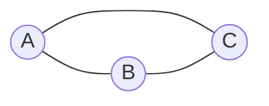
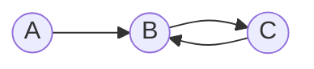

# 图计算:解锁大数据时代的新挑战

## 1.背景介绍
### 1.1 大数据时代的机遇与挑战
在当今大数据时代,数据呈现出爆炸式增长的趋势。据统计,全球每天产生的数据量高达2.5EB(1EB=10^18B)。面对如此海量的数据,传统的数据处理和分析方法已经难以胜任。如何从海量数据中挖掘出有价值的信息,成为大数据时代亟待解决的难题。

### 1.2 图计算的兴起 
近年来,图计算作为一种新兴的计算范式受到学术界和工业界的广泛关注。图计算以图论为基础,通过构建数据之间的关联关系,揭示数据内在的结构和规律,为大数据分析提供了新的思路和方法。

### 1.3 图计算的优势
与传统的数据处理方法相比,图计算具有以下优势:

1. 高效性:图计算采用图数据结构,可以高效地表示实体之间的复杂关系,避免了数据冗余和重复计算。
2. 可扩展性:图计算可以方便地进行分布式和并行处理,适用于处理大规模的图数据。  
3. 灵活性:图模型可以灵活地表达多种类型的数据,包括结构化、半结构化和非结构化数据。
4. 可解释性:图模型以直观的方式呈现数据之间的关联,便于理解数据背后的语义信息。

## 2.核心概念与联系
### 2.1 图的基本概念
- 顶点(Vertex):图中的基本单元,表示实体对象,如人、物品、事件等。
- 边(Edge):连接顶点的线,表示顶点之间的关系,如朋友关系、购买关系等。
- 属性(Property):顶点和边的附加信息,用于描述实体或关系的特征。

### 2.2 图的分类
根据边是否有方向,图可分为:
- 无向图:边没有方向,即边(u,v)与边(v,u)等价。
- 有向图:边有方向,即边(u,v)与边(v,u)不等价。

根据边是否有权重,图可分为:  
- 无权图:边没有权重,所有边都是等价的。
- 带权图:边带有权重,不同的边具有不同的重要性。

### 2.3 图的存储
常见的图存储方式有:
- 邻接矩阵(Adjacency Matrix):用二维矩阵表示图的顶点之间的连接关系。
- 邻接表(Adjacency List):用链表或数组存储每个顶点的邻接顶点。
- 边集数组(Edge Set):用数组存储图的所有边。

### 2.4 图计算的核心问题
图计算主要解决以下核心问题:
- 图遍历(Graph Traversal):按照一定的规则访问图的所有顶点,如广度优先搜索、深度优先搜索等。
- 最短路径(Shortest Path):寻找图中两个顶点之间的最短路径,如Dijkstra算法、Floyd算法等。
- 连通性(Connectivity):判断图是否连通,求解图的连通分量。
- 社区发现(Community Detection):在图中发现紧密关联的顶点子集,即社区结构。
- 影响力分析(Influence Analysis):分析图中节点的重要性和影响力,如PageRank算法。

## 3.核心算法原理具体操作步骤
### 3.1 广度优先搜索(BFS)
广度优先搜索是一种基于队列的图遍历算法,其基本步骤如下:

1. 选择一个起始顶点,将其标记为已访问,并加入队列。
2. 从队列中取出一个顶点,访问该顶点的所有未访问过的邻接顶点,将它们标记为已访问并加入队列。 
3. 重复步骤2,直到队列为空。

BFS可用于寻找最短路径、判断图的连通性等问题。

### 3.2 深度优先搜索(DFS) 
深度优先搜索是一种基于栈的图遍历算法,其基本步骤如下:

1. 选择一个起始顶点,将其标记为已访问,并压入栈中。
2. 从栈顶取出一个顶点,访问该顶点的一个未访问过的邻接顶点,将其标记为已访问并压入栈中。
3. 重复步骤2,直到所有顶点都被访问过。
4. 如果还有未被访问的顶点,则选择其中一个作为新的起始顶点,重复步骤1-3。

DFS常用于求解图的连通性、查找环等问题。

### 3.3 Dijkstra算法
Dijkstra算法是一种用于寻找带权图中单源最短路径的贪心算法,其基本步骤如下:

1. 初始化距离数组dist,起点到自身的距离为0,到其他顶点的距离为无穷大。 
2. 将起点加入最短路径顶点集合S。
3. 对于集合S中的每个顶点u,更新u的所有邻接顶点v的距离:如果dist[u]+w(u,v)<dist[v],则更新dist[v]=dist[u]+w(u,v)。
4. 在未加入集合S的顶点中,选择dist最小的顶点加入S。
5. 重复步骤3-4,直到所有顶点都加入S。

最终dist数组中保存了起点到每个顶点的最短距离。

### 3.4 PageRank算法
PageRank算法是一种用于评估网页重要性的经典算法,其基本思想是:一个网页的重要性取决于指向它的其他重要网页。PageRank值的计算步骤如下:

1. 初始化每个网页的PageRank值为1/N,其中N为网页总数。
2. 对于每个网页i,计算其PageRank值:
   $$PR(i)=\frac{1-d}{N}+d\sum_{j\in B(i)}\frac{PR(j)}{L(j)}$$
   其中,d为阻尼因子(一般取0.85),B(i)为指向网页i的网页集合,L(j)为网页j的出链数。
3. 重复步骤2,直到PageRank值收敛。

PageRank反映了网页的权威性和影响力,在搜索引擎、推荐系统等领域有广泛应用。

## 4.数学模型和公式详细讲解举例说明
图的数学表示可以用二元组G=(V,E)来描述,其中V为顶点集,E为边集。以下是一些常见的图论概念和公式:

### 4.1 度(Degree)
在无向图中,顶点v的度deg(v)表示与v相连的边的数量。设图G=(V,E),则
$$deg(v)=|\{u\in V|(v,u)\in E\}|$$

例如,对于无向图G:



顶点A的度deg(A)=2,顶点B的度deg(B)=2,顶点C的度deg(C)=2。

在有向图中,顶点v的入度indeg(v)表示指向v的边的数量,出度outdeg(v)表示从v出发的边的数量。设图G=(V,E),则
$$indeg(v)=|\{u\in V|(u,v)\in E\}|$$
$$outdeg(v)=|\{u\in V|(v,u)\in E\}|$$

例如,对于有向图G:



顶点A的入度indeg(A)=0,出度outdeg(A)=1;
顶点B的入度indeg(B)=2,出度outdeg(B)=1;
顶点C的入度indeg(C)=1,出度outdeg(C)=1。

### 4.2 邻接矩阵(Adjacency Matrix)
邻接矩阵是图的一种常见存储方式。设图G=(V,E),V中有n个顶点,则G的邻接矩阵A是一个n×n的方阵,其中
$$A_{ij}=\begin{cases}1,&(v_i,v_j)\in E\\0,&(v_i,v_j)\notin E\end{cases}$$

对于带权图,邻接矩阵的元素$A_{ij}$为边$(v_i,v_j)$的权重,不存在的边权重为0或∞。

例如,对于无向图G:


其邻接矩阵为:
$$A=\begin{bmatrix}0&1&1\\1&0&1\\1&1&0\end{bmatrix}$$

### 4.3 最短路径
最短路径是图论中的经典问题,常用的算法有Dijkstra算法和Floyd算法。

Dijkstra算法用于计算带权图中单源最短路径,其核心思想是贪心法。设图G=(V,E),源点为s,dist[i]表示s到顶点i的最短距离,则Dijkstra算法的数学描述为:

1. 初始化:
   $$dist[s]=0$$
   $$dist[i]=\infty,i\neq s$$
2. 对于未加入最短路径集合S的每个顶点u,更新u的所有邻接顶点v的距离:
   $$dist[v]=min(dist[v],dist[u]+w(u,v))$$
3. 从未加入S的顶点中选择dist最小的顶点u加入S,重复步骤2直到所有顶点都加入S。

Floyd算法用于计算带权图中任意两点间的最短路径,其核心思想是动态规划。设图G=(V,E),dist[i][j]表示顶点i到顶点j的最短距离,则Floyd算法的状态转移方程为:
$$dist[i][j]=min(dist[i][j],dist[i][k]+dist[k][j])$$

其中,i,j,k∈V。算法的时间复杂度为$O(|V|^3)$。

### 4.4 PageRank
PageRank是Google提出的网页排名算法,用于评估网页的重要性。设网页i的PageRank值为PR(i),则PageRank的数学模型为:
$$PR(i)=\frac{1-d}{N}+d\sum_{j\in B(i)}\frac{PR(j)}{L(j)}$$

其中,d为阻尼因子(一般取0.85),N为网页总数,B(i)为指向网页i的网页集合,L(j)为网页j的出链数。

PageRank计算可以通过迭代法求解,初始时所有网页的PR值相同,即$PR(i)=\frac{1}{N}$,然后不断迭代更新PR值直至收敛。

## 5.项目实践：代码实例和详细解释说明
以下是Python实现的几个经典图算法:

### 5.1 广度优先搜索(BFS)

```python
from collections import deque

def bfs(graph, start):
    visited = set()
    queue = deque([start])
    visited.add(start)
    
    while queue:
        vertex = queue.popleft()
        print(vertex, end=' ')
        
        for neighbor in graph[vertex]:
            if neighbor not in visited:
                queue.append(neighbor)
                visited.add(neighbor)

# 测试代码
graph = {
    'A': ['B', 'C'],
    'B': ['A', 'D', 'E'],
    'C': ['A', 'F'],
    'D': ['B'],
    'E': ['B', 'F'],
    'F': ['C', 'E']
}

bfs(graph, 'A')  # 输出: A B C D E F
```

代码解释:
- 使用队列`queue`存储待访问的顶点,集合`visited`存储已访问的顶点。
- 初始时将起点加入`queue`和`visited`。
- 从`queue`中取出一个顶点,访问该顶点的所有未访问过的邻接顶点,将它们加入`queue`和`visited`。
- 重复上述步骤直到`queue`为空。

### 5.2 深度优先搜索(DFS)

```python
def dfs(graph, start, visited=None):
    if visited is None:
        visited = set()
    
    visited.add(start)
    print(start, end=' ')
    
    for neighbor in graph[start]:
        if neighbor not in visited:
            dfs(graph, neighbor, visited)

# 测试代码
graph = {
    'A': ['B', 'C'],
    'B': ['A', 'D', 'E'],
    'C': ['A', 'F'],
    'D': ['B'],
    'E': ['B', 'F'],
    'F': ['C', 'E']
}

dfs(graph, 'A')  # 输出: A B D E F C
```

代码解释:
- 使用集合`visited`存储已访问的顶点。
- 从起点开始,访问起点,并递归访问起点的所有未访