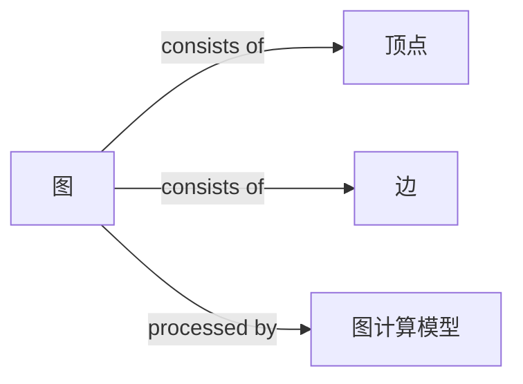
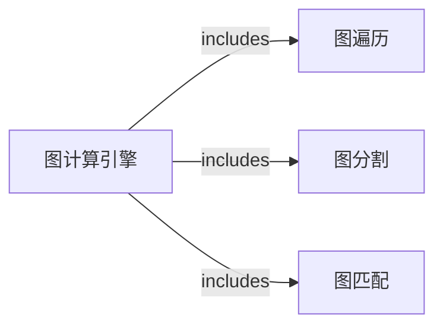

## 1.背景介绍

图计算引擎是处理大规模图数据的一个重要工具，它可以有效地处理和分析图数据，使得我们可以从图数据中获取有价值的信息。图数据的处理和分析在许多领域都有广泛的应用，如社交网络分析、网络路由、生物信息学、复杂网络分析等。然而，由于图数据的特性，如大规模、高度连接、动态变化等，使得图数据的处理和分析面临着巨大的挑战。

## 2.核心概念与联系

图计算引擎的核心概念包括图、顶点、边、图计算模型等。图是由顶点和边组成的，每个顶点代表一个实体，每个边代表实体之间的关系。图计算模型是图计算引擎的计算框架，它定义了如何在图上进行计算。常见的图计算模型有Pregel模型、GraphLab模型等。



## 3.核心算法原理具体操作步骤

图计算引擎的核心算法主要包括图遍历、图分割、图匹配等。图遍历是指在图中按照一定的规则访问图中的所有顶点。图分割是将大图分割成小图，以便于在分布式环境中进行并行计算。图匹配是寻找图中满足一定条件的子图。



## 4.数学模型和公式详细讲解举例说明

图计算引擎的数学模型主要包括图的邻接矩阵、图的拉普拉斯矩阵等。图的邻接矩阵是一个二维矩阵，如果顶点i和顶点j之间有边，则邻接矩阵的第i行第j列的元素为1，否则为0。图的拉普拉斯矩阵是由图的度矩阵和邻接矩阵计算得到的。

例如，对于一个有4个顶点的无向图，其邻接矩阵A和拉普拉斯矩阵L如下所示：

$A = \begin{bmatrix} 0 & 1 & 1 & 0 \\ 1 & 0 & 1 & 1 \\ 1 & 1 & 0 & 1 \\ 0 & 1 & 1 & 0 \end{bmatrix}$

$D = \begin{bmatrix} 2 & 0 & 0 & 0 \\ 0 & 3 & 0 & 0 \\ 0 & 0 & 3 & 0 \\ 0 & 0 & 0 & 2 \end{bmatrix}$

$L = D - A = \begin{bmatrix} 2 & -1 & -1 & 0 \\ -1 & 3 & -1 & -1 \\ -1 & -1 & 3 & -1 \\ 0 & -1 & -1 & 2 \end{bmatrix}$

## 5.项目实践：代码实例和详细解释说明

接下来，我们以一个简单的PageRank算法为例，演示如何使用图计算引擎进行计算。

PageRank算法是一种用于网页排序的算法，它是由Google的创始人拉里·佩奇和谢尔盖·布林提出的。PageRank算法的基本思想是，一个网页的重要性不仅取决于链接到该网页的其他网页的数量，而且还取决于这些网页的重要性。

以下是使用Pregel模型实现PageRank算法的Python代码：

```python
class PageRankVertex(Vertex):
    def compute(self, messages):
        if self.superstep < 20:
            rank_sum = 0.0
            for msg in messages:
                rank_sum += msg
            self.value = 0.15 / self.total_vertices + 0.85 * rank_sum
            for neighbor in self.neighbors:
                self.send_message(neighbor, self.value / len(self.neighbors))
        else:
            self.vote_to_halt()
```

## 6.实际应用场景

图计算引擎在许多领域都有广泛的应用，如社交网络分析、网络路由、生物信息学、复杂网络分析等。例如，Facebook使用图计算引擎进行社交网络分析，Google使用图计算引擎进行网页排序，生物信息学中使用图计算引擎进行蛋白质结构分析等。

## 7.工具和资源推荐

目前，有许多优秀的图计算引擎，如Google的Pregel、Apache的Giraph、GraphLab等。这些图计算引擎都有丰富的功能和良好的性能，可以满足大规模图数据处理和分析的需求。

## 8.总结：未来发展趋势与挑战

随着数据规模的不断增大和计算需求的不断提高，图计算引擎的发展面临着许多挑战，如如何处理大规模图数据、如何提高计算效率、如何支持复杂的图计算任务等。然而，随着技术的不断发展，我相信这些问题都会得到解决。

## 9.附录：常见问题与解答

1. 问：图计算引擎和图数据库有什么区别？
答：图计算引擎主要用于处理和分析图数据，而图数据库主要用于存储和查询图数据。两者有不同的关注点，但是都是处理图数据的重要工具。

2. 问：如何选择合适的图计算模型？
答：选择合适的图计算模型需要考虑多个因素，如图的规模、图的结构、计算任务的复杂性等。不同的图计算模型有不同的特点，需要根据实际需求进行选择。

作者：禅与计算机程序设计艺术 / Zen and the Art of Computer Programming