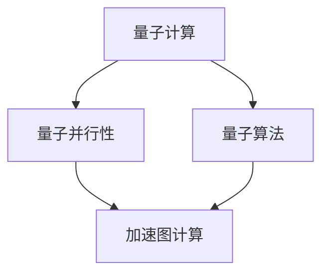
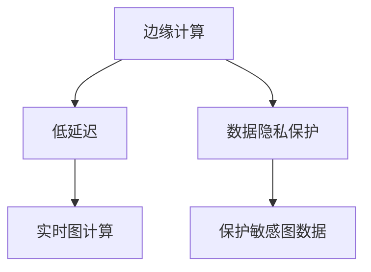
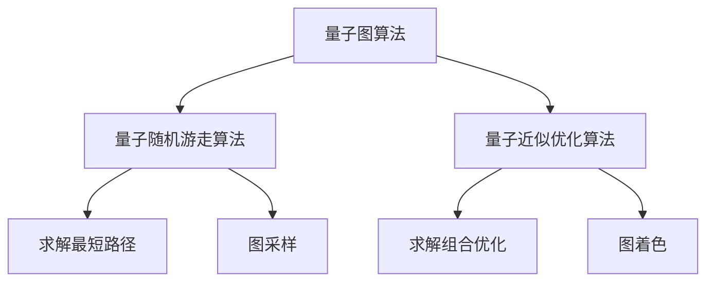
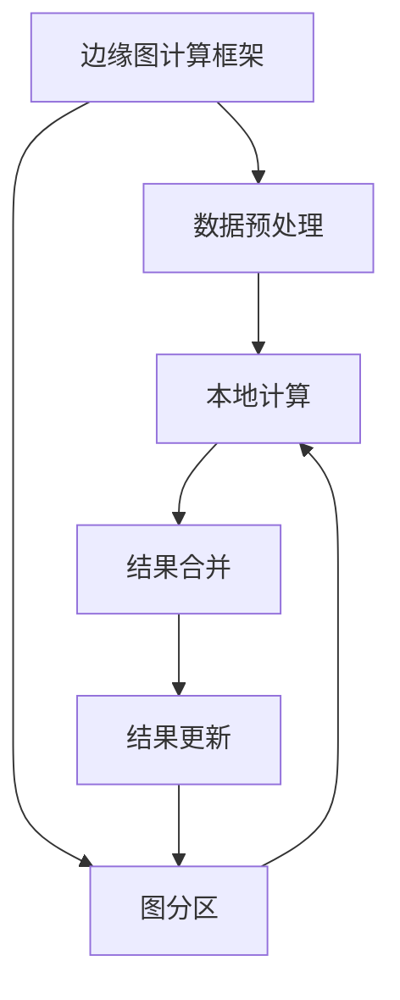

# 图计算引擎的未来发展方向：量子计算、边缘计算

## 1.背景介绍

### 1.1 图计算的重要性

在当今数据驱动的世界中,图计算已经成为一种越来越重要的计算范式。图数据结构能够自然地表示复杂的关系网络,广泛应用于社交网络、知识图谱、交通路线规划、推荐系统等诸多领域。随着数据量的激增和计算需求的不断扩大,高效的图计算引擎变得至关重要。

### 1.2 现有图计算引擎的局限性

现有的图计算引擎主要基于经典计算机架构,在处理大规模图数据时面临着可扩展性、计算效率和能源消耗等挑战。随着图数据规模的持续增长,这些局限性将变得更加突出。因此,探索新兴计算范式以提高图计算引擎的性能成为了一个迫切的需求。

## 2.核心概念与联系

### 2.1 量子计算

量子计算是一种全新的计算范式,利用量子力学原理来执行计算操作。与经典计算机基于二进制位不同,量子计算机使用量子比特(qubit)来表示信息。量子比特可以同时存在0和1的叠加态,从而实现并行计算的能力。

#### 2.1.1 量子并行性

量子并行性是量子计算的核心优势之一。由于量子比特的叠加态特性,量子计算机可以同时处理多个输入状态,从而大幅提高了计算效率。这种并行性在处理图计算等需要探索大量可能状态的问题时尤为有利。

#### 2.1.2 量子算法

量子算法是专门为量子计算机设计的算法,利用了量子力学原理来加速特定类型的计算任务。著名的量子算法包括Shor算法(用于整数分解)、Grover算法(用于无结构搜索)等。对于图计算问题,量子算法可以提供指数级的加速。



### 2.2 边缘计算

边缘计算是一种将计算资源部署在网络边缘的分布式计算范式。与传统的云计算相比,边缘计算可以将数据处理和决策过程更接近数据源,从而减少延迟、提高响应速度。

#### 2.2.1 低延迟

由于边缘计算节点靠近数据源,因此可以大幅减少数据传输延迟,实现近乎实时的计算和响应。这对于需要低延迟的应用场景(如自动驾驶、工业控制等)至关重要。

#### 2.2.2 数据隐私保护

边缘计算可以在本地处理敏感数据,而无需将其传输到远程云端,从而提高了数据隐私和安全性。这对于处理隐私敏感的图数据(如社交网络、医疗记录等)尤为重要。



## 3.核心算法原理具体操作步骤

### 3.1 量子图算法

量子图算法是专门为量子计算机设计的,用于解决图计算相关问题的算法。以下是一些核心的量子图算法及其操作步骤:

#### 3.1.1 量子随机游走算法

量子随机游走算法可用于解决图上的搜索和采样问题,如找到两个节点之间的最短路径。其基本步骤如下:

1. 初始化量子态,表示起始节点的状态。
2. 应用量子游走算子,将量子态在图上扩散。
3. 测量量子态,获得目标节点的概率分布。
4. 根据概率分布,输出最短路径或采样结果。

$$
\begin{aligned}
|s\rangle &= \sum_{v} \alpha_v |v\rangle \\
U |s\rangle &= \sum_{v} \beta_v |v\rangle
\end{aligned}
$$

其中$|s\rangle$表示起始量子态,$U$为量子游走算子,$\alpha_v$和$\beta_v$分别表示节点$v$在初始态和演化后的量子态中的振幅。

#### 3.1.2 量子近似优化算法

量子近似优化算法可用于求解图上的组合优化问题,如最大切集、图着色等。其基本步骤如下:

1. 将优化问题编码为量子态。
2. 初始化量子态为均匀叠加态。
3. 应用量子相位估计算法,估计目标函数的期望值。
4. 通过量子相位反演,将量子态朝向目标函数的最优解演化。
5. 测量量子态,获得近似最优解。

$$
\begin{aligned}
|\psi\rangle &= \frac{1}{\sqrt{2^n}}\sum_x |x\rangle \\
U_f |\psi\rangle &= \frac{1}{\sqrt{2^n}}\sum_x e^{2\pi i f(x)} |x\rangle
\end{aligned}
$$

其中$|\psi\rangle$表示初始均匀叠加态,$U_f$为目标函数的量子算子,$f(x)$为目标函数在$x$上的函数值。



### 3.2 边缘图计算框架

边缘图计算框架旨在利用边缘计算的优势,实现高效、低延迟的图计算。以下是一种典型的边缘图计算框架及其操作步骤:

1. 数据预处理:在边缘节点上对原始图数据进行预处理和清洗,如去重、规范化等。
2. 图分区:将大规模图数据划分为多个子图,分布在不同的边缘节点上。
3. 本地计算:每个边缘节点在本地执行图计算任务,如PageRank、社区发现等。
4. 结果合并:将各个边缘节点的计算结果合并,得到全局图计算结果。
5. 结果更新:根据全局结果,更新边缘节点上的图数据和计算模型。



通过将计算任务分散到多个边缘节点,并利用边缘计算的低延迟优势,该框架可以实现高效、实时的大规模图计算。

## 4.数学模型和公式详细讲解举例说明

### 4.1 量子随机游走

量子随机游走是量子计算中一种重要的概念,可用于解决图上的搜索和采样问题。它基于量子力学原理,利用量子态在图上的扩散行为来加速计算。

#### 4.1.1 量子随机游走模型

考虑一个无向连通图$G=(V,E)$,其中$V$表示节点集合,$E$表示边集合。我们定义量子态$|\psi_t\rangle$表示时刻$t$时量子粒子在图上的位置分布:

$$
|\psi_t\rangle = \sum_{v\in V} \alpha_v(t) |v\rangle
$$

其中$\alpha_v(t)$表示量子粒子在节点$v$上的振幅。量子随机游走的演化由量子游走算子$U$描述:

$$
|\psi_{t+1}\rangle = U |\psi_t\rangle
$$

不同的量子游走算子对应不同的搜索策略,如下所示:

- 连续时间量子游走:

$$
U = i\sum_{(u,v)\in E} |u\rangle\langle v| - |v\rangle\langle u|
$$

- 离散时间量子游走:

$$
U = S^{-1/2} \cdot \left( \sum_{(u,v)\in E} |u\rangle\langle v| + |v\rangle\langle u| \right) \cdot S^{-1/2}
$$

其中$S$为图的度数矩阵。

通过多次应用量子游走算子,量子态会在图上扩散,从而实现搜索和采样的功能。

#### 4.1.2 量子随机游走算法示例

我们以寻找两个节点之间的最短路径为例,说明量子随机游走算法的具体步骤:

1. 初始化量子态$|\psi_0\rangle = |s\rangle$,表示起始节点$s$的状态。
2. 应用量子游走算子$U$,将量子态在图上扩散:$|\psi_t\rangle = U^t |\psi_0\rangle$。
3. 测量量子态$|\psi_t\rangle$,获得目标节点$t$的概率分布$|\langle t|\psi_t\rangle|^2$。
4. 重复步骤2和3,直到概率分布收敛。
5. 根据收敛后的概率分布,输出最短路径。

通过利用量子态的并行性和干涉效应,量子随机游走算法可以比经典算法更快地找到最短路径。

### 4.2 量子近似优化算法

量子近似优化算法(QAOA)是一种用于求解组合优化问题的量子算法,可应用于图着色、最大切集等图计算问题。

#### 4.2.1 QAOA模型

考虑一个组合优化问题,目标函数为$C(x)$,其中$x$为二进制字符串,表示问题的一个可行解。QAOA算法旨在找到一个近似最优解$x^*$,使得$C(x^*)$接近最大值(或最小值)。

QAOA算法的核心思想是将目标函数$C(x)$编码为一个量子算子$U_C$,然后通过量子相位估计和量子相位反演,将初始量子态逐步演化到目标函数的最优解附近。具体步骤如下:

1. 初始化量子态为均匀叠加态:$|\psi_0\rangle = \frac{1}{\sqrt{2^n}}\sum_x |x\rangle$。
2. 应用量子相位估计算法,估计目标函数的期望值:$\langle C \rangle = \langle\psi_0|U_C|\psi_0\rangle$。
3. 通过量子相位反演,将量子态朝向目标函数的最优解演化:$|\psi_1\rangle = e^{i\gamma C}|\psi_0\rangle$。
4. 重复步骤2和3,直到收敛。
5. 测量量子态$|\psi_m\rangle$,获得近似最优解$x^*$。

其中$\gamma$为算法的参数,需要通过经典优化算法来确定。

#### 4.2.2 QAOA应用示例

我们以图着色问题为例,说明QAOA算法的应用。图着色问题的目标是使用最少的颜色为图$G=(V,E)$上的所有节点着色,使得相邻节点的颜色不同。

1. 将图着色问题编码为二进制字符串$x$,其中每个节点$v$对应$\lceil\log_2 k\rceil$个比特位,表示节点$v$的颜色($k$为最大颜色数)。
2. 定义目标函数$C(x)$,对于每一条边$(u,v)\in E$,如果$u$和$v$的颜色相同,则$C(x)$增加一个惩罚项。
3. 将$C(x)$编码为量子算子$U_C$。
4. 应用QAOA算法,获得近似最优解$x^*$,即使用最少颜色的图着色方案。

通过量子并行性和量子相位估计,QAOA算法可以比经典算法更快地找到近似最优解。

## 5.项目实践:代码实例和详细解释说明

### 5.1 量子随机游走算法实现

以下是使用Python和Qiskit量子计算框架实现量子随机游走算法的示例代码:

```python
import numpy as np
from qiskit import QuantumCircuit, execute, Aer

# 定义图结构
graph = {
    0: [1, 2],
    1: [0, 2, 3],
    2: [0, 1, 3],
    3: [1, 2]
}

# 初始化量子线路
n = len(graph)