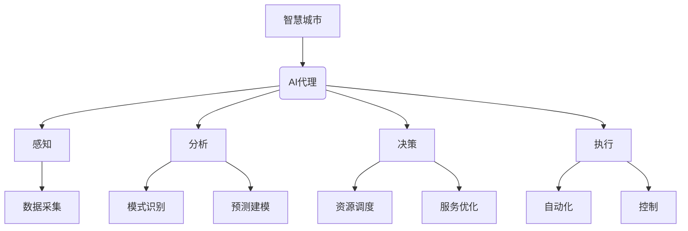

# 在智慧城市中部署AI代理的工作流与应用

## 1. 背景介绍

### 1.1 智慧城市的兴起

随着城市化进程的加快和信息技术的飞速发展,智慧城市(Smart City)的概念应运而生。智慧城市旨在利用先进的信息和通信技术,将城市的各个系统和服务进行整合,实现城市运营的智能化、高效化和可持续发展。

在智慧城市的建设中,人工智能(AI)技术扮演着关键角色。AI代理作为智能系统的核心组成部分,可以通过感知、学习、推理和决策等功能,为城市管理和服务提供智能化支持。

### 1.2 AI代理在智慧城市中的应用价值

AI代理在智慧城市中的应用价值主要体现在以下几个方面:

1. **优化资源配置**:通过对城市数据的分析和建模,AI代理可以优化资源的分配和调度,提高资源利用效率。
2. **提升服务质量**:AI代理可以基于用户需求和行为模式,提供个性化和智能化的服务,提升公共服务的质量和体验。
3. **增强决策支持**:AI代理可以通过数据挖掘和模式识别,为城市管理和决策提供有价值的洞见和建议。
4. **提高运营效率**:AI代理可以自动化和智能化城市的各种运营流程,提高工作效率,降低人力成本。
5. **促进可持续发展**:AI代理可以通过优化能源利用、减少浪费和控制污染,为城市的可持续发展做出贡献。

## 2. 核心概念与联系

### 2.1 AI代理的概念

AI代理是一种具有自主性、反应性、主动性和持续时间概念的软件实体。它能够感知环境,通过推理和决策过程选择行为,并在环境中执行相应的操作。AI代理通常包括以下几个核心组成部分:

1. **感知器(Sensors)**:用于从环境中获取数据和信息。
2. **效力器(Actuators)**:用于在环境中执行操作和行为。
3. **知识库(Knowledge Base)**:存储代理所需的领域知识和规则。
4. **推理引擎(Inference Engine)**:基于知识库和感知数据进行推理和决策。

AI代理可以根据不同的设计目标和应用场景,采用不同的架构和算法,如反应式代理、目标驱动代理、学习代理等。

### 2.2 智慧城市与AI代理的关系

智慧城市是一个复杂的系统,涉及交通、能源、环境、安全、医疗等多个领域。AI代理作为智能系统的核心,可以与智慧城市的各个子系统进行交互和协作,形成一个有机的整体。

AI代理在智慧城市中扮演着"大脑"的角色,通过感知、分析和决策,协调和优化城市的各项运营。同时,智慧城市也为AI代理提供了丰富的数据源和应用场景,促进了AI技术的发展和创新。

智慧城市与AI代理的关系可以用下图来概括:

## 3. 核心算法原理具体操作步骤

在智慧城市中部署AI代理涉及多个环节,包括数据采集、特征工程、模型训练、模型评估、模型部署和模型更新等。下面将详细介绍这些环节的核心算法原理和具体操作步骤。

### 3.1 数据采集

数据采集是AI代理系统的基础,它决定了后续模型的性能和效果。在智慧城市中,数据来源包括物联网传感器、视频监控、移动设备、社交媒体等多个渠道。

常用的数据采集算法包括:

1. **流式数据采集**:适用于实时数据流,如物联网传感器数据。常用算法有Spark Streaming、Apache Kafka等。
2. **批量数据采集**:适用于离线数据集,如历史日志数据。常用算法有Apache Hadoop、Apache Hive等。
3. **网页爬虫**:用于采集网络上的结构化和非结构化数据,如新闻、社交媒体数据等。常用算法有Scrapy、Selenium等。

数据采集的具体操作步骤如下:

1. 确定数据来源和采集目标。
2. 选择合适的数据采集算法和工具。
3. 设计数据采集流程,包括数据抓取、清洗、转换和存储。
4. 实施数据采集,监控采集过程,解决异常情况。
5. 对采集数据进行质量评估,确保数据的完整性和准确性。

### 3.2 特征工程

特征工程是机器学习中一个关键环节,它将原始数据转换为算法可以理解的特征向量,直接影响模型的性能。在智慧城市场景下,特征工程需要处理多源异构数据,提取有价值的特征。

常用的特征工程算法包括:

1. **数值特征处理**:包括归一化、标准化、缺失值填充等。
2. **类别特征处理**:包括One-Hot编码、目标编码、词袋模型等。
3. **文本特征提取**:包括TF-IDF、Word2Vec、BERT等自然语言处理算法。
4. **图像特征提取**:包括SIFT、HOG、CNN等计算机视觉算法。
5. **时序特征提取**:包括滑动窗口、时间序列分解等时序数据处理算法。

特征工程的具体操作步骤如下:

1. 探索性数据分析,了解数据的统计特性和分布情况。
2. 根据业务需求和算法要求,设计特征集。
3. 选择合适的特征工程算法,处理不同类型的原始数据。
4. 特征选择,保留有价值的特征,剔除无关特征。
5. 特征组合,构建高阶特征或交叉特征。
6. 特征评估,验证特征的有效性和可解释性。

### 3.3 模型训练

模型训练是机器学习的核心环节,它将特征数据输入算法,学习出一个可用的模型。在智慧城市场景下,模型训练需要处理大规模数据,并满足实时性、可解释性等要求。

常用的模型训练算法包括:

1. **监督学习算法**:包括线性回归、逻辑回归、决策树、随机森林、支持向量机等。
2. **无监督学习算法**:包括K-Means聚类、高斯混合模型、主成分分析等。
3. **深度学习算法**:包括卷积神经网络、递归神经网络、生成对抗网络等。
4. **强化学习算法**:包括Q-Learning、策略梯度、深度Q网络等。
5. **在线学习算法**:包括在线随机梯度下降、在线贝叶斯等。

模型训练的具体操作步骤如下:

1. 划分训练集、验证集和测试集。
2. 选择合适的模型架构和训练算法。
3. 设置模型超参数,如学习率、正则化系数等。
4. 构建模型训练流程,包括数据输入、前向传播、损失计算、反向传播等。
5. 训练模型,监控训练过程,调整超参数。
6. 在验证集上评估模型性能,选择最优模型。

### 3.4 模型评估

模型评估是保证AI代理系统质量的关键环节,它通过一系列指标来衡量模型的性能和效果,为模型选择和调优提供依据。

常用的模型评估指标包括:

1. **分类任务**:准确率、精确率、召回率、F1分数、ROC曲线、AUC等。
2. **回归任务**:均方根误差、平均绝对误差、R平方等。
3. **聚类任务**:轮廓系数、Calinski-Harabasz指数等。
4. **排序任务**:平均精度、正范数等。

模型评估的具体操作步骤如下:

1. 确定评估指标,根据业务目标选择合适的指标。
2. 在测试集上计算模型的评估指标。
3. 分析评估结果,识别模型的优缺点。
4. 根据评估结果,调整模型架构、超参数或特征集。
5. 重复上述步骤,直至模型性能满足要求。

### 3.5 模型部署

模型部署是将训练好的模型投入实际应用的过程。在智慧城市场景下,模型部署需要考虑实时性、可扩展性、安全性等因素。

常用的模型部署方式包括:

1. **批量预测**:将模型部署在离线环境中,定期对数据进行批量预测。
2. **实时预测**:将模型部署在在线服务中,对实时数据流进行预测。
3. **边缘部署**:将模型部署在边缘设备上,如物联网网关、智能摄像头等。
4. **云部署**:将模型部署在云平台上,提供可扩展的在线预测服务。

模型部署的具体操作步骤如下:

1. 选择合适的部署环境和架构,如容器化、微服务等。
2. 对模型进行优化和压缩,减小模型大小,提高预测效率。
3. 构建模型服务化流程,包括数据输入、预测、结果输出等。
4. 集成模型服务与其他系统,实现数据交互和调用。
5. 监控模型服务的性能和稳定性,进行必要的维护和更新。

### 3.6 模型更新

由于数据分布和业务需求的变化,AI代理系统需要定期更新模型,以保持模型的准确性和效果。模型更新可以采用增量学习或周期重训练的方式。

常用的模型更新算法包括:

1. **在线学习算法**:如在线随机梯度下降、在线贝叶斯等,可以实现持续学习。
2. **迁移学习算法**:利用已有模型的知识,加快新模型的训练过程。
3. **集成学习算法**:将多个模型的预测结果进行组合,提高整体性能。
4. **元学习算法**:自动学习模型的优化策略,加快模型的收敛速度。

模型更新的具体操作步骤如下:

1. 监控模型性能,识别模型老化的迹象。
2. 收集新的训练数据,进行数据清洗和特征工程。
3. 选择合适的模型更新算法,如增量学习或重新训练。
4. 训练新模型,评估新模型的性能。
5. 将新模型部署到生产环境,逐步替换旧模型。
6. 持续监控新模型的表现,进行必要的调整和优化。

## 4. 数学模型和公式详细讲解举例说明

在智慧城市中部署AI代理涉及多种数学模型和公式,下面将详细讲解其中几种常用的模型和公式。

### 4.1 线性回归模型

线性回归是一种常用的监督学习算法,用于预测连续型目标变量。在智慧城市场景下,线性回归可以应用于交通流量预测、能源需求预测等任务。

线性回归模型的数学表达式如下:

$$
y = w_0 + w_1x_1 + w_2x_2 + \cdots + w_nx_n + \epsilon
$$

其中:

- $y$是目标变量
- $x_1, x_2, \cdots, x_n$是特征变量
- $w_0, w_1, \cdots, w_n$是模型参数
- $\epsilon$是随机误差项

模型的目标是通过最小化均方误差,找到最优的参数$w$:

$$
\min_{w} \sum_{i=1}^{m} (y_i - (w_0 + w_1x_{i1} + \cdots + w_nx_{in}))^2
$$

其中$m$是训练样本的数量。

这个优化问题可以通过最小二乘法或梯度下降法等算法求解。

例如,在预测某城市的交通流量时,可以将时间、天气、节假日等作为特征变量,构建线性回归模型进行预测。

### 4.2 