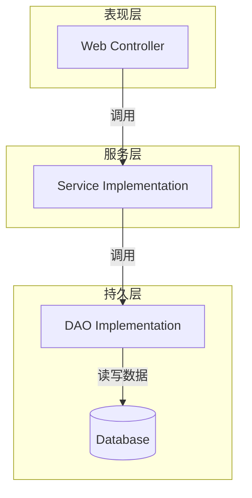

# 在线考试系统详细设计与具体代码实现

## 1.背景介绍

### 1.1 在线考试系统概述

在线考试系统是一种基于网络技术的考试解决方案,它允许考生在任何地点通过互联网参加考试。与传统的纸质考试相比,在线考试系统具有许多优势,例如高效、便捷、环保、成本低廉等。它已被广泛应用于各种考试场景,如入学考试、职业资格认证、企业内部培训测评等。

### 1.2 在线考试系统的作用和意义 

在线考试系统的出现极大地提高了考试的效率和公平性。它消除了纸质考试的种种缺陷,如防止考生作弊、自动评分、实时反馈成绩等,从而确保考试过程的公正性。同时,在线考试系统还可以大大节省人力和物力成本,减少了大量的印刷、发放和收集试卷的工作量。

### 1.3 在线考试系统的发展历程

早期的在线考试系统多采用客户端-服务器(C/S)架构,考生需要在特定的考场电脑上进行考试。随着互联网和Web技术的不断发展,基于B/S架构的在线考试系统应运而生,考生只需一台联网设备即可参加考试,大大提高了灵活性。近年来,移动互联网和云计算技术的兴起,又推动了在线考试系统向移动化和云化方向发展。

## 2.核心概念与联系

### 2.1 在线考试系统的核心概念

- **考试**: 由一组试题组成的考核活动
- **试卷**: 一次考试所包含的全部试题的集合
- **题库**: 存储所有可用于组卷的试题资源库
- **考生**: 参加在线考试的人员
- **考务管理**: 对考试全过程的规划、组织、协调和监督
- **评分策略**: 确定每道题目的分值及评分规则

### 2.2 在线考试系统的关键组成部分

一个完整的在线考试系统通常包括以下几个关键组成部分:

- **用户管理模块**: 负责考生注册、登录、身份认证等
- **试卷组卷模块**: 根据评分策略从题库中自动组装试卷
- **考试交付模块**: 在线发布试卷,控制作答时间,收集答案
- **评分模块**: 根据评分策略自动批改答案并统计成绩
- **成绩查询模块**: 考生可查询个人成绩,监考人员可查询全部成绩  
- **系统管理模块**: 对整个系统进行配置、监控和运维

### 2.3 在线考试系统的核心工作流程

一个典型的在线考试系统工作流程如下:

1. 系统管理员配置考试规则和评分策略
2. 从题库中自动或手动组卷生成试卷
3. 考生进行身份认证并开始作答
4. 考试结束后自动阅卷并统计成绩
5. 考生和监考人员查询成绩

## 3.核心算法原理具体操作步骤  

### 3.1 自动组卷算法

自动组卷是在线考试系统的一个核心功能,它的目标是根据预先设定的组卷策略,从题库中自动选取一组试题构成试卷。一个好的自动组卷算法应该能生成难易程度适中、知识点均衡的高质量试卷。

常用的自动组卷算法有:

1. **蒙特卡洛随机算法**
    - 基本思路是从题库中随机抽取试题,直至满足组卷要求
    - 优点是实现简单,但缺点是生成试卷质量不稳定

2. **贪心算法**
    - 按照题型、难度等约束条件,从题库中遍历选取最佳试题
    - 生成质量较高,但复杂度较高,可能会有局部最优解

3. **层次分析法**
    - 将组卷过程分解为多个层次,逐层进行决策
    - 能生成满足多重约束条件的试卷,但算法复杂

4. **遗传算法**
    - 模拟生物进化过程,通过选择、交叉、变异得到最优解
    - 适合高维度组卷问题,但收敛速度较慢

### 3.2 自动阅卷算法

自动阅卷是在线考试系统的另一核心功能,它能够根据预先设定的评分规则,对考生的答案进行自动批改和评分,极大提高了阅卷效率。

常见的自动阅卷算法有:

1. **精确字符串匹配**
    - 将标准答案与考生答案进行字符串比对
    - 适用于判断题、单项选择题等客观题型
    - 缺点是无法评判主观题

2. **模式匹配**
    - 使用正则表达式或关键词匹配
    - 适用于填空题、简答题等主观题型
    - 需要预先设计好匹配模式

3. **语义相似度计算**
    - 基于自然语言处理技术,计算标准答案与考生答案的语义相似度
    - 适用于主观题阅卷,但需大量标注语料

4. **机器学习模型**
    - 使用监督或无监督学习模型进行自动阅卷
    - 如神经网络、决策树等
    - 准确率较高,但需大量标注数据

### 3.3 考试交付算法

考试交付是指将试卷安全高效地发布给考生,并控制作答时间,收集答案的过程。这是保证在线考试顺利进行的关键。

常见的考试交付算法有:

1. **基于Session的交付**
    - 服务器为每个考生生成唯一的Session
    - 考生通过Session获取试卷并提交答案
    - 防止答案丢失,但无法控制作答时间

2. **基于计时器的交付**
    - 服务器端设置计时器,控制作答时间
    - 时间到自动交卷,防止考生作弊
    - 需要客户端配合,易受网络延迟影响  

3. **基于令牌的交付** 
    - 服务器生成有时间戳的访问令牌
    - 考生只能在令牌有效期内作答
    - 安全性高,可防止重复提交

4. **分布式交付**
    - 采用分布式架构部署交付服务
    - 利用负载均衡和集群技术提高并发能力
    - 适合大规模在线考试

## 4.数学模型和公式详细讲解举例说明

### 4.1 自动组卷数学模型

自动组卷可以建模为一个约束优化问题,目标是在满足多个组卷约束条件的前提下,生成一份最优质量的试卷。

设题库中有$n$道试题,记为$T = \{t_1, t_2, ..., t_n\}$,其中每道试题$t_i$具有若干属性,如题型、知识点、难度系数等。

令$x_i$为0-1决策变量,当$x_i=1$时表示将$t_i$选入试卷,否则不选。

则自动组卷问题可以表示为:

$$
\max\limits_{x} f(x) \\
s.t.\ g_j(x) \leq 0, j=1,2,...,m\\
      x_i \in \{0,1\}, i=1,2,...,n
$$

其中:
- $f(x)$是目标函数,用于评估试卷质量,如知识点覆盖度、难易程度分布等
- $g_j(x)$是组卷约束条件,如试题数量、题型比例、总分值范围等
- $m$是约束条件的个数

这是一个典型的0-1整数规划问题,可以使用整数规划算法如分支定界法、切平面法等进行求解。

### 4.2 自动阅卷数学模型

自动阅卷可以建模为一个模式识别问题,目标是判断考生的答案与标准答案是否匹配。

设有一个标准答案集合$A=\{a_1, a_2, ..., a_m\}$,考生的答案为$x$。我们需要找到一个匹配函数$f$,使得:

$$
f(x, a_i) = \begin{cases}
1, & \text{如果}x\text{与}a_i\text{匹配}\\
0, & \text{如果}x\text{与}a_i\text{不匹配}
\end{cases}
$$

匹配函数可以基于不同的原理,如字符串相似度、语义相似度、机器学习模型等。

对于字符串匹配,可以使用编辑距离(Edit Distance)来度量两个字符串的相似程度:

$$
d(x, y) = \min\limits_{k \geq 0}\{k| x \xrightarrow{k\text{步}} y\}
$$

其中$\xrightarrow{k\text{步}}$表示通过$k$次增删改操作,将$x$转换为$y$。

如果$d(x, a_i) \leq \theta$(阈值),则认为$x$与$a_i$匹配,否则不匹配。

对于语义匹配,可以使用词向量(Word Embedding)技术将答案表示为向量,再计算向量之间的余弦相似度:

$$
\text{sim}(x, y) = \frac{x \cdot y}{\|x\| \|y\|}
$$

如果$\text{sim}(x, a_i) \geq \theta$,则认为$x$与$a_i$语义相似。

此外,还可以使用机器学习模型(如神经网络)自动学习匹配函数。

## 5.项目实践:代码实例和详细解释说明

### 5.1 系统架构设计

在线考试系统通常采用经典的三层架构或微服务架构。以下是一个基于Spring Boot的三层架构设计示例:



- **表现层(Web层)**: 处理HTTP请求,与用户交互,如登录、查询成绩等
- **服务层(Business层)**: 实现业务逻辑,如自动组卷、阅卷、成绩统计等
- **持久层(Data层)**: 执行数据库操作,对试题、试卷、成绩等数据进行增删改查

### 5.2 自动组卷模块实现

以下是一个使用贪心算法实现的自动组卷模块示例(Java代码):

```java
// 试题类
class Question {
    int id;
    String type;   // 题型
    Set<String> points; // 知识点
    int difficulty; // 难度系数
    // ...
}

// 组卷策略配置类
class PaperConfig {
    int numQuestions; // 总题数
    Map<String, Integer> typeRatio; // 题型比例
    Set<String> coverPoints;  // 需覆盖的知识点
    int totalScore; // 总分值范围
    // ...
}

// 自动组卷算法实现
List<Question> autoPaperGeneration(List<Question> questionBank, PaperConfig config) {
    List<Question> paper = new ArrayList<>();
    Map<String, Integer> typeCounts = new HashMap<>(); // 统计各题型数量
    Set<String> coveredPoints = new HashSet<>(); // 统计已覆盖的知识点
    int totalScore = 0;

    // 贪心算法从题库中选取最优试题
    for (Question q : questionBank) {
        if (checkConstraintSatisfied(paper, q, config, typeCounts, coveredPoints, totalScore)) {
            paper.add(q);
            updateStats(typeCounts, coveredPoints, totalScore, q);
        }
        if (paper.size() == config.numQuestions) break;
    }
    return paper;
}

// 检查当前试题是否满足所有约束条件
boolean checkConstraintSatisfied(List<Question> paper, Question q, PaperConfig config,
                                 Map<String, Integer> typeCounts, Set<String> coveredPoints, int totalScore) {
    // 检查题型比例约束
    if (typeCounts.get(q.type) >= config.typeRatio.get(q.type) * config.numQuestions) return false;
    
    // 检查知识点覆盖约束 
    if (!coveredPoints.containsAll(q.points) && !Collections.disjoint(q.points, config.coverPoints)) return true;
    
    // 检查总分值约束
    if (totalScore + q.score > config.totalScore) return false;
    
    // ...检查其他约束条件
    
    return true;
}

// 更新统计数据
void updateStats(Map<String, Integer> typeCounts, Set<String>