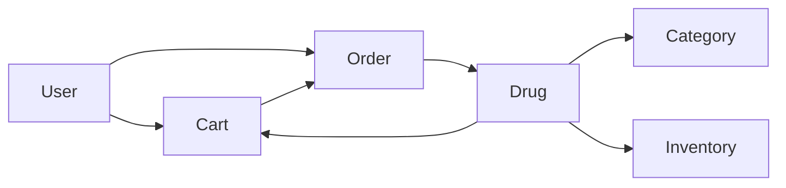

# 在线药店管理系统详细设计与具体代码实现

## 1.背景介绍

在当今互联网时代,电子商务已经深入到各个行业,药品销售行业也不例外。传统的线下药店面临着诸多挑战,如地理位置限制、营业时间限制、库存管理困难等。而在线药店能够突破这些限制,为消费者提供更加便捷、高效的药品购买服务。

本文将详细介绍一个完整的在线药店管理系统的设计与实现。该系统基于Java技术栈,采用主流的Spring Boot框架和MySQL数据库,实现了药品管理、订单管理、用户管理等核心功能模块。通过对系统架构、数据库设计、核心算法、关键代码的深入剖析,帮助读者全面理解在线药店系统的开发过程。

### 1.1 在线药店的优势

- 不受地理位置限制,消费者可以随时随地购买药品
- 24小时全天候营业,满足消费者的用药需求
- 丰富的药品种类,涵盖处方药和非处方药
- 智能化的库存管理,降低药品过期风险
- 完善的物流配送体系,确保药品及时送达

### 1.2 在线药店面临的挑战  

- 药品质量和真伪的保证
- 处方药销售的合法性审核
- 用户隐私数据的安全保护
- 物流配送的时效性与药品储存条件
- 系统高并发、高可用性的保障

## 2.核心概念与关联

在线药店管理系统涉及到的核心概念包括:

- 药品(Drug):药品的基本信息,如药品名称、类别、规格、生产厂商、价格等。
- 药品类别(Category):药品的分类信息,如处方药、非处方药、中药、西药等。
- 订单(Order):用户提交的药品订单,包含订单号、用户ID、药品信息、数量、金额、收货地址、订单状态等。
- 用户(User):注册用户的信息,如用户名、密码、姓名、联系方式等。
- 购物车(Cart):用户选择购买的药品的临时存储,包含药品ID、数量等。
- 库存(Inventory):药品的库存信息,包括药品ID、当前库存量、库存警戒值等。

这些核心概念之间的关系如下:



## 3.核心算法原理与具体操作步骤

在线药店管理系统涉及到的核心算法主要有:

### 3.1 订单状态流转算法

订单状态流转是指订单从创建到完成的整个过程中,所经历的不同状态。常见的订单状态包括:

1. 待支付(PENDING):订单已创建,等待用户支付。
2. 已支付(PAID):用户已完成支付,等待商家发货。
3. 已发货(SHIPPED):商家已发货,等待用户确认收货。
4. 已完成(COMPLETED):用户已确认收货,订单完成。
5. 已取消(CANCELED):订单因某些原因被取消,如用户主动取消、超时未支付自动取消等。

订单状态流转的具体操作步骤如下:

1. 用户提交订单,订单状态为待支付(PENDING)。
2. 用户完成支付,订单状态变为已支付(PAID)。
3. 商家发货,订单状态变为已发货(SHIPPED)。
4. 用户确认收货或超过一定时间自动确认,订单状态变为已完成(COMPLETED)。
5. 如果用户主动取消订单或超时未支付,订单状态变为已取消(CANCELED)。

### 3.2 库存更新算法

库存更新是指在用户下单和取消订单时,对相应药品的库存数量进行增减的操作。具体操作步骤如下:

1. 用户提交订单时,根据订单中的药品ID和数量,对相应药品的库存数量进行预减操作。
2. 如果库存不足,则下单失败,提示用户库存不足。
3. 如果用户支付成功,则对预减的库存数量进行确认,正式减少库存。
4. 如果用户取消订单或支付超时,则将预减的库存数量恢复,增加库存。

## 4.数学模型和公式详细讲解举例说明

在线药店管理系统中涉及到的数学模型主要有:

### 4.1 销量预测模型

销量预测是指根据历史销售数据,预测未来一段时间内的药品销量。常用的销量预测模型有移动平均法、指数平滑法等。以移动平均法为例,假设某药品最近5天的销量如下:

$$ 
\begin{aligned}
&第1天:20件\\
&第2天:25件\\
&第3天:30件\\
&第4天:28件\\
&第5天:32件
\end{aligned}
$$

则第6天的预测销量为:

$$
\frac{20+25+30+28+32}{5}=27件
$$

### 4.2 用户评分预测模型

用户评分预测是指根据用户历史评分数据,预测用户对某药品的评分。常用的评分预测模型有协同过滤算法。假设用户A和用户B对药品X和Y的评分如下:

$$
\begin{aligned}
&用户A:药品X(4分),药品Y(3分)\\
&用户B:药品X(5分),药品Y(?)
\end{aligned}
$$

根据用户A和B对药品X的评分相似性,可以预测用户B对药品Y的评分:

$$
药品Y_{用户B}=\frac{药品X_{用户B}}{药品X_{用户A}}\times 药品Y_{用户A}=\frac{5}{4}\times 3=3.75分
$$

## 5.项目实践:代码实例和详细解释说明

下面以订单状态流转和库存更新为例,给出相关代码实例和解释说明。

### 5.1 订单状态流转

```java
public enum OrderStatus {
    PENDING, PAID, SHIPPED, COMPLETED, CANCELED
}

public class Order {
    private Long id;
    private OrderStatus status;
    // 其他属性省略
    
    public void pay() {
        if (status == OrderStatus.PENDING) {
            status = OrderStatus.PAID;
            // 调用库存更新接口,确认预减库存
            inventory.confirmReduce(this);
        } else {
            throw new IllegalStateException("当前订单状态不允许支付");
        }
    }
    
    public void ship() {
        if (status == OrderStatus.PAID) {
            status = OrderStatus.SHIPPED;
        } else {
            throw new IllegalStateException("当前订单状态不允许发货");
        }
    }
    
    public void complete() {
        if (status == OrderStatus.SHIPPED) {
            status = OrderStatus.COMPLETED;
        } else {
            throw new IllegalStateException("当前订单状态不允许完成");
        }
    }
    
    public void cancel() {
        if (status == OrderStatus.PENDING || status == OrderStatus.PAID) {
            status = OrderStatus.CANCELED;
            // 调用库存更新接口,恢复预减库存
            inventory.restore(this);
        } else {
            throw new IllegalStateException("当前订单状态不允许取消");
        }
    }
}
```

以上代码定义了订单状态枚举类型`OrderStatus`,以及订单类`Order`。在`Order`类中定义了`pay()`、`ship()`、`complete()`、`cancel()`等方法,用于处理订单状态的流转。例如:

- `pay()`:当订单状态为待支付(PENDING)时,可以调用此方法完成支付,订单状态变为已支付(PAID),同时调用库存更新接口确认预减库存。
- `ship()`:当订单状态为已支付(PAID)时,可以调用此方法进行发货,订单状态变为已发货(SHIPPED)。
- `complete()`:当订单状态为已发货(SHIPPED)时,可以调用此方法完成订单,订单状态变为已完成(COMPLETED)。
- `cancel()`:当订单状态为待支付(PENDING)或已支付(PAID)时,可以调用此方法取消订单,订单状态变为已取消(CANCELED),同时调用库存更新接口恢复预减库存。

### 5.2 库存更新

```java
public class Inventory {
    private Map<Long, Integer> stockMap = new HashMap<>(); // 药品ID -> 库存量
    
    public synchronized boolean reduceStock(Long drugId, Integer amount) {
        Integer stock = stockMap.get(drugId);
        if (stock == null || stock < amount) {
            return false; // 库存不足
        }
        stockMap.put(drugId, stock - amount);
        return true;
    }
    
    public synchronized void confirmReduce(Order order) {
        // 从订单中获取药品ID和数量,正式减少库存
        // ...
    }
    
    public synchronized void restore(Order order) {
        // 从订单中获取药品ID和数量,恢复库存
        // ...
    }
}
```

以上代码定义了库存类`Inventory`,用于管理药品库存。其中:

- `stockMap`:用于存储药品ID与对应的库存量。
- `reduceStock()`:用于预减库存,在用户下单时调用。如果库存不足,返回false,下单失败。
- `confirmReduce()`:用于确认预减库存,在用户支付成功后调用。从订单中获取药品ID和数量,正式减少库存。
- `restore()`:用于恢复预减库存,在用户取消订单或支付超时时调用。从订单中获取药品ID和数量,恢复库存。

## 6.实际应用场景

在线药店管理系统的实际应用场景包括:

### 6.1 处方药销售管理

在线药店需要严格管控处方药的销售,具体流程如下:

1. 用户提交处方药订单时,需要上传医生处方。
2. 药店药师审核处方的真实性和合法性。
3. 审核通过后,用户才能完成支付,药店发货。
4. 处方药订单需要特殊标识,以便药师优先处理。

### 6.2 慢性病药品自动续订

对于慢性病患者,在线药店可以提供药品自动续订服务,具体流程如下:

1. 用户在药店设置自动续订,选择药品和周期(如每月)。
2. 系统自动生成订单,并通知用户进行支付。
3. 用户支付成功后,系统自动安排发货。
4. 发货完成后,系统自动更新下一次续订时间。

### 6.3 药品促销活动

在线药店可以开展各种促销活动,提高销量和用户粘性,如:

1. 针对处方药,满足某些条件(如上传处方)即可享受折扣。
2. 针对常见慢性病药品,设置会员价,吸引老客户。
3. 针对滞销药品,设置限时特价,加速库存周转。
4. 针对新用户,设置首单优惠,吸引新客户。

## 7.工具和资源推荐

### 7.1 开发工具

- IntelliJ IDEA:业界公认的优秀Java IDE,提供了智能代码提示、重构、调试等功能。
- Navicat:强大的数据库管理工具,支持MySQL、Oracle、SQL Server等主流数据库。
- Postman:API开发和测试工具,可以方便地模拟HTTP请求,测试接口。

### 7.2 技术框架

- Spring Boot:基于Spring的快速开发框架,内置Web服务器,开箱即用。
- MyBatis:优秀的Java持久层框架,支持自定义SQL、存储过程等高级特性。
- Dubbo:高性能Java RPC框架,提供了服务注册、负载均衡、服务治理等功能。
- Redis:高性能的key-value内存数据库,常用于缓存和分布式锁。

### 7.3 学习资源

- Spring官方文档:https://spring.io/projects/spring-boot
- MyBatis官方文档:https://mybatis.org/mybatis-3/
- Dubbo官方文档:https://dubbo.apache.org/zh/
- Redis官方文档:https://redis.io/documentation
- 《Java核心技术》系列书籍
- 《Spring实战》
- 《MyBatis从入门到精通》
- 《Redis设计与实现》

## 8.总结:未来发展趋势与挑战

随着互联网医疗的发展,在线药店将迎来更广阔的市场前景。未来在线药店的发展趋势可能包括:

1. 处方药销售的全面电子化,处方审核更加智能化。
2. 药品追溯体系的完善,保障药品来源可查、去向可追。
3. 人工智能技术的应用,实现智能导诊、用药指导等功能。
4. 与医疗机构的深度合作,提供一站式医药