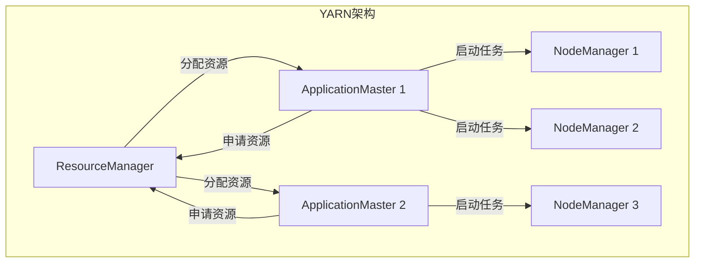
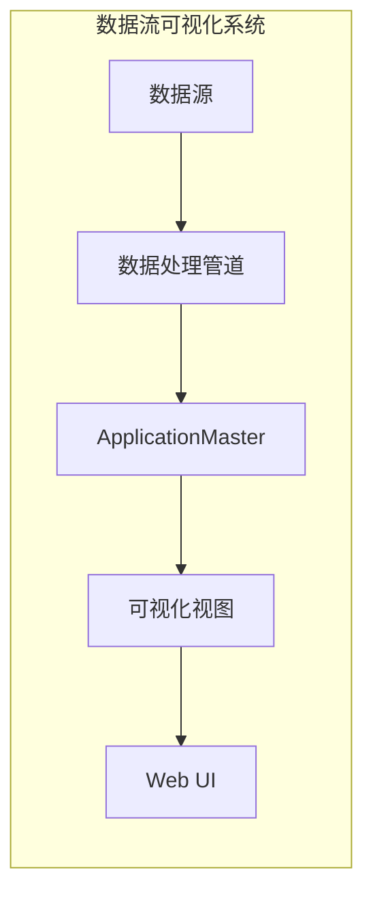

# 基于ApplicationMaster的数据流可视化实战

## 1.背景介绍

### 1.1 数据可视化的重要性

在当今的数据时代,数据无处不在,数据量也在不断增长。然而,纷繁复杂的数据本身并没有太大价值,关键是如何从海量数据中提取有价值的信息并加以利用。数据可视化技术正是解决这一问题的有力工具。

数据可视化是指将抽象的数据转化为图形化的表示形式,使人们能够更直观、更高效地理解和分析数据。通过将数据映射到视觉元素(如点、线、面、颜色等)上,数据可视化可以揭示数据中隐藏的模式、趋势和异常,从而支持数据驱动的决策和洞见发现。

### 1.2 数据流可视化的挑战

随着大数据时代的到来,数据不仅呈现出海量的特点,而且数据产生和传输的速度也越来越快。传统的数据可视化方法往往针对静态数据集,难以有效处理动态、持续到来的数据流。因此,数据流可视化应运而生。

数据流可视化是指对连续不断产生的数据流进行实时或准实时的可视化表示和分析。与静态数据可视化相比,数据流可视化面临着诸多挑战:

- 实时性:需要在数据到达时快速更新可视化视图,满足低延迟的要求。
- 无界性:数据流是无界的,不能一次性加载所有数据进行处理。
- 动态性:数据流的分布和模式可能会随时间动态变化。
- 大规模:需要处理大量的数据流,对系统的计算能力和内存利用率提出了更高要求。

### 1.3 ApplicationMaster在数据流可视化中的作用

Apache Hadoop YARN是一种新的资源协调和管理架构,可以支持多种数据处理模型。在YARN中,ApplicationMaster(AM)负责协调和监控应用程序的执行。

在数据流可视化领域,ApplicationMaster可以发挥重要作用。它可以作为一个独立的组件,负责管理和协调数据流可视化应用的整个生命周期,包括资源分配、任务调度、容错恢复等。通过将可视化逻辑与数据处理管道解耦,ApplicationMaster可以提高系统的灵活性和可扩展性。

本文将详细探讨如何基于ApplicationMaster构建一个高效、可靠的数据流可视化系统,并介绍相关的核心概念、算法原理和实现细节。

## 2.核心概念与联系

### 2.1 YARN架构概览

Apache Hadoop YARN是一种新的资源协调和管理架构,旨在支持多种数据处理模型。YARN主要由以下几个核心组件组成:

- ResourceManager(RM):集群资源管理器,负责管理和分配集群资源。
- NodeManager(NM):节点管理器,负责管理单个节点上的资源和容器。
- ApplicationMaster(AM):应用程序管理器,负责协调和监控应用程序的执行。
- Container:YARN中的资源抽象,封装了CPU、内存等资源。

YARN采用了Master-Slave架构,ResourceManager充当Master角色,NodeManager充当Slave角色。当用户提交应用程序时,ResourceManager会为该应用程序分配一个Container,并在该Container中启动ApplicationMaster。ApplicationMaster负责向ResourceManager申请资源,并在获取到资源后,启动相应的任务在NodeManager上运行。

### 2.2 数据流可视化系统架构

在基于ApplicationMaster的数据流可视化系统中,ApplicationMaster扮演着核心角色。它不仅负责管理和协调数据处理管道,还负责管理和更新可视化视图。

系统架构可以概括为以下几个主要组件:

- **数据源**: 产生连续的数据流,可以是各种数据源,如日志文件、消息队列、数据库等。
- **数据处理管道**: 负责对数据流进行预处理、转换和聚合等操作,以便于后续的可视化展示。
- **ApplicationMaster**: 负责协调和管理整个数据流可视化应用的生命周期,包括资源分配、任务调度、容错恢复等。它还负责维护可视化视图的状态,并根据数据流的变化实时更新视图。
- **可视化视图**: 以图形化的形式展示数据流的动态变化,可以采用不同的可视化技术,如折线图、柱状图、散点图等。
- **Web UI**: 提供基于Web的用户界面,允许用户与可视化视图进行交互,如改变视图类型、调整参数等。

### 2.3 核心概念总结

在基于ApplicationMaster的数据流可视化系统中,涉及以下几个核心概念:

- **数据流**: 连续不断产生的数据序列,是可视化对象。
- **数据处理管道**: 对数据流进行预处理、转换和聚合,为可视化做准备。
- **ApplicationMaster**: 管理和协调整个数据流可视化应用,维护可视化视图状态。
- **可视化视图**: 以图形化形式展示数据流的动态变化。
- **Web UI**: 提供基于Web的用户交互界面。

这些概念相互关联、协同工作,共同构建了一个完整的数据流可视化解决方案。

## 3.核心算法原理具体操作步骤

### 3.1 数据流处理算法

在数据流可视化系统中,数据处理管道扮演着至关重要的角色。它需要对连续到来的数据流进行实时处理,以满足可视化的需求。常见的数据流处理算法包括:

#### 3.1.1 滑动窗口算法

滑动窗口算法是处理数据流的一种常用技术。它将数据流划分为多个窗口,每个窗口包含一定时间范围内的数据。算法在每个窗口上执行计算,并将结果作为输出。

滑动窗口算法的关键步骤如下:

1. 确定窗口大小(时间范围)和滑动步长。
2. 初始化一个空窗口。
3. 对每个新到来的数据元素:
   - 将其添加到当前窗口。
   - 如果当前窗口已满,则在当前窗口上执行计算,输出结果。
   - 根据滑动步长,移动窗口到下一个位置。
4. 重复步骤3,直到数据流结束。

滑动窗口算法可以用于计算移动平均值、计数、求和等操作,适用于需要基于最近数据进行计算的场景。

#### 3.1.2 增量计算算法

增量计算算法是另一种常见的数据流处理技术。它基于这样一个观察:在数据流中,新到来的数据通常只会导致部分计算结果发生变化,而不需要重新计算所有结果。

增量计算算法的关键步骤如下:

1. 初始化一个空的数据结构(如哈希表、树等)。
2. 对每个新到来的数据元素:
   - 更新数据结构,反映新数据的影响。
   - 根据更新后的数据结构,增量计算受影响的结果。
3. 重复步骤2,直到数据流结束。

增量计算算法可以显著减少计算开销,提高处理效率。它适用于可以增量更新的计算,如计数、求和、最大/最小值等。

#### 3.1.3 近似计算算法

对于某些计算密集型的数据流处理任务,精确计算可能会带来过高的计算开销。在这种情况下,可以采用近似计算算法,以空间和时间开销为代价,换取更高的计算效率。

常见的近似计算算法包括:

- **蓄水池抽样算法**: 用于从数据流中随机抽取一个样本集,样本集的大小是固定的。
- **Bloom过滤器**: 用于快速判断一个元素是否存在于数据流中,具有一定的假阳性率。
- **Count-Min Sketch**: 用于近似计算数据流中元素的频率,具有确定的误差界限。

近似计算算法通常会牺牲一定的精度,但可以显著提高处理效率,适用于对结果精度要求不太严格的场景。

### 3.2 可视化视图更新算法

在数据流可视化系统中,可视化视图需要实时反映数据流的变化。ApplicationMaster需要维护视图的状态,并根据数据处理管道的输出,及时更新视图。

#### 3.2.1 增量更新算法

增量更新算法是一种常见的可视化视图更新策略。它基于这样一个观察:在数据流中,新到来的数据通常只会导致部分视图需要更新,而不需要重新渲染整个视图。

增量更新算法的关键步骤如下:

1. 初始化可视化视图。
2. 对每个新到来的数据批次:
   - 确定受影响的视图区域。
   - 只更新受影响的视图区域,保留其他区域不变。
3. 重复步骤2,直到数据流结束。

增量更新算法可以显著减少视图渲染的开销,提高更新效率。它适用于可以局部更新的视图类型,如折线图、柱状图等。

#### 3.2.2 视图合并算法

在某些情况下,数据流的变化可能会导致视图发生较大的结构变化,增量更新算法可能无法满足需求。这时可以采用视图合并算法。

视图合并算法的关键步骤如下:

1. 初始化可视化视图。
2. 对每个新到来的数据批次:
   - 根据新数据,渲染一个临时视图。
   - 将临时视图与当前视图合并,生成新的视图。
   - 用新视图替换当前视图。
3. 重复步骤2,直到数据流结束。

视图合并算法的关键在于合并操作的实现。可以采用各种图形合并技术,如图层合并、形状合并等。合并操作需要保证视觉连续性,避免视图抖动。

#### 3.2.3 视图缓存算法

为了进一步提高可视化视图的更新效率,可以引入视图缓存机制。视图缓存算法的基本思路是:在内存中维护一个视图缓存,缓存中存储了最近的视图状态。当需要更新视图时,先在缓存中查找是否存在可复用的视图,如果存在,则直接复用;否则,重新渲染视图。

视图缓存算法的关键步骤如下:

1. 初始化一个空的视图缓存。
2. 对每个新到来的数据批次:
   - 在缓存中查找是否存在可复用的视图。
   - 如果存在,则复用该视图,并根据新数据进行增量更新。
   - 如果不存在,则重新渲染视图,并将新视图存入缓存。
3. 重复步骤2,直到数据流结束。

视图缓存算法可以显著减少视图渲染的开销,提高更新效率。但是,它也会占用额外的内存空间,需要合理控制缓存大小。

### 3.3 任务调度算法

在数据流可视化系统中,ApplicationMaster还需要负责任务调度,合理分配计算资源。常见的任务调度算法包括:

#### 3.3.1 先来先服务(FCFS)调度算法

先来先服务(First Come First Served, FCFS)调度算法是一种简单的调度策略。它按照任务到达的顺序依次执行,先到达的任务先获得服务。

FCFS调度算法的优点是公平性和简单性,但缺点是可能会导致某些短任务长时间等待,降低系统吞吐量。

#### 3.3.2 最短作业优先(SJF)调度算法

最短作业优先(Shortest Job First, SJF)调度算法是一种基于任务长