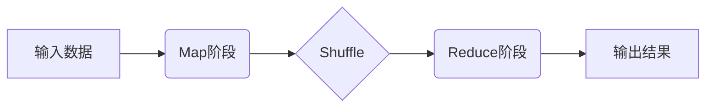
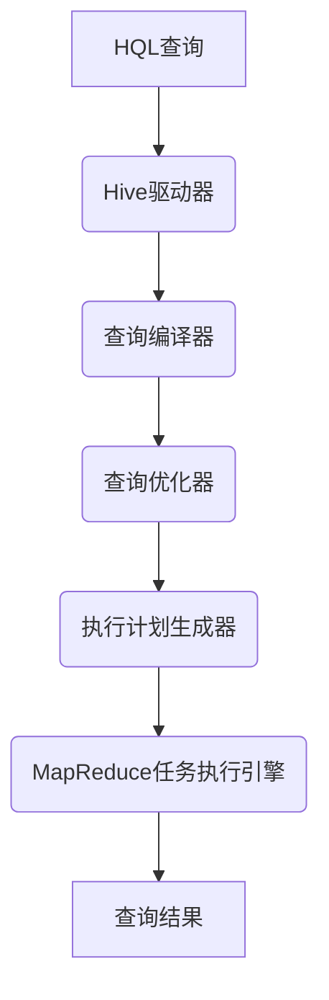

以下是关于"基于Hadoop教育平台的设计与实现"的技术博客文章正文内容：

# 基于Hadoop教育平台的设计与实现

## 1.背景介绍

### 1.1 大数据时代的到来
随着互联网、物联网、云计算等技术的快速发展,数据呈现出爆炸式增长趋势,传统数据处理方式已无法满足当前对海量数据的存储和计算需求。大数据时代的到来,对高效处理海量数据提出了新的挑战。

### 1.2 Hadoop的重要性
Apache Hadoop是一个开源的分布式系统基础架构,由Apache软件基金会开发和维护。它能够可靠且高效地在廉价的商用硬件集群上存储和处理海量数据。Hadoop具有高可靠性、高可扩展性、高性能、高容错性和低成本等特点,已成为大数据处理的核心平台。

### 1.3 教育领域的大数据需求
教育信息化建设的不断推进,使得教育领域也面临着海量数据的存储和处理需求,如学生信息、课程资源、教学活动记录等。传统的数据处理系统已无法满足教育大数据的需求,迫切需要采用新的大数据处理技术来支撑教育信息化建设。

## 2.核心概念与联系

### 2.1 Hadoop核心组件
Hadoop主要由以下几个核心组件组成:

#### 2.1.1 HDFS (Hadoop Distributed File System)
HDFS是Hadoop的分布式文件系统,用于存储海量数据。它具有高容错性、高吞吐量等特点,可以在廉价的商用硬件上构建大规模的数据存储系统。

#### 2.1.2 MapReduce
MapReduce是Hadoop的分布式计算框架,用于并行处理海量数据。它将计算任务拆分为Map和Reduce两个阶段,实现高效的并行计算。

#### 2.1.3 YARN (Yet Another Resource Negotiator)
YARN是Hadoop的资源管理和任务调度框架,负责集群资源管理和任务调度。

#### 2.1.4 Hive
Hive是建立在Hadoop之上的数据仓库工具,提供类SQL语言来管理和查询存储在HDFS上的数据。

#### 2.1.5 HBase
HBase是建立在HDFS之上的分布式列式存储数据库,适合随机实时读写海量数据。

### 2.2 Hadoop教育平台的核心概念
基于Hadoop的教育平台主要包括以下几个核心概念:

#### 2.2.1 数据采集与存储
通过各种渠道(如学生信息系统、教学管理系统等)采集教育数据,并存储到HDFS中。

#### 2.2.2 数据处理与分析
利用MapReduce、Hive等框架对存储在HDFS中的教育数据进行批处理和分析,挖掘有价值的信息。

#### 2.2.3 数据可视化与服务
将处理分析后的数据通过Web界面以可视化的方式呈现给用户,并提供相关的教育服务,如个性化学习推荐、教学质量分析等。

#### 2.2.4 系统管理与运维
对Hadoop集群进行管理和运维,保证系统的高可用性和高性能。

### 2.3 Hadoop教育平台设计的关键点
设计基于Hadoop的教育平台需要重点考虑以下几个方面:

- 数据采集与存储设计
- 数据处理与分析框架选择
- 数据可视化与服务设计
- 系统架构与集群规划
- 系统安全与权限控制

## 3.核心算法原理具体操作步骤  

### 3.1 HDFS文件存储原理
HDFS采用主从架构,包括一个NameNode(名称节点)和多个DataNode(数据节点)。文件数据实际上是分块存储在DataNode上,而NameNode记录了文件到块映射的元数据信息。

文件存储步骤如下:

1. 客户端向NameNode申请上传文件,获取一个可写文件状态
2. NameNode分配一个文件ID,并确定存储文件块的DataNode节点列表
3. 客户端按顺序向DataNode上传文件块数据
4. 客户端完成上传后,通知NameNode完成文件写入
5. NameNode记录文件元数据信息,包括文件ID、文件块ID和DataNode节点信息

### 3.2 MapReduce数据处理流程
MapReduce将计算过程分为Map和Reduce两个阶段,实现并行处理海量数据:



1. **Map阶段**: 输入数据被拆分为多个数据块,并行运行多个Map任务对数据进行处理,生成中间结果
2. **Shuffle阶段**: 对Map阶段的中间结果进行分区、排序等操作,准备输入到Reduce阶段
3. **Reduce阶段**: 对Shuffle后的数据进行汇总、合并等操作,生成最终结果

### 3.3 Hive查询执行流程
Hive将HQL查询语句转换为一系列MapReduce任务在Hadoop集群上执行。查询执行流程如下:



1. 用户提交HQL查询语句
2. Hive驱动器接收HQL查询,并调用查询编译器进行语法解析和语义检查
3. 查询优化器对查询计划进行优化,如选择合适的Join算法等
4. 执行计划生成器根据优化后的查询计划生成MapReduce任务
5. MapReduce任务执行引擎在Hadoop集群上执行MapReduce任务
6. 将最终结果返回给用户

## 4.数学模型和公式详细讲解举例说明

在Hadoop教育平台中,常用的数学模型和公式包括:

### 4.1 数据采样算法
在处理海量教育数据时,常需要先对数据进行采样,以提高计算效率。常用的采样算法包括:

#### 4.1.1 简单随机采样
简单随机采样是指从总体中任意抽取n个样本,每个个体被选中的概率相等。设总体样本量为N,需要抽取的样本量为n,那么每个个体被抽中的概率为:

$$P = \frac{n}{N}$$

#### 4.1.2 分层抽样
分层抽样是指先将总体划分为若干个互不相交的子群(或称为层),再在每一层中用适当的方法抽取一定数量的样本。设第i层的样本量为$N_i$,需要抽取的样本量为$n_i$,则第i层中每个个体被抽中的概率为:

$$P_i = \frac{n_i}{N_i}$$

### 4.2 相似度计算
在教育数据分析中,常需要计算不同实体之间的相似度,如学生行为模式相似度、课程内容相似度等。常用的相似度计算方法包括:

#### 4.2.1 欧几里得距离
欧几里得距离是指两个向量之间的直线距离,公式如下:

$$d(x,y) = \sqrt{\sum_{i=1}^{n}(x_i-y_i)^2}$$

其中$x$和$y$是n维向量,分别表示两个实体的特征向量。

#### 4.2.2 余弦相似度
余弦相似度是指两个向量的夹角余弦值,公式如下:

$$sim(x,y) = \frac{x \cdot y}{\|x\|\|y\|} = \frac{\sum_{i=1}^{n}x_iy_i}{\sqrt{\sum_{i=1}^{n}x_i^2}\sqrt{\sum_{i=1}^{n}y_i^2}}$$

余弦相似度的值域为$[0,1]$,值越大表示两个向量越相似。

### 4.3 推荐系统算法
在教育平台中,常需要为学生推荐个性化的学习资源或课程。常用的推荐算法包括:

#### 4.3.1 协同过滤算法
协同过滤算法根据用户对物品的历史评分数据,计算不同用户之间的相似度或物品之间的相似度,从而预测目标用户对某物品的兴趣程度。

用户相似度可以采用上述的欧几里得距离或余弦相似度来计算。而对于目标用户u对物品i的兴趣评分$r_{ui}$,可以用基于用户的协同过滤算法预测:

$$r_{ui} = \overline{r_u} + \frac{\sum\limits_{v \in S(i,k)}sim(u,v)(r_{vi}-\overline{r_v})}{\sum\limits_{v \in S(i,k)}sim(u,v)}$$

其中$\overline{r_u}$和$\overline{r_v}$分别表示用户u和v的平均评分,$S(i,k)$表示与物品i相似度最高的k个物品集合,$sim(u,v)$表示用户u和v的相似度。

#### 4.3.2 矩阵分解算法
矩阵分解算法将用户对物品的评分数据表示为一个稀疏矩阵,然后将该矩阵分解为两个低维稠密矩阵的乘积,从而学习到用户和物品的隐语义特征向量。

设$R$为$m \times n$的评分矩阵,其中$R_{ij}$表示用户i对物品j的评分。矩阵分解的目标是找到$p \times m$的用户隐语义特征矩阵$U$和$p \times n$的物品隐语义特征矩阵$M$,使得:

$$R \approx U^TM$$

常用的矩阵分解算法包括奇异值分解(SVD)、概率矩阵分解(PMF)等。

## 5.项目实践:代码实例和详细解释说明

本节将通过一个基于Hadoop的学生行为分析项目,展示如何在实践中应用Hadoop技术进行教育大数据处理。

### 5.1 项目概述
该项目旨在分析学生在教育平台上的学习行为数据,包括学习时间、学习资源、学习进度等,从而发现学生的学习模式,为教师提供教学决策支持,并为学生推荐个性化的学习资源。

### 5.2 数据采集
学生学习行为数据来源于教育平台的日志系统,包括以下几个方面:

- 学生基本信息:姓名、年龄、性别等
- 课程信息:课程名称、课程内容等
- 学习行为日志:学习时间、学习资源、学习进度等

使用Python脚本从日志系统中抽取并清洗相关数据,最终将数据存储到HDFS中,作为后续分析的输入数据。

```python
# 连接HDFS
hdfs = InsecureClient('http://namenode:9870')

# 读取学生基本信息
student_info = read_student_info_from_db()
with hdfs.write('hdfs://namenode:9000/user/studentinfo.csv') as writer:
    writer.write(student_info.to_csv(index=False))
    
# 读取课程信息    
course_info = read_course_info_from_db()
with hdfs.write('hdfs://namenode:9000/user/courseinfo.csv') as writer:
    writer.write(course_info.to_csv(index=False))
    
# 读取学习行为日志
learn_log = read_learn_log_from_db()
with hdfs.write('hdfs://namenode:9000/user/learnlog.csv') as writer:
    writer.write(learn_log.to_csv(index=False))
```

### 5.3 数据处理与分析
使用Hive和MapReduce对采集的数据进行处理和分析,主要包括以下几个步骤:

#### 5.3.1 创建Hive表
在Hive中创建外部表,将HDFS上的数据文件与Hive表关联:

```sql
CREATE EXTERNAL TABLE student_info(
    id INT,
    name STRING,
    age INT,
    gender STRING
)
ROW FORMAT DELIMITED
FIELDS TERMINATED BY ','
LOCATION '/user/studentinfo';

CREATE EXTERNAL TABLE course_info(
    id INT, 
    name STRING,
    content STRING
)
ROW FORMAT DELIMITED
FIELDS TERMINATED BY ','
LOCATION '/user/courseinfo';

CREATE EXTERNAL TABLE learn_log(
    student_id INT,
    course_id INT,
    learn_time TIMESTAMP,
    learn_resource STRING,
    learn_progress DOUBLE
)
ROW FORMAT DELIMITED
FIELDS TERMINATED BY ','
LOCATION '/user/learnlog';
```

#### 5.3.2 学习行