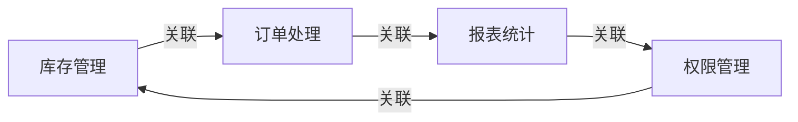

## 1.背景介绍

在现代化的仓储管理中，仓库管理系统(Warehouse Management System, WMS)成为了企业信息化建设的重要组成部分。在这个信息化的时代，库房管理系统的设计与实现，尤其是基于J2EE的库房管理系统，是一个值得深入研究和探讨的话题。

J2EE（Java 2 Platform Enterprise Edition）是一个为企业级应用设计的标准平台，它将面向企业转型的环境中的对象、组件、服务和应用程序集成到一个高度可扩展的、跨平台的环境中。基于J2EE的库房管理系统，能够提供强大的数据处理能力，满足库房管理的各种需求。

## 2.核心概念与联系

库房管理系统主要涉及到以下几个核心概念：

- **库存管理**：库存管理是库房管理的核心，包括库存的入库、出库、转移、盘点等操作。
- **订单处理**：订单处理包括订单的创建、修改、查询和删除等操作。
- **报表统计**：报表统计是对库房数据进行统计分析，生成各种报表。
- **权限管理**：权限管理是对系统用户进行管理，包括用户的添加、删除、修改和查询，以及对用户权限的设置。

这些核心概念之间的联系可以通过以下的Mermaid流程图进行展示：



## 3.核心算法原理具体操作步骤

基于J2EE的库房管理系统的设计与实现，主要包括以下几个步骤：

1. **需求分析**：对库房管理的需求进行详细的分析和定义，确定系统的功能模块。
2. **系统设计**：根据需求分析的结果，进行系统的设计，包括数据库设计、页面设计和接口设计等。
3. **系统实现**：根据系统设计的结果，进行系统的编码实现。
4. **系统测试**：对系统进行详细的测试，确保系统的功能正确性和稳定性。

## 4.数学模型和公式详细讲解举例说明

在库房管理系统中，经常需要进行库存量的计算。这里我们以最简单的库存量计算为例，介绍一下相关的数学模型和公式。

假设我们的库房只有一种商品，其初始库存量为$Q_0$，每次入库数量为$Q_{in}$，每次出库数量为$Q_{out}$，则在任意时刻$t$，商品的库存量$Q_t$可以表示为：

$$
Q_t = Q_0 + \sum_{i=1}^{t}(Q_{in_i} - Q_{out_i})
$$

这个公式告诉我们，任意时刻的库存量，等于初始库存量加上每次入库量和出库量的差值的累加。

## 5.项目实践：代码实例和详细解释说明

接下来，我们将通过一个简单的例子，来展示如何使用J2EE来实现一个库房管理系统的基本功能。

首先，我们需要创建一个商品类（Product.java）：

```java
public class Product {
    private String id;  // 商品ID
    private String name;  // 商品名称
    private int quantity;  // 商品库存量

    // 省略getter和setter方法
}
```

然后，我们创建一个商品管理类（ProductManager.java），用于管理商品的入库和出库操作：

```java
public class ProductManager {
    private Map<String, Product> productMap = new HashMap<>();

    // 商品入库
    public void in(String id, int quantity) {
        Product product = productMap.get(id);
        if (product == null) {
            product = new Product();
            product.setId(id);
            product.setName("商品" + id);
            productMap.put(id, product);
        }
        product.setQuantity(product.getQuantity() + quantity);
    }

    // 商品出库
    public void out(String id, int quantity) {
        Product product = productMap.get(id);
        if (product != null && product.getQuantity() >= quantity) {
            product.setQuantity(product.getQuantity() - quantity);
        }
    }

    // 省略其他方法
}
```

以上代码只是一个简单的示例，真实的库房管理系统会包含更多的功能和复杂的逻辑。

## 6.实际应用场景

基于J2EE的库房管理系统可以应用在各种需要进行库房管理的场景中，例如：

- **制造业**：制造业企业可以使用库房管理系统来管理原材料的入库和出库，以及成品的存储和发货。
- **零售业**：零售业企业可以使用库房管理系统来管理商品的库存，以及进行库存盘点和库存预警等操作。
- **物流业**：物流业企业可以使用库房管理系统来管理