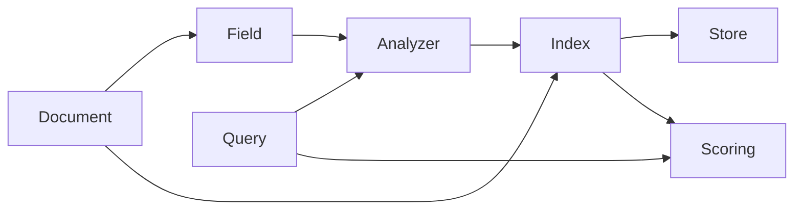

# 基于Lucene的信息检索系统详细设计与具体代码实现

## 1. 背景介绍

在当今信息爆炸的时代,高效准确的信息检索系统变得越来越重要。无论是在互联网搜索、企业内部知识管理,还是个人信息整理方面,都需要一个强大的信息检索工具。而 Lucene 正是这样一个优秀的开源全文检索引擎库,它提供了丰富的 API,使得开发者可以方便地构建自己的搜索应用。本文将详细介绍如何利用 Lucene 设计并实现一个完整的信息检索系统,包括系统架构设计、核心算法原理、关键代码实现等方面,力求为读者提供一个全面、深入、实用的 Lucene 应用指南。

### 1.1 Lucene 简介

Lucene 是一个用 Java 编写的高性能、可扩展的开源全文检索引擎库,最初由 Doug Cutting 于 1999 年创建。Lucene 并不是一个完整的搜索应用程序,而是为开发者提供了一系列构建搜索功能的工具类和 API。目前,Lucene 已经成为 Apache 软件基金会的顶级项目,被广泛应用于各种规模的搜索场景中。

Lucene 的主要特点包括:

- 高性能:Lucene 采用了倒排索引、压缩存储等技术,搜索速度非常快。
- 可扩展:Lucene 的架构设计非常灵活,可以方便地进行二次开发和定制。 
- 丰富的查询语言:Lucene 支持布尔查询、短语查询、通配符查询、模糊查询等多种查询方式。
- 跨平台:Lucene 基于 Java 开发,可以运行在各种操作系统上。
- 多语言:Lucene 支持多种语言的分词和检索。

### 1.2 信息检索系统概述

信息检索(Information Retrieval,简称 IR)是根据用户的信息需求,从海量信息中找出相关信息的过程。一个典型的信息检索系统通常由以下几个核心部分组成:

- 信息采集:从各种渠道获取原始文本数据,如网页抓取、文件上传等。
- 文本预处理:对原始文本进行切分、过滤、归一化等操作,生成适合建立索引的结构化数据。
- 索引构建:对预处理后的文本数据建立倒排索引,加快搜索速度。
- 查询处理:接收并解析用户输入的查询语句,生成对应的查询计划。
- 相关度排序:根据查询词和索引信息,计算每个文档的相关度得分,按照得分高低排序。
- 结果展示:将排序后的搜索结果返回给用户,并提供必要的导航和交互功能。

本文将围绕这些核心部分,讲解如何使用 Lucene 一步步构建一个完整的信息检索系统。

## 2. 核心概念与联系

在深入讨论 Lucene 的技术细节之前,我们有必要先了解一下 Lucene 中的一些核心概念,以及它们之间的关系。

### 2.1 文档(Document)

在 Lucene 中,文档是信息的基本单元。一个文档包含了一组域(Field),每个域有一个名称和一个值。比如,一篇新闻可以表示为如下的文档:

```
title: Lucene 入门教程
content: Lucene 是一个 Java 开发的全文检索引擎库,它提供了...
author: Tom
timestamp: 2023-05-30 10:00:00
```

其中,title、content、author、timestamp 就是域,它们的值就是对应的标题、正文、作者、时间戳等信息。

### 2.2 域(Field)

域是文档的一个组成部分,由域名和域值构成。Lucene 支持以下几种域的类型:

- 字符串域(StringField):不分词,只能完全匹配,常用于存储标识符、URL 等信息。
- 文本域(TextField):会进行分词和语言处理,用于存储内容性的数据,如新闻正文、商品描述等。
- 数值域(NumericField):用于存储整型、长整型、单精度浮点型等数值类型数据。
- 日期域(DateField):用于存储日期时间类型的数据。

不同类型的域会采用不同的索引方式,从而支持不同的查询需求。

### 2.3 分析器(Analyzer)

分析器是 Lucene 的核心组件之一,它负责在索引和查询时,对文本进行各种转换和处理,包括:

- 字符过滤(Character Filter):对原始文本进行预处理,如去除 HTML 标签、将特殊字符转义等。
- 分词(Tokenizer):将文本切分成一个个词元(Token)。
- 词元过滤(Token Filter):对切分好的词元进行进一步加工,如转小写、同义词处理、词干提取等。

Lucene 内置了多种常用的分析器,如 StandardAnalyzer、WhitespaceAnalyzer 等,也支持自定义分析器以满足特定领域的需求。

### 2.4 索引(Index)

索引是 Lucene 用于快速搜索的核心数据结构,它是对文档集合建立的一种倒排索引。索引的逻辑视图是一个由多个段(Segment)组成的集合,段中包含了词典(Term Dictionary)、词典索引(Term Index)等信息。

当我们向 Lucene 添加一个文档时,Lucene 会对文档的各个域进行分析,生成一系列词元,然后将词元和对应的文档 ID、词频等信息写入索引。在搜索时,Lucene 先对查询语句进行分析,得到查询词元,然后在倒排索引中查找包含这些词元的文档,计算相关度得分,最后将结果返回给用户。

### 2.5 存储(Store)

存储是 Lucene 中与索引相对的另一个重要概念,它决定了域的值是否要和索引一起存储在文件系统中。Lucene 定义了如下几种存储类型:

- Store.YES:把域值存储到文件系统,可以从索引中直接读取。 
- Store.NO:域值不存储,仅将其写入索引,适用于不需要在搜索结果中返回该域值的情况。
- Store.COMPRESS:压缩存储,用于大文本内容的存储,如新闻正文等。

一般来说,标识性的域如文档 ID 可以不存储,而内容性的域如标题、摘要等则需要存储,以便在搜索结果中高亮显示关键词。

### 2.6 查询(Query)

查询是用户描述其信息需求的一种方式,Lucene 支持多种类型的查询,主要有:

- TermQuery:词元查询,要求文档必须包含指定的词元。
- BooleanQuery:布尔查询,支持多个子查询通过 AND、OR、NOT 等布尔操作符进行组合。
- PhraseQuery:短语查询,要求文档必须包含指定的词元序列。
- WildcardQuery:通配符查询,支持使用 `?`、`*` 等通配符进行模糊匹配。
- FuzzyQuery:模糊查询,可以匹配拼写相似的词元,如 "apple" 和 "appple"。
- NumericRangeQuery:数值范围查询,用于匹配数值域在某个区间内的文档。

除了这些基本的查询类型,Lucene 还支持将多个查询组合成复合查询,如 BooleanQuery、DisjunctionMaxQuery 等,以满足更加复杂的搜索需求。

### 2.7 打分(Scoring)

打分是搜索引擎的一个关键功能,用于衡量文档与查询的相关程度。Lucene 采用了 TF-IDF 算法作为默认的相关度计算模型,即:

- TF(Term Frequency):词频,表示一个词元在文档中出现的频率。频率越高,说明文档与该词元的相关度越高。
- IDF(Inverse Document Frequency):逆文档频率,表示一个词元在整个文档集合中的稀有程度。如果一个词出现在很多文档中,其区分度就比较低。

最终文档的得分由查询中每个词元的 TF-IDF 值进行加权求和得到。除了 TF-IDF,Lucene 还支持其他的相关度模型,如 BM25、DFR 等,可以根据实际需求进行选择和定制。

以上就是 Lucene 的一些核心概念,它们之间的关系如下图所示:



从图中可以看出,文档经过分析器处理后写入索引,查询也经过分析器处理后到索引中进行匹配,然后根据打分模型计算相关度,最终将结果返回给用户。理解了这些概念和它们之间的联系,就能更好地掌握 Lucene 的整体工作原理,为后续的开发实践打下基础。

## 3. 核心算法原理与操作步骤

Lucene 作为一个成熟的全文检索引擎库,其内部实现涉及了多种复杂的算法和数据结构。本节将重点介绍 Lucene 的两个核心算法:倒排索引和相关度计算,并给出它们的具体操作步骤。

### 3.1 倒排索引算法

倒排索引(Inverted Index)是 Lucene 实现高性能搜索的关键所在。与正排索引(Forward Index)不同,倒排索引是以词元为中心,记录了每个词元出现在哪些文档中。这种"词元到文档"的映射关系,使得搜索引擎可以快速定位包含查询词的文档,而无需对每个文档进行全文扫描。

倒排索引的核心数据结构由两部分组成:

- 词典(Term Dictionary):存储了所有不重复的词元,并为每个词元分配一个唯一的编号(Term ID)。
- 倒排列表(Posting List):存储了每个词元对应的文档信息,包括文档 ID、词频、位置等。

下面是一个简单的倒排索引示例:

```
Term Dictionary:
- lucene (Term ID: 1)
- search (Term ID: 2) 
- engine (Term ID: 3)

Posting Lists:
- lucene: [(Doc ID: 1, Freq: 2, Positions: [1,5]), (Doc ID: 2, Freq: 1, Positions: [3])]
- search: [(Doc ID: 1, Freq: 1, Positions: [2]), (Doc ID: 3, Freq: 3, Positions: [1,4,7])] 
- engine: [(Doc ID: 2, Freq: 2, Positions: [2,6]), (Doc ID: 3, Freq: 1, Positions: [5])]
```

从上面的例子可以看出,"lucene"这个词出现在文档1的第1个和第5个位置,在文档2的第3个位置;"search"出现在文档1的第2个位置,在文档3的第1、4、7个位置,依此类推。

倒排索引的构建过程可以分为以下几个步骤:

1. 文本分析:对输入的文档进行分词、过滤、归一化等处理,生成一系列词元。
2. 词典构建:将所有词元去重后写入词典,并分配 Term ID。
3. 倒排列表构建:遍历每个文档的词元,在对应的倒排列表中添加文档信息。
4. 索引优化:对倒排列表进行压缩、合并等优化操作,以减小索引文件的大小。

在搜索时,Lucene 先对查询语句进行分析,得到查询词元,然后在词典中查找这些词元的 Term ID,再通过 Term ID 找到对应的倒排列表,最后对倒排列表求交集或并集,得到包含查询词的文档集合。

### 3.2 相关度计算算法

找到包含查询词的文档集合后,搜索引擎还需要对结果进行相关度排序,将最相关的文档排在前面。Lucene 默认采用的是 TF-IDF 算法,其基本思想是:如果一个词在文档中出现的频率越高,且在整个文档集合中出现的频率越低,那么这个词对文档的重要性就越高。

TF-IDF 算法可以用以下公式表示:

$score(q,d) = \sum_{t \in q} tf(t,d) \cdot idf(t)$

其中,$q$ 表示查询,$d$ 表示文档,$t$ 表示查询中的一个词元,$tf(t,d)$ 表示词元 $t$ 在文档 $d$ 