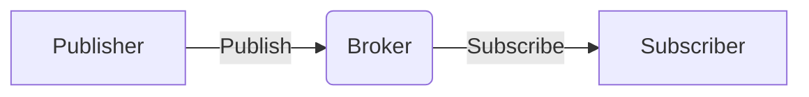
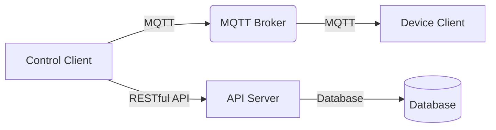

# 基于MQTT协议和RESTful API的智能家居远程控制安全模型

## 1.背景介绍

### 1.1 智能家居的兴起

随着物联网技术的快速发展,智能家居系统逐渐走进千家万户。智能家居系统通过将家居设备连接到互联网,实现了对家电、照明、暖通空调等设备的远程监控和控制,为人们的生活带来了极大的便利。

### 1.2 智能家居系统的安全挑战

然而,智能家居系统的开放性和互联性也带来了一些安全隐患。黑客可能通过网络入侵智能家居系统,窃取用户隐私数据或者控制家居设备,给用户的财产和人身安全带来威胁。因此,构建一个安全可靠的智能家居远程控制系统至关重要。

### 1.3 MQTT和RESTful API

MQTT(Message Queuing Telemetry Transport)是一种轻量级的发布/订阅模式的消息传输协议,非常适合于物联网领域。RESTful API(Representational State Transfer Application Programming Interface)则是一种基于HTTP协议的应用程序接口设计风格,具有简洁、轻量和跨平台等优点。

本文将介绍如何结合MQTT协议和RESTful API,构建一个安全的智能家居远程控制系统。

## 2.核心概念与联系

### 2.1 MQTT协议

MQTT协议基于发布/订阅模式,包括以下几个核心组件:

- 代理(Broker): 消息的中介者,负责分发消息。
- 发布者(Publisher): 发布消息的客户端。
- 订阅者(Subscriber): 订阅消息的客户端。
- 主题(Topic): 消息的类别,由字符串表示。

发布者将消息发布到代理的某个主题,订阅者则订阅感兴趣的主题,从代理处获取消息。



### 2.2 RESTful API

RESTful API遵循REST架构风格,通过HTTP协议的GET、POST、PUT、DELETE等方法对资源进行操作。它具有以下特点:

- 无状态(Stateless): 每次请求都包含完整的必要信息。
- 层级系统(Layered System): 客户端和服务器之间可以有多个中间层。
- 缓存(Cacheable): 响应可以被缓存以提高性能。
- 统一接口(Uniform Interface): 使用标准的HTTP方法对资源进行操作。

### 2.3 结合MQTT和RESTful API

在智能家居远程控制系统中,我们可以将MQTT协议和RESTful API结合使用:

- MQTT协议用于实时监控和控制家居设备,例如开关灯光、调节温度等。
- RESTful API用于管理用户账户、设备信息等,提供更加安全和可靠的操作接口。

通过这种结合,我们可以充分利用两者的优势,实现高效、安全的智能家居远程控制。

## 3.核心算法原理具体操作步骤

### 3.1 MQTT协议原理

MQTT协议的核心原理包括以下几个方面:

1. 发布/订阅模式

发布者(Publisher)将消息发送到代理(Broker),订阅者(Subscriber)从代理处获取感兴趣的消息。这种模式实现了发布者和订阅者的解耦,提高了系统的可扩展性和灵活性。

2. 主题(Topic)层级结构

MQTT协议使用主题(Topic)来对消息进行分类,主题可以采用层级结构,例如`home/livingroom/light`。这种层级结构有助于组织和管理消息,提高了系统的可维护性。

3. 质量服务等级(QoS)

MQTT协议定义了三种质量服务等级(QoS),用于控制消息传递的可靠性:

- QoS 0: 最多一次,消息可能会丢失。
- QoS 1: 至少一次,消息可能会重复。
- QoS 2: 只有一次,确保消息只被传递一次。

根据实际需求选择合适的QoS等级,可以在可靠性和性能之间进行权衡。

4. 持久会话和离线消息

MQTT协议支持持久会话和离线消息,这意味着即使客户端断开连接,代理也会保留会话信息和离线消息,等待客户端重新连接后进行传递。这种机制提高了系统的可靠性和容错性。

### 3.2 RESTful API原理

RESTful API的核心原理包括以下几个方面:

1. 资源(Resource)

RESTful API将系统中的每个实体抽象为一个资源,通过URI(Uniform Resource Identifier)来标识和定位资源。例如,`/users/123`表示ID为123的用户资源。

2. 统一接口

RESTful API使用HTTP协议的标准方法(GET、POST、PUT、DELETE等)对资源进行操作,这些方法具有明确的语义:

- GET: 获取资源
- POST: 创建资源
- PUT: 更新资源
- DELETE: 删除资源

3. 无状态(Stateless)

RESTful API是无状态的,每个请求都包含完整的必要信息,服务器不需要维护会话状态。这种设计简化了服务器的实现,提高了可伸缩性和可靠性。

4. 表现层(Representation)

资源的表现层是资源在特定格式(如JSON或XML)下的状态。客户端通过操作资源的表现层来间接操作资源。

### 3.3 MQTT和RESTful API的结合

在智能家居远程控制系统中,我们可以将MQTT协议和RESTful API结合使用,具体操作步骤如下:

1. 使用MQTT协议实现实时监控和控制家居设备。

- 家居设备作为MQTT客户端,订阅特定的主题,接收控制命令。
- 控制端(如手机APP或网页)作为MQTT客户端,向特定主题发布控制命令。
- MQTT代理负责转发消息。

2. 使用RESTful API管理用户账户、设备信息等。

- 提供RESTful API接口,如`/users`、`/devices`等。
- 客户端通过HTTP方法(GET、POST、PUT、DELETE)操作这些资源。
- API服务器处理请求,与数据库进行交互。

3. 在MQTT客户端和RESTful API之间建立安全通信。

- MQTT客户端使用API获取的凭证(如JWT令牌)进行身份验证。
- API服务器验证客户端的身份,防止未经授权的访问。

通过这种结合,我们可以实现高效的实时控制和安全的账户管理,满足智能家居远程控制系统的需求。

## 4.数学模型和公式详细讲解举例说明

在智能家居远程控制系统中,我们可能需要使用一些数学模型和公式来优化系统性能、提高安全性等。下面将介绍一些常用的模型和公式。

### 4.1 队列模型

在MQTT协议中,代理需要处理来自多个发布者和订阅者的消息,可以将其抽象为一个队列模型。我们可以使用队列论中的一些公式来分析和优化系统性能。

假设消息到达服从泊松分布,服务时间服从负指数分布,则根据M/M/1队列模型,系统的一些重要性能指标如下:

$$
\begin{aligned}
\rho &= \frac{\lambda}{\mu} \\
L &= \frac{\rho}{1-\rho} \\
W &= \frac{L}{\lambda} \\
W_q &= \frac{\rho}{(1-\rho)\mu}
\end{aligned}
$$

其中:

- $\rho$ 是系统利用率
- $\lambda$ 是消息到达率
- $\mu$ 是服务率
- $L$ 是系统中的平均消息数
- $W$ 是消息在系统中的平均时延
- $W_q$ 是消息在队列中的平均时延

通过调整服务率 $\mu$ 或控制到达率 $\lambda$,我们可以优化系统性能,降低时延。

### 4.2 加密算法

为了保护智能家居系统的安全,我们需要使用加密算法对通信数据进行加密。常用的对称加密算法包括AES、DES等,非对称加密算法包括RSA、ECC等。

以AES(Advanced Encryption Standard)算法为例,它是一种对称分组密码,可以用于加密MQTT消息或RESTful API请求/响应的数据。AES算法的核心是一个代数结构,称为有限域 $GF(2^8)$。

在 $GF(2^8)$ 中,每个元素可以用一个8位二进制数表示,运算遵循特定的代数规则。AES算法的加密过程包括多轮迭代,每轮包括以下几个步骤:

1. 字节代替(SubBytes)
2. 行移位(ShiftRows)
3. 列混合(MixColumns)
4. 加轮密钥(AddRoundKey)

其中,字节代替和列混合使用了有限域 $GF(2^8)$ 中的运算,保证了算法的混淆和扩散性能。

通过选择合适的加密算法和密钥长度,我们可以有效防止窃听、篡改等攻击,保护智能家居系统的安全。

### 4.3 身份验证模型

在智能家居远程控制系统中,我们需要对用户和设备进行身份验证,以防止未经授权的访问。常用的身份验证模型包括基于密码的模型、基于令牌的模型等。

以基于JWT(JSON Web Token)的身份验证模型为例,它是一种无状态的身份验证机制,常用于RESTful API的身份验证。

JWT由三部分组成:头部(Header)、有效载荷(Payload)和签名(Signature)。其中,有效载荷包含了一些声明(Claims),如用户ID、过期时间等。签名部分使用了加密算法(如HMAC或RSA)对头部和有效载荷进行签名,用于验证令牌的完整性。

$$
\begin{aligned}
\text{Header} &= \text{Base64UrlEncode}(\text{HeaderJSON}) \\
\text{Payload} &= \text{Base64UrlEncode}(\text{PayloadJSON}) \\
\text{Signature} &= \text{Base64UrlEncode}(\text{HMAC}(\text{HeaderJSON} + \text{PayloadJSON}, \text{Secret}))
\end{aligned}
$$

JWT的工作流程如下:

1. 客户端向服务器发送用户凭证(如用户名和密码)。
2. 服务器验证凭证,如果有效,则生成JWT令牌。
3. 客户端在后续请求中携带JWT令牌。
4. 服务器验证JWT令牌的签名和有效载荷,如果有效,则允许访问。

通过使用JWT等身份验证模型,我们可以确保只有经过授权的用户和设备才能访问智能家居系统,提高系统的安全性。

## 5.项目实践:代码实例和详细解释说明

在本节中,我们将通过一个简单的示例项目,展示如何在实践中结合MQTT协议和RESTful API构建智能家居远程控制系统。

### 5.1 系统架构

我们的示例系统包括以下几个主要组件:

1. MQTT代理(Broker)
2. 家居设备(作为MQTT客户端)
3. 控制端(如手机APP,作为MQTT客户端)
4. RESTful API服务器
5. 数据库(存储用户、设备信息等)



### 5.2 MQTT客户端示例

以Python语言为例,我们可以使用`paho-mqtt`库实现MQTT客户端。

```python
import paho.mqtt.client as mqtt

# 连接到MQTT代理
broker_address = "broker.example.com"
client = mqtt.Client()
client.connect(broker_address)

# 订阅主题
topic = "home/livingroom/light"
client.subscribe(topic)

# 处理接收到的消息
def on_message(client, userdata, msg):
    payload = msg.payload.decode()
    print(f"Received message: {payload} on topic {msg.topic}")
    # 执行相应的操作

client.on_message = on_message

# 发布消息
client.publish(topic, "ON")

# 保持连接
client.loop_forever()
```

在上面的示例中,我们首先连接到MQTT代理,然后订阅主题`home/livingroom/light`。当收到消息时,`on_message`函数会被调用,我们可以在这里执行相应的操作,如控制家居设备。我们还可以使用