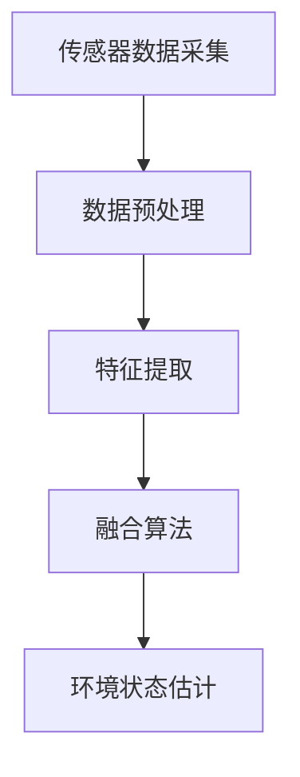
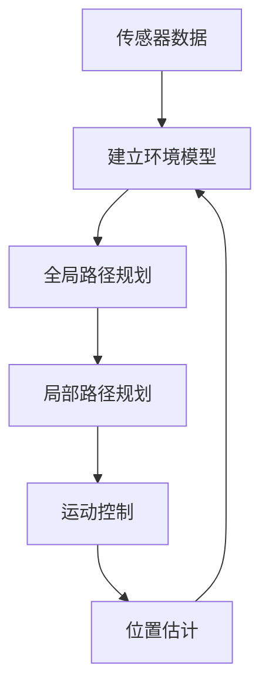
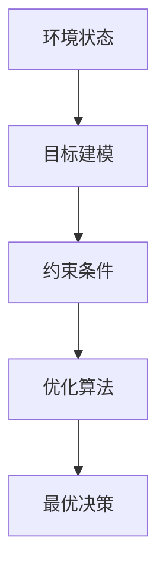
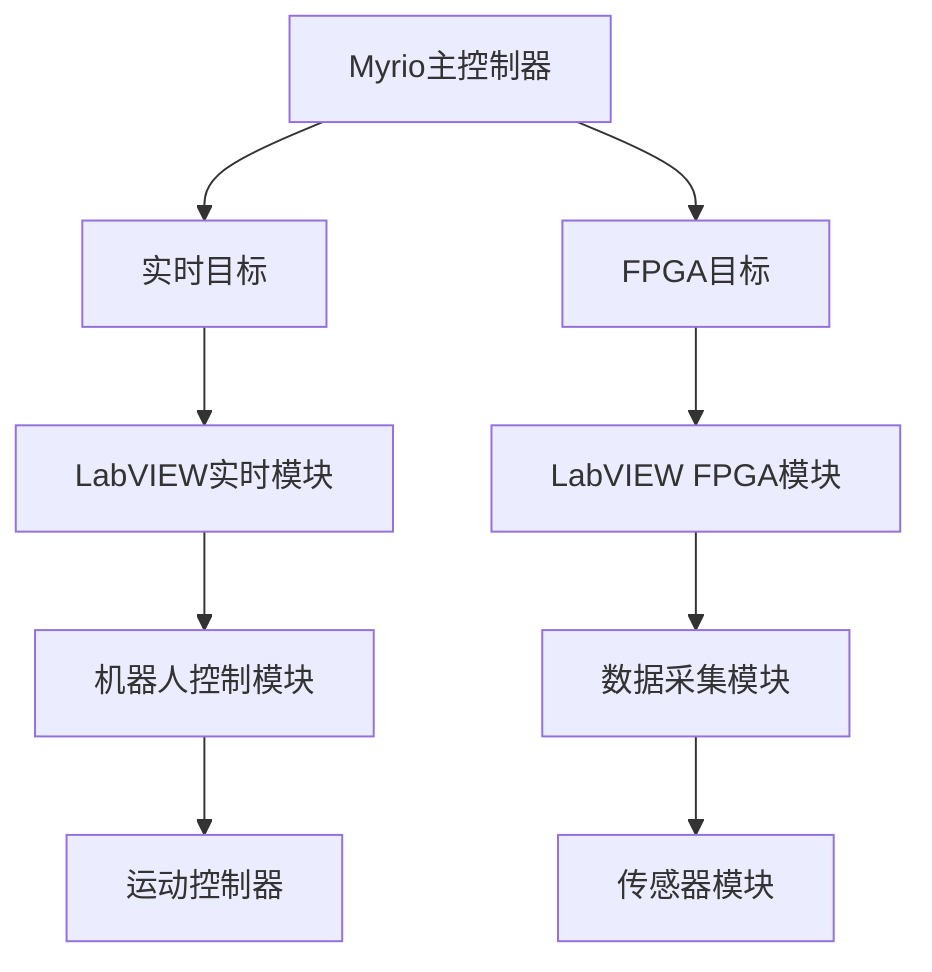

以下是基于您的要求,为您撰写的技术博客文章正文内容:

# 基于Myrio的智能环境检测机器人

## 1.背景介绍

### 1.1 环境监测的重要性

在当今社会,环境质量对人类生存和发展至关重要。空气污染、水污染、土壤污染等环境问题已经成为全球关注的热点问题。及时、准确地监测环境状况,对于制定环保政策、预防环境灾难、保护生态系统具有重要意义。

### 1.2 传统环境监测方法的局限性  

传统的环境监测方法主要依赖人工采样和实验室分析,存在诸多不足:

- 人力成本高、效率低下
- 时间和空间分辨率有限 
- 无法实现连续在线监测
- 部署灵活性差

### 1.3 智能环境监测机器人的优势

智能环境监测机器人凭借其自主移动、感知融合、智能决策等优势,可以突破传统方法的局限,实现环境质量的高效、精准、持续监测。

## 2.核心概念与联系

### 2.1 Myrio控制器

Myrio是一款由国家仪器(NI)公司推出的可编程实时嵌入式控制器,集成了双核ARM Cortex-A9处理器和可重构FPGA芯片。它提供了强大的实时处理能力、丰富的外设接口,以及LabVIEW和Linux RT等开发环境支持,非常适合于机器人控制、数据采集等应用场景。

### 2.2 多传感器融合

环境检测需要监测多种物理、化学指标,如温度、湿度、气体浓度、噪音水平等。通过集成多种传感器,并采用先进的信号处理和数据融合算法,可以全面、准确地感知环境状态。

### 2.3 移动机器人平台

机器人底盘赋予了环境监测系统移动能力,可以根据监测需求,自主规划路径,到达感兴趣的区域开展检测任务。同时,机器人的运动状态也可以作为环境监测的重要数据源。

### 2.4 智能导航与决策

通过融合传感器数据、建立环境模型,机器人可以实现自主导航、路径规划、障碍规避等功能。基于环境感知,机器人还可以进行智能决策,如选择最优监测路径、调整监测策略等。

### 2.5 云端管理与数据分析

将采集的环境数据传输至云端,可以进行大数据分析、模式识别、异常检测等处理,为环境质量评估和决策提供依据。同时,云端也可以下发指令,对机器人的行为进行管理和调度。

## 3.核心算法原理具体操作步骤

智能环境检测机器人系统的核心算法包括以下几个方面:

### 3.1 多传感器数据融合

1. 采集来自多个传感器的原始数据,如温湿度、气体浓度、噪音等
2. 对原始数据进行预处理,如去燥、标准化、插值等,提高数据质量
3. 从预处理数据中提取特征,如统计特征、频域特征、小波特征等
4. 将多源特征通过融合算法(如卡尔曼滤波、粒子滤波、贝叶斯融合等)进行融合
5. 基于融合结果,对环境状态进行估计,得到综合环境质量指数

### 3.2 移动机器人导航与路径规划

1. 通过激光雷达、深度相机等传感器获取环境信息
2. 基于传感器数据,建立环境二维/三维模型,用于路径规划
3. 根据监测任务,利用算法(如A*、D*等)进行全局路径规划
4. 结合实时环境感知,进行局部路径规划,避开动态障碍物
5. 根据规划路径,控制机器人底盘运动
6. 通过里程计、视觉里程计等算法进行位置估计,反馈至环境模型

### 3.3 智能决策与优化

1. 根据环境感知结果,建立环境状态模型
2. 根据监测任务,建立目标模型,如最大覆盖区域、最小能耗等
3. 确定决策的约束条件,如作业时间、电量限制等
4. 利用优化算法(如遗传算法、蚁群算法等)求解最优决策方案
5. 执行最优决策,如调整监测路径、更新监测策略等

## 4.数学模型和公式详细讲解举例说明

### 4.1 卡尔曼滤波

卡尔曼滤波是一种常用的状态估计算法,可用于多传感器数据融合。其核心思想是利用系统状态方程和观测方程,结合先验估计和新的观测值,递推计算最优状态估计及其协方差。

设系统状态为 $\boldsymbol{x}_k$,观测值为 $\boldsymbol{z}_k$,状态方程和观测方程如下:

$$
\begin{aligned}
\boldsymbol{x}_{k} &=\boldsymbol{F}_{k} \boldsymbol{x}_{k-1}+\boldsymbol{B}_{k} \boldsymbol{u}_{k}+\boldsymbol{w}_{k} \\
\boldsymbol{z}_{k} &=\boldsymbol{H}_{k} \boldsymbol{x}_{k}+\boldsymbol{v}_{k}
\end{aligned}
$$

其中,$\boldsymbol{w}_{k}$ 和 $\boldsymbol{v}_{k}$ 分别为过程噪声和观测噪声, $\boldsymbol{F}_{k}$ 和 $\boldsymbol{H}_{k}$ 为状态转移矩阵和观测矩阵, $\boldsymbol{B}_{k}$ 为控制输入矩阵, $\boldsymbol{u}_{k}$ 为控制输入向量。

卡尔曼滤波算法包括两个重复的步骤:预测和更新。

**预测步骤:**
$$
\begin{aligned}
\hat{\boldsymbol{x}}_{k}^{-} &=\boldsymbol{F}_{k} \hat{\boldsymbol{x}}_{k-1}+\boldsymbol{B}_{k} \boldsymbol{u}_{k} \\
\boldsymbol{P}_{k}^{-} &=\boldsymbol{F}_{k} \boldsymbol{P}_{k-1} \boldsymbol{F}_{k}^{\top}+\boldsymbol{Q}_{k}
\end{aligned}
$$

**更新步骤:**
$$
\begin{aligned}
\boldsymbol{K}_{k} &=\boldsymbol{P}_{k}^{-} \boldsymbol{H}_{k}^{\top}\left(\boldsymbol{H}_{k} \boldsymbol{P}_{k}^{-} \boldsymbol{H}_{k}^{\top}+\boldsymbol{R}_{k}\right)^{-1} \\
\hat{\boldsymbol{x}}_{k} &=\hat{\boldsymbol{x}}_{k}^{-}+\boldsymbol{K}_{k}\left(\boldsymbol{z}_{k}-\boldsymbol{H}_{k} \hat{\boldsymbol{x}}_{k}^{-}\right) \\
\boldsymbol{P}_{k} &=\left(\boldsymbol{I}-\boldsymbol{K}_{k} \boldsymbol{H}_{k}\right) \boldsymbol{P}_{k}^{-}
\end{aligned}
$$

其中, $\boldsymbol{Q}_{k}$ 和 $\boldsymbol{R}_{k}$ 分别为过程噪声和观测噪声的协方差矩阵, $\boldsymbol{K}_{k}$ 为卡尔曼增益, $\boldsymbol{P}_{k}$ 为状态估计误差协方差。

通过上述迭代计算,可以获得最优状态估计 $\hat{\boldsymbol{x}}_{k}$,并用于多传感器数据融合。

### 4.2 A*路径规划算法

A*算法是一种常用的最优路径规划算法,可用于机器人全局路径规划。该算法基于启发式搜索策略,能够快速找到最短路径。

设机器人当前位置为 $s$,目标位置为 $g$,地图由节点 $n$ 组成。定义如下三个函数:

- $g(n)$:从起点 $s$ 到达节点 $n$ 的实际代价
- $h(n)$:从节点 $n$ 到达目标点 $g$ 的估计代价(启发函数)
- $f(n)=g(n)+h(n)$:从起点 $s$ 经过节点 $n$ 到达目标点 $g$ 的估计总代价

A*算法的步骤如下:

1. 将起点 $s$ 加入开启列表(open list),估计函数值 $f(s)=h(s)$
2. 重复以下步骤:
    - 从开启列表中取出 $f$ 值最小的节点 $n$,加入闭启列表(closed list)
    - 对 $n$ 的所有邻居节点 $m$:
        - 如果 $m$ 在闭启列表中,忽略之
        - 计算从 $s$ 经过 $n$ 到达 $m$ 的代价 $g(m)=g(n)+c(n,m)$
        - 如果 $m$ 不在开启列表中,或 $g(m)$ 更小:
            - 将 $m$ 加入开启列表
            - 记录 $m$ 的父节点为 $n$
            - 计算 $f(m)=g(m)+h(m)$
3. 当目标节点 $g$ 加入闭启列表时,根据父节点回溯得到最短路径

算法的关键在于合理选择启发函数 $h(n)$。常用的启发函数有:

- 欧几里得距离: $h(n)=\sqrt{(n_x-g_x)^2+(n_y-g_y)^2}$
- 曼哈顿距离: $h(n)=|n_x-g_x|+|n_y-g_y|$
- 对角线距离: $h(n)=\max(|n_x-g_x|,|n_y-g_y|)$

当启发函数满足渐进可行性时,A*算法能够保证找到最优解。

## 5.项目实践:代码实例和详细解释说明

### 5.1 Myrio控制系统架构

Myrio主控制器包含两个独立的目标:实时目标和FPGA目标。

- 实时目标运行LabVIEW实时模块,负责高级控制算法、决策等功能
- FPGA目标运行LabVIEW FPGA模块,实现实时数据采集、硬件控制等功能

实时模块中的机器人控制模块与FPGA模块中的运动控制器相连,实现对机器人底盘的运动控制。FPGA模块的数据采集模块连接各种传感器,完成环境数据的实时采集。

### 5.2 多传感器数据融合示例

以温湿度、气体浓度、噪音三种传感器数据融合为例,使用卡尔曼滤波进行环境质量评估。

**状态方程:**

$$
\boldsymbol{x}_{k}=\boldsymbol{F} \boldsymbol{x}_{k-1}+\boldsymbol{w}_{k}
$$

其中, $\boldsymbol{x}_{k}=\left[\begin{array}{lll}x_{1, k} & x_{2, k} & x_{3, k}\end{array}\right]^{\top}$ 为温湿度、气体浓度、噪音三个状态变量, $\boldsymbol{F}=\operatorname{diag}(1,1,1)$ 为状态转移矩阵,