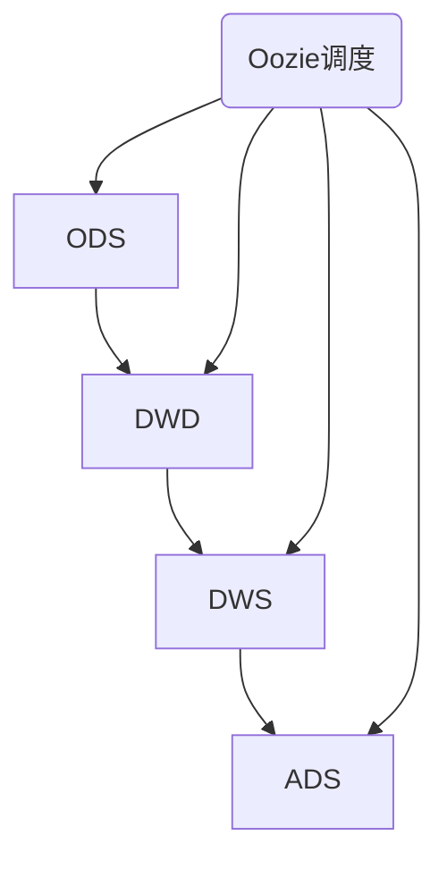
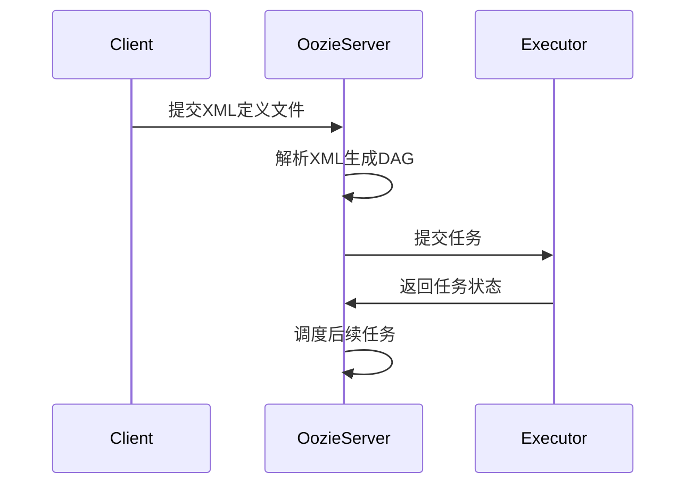

# 基于Oozie的数据仓库自动化构建

## 1.背景介绍
随着大数据时代的到来,企业每天都会产生海量的数据。如何高效地处理和分析这些数据,已经成为企业面临的重大挑战。数据仓库作为一种面向主题的、集成的、相对稳定的、反映历史变化的数据集合,为企业的数据分析和决策提供了重要支撑。

然而,传统的数据仓库构建方式存在诸多问题,如开发周期长、维护成本高、灵活性差等。为了解决这些问题,我们急需一种自动化、智能化的数据仓库构建方案。Apache Oozie作为一个开源的工作流调度系统,为我们提供了实现数据仓库自动化构建的可能。

### 1.1 数据仓库概述
#### 1.1.1 数据仓库的定义
数据仓库是一个面向主题的、集成的、相对稳定的、反映历史变化的数据集合,用于支持管理决策。它通过对原始数据进行抽取、清洗、转换和加载(ETL),将分散的、异构的数据整合到一起,形成一个统一的、高质量的数据视图。

#### 1.1.2 数据仓库的特点
- 面向主题:数据仓库是围绕企业的核心主题(如客户、产品、订单等)来组织数据的。
- 集成性:数据仓库需要将来自不同来源的异构数据进行集成,消除数据的不一致性。 
- 非易失性:数据进入数据仓库后一般不会被删除或修改,而是保留下来用于历史分析。
- 时变性:数据仓库中的数据通常带有时间标签,反映了数据的历史变化情况。

#### 1.1.3 数据仓库的分层架构
数据仓库通常采用分层架构,将数据处理流程划分为多个层次:
- ODS层(Operational Data Store):存储原始数据,保持与源系统一致。
- DWD层(Data Warehouse Detail):对ODS层数据进行清洗转换,形成细粒度的明细数据。
- DWS层(Data Warehouse Service):在DWD基础上进一步汇总,形成轻度汇总的数据。
- ADS层(Application Data Service):为具体的应用场景构建数据集市或数据产品。

### 1.2 传统数据仓库构建面临的挑战
#### 1.2.1 开发效率低下
传统的数据仓库构建通常需要手工编写大量ETL脚本,工作量大且容易出错。开发一个数据仓库应用往往需要数周甚至数月时间,难以满足快速变化的业务需求。

#### 1.2.2 运维成本高昂
数据仓库的ETL任务错综复杂,依赖关系难以梳理,出错后定位和修复问题非常耗时。此外,ETL任务的监控和调度也需要投入大量人力。

#### 1.2.3 扩展性差
传统数据仓库大多基于单体架构,缺乏灵活的扩展机制。当数据量和并发请求增加时,系统难以线性扩展,容易形成性能瓶颈。

#### 1.2.4 元数据管理混乱
元数据是对数据仓库各个组件及其相互关系的描述。传统数据仓库缺乏统一的元数据管理,不同的ETL任务和调度工具各自为政,导致数据血缘难以追溯,影响数据质量。

### 1.3 数据仓库自动化构建的必要性
#### 1.3.1 提升开发效率
通过工作流引擎自动编排和调度ETL任务,大幅减少了手工开发的工作量,显著提升开发效率。预先定义好标准化的作业模板,就能快速搭建出数据仓库应用。

#### 1.3.2 降低运维成本
自动化的任务调度和监控可以取代人工值守,减少运维投入。当任务出错时,系统能够自动重试或报警,帮助快速定位和解决问题。

#### 1.3.3 增强扩展能力
将调度逻辑与具体的数据处理逻辑解耦,ETL任务能够以松耦合的方式并行执行。当数据量增长时,可以方便地增加节点来线性扩展处理能力。

#### 1.3.4 规范元数据管理
统一的工作流引擎可以自动记录和管理ETL任务的元数据,包括任务的依赖关系、执行状态、数据血缘等,从而提升元数据的准确性和可追溯性。

## 2.核心概念与联系
### 2.1 Oozie简介
Apache Oozie是一个开源的工作流调度系统,用于管理和协调Hadoop生态系统中的作业。它支持多种类型的Hadoop任务,如MapReduce、Hive、Pig、Sqoop等,并能够按照预定义的顺序和依赖关系调度任务。

### 2.2 Oozie的核心概念
#### 2.2.1 Workflow
Workflow定义了一系列有依赖关系的Action,描述了作业的执行流程。它是一个有向无环图(DAG),节点代表Action,边代表依赖。

#### 2.2.2 Action
Action是Workflow中的一个任务节点,代表一个具体的操作,如运行一个MapReduce程序、执行一条Hive查询等。Oozie支持多种类型的Action。

#### 2.2.3 Coordinator
Coordinator用于定义重复执行的Workflow,可以指定Workflow的执行时间、频率和输入数据。

#### 2.2.4 Bundle
Bundle用于打包多个Coordinator,以更高的层次管理和调度作业。

### 2.3 Oozie在数据仓库构建中的作用
Oozie可以将数据仓库的ETL开发流程标准化和自动化。我们可以将每个ETL任务抽象为一个Action,多个Action组成Workflow,来描述完整的数据处理流程。通过定义Coordinator,可以实现ETL任务的定时调度和增量处理。

Oozie能够自动解析任务之间的依赖关系,合理安排任务的执行顺序,并提供可视化的监控界面,大大简化了数据仓库的开发运维。同时,Oozie良好的扩展性使得我们可以方便地集成各种大数据处理组件,满足企业级数据仓库的建设需求。

下图展示了Oozie在数据仓库分层架构中的应用:



## 3.核心算法原理具体操作步骤
### 3.1 Oozie Workflow的定义
Oozie Workflow使用XML格式的配置文件来定义,称为workflow.xml。一个workflow.xml主要包含以下几个部分:
- start:Workflow的开始节点
- end:Workflow的结束节点 
- action:Workflow中的任务节点
- fork/join:并行执行的任务分支
- decision:条件判断节点
- kill:异常终止节点

一个简单的workflow.xml示例如下:

```xml
<workflow-app name="sample-wf" xmlns="uri:oozie:workflow:0.5">
    <start to="first-action"/>
    
    <action name="first-action">
        <hive xmlns="uri:oozie:hive-action:0.5">
            <script>script.hql</script>
        </hive>
        <ok to="second-action"/>
        <error to="kill"/>
    </action>
    
    <action name="second-action">
        <shell xmlns="uri:oozie:shell-action:0.3">
            <exec>script.sh</exec>
        </shell>
        <ok to="end"/>
        <error to="kill"/>
    </action>
    
    <kill name="kill">
        <message>Job failed</message>
    </kill>
    
    <end name="end"/>
</workflow-app>
```

该Workflow包含两个Action节点,分别执行一个Hive脚本和一个Shell脚本。每个Action可以指定执行成功(ok)和失败(error)后的跳转节点。

### 3.2 Oozie Coordinator的定义  
Oozie Coordinator使用XML格式的配置文件来定义,称为coordinator.xml。一个coordinator.xml主要包含以下几个部分:
- start:Coordinator的开始时间
- end:Coordinator的结束时间
- timezone:时区
- frequency:Workflow的执行频率
- datasets:输入数据集
- input-events:输入事件,用于触发Workflow

一个简单的coordinator.xml示例如下:

```xml
<coordinator-app name="sample-coord" frequency="${coord:days(1)}"
                 start="2023-01-01T00:00Z" end="2023-12-31T00:00Z" timezone="UTC"
                 xmlns="uri:oozie:coordinator:0.4">
                 
    <datasets>
        <dataset name="input" frequency="${coord:days(1)}"
                 initial-instance="2023-01-01T00:00Z" timezone="UTC">
            <uri-template>hdfs:///user/foo/data/${YEAR}${MONTH}${DAY}</uri-template>
        </dataset>
    </datasets>
    
    <input-events>
        <data-in name="input" dataset="input">
            <instance>${coord:current(0)}</instance>
        </data-in>
    </input-events>
    
    <action>
        <workflow>
            <app-path>hdfs:///user/foo/workflows/sample-wf</app-path>
        </workflow>
    </action>
</coordinator-app>
```

该Coordinator每天定时执行一个Workflow,输入数据集为HDFS上按天分区的目录。

### 3.3 Oozie Bundle的定义
Oozie Bundle使用XML格式的配置文件来定义,称为bundle.xml。一个bundle.xml主要包含以下几个部分:
- coordinator:Bundle中的Coordinator应用

一个简单的bundle.xml示例如下:

```xml
<bundle-app name="sample-bundle" xmlns="uri:oozie:bundle:0.2">
    <coordinator name="sample-coord">
        <app-path>hdfs:///user/foo/coordinators/sample-coord</app-path>
    </coordinator>
</bundle-app>
```

该Bundle只包含一个Coordinator。

### 3.4 Oozie任务调度原理
Oozie基于XML配置文件来定义和调度任务,其核心调度原理如下:

1. Oozie Client提交Workflow/Coordinator/Bundle的XML定义文件到Oozie Server。
2. Oozie Server解析XML文件,生成DAG(有向无环图)任务依赖关系。
3. Oozie Server根据DAG调度任务,将任务提交到对应的执行引擎,如MapReduce、Hive等。
4. 执行引擎运行任务,并将状态反馈给Oozie Server。
5. Oozie Server根据任务状态和DAG依赖,继续调度后续任务,直到整个Workflow/Coordinator/Bundle完成。

下图展示了Oozie的整体调度流程:



## 4.数学模型和公式详细讲解举例说明
Oozie本身是一个通用的工作流调度系统,没有涉及太多数学模型。但在数据仓库的构建过程中,我们通常需要用到一些数学模型和算法,如数据统计、预测、分类等。下面以数据统计中的指数平滑模型为例,讲解如何在Oozie工作流中应用数学模型。

指数平滑是一种常用的时间序列预测方法,通过加权平均的方式对历史数据进行平滑,并据此预测未来趋势。其基本公式如下:

$$S_t = \alpha \cdot y_t + (1 - \alpha) \cdot S_{t-1}$$

其中,$S_t$为第$t$期的平滑值,$y_t$为第$t$期的实际值,$\alpha$为平滑系数,取值在0到1之间。

在Hive中,我们可以使用SQL实现指数平滑算法。假设有一张销售数据表sales,包含日期(dt)和销售额(amount)两个字段,要求计算每天的平滑销售额,平滑系数$\alpha=0.2$。

```sql
CREATE TABLE sales_smooth AS
SELECT
    dt,
    amount,
    CASE WHEN LAG(smooth_amount) OVER(ORDER BY dt) IS NULL
         THEN amount
         ELSE 0.2 * amount + 0.8 * LAG(smooth_amount) OVER(ORDER BY dt)
    END AS smooth_amount
FROM sales;
```

上述SQL使用LAG函数获取前一天的平滑值