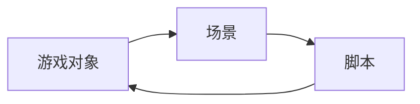
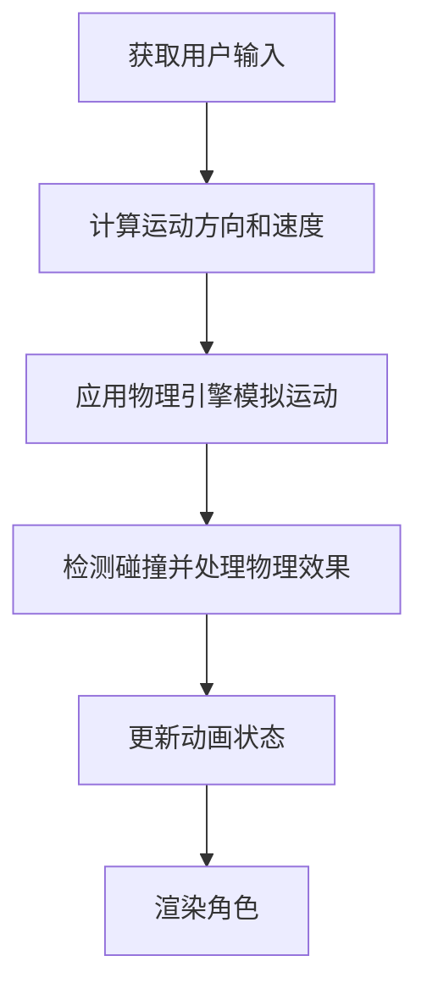
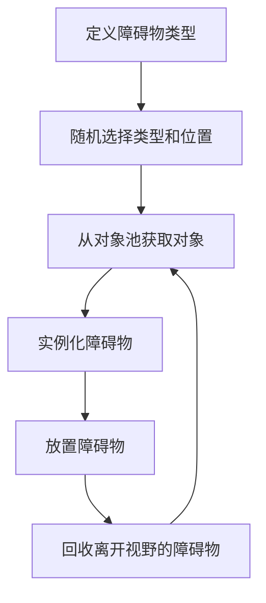
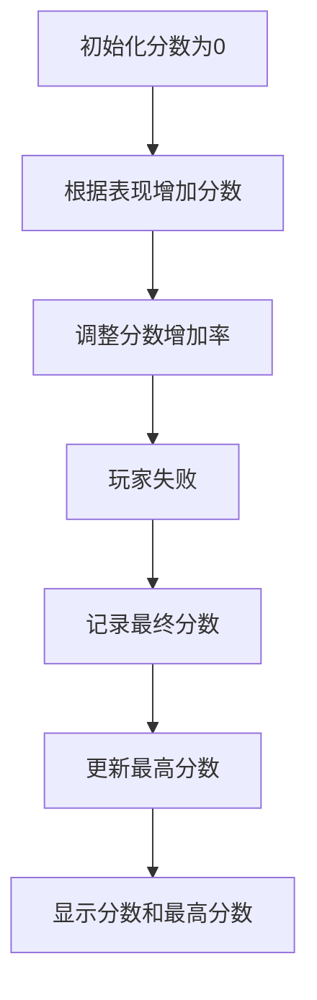

# 基于Unity3D的跑酷游戏

## 1.背景介绍

### 1.1 游戏行业的发展趋势

近年来,随着移动设备和虚拟现实技术的飞速发展,游戏行业正经历着前所未有的变革。玩家对沉浸式、身临其境的游戏体验有着越来越高的期望,这推动了游戏开发技术的不断进步。在这一背景下,Unity3D作为一款跨平台的综合型游戏引擎,凭借其强大的3D渲染能力、丰富的资源库和友好的开发环境,成为了游戏开发者的首选之一。

### 1.2 跑酷游戏的魅力

跑酷游戏(Parkour Game)是一种充满动感和挑战性的游戏类型。玩家需要控制角色在城市环境中跳跃、攀爬、翻滚等,克服重重障碍,完成刺激的跑酷动作。这种游戏不仅考验玩家的反应能力和操作技巧,更能带来身临其境的沉浸体验。随着VR技术的兴起,跑酷游戏将有望实现全新的互动方式,让玩家真正身临其境,体验无与伦比的游戏乐趣。

### 1.3 Unity3D的优势

Unity3D作为一款成熟的游戏引擎,不仅支持多种编程语言(C#、JavaScript等),还集成了强大的物理引擎、音频系统、粒子特效等模块,可以高效地构建各种类型的游戏。此外,Unity3D拥有庞大的资源商店和社区支持,为开发者提供了丰富的资源和技术支持。凭借这些优势,Unity3D在独立游戏开发和大型游戏项目中均有广泛应用。

## 2.核心概念与联系

### 2.1 游戏对象(GameObject)

在Unity3D中,游戏对象(GameObject)是构建游戏世界的基本单元。一个游戏对象可以包含多个组件(Component),如Transform(变换)、Mesh Renderer(网格渲染器)、Collider(碰撞器)等,用于控制对象的位置、形状、材质和物理行为等。游戏对象可以被层层嵌套,形成复杂的层级结构,从而构建出丰富多样的游戏场景。

### 2.2 场景(Scene)

场景(Scene)是Unity3D中表示游戏世界的概念。一个场景包含了所有的游戏对象、灯光、相机等元素,构成了一个完整的游戏环境。在开发过程中,可以将游戏分割为多个场景,并在运行时动态加载和切换场景,实现游戏的无缝过渡。

### 2.3 脚本(Script)

脚本(Script)是Unity3D中实现游戏逻辑的关键。开发者可以使用C#或UnityScript(Unity的JavaScript版本)编写脚本,并将其附加到游戏对象上,从而控制对象的行为。脚本可以访问和操作游戏对象的组件,实现各种复杂的游戏功能,如角色控制、AI、物理模拟等。

### 2.4 核心概念关系

游戏对象、场景和脚本是Unity3D中最核心的概念,它们之间紧密相连,共同构建了游戏的整体框架。游戏对象是构建游戏世界的基本单元,场景则是容纳和组织这些对象的空间,而脚本则赋予了游戏对象生命,实现了各种游戏逻辑和交互。这三者相互依赖、相互作用,共同创造出丰富多彩的游戏体验。



## 3.核心算法原理具体操作步骤

### 3.1 角色控制

在跑酷游戏中,角色的流畅控制是核心环节之一。我们需要编写脚本来实现角色的移动、跳跃、攀爬等基本动作。以下是一个简化的角色控制算法流程:

1. 获取用户输入(键盘、手柄等)
2. 根据输入计算角色的运动方向和速度
3. 应用物理引擎,模拟角色的运动
4. 检测角色与环境的碰撞,处理相应的物理效果(如下落、反弹等)
5. 更新角色的动画状态
6. 渲染角色的最新位置和动画



### 3.2 障碍物生成

为了增加游戏的挑战性和可重玩性,我们需要动态生成障碍物,让玩家面临不断变化的环境。以下是一种常见的障碍物生成算法:

1. 定义障碍物的基本类型(如墙壁、跳板等)
2. 随机选择障碍物类型和位置
3. 从对象池中获取可用的障碍物对象
4. 根据选定的类型和位置实例化障碍物
5. 将障碍物放置在场景中
6. 当障碍物离开视野范围时,回收到对象池



### 3.3 评分系统

为了增强游戏的竞争性和可玩性,我们需要设计一个合理的评分系统。以下是一种常见的评分算法:

1. 初始化分数为0
2. 根据玩家的表现(如通过障碍物、完成特技动作等),增加相应的分数
3. 根据游戏难度、时间等因素,调整分数的增加率
4. 当玩家失败时,记录最终分数
5. 将最终分数与历史最高分进行比较,更新最高分数
6. 显示分数和最高分数在游戏界面上



## 4.数学模型和公式详细讲解举例说明

### 4.1 运动学模型

在游戏中模拟角色的运动往往需要借助运动学模型。以下是一些常见的运动学公式:

1. 位移公式:

$$s = ut + \frac{1}{2}at^2$$

其中,$s$表示位移,$u$表示初速度,$a$表示加速度,$t$表示时间。

2. 速度公式:

$$v = u + at$$

其中,$v$表示最终速度,$u$表示初速度,$a$表示加速度,$t$表示时间。

3. 向量运动公式:

$$\vec{r}(t) = \vec{r}_0 + \vec{v}_0t + \frac{1}{2}\vec{a}t^2$$

其中,$\vec{r}(t)$表示时刻$t$的位置向量,$\vec{r}_0$表示初始位置向量,$\vec{v}_0$表示初始速度向量,$\vec{a}$表示加速度向量。

这些公式可以用于模拟角色的跳跃、下落、投射等运动,从而实现更加真实的物理效果。

### 4.2 碰撞检测

在游戏中,我们需要检测角色与障碍物之间的碰撞,以实现相应的物理效果。Unity3D提供了多种碰撞检测方法,其中最常用的是基于射线的方法。

假设我们要检测一个球体$B$与一个平面$P$之间的碰撞,其中球体的中心为$\vec{c}$,半径为$r$,平面的法向量为$\vec{n}$,过平面上一点$\vec{p}_0$。我们可以使用以下公式计算球体与平面之间的距离$d$:

$$d = (\vec{c} - \vec{p}_0) \cdot \vec{n}$$

如果$d < r$,则发生碰撞;否则,没有碰撞发生。

通过这种方式,我们可以检测角色与各种形状的障碍物之间的碰撞,并进行相应的处理,如反弹、停止运动等。

## 5.项目实践:代码实例和详细解释说明

在这一部分,我们将通过一个简单的示例项目,展示如何使用Unity3D和C#编写一个基本的跑酷游戏。

### 5.1 创建场景

首先,我们在Unity编辑器中创建一个新场景,并添加一些基本元素,如地面、障碍物和玩家角色。

```csharp
// 创建地面
GameObject ground = GameObject.CreatePrimitive(PrimitiveType.Plane);
ground.transform.position = new Vector3(0, 0, 0);
ground.transform.localScale = new Vector3(10, 1, 10);

// 创建障碍物
GameObject obstacle = GameObject.CreatePrimitive(PrimitiveType.Cube);
obstacle.transform.position = new Vector3(5, 1, 0);

// 创建玩家角色
GameObject player = GameObject.CreatePrimitive(PrimitiveType.Capsule);
player.transform.position = new Vector3(-5, 1, 0);
```

### 5.2 编写角色控制脚本

接下来,我们编写一个脚本来控制玩家角色的移动和跳跃。

```csharp
using UnityEngine;

public class PlayerController : MonoBehaviour
{
    public float moveSpeed = 5f;
    public float jumpForce = 10f;

    private Rigidbody rb;
    private bool isGrounded = true;

    void Start()
    {
        rb = GetComponent<Rigidbody>();
    }

    void Update()
    {
        // 获取水平轴输入
        float horizontal = Input.GetAxis("Horizontal");

        // 计算移动方向
        Vector3 movement = new Vector3(horizontal, 0, 0);

        // 移动角色
        rb.velocity = movement * moveSpeed;

        // 检测是否在地面上
        isGrounded = Physics.Raycast(transform.position, Vector3.down, 1.1f);

        // 跳跃
        if (Input.GetButtonDown("Jump") && isGrounded)
        {
            rb.AddForce(Vector3.up * jumpForce, ForceMode.Impulse);
        }
    }
}
```

在这个脚本中,我们使用了Unity的输入系统获取玩家的键盘输入,并根据输入计算角色的移动方向和速度。我们还使用了射线检测来判断角色是否在地面上,从而实现跳跃功能。

### 5.3 添加障碍物生成

为了增加游戏的难度和可重玩性,我们可以编写一个脚本来动态生成障碍物。

```csharp
using UnityEngine;

public class ObstacleGenerator : MonoBehaviour
{
    public GameObject obstaclePrefab;
    public float spawnInterval = 2f;
    public float spawnDistance = 20f;

    private float timer;

    void Update()
    {
        timer += Time.deltaTime;

        if (timer >= spawnInterval)
        {
            SpawnObstacle();
            timer = 0;
        }
    }

    void SpawnObstacle()
    {
        Vector3 spawnPos = transform.position + Vector3.forward * spawnDistance;
        Instantiate(obstaclePrefab, spawnPos, Quaternion.identity);
    }
}
```

在这个脚本中,我们每隔一段时间就在场景中的指定位置实例化一个障碍物预制体。你可以根据需要调整障碍物的类型、大小和生成频率。

### 5.4 添加评分系统

最后,我们添加一个简单的评分系统,根据玩家的表现计算分数。

```csharp
using UnityEngine;
using UnityEngine.UI;

public class ScoreManager : MonoBehaviour
{
    public Text scoreText;
    public int scorePerObstacle = 100;

    private int score;

    void Start()
    {
        score = 0;
        UpdateScoreText();
    }

    void OnTriggerEnter(Collider other)
    {
        if (other.CompareTag("Obstacle"))
        {
            score += scorePerObstacle;
            UpdateScoreText();
        }
    }

    void UpdateScoreText()
    {
        scoreText.text = "Score: " + score.ToString();
    }
}
```

在这个脚本中,我们使用Unity的UI系统显示当前分数。每当玩家通过一个障碍物时,分数就会增加。你可以根据需要调整分数的计算方式,并添加更多的分