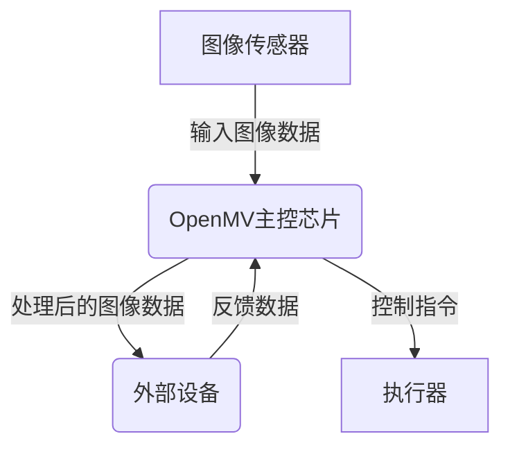
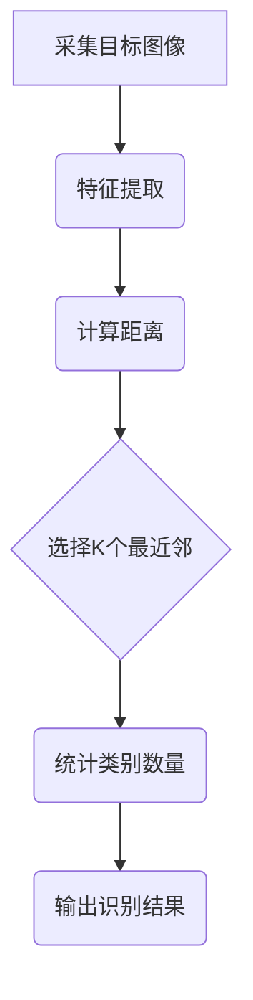

以下是对题目"基于OpenMV的视频安防系统的设计"的深入探讨和分析:

# 基于OpenMV的视频安防系统的设计

## 1.背景介绍

### 1.1 视频安防系统概述

视频安防系统是指利用视频监控设备、传输线路和管理平台等硬件和软件设施，对重点区域实施全天候、无死角的监控和管理。视频安防系统广泛应用于公共场所、企业单位、家庭等各个领域,对确保公共安全、预防违法犯罪行为、提高生产效率等具有重要作用。

### 1.2 传统视频安防系统的局限性

传统的视频安防系统通常由模拟监控摄像头、视频编码器、监控中心等组成。这种系统存在以下几个主要缺陷:

1. 设备成本高、维护困难
2. 监控画面质量较差,夜间拍摄效果差
3. 对视频内容的智能分析能力有限
4. 系统扩展性和兼容性较差

### 1.3 OpenMV视觉传感器的优势

OpenMV是一款开源的低成本嵌入式视觉系统,集成了强大的图像处理能力。它基于ARM Cortex-M系列微控制器,搭载OV7725图像传感器,支持Python脚本编程。OpenMV可以看作是一个微型的人工智能视觉系统,具有以下优势:

1. 低功耗、体积小巧、成本低廉
2. 开源社区活跃,资源丰富
3. 支持多种经典机器视觉算法
4. 可通过Python脚本实现灵活编程

基于OpenMV构建的视频安防系统,可以有效克服传统系统的诸多缺陷,提供高质量、智能化的视频监控服务。

## 2.核心概念与联系

### 2.1 图像处理基础

要设计基于OpenMV的视频安防系统,首先需要理解图像处理的一些基本概念:

1. **图像表示**: 数字图像由像素阵列构成,每个像素用一个或多个数值表示颜色和亮度信息。
2. **图像滤波**: 通过卷积等操作去除图像噪声,增强图像质量。
3. **图像分割**: 将图像分割为若干个独立区域,为后续目标检测和识别做准备。
4. **特征提取**: 从图像中提取出对目标物体有代表性的特征,如边缘、角点、形状等。
5. **目标检测**: 在图像中定位感兴趣的目标物体区域。
6. **目标识别**: 对检测到的目标进行分类和识别。

### 2.2 经典机器视觉算法

OpenMV支持多种经典的机器视觉算法,可用于目标检测和识别:

1. **Canny边缘检测**: 检测图像中的边缘信息。
2. **Hough变换**: 检测直线、圆等几何图形。
3. **Harris角点检测**: 检测图像中的角点特征。
4. **FAST特征检测**: 快速检测图像中的角点和边缘特征。
5. **MSER区域检测**: 检测具有相同亮度模式的区域。
6. **KNN最近邻分类器**: 基于训练样本进行目标识别和分类。

通过合理选择和组合这些算法,可以构建出高效的目标检测和识别模块。

### 2.3 OpenMV系统架构

OpenMV系统架构如下所示:



1. 图像传感器(如OV7725)负责采集图像数据,并将其输入到OpenMV主控芯片。
2. OpenMV主控芯片(ARM Cortex-M)运行图像处理算法,对输入图像进行处理。
3. 处理后的图像数据可传输到外部设备(如监控中心)进行存储、显示或进一步分析。
4. OpenMV也可根据处理结果发出控制指令,驱动执行器(如报警器)运行。
5. 外部设备还可将反馈数据发送回OpenMV,实现闭环控制。

## 3.核心算法原理具体操作步骤 

在视频安防系统中,目标检测和识别是两个核心算法模块。下面分别介绍它们的原理和具体操作步骤。

### 3.1 目标检测算法

常用的目标检测算法包括基于特征的方法和基于机器学习的方法。这里以Haar-like特征+Adaboost分类器为例,介绍基于特征的目标检测算法。

#### 3.1.1 Haar-like特征

Haar-like特征是一种简单而有效的图像特征,由相邻的矩形区域的像素值之差构成。常见的Haar-like特征包括边缘特征、线性特征、对角线特征等。


1. 首先,需要将输入图像转化为积分图像(integral image),加快特征计算速度。
2. 利用Haar-like特征模板在积分图像上滑动,提取出所有可能的特征。
3. 将提取到的特征值构建成特征向量。
4. 将特征向量输入分类器,进行目标检测。

#### 3.1.2 Adaboost分类器

Adaboost(Adaptive Boosting)是一种常用的boosting技术,通过迭代方式不断加强分类器性能。其算法流程如下:

1. 初始化训练样本的权重分布为均匀分布。
2. 对每个特征训练一个弱分类器,选择最小化加权误差率的弱分类器。
3. 增大那些被弱分类器错分样本的权重,减小被正确分类样本的权重。
4. 合并当前的弱分类器到最终的强分类器。
5. 返回步骤2,直到满足某个停止条件。

经过多轮迭代,Adaboost可以得到一个高精度的强分类器,用于目标检测。

### 3.2 目标识别算法

目标识别的常用算法有KNN、SVM、神经网络等。这里以KNN(K最近邻)算法为例进行说明。

#### 3.2.1 KNN算法原理

KNN是一种基于实例的学习算法,其工作原理是:对给定的测试实例,在训练样本集中找出与它最邻近的K个实例,然后根据这些实例的多数类别对测试实例进行预测。

具体步骤如下:

1. 选择合适的特征表示输入实例,计算实例间的距离。
2. 对每个测试实例,在训练集中找出与它最近邻的K个实例。
3. 统计这K个实例中不同类别的个数。
4. 将测试实例预测为数量最多的那个类别。

#### 3.2.2 KNN算法应用

在视频安防系统中,可以通过以下步骤应用KNN算法进行目标识别:



1. 首先从视频流中采集感兴趣的目标图像。
2. 提取目标图像的特征向量,如颜色、形状、纹理等特征。
3. 计算目标实例与训练集中所有实例的距离。
4. 选择距离最近的K个训练实例。
5. 统计这K个实例中不同类别的数量。
6. 将目标实例预测为数量最多的那个类别,输出识别结果。

KNN算法简单有效,尤其适用于小规模的模式识别问题。在视频安防系统中,可以用于识别人脸、车牌、物体等目标。

## 4.数学模型和公式详细讲解举例说明

在目标检测和识别算法中,有一些重要的数学模型和公式,下面对它们进行详细讲解。

### 4.1 积分图像

积分图像(Integral Image)是一种高效计算Haar-like特征的中间数据结构,定义如下:

$$
I_\Sigma(x, y) = \sum_{x' \leq x, y' \leq y} I(x', y')
$$

其中,\\(I(x', y')\\)是原始图像在点\\((x', y')\\)处的像素值。\\(I_\Sigma(x, y)\\)是原始图像\\((0, 0)\\)到\\((x, y)\\)矩形区域内所有像素值的累计和。

借助积分图像,可以通过几个加减运算高效地计算出任意矩形区域的像素和,从而加快Haar-like特征的计算速度。

### 4.2 Adaboost算法

Adaboost算法的核心是通过迭代方式不断加强弱分类器的性能,最终得到一个高精度的强分类器。其中涉及到以下公式:

1. **样本权重更新**:

$$
D_{t+1}(i) = \frac{D_t(i)}{Z_t} \begin{cases}
\exp(-\alpha_t), & \text{if correctly classified}\\
\exp(\alpha_t), & \text{if incorrectly classified}
\end{cases}
$$

其中,\\(D_t(i)\\)是第t轮迭代时第i个样本的权重,\\(\alpha_t\\)是当前弱分类器的系数,\\(Z_t\\)是一个归一化因子。

被正确分类的样本权重会减小,被错误分类的样本权重会增大,从而在下一轮迭代中更关注那些难以分类的样本。

2. **强分类器组合**:

$$
H(x) = \begin{cases}
1, & \text{if } \sum_{t=1}^T \alpha_t h_t(x) \geq \frac{1}{2} \sum_{t=1}^T \alpha_t\\
0, & \text{otherwise}
\end{cases}
$$

其中,\\(h_t(x)\\)是第t个弱分类器,\\(\alpha_t\\)是其对应的系数。强分类器\\(H(x)\\)是所有弱分类器的加权组合。

通过不断迭代优化,Adaboost算法可以得到一个精度较高的强分类器,用于目标检测。

### 4.3 KNN距离度量

在KNN算法中,距离度量是一个关键环节。常用的距离度量方法有欧几里得距离、曼哈顿距离、切比雪夫距离等,它们的定义如下:

1. **欧几里得距离**:

$$
d(x, y) = \sqrt{\sum_{i=1}^n (x_i - y_i)^2}
$$

2. **曼哈顿距离**:

$$
d(x, y) = \sum_{i=1}^n |x_i - y_i|
$$

3. **切比雪夫距离**:

$$
d(x, y) = \max_{1 \leq i \leq n} |x_i - y_i|
$$

其中,\\(x=(x_1, x_2, \dots, x_n)\\)和\\(y=(y_1, y_2, \dots, y_n)\\)是两个n维向量。

不同的距离度量方法对最终的分类结果有一定影响,需要根据具体问题选择合适的方法。例如,对于高维稀疏数据,曼哈顿距离通常比欧几里得距离表现更好。

## 5.项目实践:代码实例和详细解释说明

为了更好地理解基于OpenMV的视频安防系统的设计,下面给出一个实际项目的代码示例,并进行详细解释说明。

### 5.1 人脸检测与识别

这是一个基于OpenMV的人脸检测与识别项目,可用于门禁控制等场景。项目分为两个部分:人脸检测模块和人脸识别模块。

#### 5.1.1 人脸检测模块

人脸检测模块基于Haar-like特征和Adaboost分类器算法,用于从视频流中检测出人脸区域。代码如下:

```python
# 加载Haar级联文件
haar_cascade = image.HaarCascade("frontalface")

# 初始化摄像头
sensor.reset()
sensor.set_pixformat(sensor.RGB565)
sensor.set_framesize(sensor.QVGA)
sensor.skip_frames(time=2000)

# 主循环
while True:
    # 获取一帧图像
    img = sensor.snapshot()

    # 在图