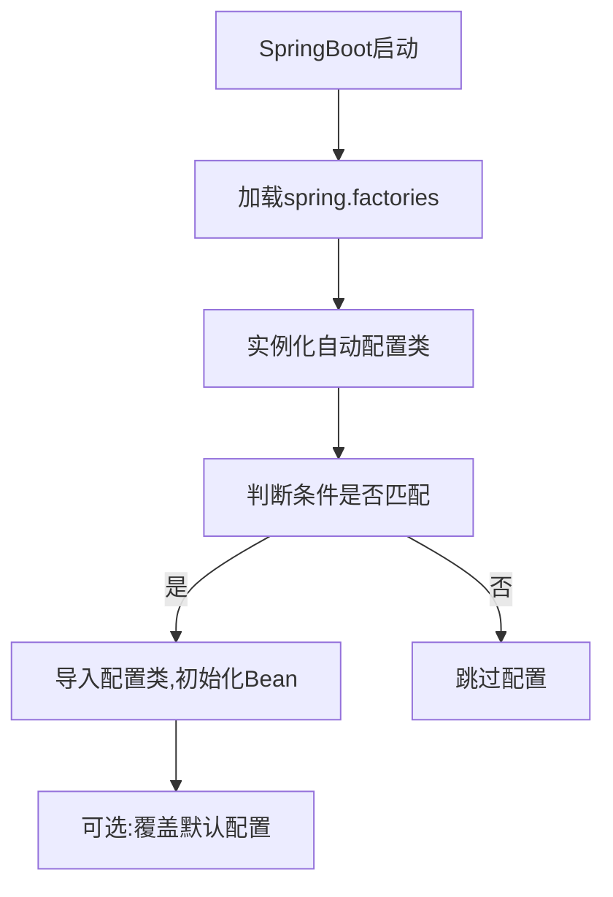
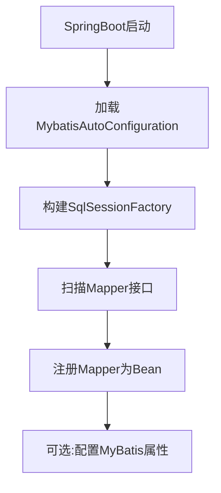

# 基于SpringBoot的教务管理系统

## 1. 背景介绍

### 1.1 教育信息化的重要性

在当今信息时代,教育信息化已经成为推动教育现代化发展的重要驱动力。通过将现代信息技术与教育教学相结合,可以极大地提高教育质量和效率,优化教育资源配置,促进教育公平,为学生提供更加个性化和高质量的教育服务。

### 1.2 教务管理系统的作用

教务管理系统作为教育信息化的重要组成部分,承担着管理学校的教学活动、学生信息、教师信息、课程安排等核心业务,是学校日常教学运作的命脉系统。一个高效、安全、可靠的教务管理系统,可以极大地提高学校的办学效率,优化教学流程,为师生提供更好的服务体验。

### 1.3 SpringBoot在教务管理系统中的应用

SpringBoot作为一个流行的JavaEE开发框架,具有开箱即用、配置简单、内嵌服务器等优点,非常适合快速构建教务管理系统这类中小型Web应用。通过SpringBoot可以快速搭建项目框架,集成常用的中间件和第三方库,极大地提高了开发效率。

## 2. 核心概念与联系

### 2.1 SpringBoot核心概念

#### 2.1.1 自动配置

SpringBoot的核心理念之一就是约定大于配置,通过`@EnableAutoConfiguration`注解,SpringBoot会自动加载所有可用的自动配置类,根据项目的依赖自动配置相关的组件和中间件,极大地简化了配置过程。

#### 2.1.2 嵌入式容器

SpringBoot内置了Tomcat、Jetty和Undertow等多种容器,开发者可以根据需求选择合适的容器,无需额外配置和部署War包,直接通过`java -jar`命令即可运行应用程序。

#### 2.1.3 Starter依赖

SpringBoot提供了一系列开箱即用的Starter依赖,集成了常用的中间件和第三方库,如Spring MVC、Spring Data、Redis、RabbitMQ等,只需要在项目中引入相应的Starter即可,极大地简化了依赖管理。

### 2.2 教务管理系统核心概念

#### 2.2.1 学生信息管理

包括学生的基本信息、学籍信息、成绩信息等,是教务管理系统的核心数据。

#### 2.2.2 课程管理

包括课程的基本信息、上课时间、授课教师、选课学生等,是组织教学活动的基础。

#### 2.2.3 教学计划管理

根据学校的培养方案和专业设置,制定每个学期的教学计划,安排课程开设、教师授课等。

#### 2.2.4 考务管理

包括考试安排、考场分配、阅卷录入、成绩管理等,是教学质量评价的重要环节。

#### 2.2.5 教学质量评价

通过学生评教、教学督导、教学质量分析等手段,对教学质量进行评价和反馈,持续改进教学。

### 2.3 SpringBoot与教务管理系统的联系

SpringBoot作为一个高效、简洁的JavaEE开发框架,非常适合构建教务管理系统这类中小型Web应用。通过SpringBoot可以快速搭建项目框架,集成常用的中间件和第三方库,如Spring MVC、Spring Data JPA、MyBatis、Redis、RabbitMQ等,极大地提高了开发效率。同时,SpringBoot还提供了一系列的自动配置、嵌入式容器、监控管理等功能,有助于提高系统的可维护性和可扩展性。

## 3. 核心算法原理具体操作步骤

### 3.1 SpringBoot自动配置原理

SpringBoot的自动配置功能是基于Spring的条件化配置和自动装配的基础上实现的。具体原理如下:

1. SpringBoot在启动时,会扫描`META-INF/spring.factories`文件,加载其中声明的自动配置类。
2. 自动配置类通过`@Conditional`注解,根据当前环境和依赖情况,决定是否启用相应的配置。
3. 自动配置类会导入相关的配置类,初始化相应的Bean。
4. 开发者可以通过属性文件或代码的方式覆盖自动配置的默认值。

自动配置的具体流程如下:



### 3.2 SpringBoot集成MyBatis原理

SpringBoot通过`mybatis-spring-boot-starter`实现了对MyBatis的自动配置,主要原理如下:

1. 在`META-INF/spring.factories`中声明了自动配置类`MybatisAutoConfiguration`。
2. `MybatisAutoConfiguration`会根据项目依赖和配置,自动构建`SqlSessionFactory`、`MapperScannerRegistrar`等核心组件。
3. `MapperScannerRegistrar`会扫描指定包下的Mapper接口,并将其注册为Spring Bean。
4. 开发者可以通过`application.properties`配置MyBatis相关属性,如数据源、映射文件路径等。

MyBatis集成的流程如下:



## 4. 数学模型和公式详细讲解举例说明

在教务管理系统中,可能会涉及一些数学模型和公式,例如计算学生的绩点、排名等。下面我们以计算学生的加权平均分(GPA)为例,介绍相关的数学模式和公式。

### 4.1 加权平均分(GPA)计算公式

加权平均分(GPA)是评价学生综合学习成绩的重要指标,它将每门课程的学分和成绩相结合,计算出一个加权平均值。GPA的计算公式如下:

$$
GPA = \frac{\sum_{i=1}^{n}(G_i \times C_i)}{\sum_{i=1}^{n}C_i}
$$

其中:
- $n$表示总共修读的课程数量
- $G_i$表示第$i$门课程的最终成绩
- $C_i$表示第$i$门课程的学分权重

### 4.2 成绩等级制计算

在某些学校,成绩等级制也是常用的评分方式。假设成绩等级分为A+、A、B+、B、C+、C、D、F共8个等级,对应的分数范围和绩点如下:

| 等级 | 分数范围 | 绩点 |
|------|----------|------|
| A+   | 95-100   | 4.3  |
| A    | 90-94    | 4.0  |
| B+   | 85-89    | 3.7  |
| B    | 80-84    | 3.3  |
| C+   | 75-79    | 3.0  |
| C    | 70-74    | 2.7  |
| D    | 60-69    | 2.0  |
| F    | 0-59     | 0    |

则学生的加权平均绩点可以计算如下:

$$
GPA = \frac{\sum_{i=1}^{n}(P_i \times C_i)}{\sum_{i=1}^{n}C_i}
$$

其中:
- $P_i$表示第$i$门课程对应的绩点

通过计算出的GPA,可以评估学生的综合学习水平。

## 5. 项目实践:代码实例和详细解释说明

### 5.1 项目结构

```
edu-management-system
├── src
│   ├── main
│   │   ├── java
│   │   │   └── com
│   │   │       └── example
│   │   │           └── edumgmt
│   │   │               ├── config
│   │   │               ├── controller
│   │   │               ├── entity
│   │   │               ├── mapper
│   │   │               ├── service
│   │   │               │   └── impl
│   │   │               └── EduManagementSystemApplication.java
│   │   └── resources
│   │       ├── mapper
│   │       ├── static
│   │       ├── templates
│   │       └── application.properties
│   └── test
│       └── java
│           └── com
│               └── example
│                   └── edumgmt
└── pom.xml
```

该项目采用了典型的SpringBoot Web应用结构,主要包含以下部分:

- `config`目录: 存放系统配置相关类
- `controller`目录: 存放控制器类,处理HTTP请求
- `entity`目录: 存放实体类,对应数据库表
- `mapper`目录: 存放MyBatis的Mapper接口
- `service`目录: 存放服务层接口和实现类
- `resources`目录: 存放配置文件、静态资源、模板文件等

### 5.2 核心代码解释

#### 5.2.1 SpringBoot启动类

```java
@SpringBootApplication
public class EduManagementSystemApplication {

    public static void main(String[] args) {
        SpringApplication.run(EduManagementSystemApplication.class, args);
    }

}
```

`@SpringBootApplication`注解是SpringBoot的核心注解,它是一个组合注解,包含了`@Configuration`、`@EnableAutoConfiguration`、`@ComponentScan`等注解,用于启用SpringBoot的自动配置、组件扫描等功能。

#### 5.2.2 实体类示例

```java
@Entity
@Table(name = "student")
public class Student {

    @Id
    @GeneratedValue(strategy = GenerationType.IDENTITY)
    private Long id;

    @Column(nullable = false)
    private String name;

    @Column(nullable = false, unique = true)
    private String studentNo;

    // 其他属性和getter/setter方法
}
```

该实体类对应数据库中的`student`表,使用JPA注解进行映射。`@Entity`注解标记该类为实体类,`@Table`注解指定对应的表名。`@Id`和`@GeneratedValue`注解标识主键及其生成策略。`@Column`注解指定列的约束条件。

#### 5.2.3 Mapper接口示例

```java
@Mapper
public interface StudentMapper {

    @Select("SELECT * FROM student WHERE id = #{id}")
    Student getStudentById(Long id);

    @Insert("INSERT INTO student(name, studentNo) VALUES(#{name}, #{studentNo})")
    int addStudent(Student student);

    // 其他查询方法
}
```

该Mapper接口定义了对`student`表的基本CRUD操作,使用MyBatis的注解方式编写SQL语句。`@Mapper`注解将该接口标记为MyBatis的Mapper接口,SpringBoot会自动扫描并注册为Bean。

#### 5.2.4 服务层实现示例

```java
@Service
public class StudentServiceImpl implements StudentService {

    @Autowired
    private StudentMapper studentMapper;

    @Override
    public Student getStudentById(Long id) {
        return studentMapper.getStudentById(id);
    }

    @Override
    public boolean addStudent(Student student) {
        return studentMapper.addStudent(student) > 0;
    }

    // 其他服务方法实现
}
```

该服务层实现类封装了对学生信息的基本操作,通过注入`StudentMapper`实现对数据库的访问。`@Service`注解将该类标记为服务层Bean,SpringBoot会自动扫描并注入相关依赖。

#### 5.2.5 控制器示例

```java
@RestController
@RequestMapping("/students")
public class StudentController {

    @Autowired
    private StudentService studentService;

    @GetMapping("/{id}")
    public ResponseEntity<Student> getStudentById(@PathVariable Long id) {
        Student student = studentService.getStudentById(id);
        return ResponseEntity.ok(student);
    }

    @PostMapping
    public ResponseEntity<String> addStudent(@RequestBody Student student) {
        boolean success = studentService.addStudent(student);
        if (success) {
            return ResponseEntity.ok("Student added successfully");
        } else {
            return ResponseEntity.badRequest().body("Failed to add student");
        }
    }

    // 其他控制器方法
}
```

该控制器类处理与学生信息相关的HTTP请求,通过注入`StudentService`实现业务逻辑。`@RestController`注解将该类标记为REST风格的控制器,`@RequestMapping`注解指定请求映射路径。`@GetMapping`和`@PostMapping`注解分别处理GET和POST请求,使用`@PathVariable`和`@RequestBody`注解绑定请求参数。

### 5.3 单元测试示例

```java
@SpringBootTest
class EduManagementSystemApplicationTests {

    @Autowired
    private StudentService studentService;

    @Test
    void testAddStudent() {
        Student student = new Student();
        student.setName("John Doe");
        student.setStudentNo("20210001");

        boolean success = student