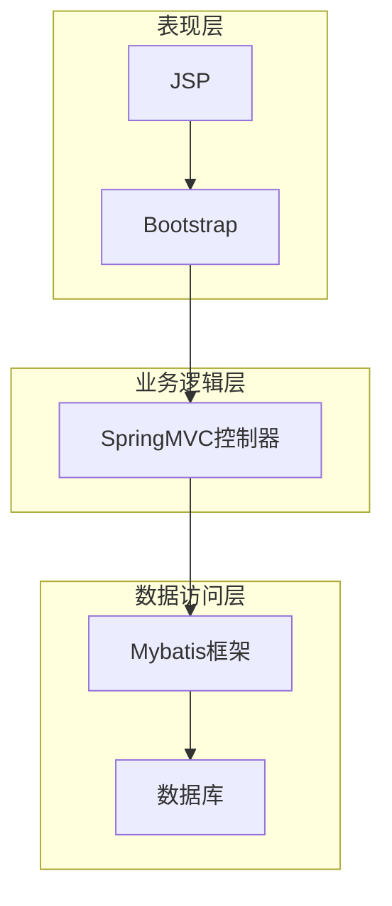

# 基于SSM的人事管理系统

## 1. 背景介绍

### 1.1 人力资源管理的重要性

在当今商业环境中,人力资源被视为企业最宝贵的资产之一。有效的人力资源管理对于企业的成功至关重要,它涉及招聘、培训、绩效评估、薪酬福利等多个方面。传统的人力资源管理方式往往效率低下、成本高昂且容易出错。因此,开发一个高效、可扩展的人事管理系统变得迫在眉睫。

### 1.2 人事管理系统概述

人事管理系统是一种基于Web的应用程序,旨在简化和自动化人力资源管理流程。它提供了集中式的数据存储和管理,使HR专业人员能够轻松地跟踪员工信息、管理招聘流程、处理薪资和福利等。此外,员工也可以通过该系统查看个人信息、申请休假等。

### 1.3 SSM框架介绍

SSM是一种流行的Java Web开发框架,由Spring、SpringMVC和Mybatis三个框架组成。Spring提供了依赖注入和面向切面编程,SpringMVC负责Web层,而Mybatis则用于数据持久化。SSM框架的优势在于简化了开发流程,提高了开发效率,并支持模块化设计。

## 2. 核心概念与联系

### 2.1 系统架构

该人事管理系统采用经典的三层架构,包括表现层(View)、业务逻辑层(Controller)和数据访问层(Model)。其中:

- 表现层使用JSP和Bootstrap实现用户界面
- 业务逻辑层由SpringMVC控制器处理请求和响应
- 数据访问层由Mybatis框架与数据库交互



### 2.2 核心模块

该系统包含以下核心模块:

- **员工信息管理**:维护员工基本信息、教育经历、工作经历等
- **招聘管理**:发布职位信息、处理简历、安排面试等
- **薪资管理**:设置薪资等级、计算工资、发放工资等
- **考勤管理**:记录员工上下班时间、审批休假申请等
- **绩效管理**:制定绩效考核指标、进行绩效评估等
- **培训管理**:安排培训计划、跟踪培训进度等
- **系统管理**:用户权限管理、系统日志记录等

## 3. 核心算法原理具体操作步骤  

### 3.1 员工信息管理算法

员工信息管理模块的核心算法是基于哈希表的数据结构,用于快速查找和更新员工记录。具体步骤如下:

1. 初始化一个空的哈希表
2. 遍历员工数据,对每个员工记录计算哈希值作为键,员工对象作为值,插入哈希表
3. 查找员工时,计算员工ID的哈希值,在哈希表中查找对应的员工对象
4. 更新员工信息时,先查找对应记录,然后修改员工对象中的属性值

该算法的时间复杂度为O(1),能够高效地管理大量员工数据。

### 3.2 招聘管理算法

招聘管理模块使用优先级队列算法,根据职位要求为简历分配优先级,从而加快招聘流程。算法步骤:

1. 初始化一个优先级队列
2. 对每份简历,根据与职位要求的匹配程度计算优先级值
3. 将简历及其优先级值作为元素插入优先级队列
4. 从优先级队列中取出最高优先级的简历进行处理

该算法的时间复杂度为O(nlogn),n为简历数量,能够显著提高招聘效率。

### 3.3 薪资管理算法

薪资管理模块采用线性回归算法,根据员工的工作年限、职级、绩效等因素预测合理的薪资水平。算法步骤:

1. 收集历史薪资数据及影响因素作为训练集
2. 使用最小二乘法估计回归系数
3. 对新员工的特征变量代入回归方程,计算预测薪资

该算法可以自动分析多个变量对薪资的影响,为制定薪酬策略提供数据支持。

## 4. 数学模型和公式详细讲解举例说明

### 4.1 线性回归模型

线性回归是一种常用的监督学习算法,用于预测连续型目标变量。在薪资管理中,我们可以将薪资作为目标变量,将影响因素(如工龄、职级等)作为自变量,构建如下回归模型:

$$y = \beta_0 + \beta_1x_1 + \beta_2x_2 + ... + \beta_nx_n + \epsilon$$

其中:
- $y$是预测的薪资
- $x_i$是第i个影响因素
- $\beta_i$是对应的回归系数
- $\epsilon$是随机误差项

我们使用最小二乘法估计回归系数$\beta$,使残差平方和最小化:

$$\min \sum_{i=1}^{m}(y_i - ({\beta_0 + \beta_1x_{i1} + \beta_2x_{i2} + ... + \beta_nx_{in}}))^2$$

其中m是训练样本数量。

例如,假设我们考虑工龄(x1)和职级(x2)两个因素,线性回归模型为:

$$\text{薪资} = 3500 + 250x_1 + 1000x_2$$

这意味着,初始薪资为3500元,每增加一年工龄可增加250元,而每升一级职位可增加1000元。

### 4.2 优先级队列

优先级队列是一种特殊的队列数据结构,其中的元素被赋予优先级。元素按优先级顺序被服务,优先级最高的元素先被服务。在招聘管理中,我们可以根据简历与职位要求的匹配程度为每份简历分配优先级,构建优先级队列:

```python
from queue import PriorityQueue

# 初始化优先级队列
resume_queue = PriorityQueue()

# 插入简历及其优先级
resume_queue.put((priority1, resume1))
resume_queue.put((priority2, resume2))
...

# 取出最高优先级的简历
top_resume = resume_queue.get()[1]
```

上述Python代码展示了如何使用优先级队列管理简历。每次从队列取出的简历将是当前最匹配的。该算法的时间复杂度为O(nlogn)。

## 5. 项目实践:代码实例和详细解释说明

### 5.1 Spring配置

```xml
<!-- applicationContext.xml -->
<?xml version="1.0" encoding="UTF-8"?>
<beans xmlns="http://www.springframework.org/schema/beans"
    xmlns:xsi="http://www.w3.org/2001/XMLSchema-instance"
    xmlns:context="http://www.springframework.org/schema/context"
    xsi:schemaLocation="http://www.springframework.org/schema/beans
                        http://www.springframework.org/schema/beans/spring-beans.xsd
                        http://www.springframework.org/schema/context
                        http://www.springframework.org/schema/context/spring-context.xsd">

    <!-- 启用组件扫描 -->
    <context:component-scan base-package="com.mycompany.hrms" />

</beans>
```

上述配置启用了Spring的组件扫描功能,自动扫描并创建`com.mycompany.hrms`包下标注了`@Component`、`@Service`等注解的bean。

### 5.2 SpringMVC配置

```xml
<!-- servlet-context.xml -->
<?xml version="1.0" encoding="UTF-8"?>
<beans xmlns="http://www.springframework.org/schema/beans"
    xmlns:xsi="http://www.w3.org/2001/XMLSchema-instance"
    xmlns:mvc="http://www.springframework.org/schema/mvc"
    xsi:schemaLocation="http://www.springframework.org/schema/beans
                        http://www.springframework.org/schema/beans/spring-beans.xsd
                        http://www.springframework.org/schema/mvc
                        http://www.springframework.org/schema/mvc/spring-mvc.xsd">

    <!-- 启用SpringMVC注解支持 -->
    <mvc:annotation-driven />

    <!-- 扫描控制器组件 -->
    <context:component-scan base-package="com.mycompany.hrms.controller" />

    <!-- 配置视图解析器 -->
    <bean class="org.springframework.web.servlet.view.InternalResourceViewResolver">
        <property name="prefix" value="/WEB-INF/views/" />
        <property name="suffix" value=".jsp" />
    </bean>

</beans>
```

该配置启用了SpringMVC的注解支持,并配置了视图解析器将JSP文件映射为视图。

### 5.3 Mybatis配置

```xml
<!-- mybatis-config.xml -->
<?xml version="1.0" encoding="UTF-8" ?>
<!DOCTYPE configuration
  PUBLIC "-//mybatis.org//DTD Config 3.0//EN"
  "http://mybatis.org/dtd/mybatis-3-config.dtd">
<configuration>
    <typeAliases>
        <package name="com.mycompany.hrms.model"/>
    </typeAliases>
    <mappers>
        <mapper resource="com/mycompany/hrms/mapper/EmployeeMapper.xml"/>
        <mapper resource="com/mycompany/hrms/mapper/DepartmentMapper.xml"/>
        <!-- 其他Mapper文件... -->
    </mappers>
</configuration>
```

该配置指定了模型类所在的包,以及Mapper映射文件的位置。

### 5.4 Java代码示例

**控制器层**

```java
@Controller
@RequestMapping("/employees")
public class EmployeeController {

    @Autowired
    private EmployeeService employeeService;

    @GetMapping
    public String listEmployees(Model model) {
        List<Employee> employees = employeeService.getAllEmployees();
        model.addAttribute("employees", employees);
        return "employee-list";
    }

    // 其他方法...
}
```

上述代码展示了一个SpringMVC控制器,用于处理员工列表请求。`@Controller`和`@RequestMapping`注解将该类标识为控制器,并映射URL路径。`@Autowired`注解自动注入`EmployeeService`bean。

**服务层**

```java
@Service
public class EmployeeServiceImpl implements EmployeeService {

    @Autowired
    private EmployeeMapper employeeMapper;

    @Override
    public List<Employee> getAllEmployees() {
        return employeeMapper.selectAll();
    }

    // 其他方法...
}
```

服务层代码中,`@Service`注解将该类标识为服务bean。`EmployeeMapper`是一个Mybatis映射器接口,用于执行数据库操作。

**映射器接口**

```java
public interface EmployeeMapper {

    @Select("SELECT * FROM employees")
    List<Employee> selectAll();

    @Insert("INSERT INTO employees (name, department, email) VALUES (#{name}, #{department}, #{email})")
    int insert(Employee employee);

    // 其他方法...
}
```

该接口定义了Mybatis的SQL映射方法,如`selectAll()`用于查询所有员工记录。Mybatis会自动实现该接口并执行对应的SQL语句。

上述代码示例展示了SSM框架中不同层之间的交互方式。控制器处理HTTP请求,并调用服务层方法执行业务逻辑,服务层则通过Mybatis访问数据库。

## 6. 实际应用场景

人事管理系统可以广泛应用于各种规模的企业和组织,为HR专业人员和员工提供高效的工具。以下是一些典型的应用场景:

### 6.1 大型企业

大型企业通常拥有庞大的员工队伍,传统的人力资源管理方式已无法满足需求。通过部署人事管理系统,HR部门可以集中管理员工信息、简化招聘流程、自动化薪资发放等,从而提高效率、降低成本。同时,员工也可以通过系统查看个人信息、申请休假等,提升工作体验。

### 6.2 中小企业

对于中小企业而言,人事管理系统不仅可以简化日常工作流程,还能帮助企业制定科学的人力资源策略。系统中的数据分析功能可以洞察员工绩效、薪酬水平等,为决策提供依据。此外,中小企业往往人手有限,系统的自动化特性可以减轻HR工作人员的负担。

### 6.3 政府机构和事业单位

政府机构和事业单位通常有严格的员工管理规定,需要对员工信息、考勤、培训等进行严格监控和记录。人事管理系统可以满足这些需求,并提供审计跟踪功能,确保数据的准确性和完整性。

### 6.4 人力资源外包公司

人力资源外包公司为多家企业提供人力资