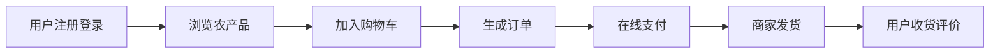
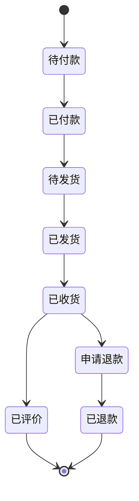

# 基于SSM的农产品商城

## 1. 背景介绍

随着互联网技术的快速发展,电子商务已经深入到人们生活的方方面面。农产品作为一类特殊的商品,由于其产地分散、品种多样、质量参差不齐等特点,在电商领域的发展相对滞后。然而,随着人们生活水平的提高和消费观念的转变,网上购买农产品已成为一种趋势。

基于 SSM(Spring + Spring MVC + MyBatis)框架开发的农产品商城,旨在为农产品的线上交易提供一个高效、便捷、安全的平台。通过该平台,农户可以直接将自己的产品销售给消费者,减少中间环节,提高农产品的附加值;消费者可以足不出户,便捷地购买到新鲜、优质的农产品。

### 1.1 农产品电商的现状与挑战

#### 1.1.1 农产品电商发展现状

#### 1.1.2 农产品电商面临的挑战

### 1.2 SSM框架简介

#### 1.2.1 Spring框架

#### 1.2.2 Spring MVC框架  

#### 1.2.3 MyBatis框架

### 1.3 农产品商城的意义与价值

#### 1.3.1 促进农业现代化发展

#### 1.3.2 助力农民增收致富

#### 1.3.3 满足消费者多样化需求

## 2. 核心概念与关联

### 2.1 农产品商城的业务流程



### 2.2 农产品商城的核心功能模块

#### 2.2.1 用户模块
- 用户注册与登录
- 个人信息管理
- 收货地址管理

#### 2.2.2 商品模块 
- 商品分类管理
- 商品信息管理
- 商品评价管理

#### 2.2.3 购物车模块
- 加入购物车
- 修改商品数量
- 删除商品

#### 2.2.4 订单模块
- 生成订单
- 订单支付
- 订单发货与收货
- 订单评价 

#### 2.2.5 支付模块
- 接入第三方支付
- 支付状态管理

#### 2.2.6 物流模块
- 物流信息对接
- 物流状态跟踪

### 2.3 农产品商城的数据库设计

#### 2.3.1 用户表

#### 2.3.2 商品表

#### 2.3.3 订单表

#### 2.3.4 购物车表

## 3. 核心算法原理与具体操作步骤

### 3.1 个性化商品推荐算法

#### 3.1.1 基于用户的协同过滤推荐
- 收集用户行为数据
- 计算用户相似度
- 生成推荐列表

#### 3.1.2 基于物品的协同过滤推荐  
- 计算物品相似度矩阵
- 根据用户历史行为生成推荐

#### 3.1.3 基于内容的推荐
- 提取商品特征
- 计算用户对商品特征的偏好
- 推荐相似特征的商品

### 3.2 订单状态流转算法

#### 3.2.1 订单状态图



#### 3.2.2 状态转移条件与操作
- 待付款 -> 已付款:用户完成支付
- 已付款 -> 待发货:商家接单
- 待发货 -> 已发货:商家发货
- 已发货 -> 已收货:用户确认收货
- 已收货 -> 已评价:用户评价
- 已收货 -> 申请退款:用户发起退款
- 申请退款 -> 已退款:商家同意退款

## 4. 数学模型与公式详解

### 4.1 协同过滤推荐算法

#### 4.1.1 用户相似度计算

用户相似度可以用余弦相似度来计算:

$sim(u,v) = \frac{\sum_{i \in I_{uv}}r_{ui}r_{vi}}{\sqrt{\sum_{i \in I_u}r_{ui}^2}\sqrt{\sum_{i \in I_v}r_{vi}^2}}$

其中,$I_{uv}$表示用户u和v共同评分的物品集合,$r_{ui}$表示用户u对物品i的评分,$I_u$和$I_v$分别表示用户u和v评分的物品集合。

#### 4.1.2 物品相似度计算

物品相似度也可以用余弦相似度计算:

$sim(i,j) = \frac{\sum_{u \in U_{ij}}r_{ui}r_{uj}}{\sqrt{\sum_{u \in U_i}r_{ui}^2}\sqrt{\sum_{u \in U_j}r_{uj}^2}}$

其中,$U_{ij}$表示对物品i和j都有评分的用户集合,$r_{ui}$表示用户u对物品i的评分,$U_i$和$U_j$分别表示对物品i和j有评分的用户集合。

### 4.2 基于内容的推荐

#### 4.2.1 TF-IDF算法

TF-IDF用于提取商品的关键特征。TF(Term Frequency)表示词频,IDF(Inverse Document Frequency)表示逆文档频率。

$$TF(t,d) = \frac{f_{t,d}}{\sum_{t' \in d}f_{t',d}}$$

$$IDF(t,D) = \log \frac{|D|}{|\{d \in D:t \in d\}|}$$

$$TFIDF(t,d,D) = TF(t,d) \times IDF(t,D)$$

其中,$f_{t,d}$表示词t在文档d中出现的次数,$\sum_{t' \in d}f_{t',d}$表示文档d中所有词出现的次数之和,|D|表示语料库中文档的总数,$|\{d \in D:t \in d\}|$表示包含词t的文档数。

## 5. 项目实践:代码实例与详解

### 5.1 Spring MVC控制器示例

```java
@Controller
@RequestMapping("/product")
public class ProductController {

    @Autowired
    private ProductService productService;
    
    @GetMapping("/list")
    public String list(Model model) {
        List<Product> products = productService.findAll();
        model.addAttribute("products", products);
        return "product_list";
    }
    
    @GetMapping("/{id}")
    public String detail(@PathVariable Long id, Model model) {
        Product product = productService.findById(id);
        model.addAttribute("product", product);
        return "product_detail";
    }
    
    // ...
}
```

### 5.2 MyBatis映射器示例

```xml
<mapper namespace="com.example.mapper.ProductMapper">
    <select id="findAll" resultType="com.example.entity.Product">
        SELECT * FROM product
    </select>
    
    <select id="findById" resultType="com.example.entity.Product">
        SELECT * FROM product WHERE id = #{id}
    </select>
    
    <!-- ... -->
</mapper>
```

### 5.3 Thymeleaf模板引擎示例

```html
<table>
    <thead>
        <tr>
            <th>商品名称</th>
            <th>价格</th>
            <th>操作</th>
        </tr>
    </thead>
    <tbody>
        <tr th:each="product:${products}">
            <td th:text="${product.name}"></td>
            <td th:text="${product.price}"></td>
            <td>
                <a th:href="@{/product/{id}(id=${product.id})}">查看详情</a>
            </td>
        </tr>
    </tbody>
</table>
```

## 6. 实际应用场景

### 6.1 农产品品牌馆

依托农产品商城平台,为知名农产品品牌提供专属的品牌馆,提升品牌影响力和销量。品牌馆可以设置品牌故事、品牌文化等专题内容,并对品牌商品进行重点推荐。

### 6.2 农产品众筹

利用农产品商城的流量优势,开展农产品众筹活动。农户或合作社可以发布众筹项目,消费者通过认购的方式参与众筹。众筹模式有利于农户分散风险,同时也为消费者提供了优惠购买农产品的机会。

### 6.3 农产品溯源

通过在农产品商城中嵌入溯源系统,消费者可以查询农产品的生产过程、质量检测报告、物流信息等,提高农产品的可信度和安全性。溯源系统也有利于促进农产品生产的标准化和规范化。

## 7. 工具与资源推荐

### 7.1 开发工具
- IntelliJ IDEA:Java IDE
- Visual Studio Code:前端开发编辑器
- MySQL Workbench:MySQL数据库管理工具
- Postman:API测试工具

### 7.2 技术文档
- Spring官方文档:https://spring.io/docs
- MyBatis官方文档:https://mybatis.org/mybatis-3/
- Thymeleaf官方文档:https://www.thymeleaf.org/doc/

### 7.3 学习资源
- 《Spring实战》:经典的Spring学习书籍
- 《MyBatis从入门到精通》:系统讲解MyBatis的使用
- 《深入浅出Spring Boot》:Spring Boot入门与实践指南
- 慕课网、极客时间等在线教育平台

## 8. 总结:未来发展趋势与挑战

### 8.1 发展趋势

#### 8.1.1 农产品品质分级与定价

#### 8.1.2 农产品供应链金融服务

#### 8.1.3 农产品区块链应用

### 8.2 面临的挑战

#### 8.2.1 农产品标准化难度大

#### 8.2.2 物流配送成本高

#### 8.2.3 消费者信任度有待提高

## 9. 附录:常见问题与解答

### 9.1 农产品商城如何保证农产品质量?

通过严格的供应商审核、入驻农户资质审查、农产品质量抽检等措施,确保平台销售的农产品质量合格。对于出现质量问题的农产品,平台会第一时间下架并启动退货赔付机制。

### 9.2 农产品商城的物流配送方式有哪些?

平台与多家物流公司合作,为商家和消费者提供多种物流配送选择。针对鲜活农产品,平台提供冷链宅配服务,确保农产品的新鲜度。消费者也可以选择到最近的自提点进行自提。

### 9.3 农产品商城如何进行客户服务?

平台设有24小时客服热线,消费者可以通过电话、在线客服等方式进行咨询和投诉。此外,平台还建立了完善的售后服务机制,对于消费者投诉的问题,平台会及时与商家沟通,提供退换货、赔偿等服务。

---

作者:禅与计算机程序设计艺术 / Zen and the Art of Computer Programming